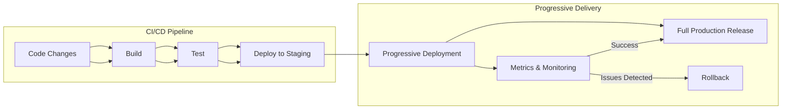

# CI/CD Progressive Delivery

## Introduction

Progressive delivery is an advanced deployment strategy that builds upon continuous integration and continuous deployment (CI/CD) practices. While traditional CI/CD focuses on automating the delivery pipeline to get code changes into production quickly, progressive delivery adds sophisticated control mechanisms to make deployments safer and more controlled.

At its core, progressive delivery is about gradually releasing changes to a subset of users before rolling them out to everyone. This controlled approach minimizes the blast radius of potential issues and allows teams to validate changes in real production environments with real users.

In this guide, we'll explore what progressive delivery is, common implementation strategies, and how to get started with progressive delivery in your own projects.

## What is Progressive Delivery?

Progressive delivery is a deployment approach where new features are rolled out gradually to users rather than all at once. It combines automated deployment techniques with fine-grained control over the release process.

The key principles of progressive delivery include:

1. **Gradual rollouts**: Releasing changes to a small percentage of users first
2. **Risk mitigation**: Limiting the impact of problematic changes
3. **Automated verification**: Using metrics and monitoring to verify changes are working correctly
4. **Controlled experiments**: Testing different versions simultaneously
5. **Immediate response**: Quickly reverting or fixing issues when detected

Progressive delivery extends the CI/CD pipeline by adding these capabilities:



## Common Progressive Delivery Strategies

Let's explore the most common progressive delivery strategies and how they work.

### Feature Flags

Feature flags (also known as feature toggles) are a technique that allows teams to modify system behavior without changing code. They provide a way to enable or disable features during runtime.

**How it works:**

1. Wrap new features in conditional logic (the feature flag)
2. Control the flag state through a configuration system
3. Gradually enable the feature for more users
4. Remove the flag once the feature is stable

Here's a simple example of a feature flag implementation:

```javascript
// A simple feature flag implementation
function checkFeatureFlag(flagName, userId) {
  const flags = {
    'new-checkout': {
      enabled: true,
      percentage: 25, // Only 25% of users get the feature
      whitelistedUsers: ['user123', 'user456']
    }
  };
  
  const flag = flags[flagName];
  
  // Feature is disabled completely
  if (!flag || !flag.enabled) {
    return false;
  }
  
  // User is explicitly whitelisted
  if (flag.whitelistedUsers && flag.whitelistedUsers.includes(userId)) {
    return true;
  }
  
  // Percentage rollout
  if (flag.percentage) {
    // Simple hash function to consistently assign users
    const hash = Math.abs(userId.split('').reduce((a, b) => {
      return a + b.charCodeAt(0);
    }, 0));
    
    return (hash % 100) < flag.percentage;
  }
  
  return true;
}

// Usage example
function renderCheckoutPage(userId) {
  if (checkFeatureFlag('new-checkout', userId)) {
    return renderNewCheckout();
  } else {
    return renderOldCheckout();
  }
}
```

### Canary Deployments

Canary deployments involve releasing a new version to a small subset of servers or users, then gradually increasing the rollout while monitoring for issues.

**How it works:**

1. Deploy the new version to a small subset of servers (e.g., 5%)
2. Route a small percentage of traffic to the new version
3. Monitor metrics and error rates
4. Gradually increase traffic to the new version if metrics look good
5. Roll back if issues are detected

Here's an example of how to configure a canary deployment with Kubernetes and Istio:

```yaml
apiVersion: networking.istio.io/v1alpha3
kind: VirtualService
metadata:
  name: my-service
spec:
  hosts:
  - my-service
  http:
  - route:
    - destination:
        host: my-service
        subset: v1
      weight: 90
    - destination:
        host: my-service
        subset: v2
      weight: 10
```

In this example, 10% of traffic is being routed to version 2 (the canary), while 90% continues to use version 1.

### Blue-Green Deployments

Blue-green deployment is a technique that maintains two identical production environments, called Blue and Green. At any time, only one of the environments is live.

**How it works:**

1. Blue environment is currently serving production traffic
2. Deploy the new version to the Green environment
3. Test the Green environment to ensure it's working correctly
4. Switch the router to direct traffic from Blue to Green
5. Green is now live and Blue becomes the staging environment for the next release

Here's a simplified example using AWS Elastic Beanstalk:

```json
{
  "AWSEBBlueGreenDeploymentConfig": {
    "Application": "my-app",
    "BlueEnvironment": "my-app-blue",
    "GreenEnvironment": "my-app-green",
    "Tags": [
      {
        "Key": "environment",
        "Value": "production"
      }
    ],
    "TrafficSplittingConfig": {
      "NewVersionPercent": 0,
      "Interval": 10,
      "MaximumPercent": 100,
      "StepSize": 10
    }
  }
}
```

This configuration will start with 0% traffic to the new version, then increase by 10% every 10 minutes until it reaches 100%.

### A/B Testing

A/B testing (also known as split testing) is a technique for comparing two versions of a feature to determine which performs better according to defined metrics.

**How it works:**

1. Define the metric you want to optimize (e.g., conversion rate)
2. Create two or more variations of a feature
3. Randomly assign users to each variation
4. Measure the performance of each variation
5. Deploy the winning variation to all users

Here's a simple example of how to implement A/B testing:

```javascript
function assignUserToExperiment(userId, experimentName) {
  // Simple hash function to consistently assign users
  const hash = Math.abs(userId.split('').reduce((a, b) => {
    return a + b.charCodeAt(0);
  }, 0));
  
  const experiments = {
    'button-color': {
      variants: ['blue', 'green', 'red'],
      weights: [0.33, 0.33, 0.34] // Must sum to 1
    }
  };
  
  const experiment = experiments[experimentName];
  if (!experiment) return null;
  
  const randomValue = (hash % 100) / 100;
  let cumulativeWeight = 0;
  
  for (let i = 0; i < experiment.variants.length; i++) {
    cumulativeWeight += experiment.weights[i];
    if (randomValue < cumulativeWeight) {
      return experiment.variants[i];
    }
  }
  
  return experiment.variants[0]; // Fallback
}

// Usage example
function renderButton(userId) {
  const buttonColor = assignUserToExperiment(userId, 'button-color');
  return `<button style="background-color: ${buttonColor}">Click Me</button>`;
}
```

## Implementing Progressive Delivery

To implement progressive delivery in your CI/CD pipeline, you'll need several components:

### 1. Deployment Automation

First, you need a reliable CI/CD pipeline that can automatically build, test, and deploy your application. Tools like Jenkins, GitHub Actions, CircleCI, or GitLab CI can help with this.

### 2. Service Mesh or Traffic Management

For routing traffic and implementing canary deployments, you'll need a service mesh like Istio, Linkerd, or a traffic management solution like AWS App Mesh.

### 3. Feature Flag Management

Instead of building your own feature flag system, consider using a feature flag management platform like LaunchDarkly, Split.io, or Flagsmith.

### 4. Metrics and Monitoring

You need robust monitoring to validate deployments and detect issues. Tools like Prometheus, Grafana, Datadog, or New Relic can help you collect and analyze metrics.

### 5. Automated Rollbacks

If issues are detected, your system should be able to automatically roll back to a stable version. This requires versioning your deployments and maintaining rollback scripts.

## Real-World Example: Implementing Canary Deployments with GitHub Actions and Kubernetes

Let's walk through a real-world example of implementing canary deployments with GitHub Actions and Kubernetes.

First, we need a GitHub Actions workflow to build and deploy our application:

```yaml
name: Deploy Canary

on:
  push:
    branches: [ main ]

jobs:
  build:
    runs-on: ubuntu-latest
    
    steps:
    - uses: actions/checkout@v2
    
    - name: Build and push Docker image
      uses: docker/build-push-action@v2
      with:
        context: .
        push: true
        tags: myapp:${{ github.sha }}
    
    - name: Deploy Canary
      run: |
        # Deploy to 10% of production
        kubectl set image deployment/myapp-canary myapp=myapp:${{ github.sha }}
        kubectl scale deployment myapp-canary --replicas=1
        kubectl scale deployment myapp-prod --replicas=9
    
    - name: Wait for metrics
      run: sleep 300  # Wait 5 minutes
    
    - name: Check metrics
      id: check_metrics
      run: |
        # Check if error rate is below threshold
        ERROR_RATE=$(curl -s https://monitoring.example.com/api/error-rate)
        if (( $(echo "$ERROR_RATE < 0.01" | bc -l) )); then
          echo "Error rate is acceptable: $ERROR_RATE"
          echo "::set-output name=status::success"
        else
          echo "Error rate too high: $ERROR_RATE"
          echo "::set-output name=status::failure"
        fi
    
    - name: Promote or rollback
      run: |
        if [[ "${{ steps.check_metrics.outputs.status }}" == "success" ]]; then
          # Promote canary to production
          kubectl set image deployment/myapp-prod myapp=myapp:${{ github.sha }}
          kubectl scale deployment myapp-canary --replicas=0
          kubectl scale deployment myapp-prod --replicas=10
          echo "Canary promoted to production"
        else
          # Rollback
          kubectl scale deployment myapp-canary --replicas=0
          echo "Canary deployment rolled back due to high error rate"
          exit 1
        fi
```

Next, we need Kubernetes manifests for our canary and production deployments:

```yaml
# canary-deployment.yaml
apiVersion: apps/v1
kind: Deployment
metadata:
  name: myapp-canary
spec:
  replicas: 0  # Start with 0 replicas
  selector:
    matchLabels:
      app: myapp
  template:
    metadata:
      labels:
        app: myapp
        version: canary
    spec:
      containers:
      - name: myapp
        image: myapp:latest
        ports:
        - containerPort: 8080
---
# prod-deployment.yaml
apiVersion: apps/v1
kind: Deployment
metadata:
  name: myapp-prod
spec:
  replicas: 10  # Start with all traffic going to production
  selector:
    matchLabels:
      app: myapp
  template:
    metadata:
      labels:
        app: myapp
        version: stable
    spec:
      containers:
      - name: myapp
        image: myapp:stable
        ports:
        - containerPort: 8080
---
# service.yaml
apiVersion: v1
kind: Service
metadata:
  name: myapp
spec:
  selector:
    app: myapp  # This selects both canary and prod pods
  ports:
  - port: 80
    targetPort: 8080
```

With this setup, when code is pushed to the main branch:

1. A new Docker image is built and tagged with the commit SHA
2. The canary deployment is updated with the new image and scaled to 1 replica
3. The production deployment is scaled to 9 replicas (10% canary, 90% production)
4. The workflow waits 5 minutes to collect metrics
5. If the error rate is acceptable, the canary is promoted to production
6. If the error rate is too high, the canary is rolled back

## Best Practices for Progressive Delivery

To make the most of progressive delivery, consider these best practices:

1. **Start small**: Begin with simple feature flags before implementing complex canary deployments
2. **Automate everything**: Automate the deployment, testing, and rollback processes
3. **Define clear metrics**: Know what success looks like before starting a rollout
4. **Set up proper monitoring**: You can't manage what you don't measure
5. **Have a rollback strategy**: Always be prepared for things to go wrong
6. **Test in production safely**: Use techniques like shadowing traffic to test without impacting users
7. **Document your process**: Make sure everyone understands how your progressive delivery system works

## Challenges and Considerations

While progressive delivery offers many benefits, it also comes with challenges:

1. **Increased complexity**: Managing multiple versions in production adds complexity
2. **Technical debt**: Feature flags can accumulate and create technical debt if not removed
3. **Testing overhead**: You need to test all possible combinations of enabled features
4. **Monitoring requirements**: More sophisticated monitoring is needed
5. **Database migrations**: Coordinating database changes with code deployments becomes more complex

## Summary

Progressive delivery extends traditional CI/CD practices by adding controlled, gradual rollouts of new features. By implementing strategies like feature flags, canary deployments, blue-green deployments, and A/B testing, teams can minimize the risk of deployments while still moving quickly.

The key benefits include:

- Reduced deployment risk
- Faster feedback cycles
- More controlled experimentation
- Improved user experience
- Greater confidence in releases

As your application and team grow, implementing progressive delivery becomes increasingly valuable. Start with simple techniques like feature flags, then gradually adopt more sophisticated approaches as your needs evolve.

## Additional Resources

To learn more about progressive delivery, check out these resources:

- Martin Fowler's article on [Feature Toggles](https://martinfowler.com/articles/feature-toggles.html)
- The [DORA research](https://cloud.google.com/blog/products/devops-sre/using-the-four-keys-to-measure-your-devops-performance) on DevOps performance
- Kubernetes documentation on [Deployments](https://kubernetes.io/docs/concepts/workloads/controllers/deployment/)
- Istio documentation on [Traffic Management](https://istio.io/latest/docs/concepts/traffic-management/)

## Exercises

1. Implement a simple feature flag system in your application
2. Create a blue-green deployment for a simple web application
3. Configure a canary deployment in Kubernetes
4. Set up an A/B test for a UI component
5. Develop a monitoring dashboard to track the health of your deployments