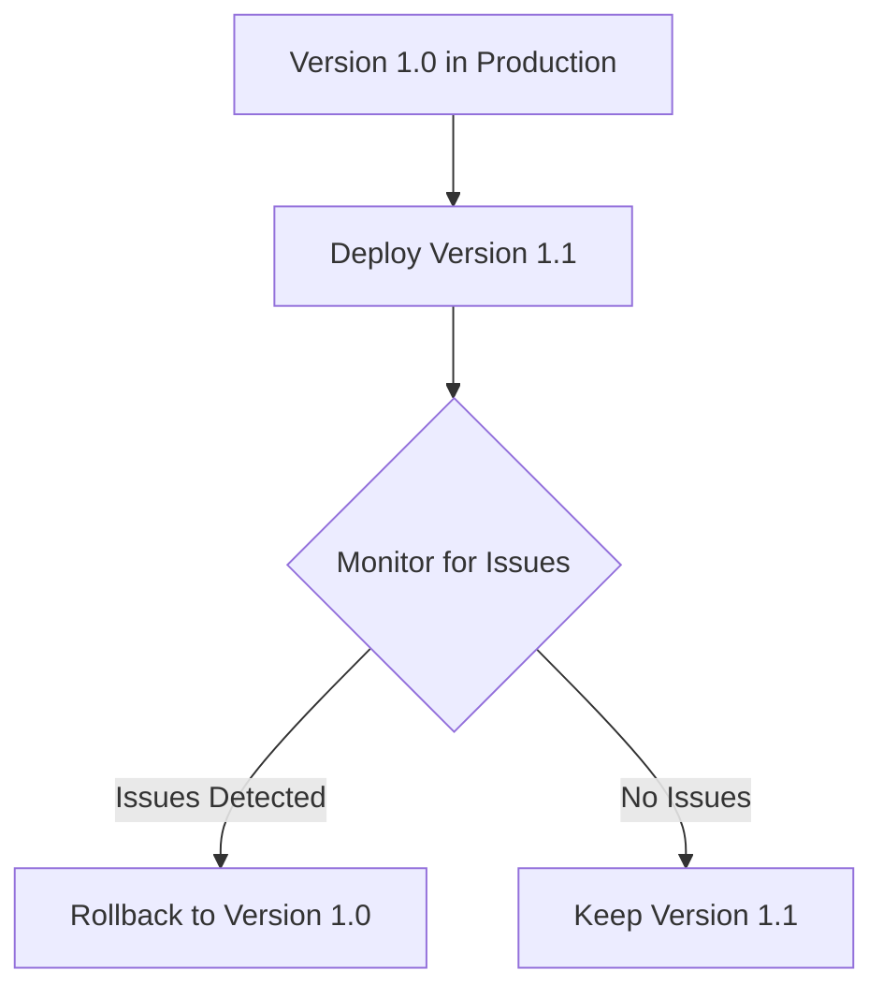
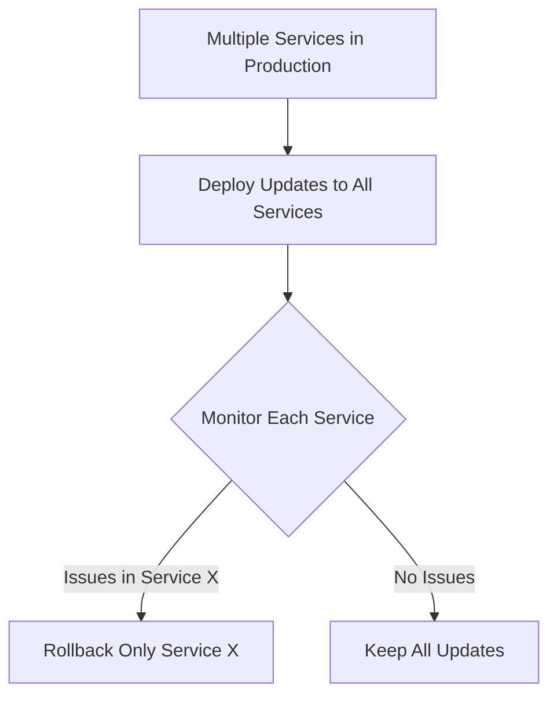
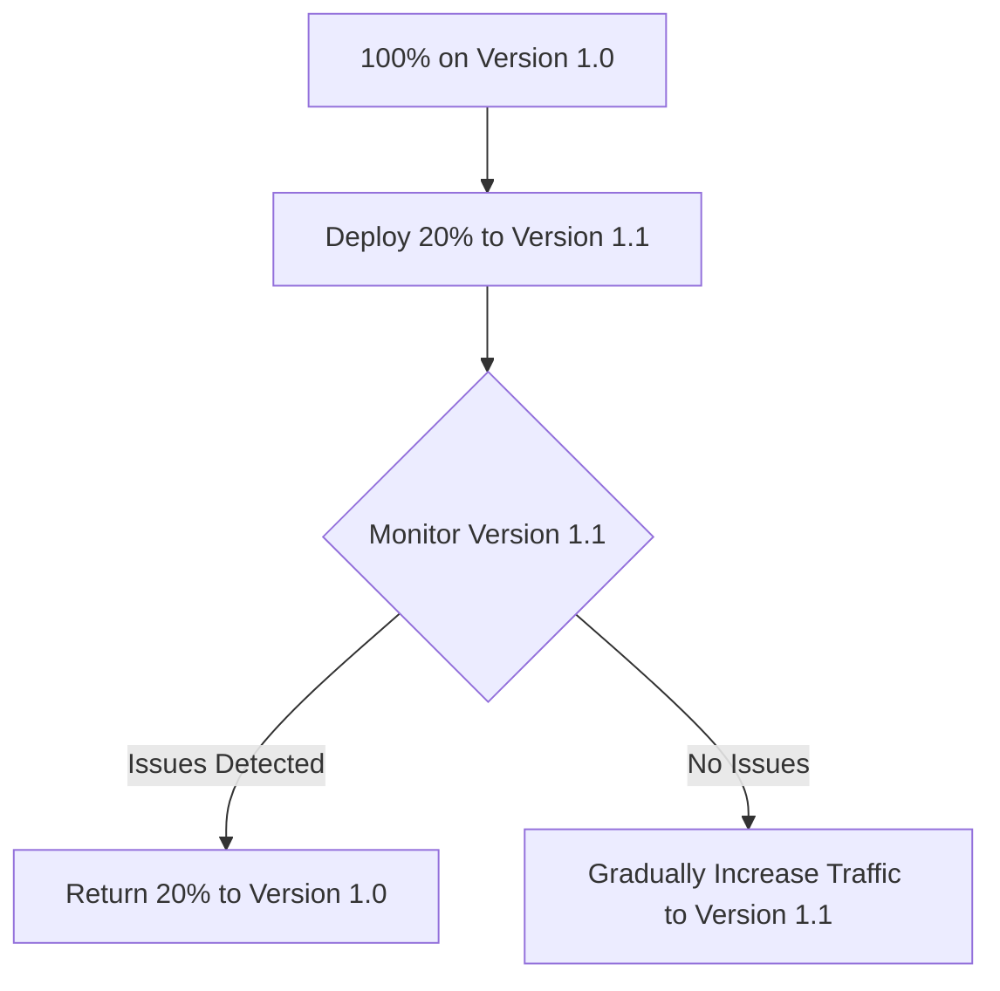

# CICD Rollback Strategy

## Introduction

Even with thorough testing and careful deployment practices, sometimes things go wrong in production. A critical bug might slip through, an unexpected integration issue could arise, or a performance problem might only become apparent under real-world conditions. When these situations occur, you need a reliable way to return your application to a stable state quickly.

This is where **rollback strategies** come into play. Rollbacks are a crucial part of any robust CI/CD pipeline, providing a safety net that allows you to revert to a previously working version of your application with minimal downtime or user impact.

In this guide, we'll explore what rollback strategies are, why they're important, and how to implement them effectively in your CI/CD pipeline.

## What is a Rollback Strategy?

A rollback strategy is a predefined plan for reverting your application to a previous stable state when a deployment fails or introduces critical issues. Instead of rushing to fix forward (making emergency fixes to the problematic deployment), a rollback lets you restore service quickly while you diagnose and fix the underlying problems.

## Why Rollback Strategies Matter

Implementing robust rollback capabilities provides several benefits:

1. **Minimizes downtime**: When issues occur, you can quickly restore service rather than leaving users with a broken experience.
2. **Reduces pressure**: Your team can fix issues deliberately rather than making hasty, potentially problematic changes.
3. **Builds confidence**: Teams can deploy more frequently knowing they have a safety net.
4. **Improves reliability**: Your service maintains higher overall availability.

## Types of Rollback Strategies

### 1. Full Rollback

A full rollback completely reverts to the previous version of your application.



### 2. Partial Rollback

Partial rollbacks revert only specific components or services that are experiencing issues.



### 3. Canary Rollback

With canary deployments, you can roll back just the portion of traffic that was directed to the new version.



## Implementing an Effective Rollback Strategy

Let's walk through the key components of implementing a robust rollback strategy in your CI/CD pipeline:

### 1. Version Control and Immutable Artifacts

For effective rollbacks, you need to maintain previous versions of your application that can be deployed at any time.

```bash
# Example: Creating an immutable Docker image with a specific version tag
docker build -t myapp:1.0.5 .
docker push myapp:1.0.5

# Later, for rollback:
kubectl set image deployment/myapp myapp=myapp:1.0.4
```

### 2. Database Migration Strategies

Database changes can be especially challenging for rollbacks. Consider these approaches:

#### a. Backward Compatible Changes

Make database changes that work with both the new and old application versions.

```sql
-- Example: Adding a new column (compatible with old code)
ALTER TABLE users ADD COLUMN preferred_language VARCHAR(10);

-- Instead of renaming an existing column (would break old code)
-- ALTER TABLE users RENAME COLUMN email TO contact_email;
```

#### b. Blue-Green Database Migrations

Maintain two database schemas and synchronize data between them during the transition period.

```bash
# Simplified example of a blue-green DB migration script
python manage.py migrate_blue_to_green

# If rollback needed:
python manage.py switch_to_blue
```

### 3. Automated Rollback Triggers

Set up monitoring to automatically detect issues and trigger rollbacks.

```yaml
# Example Jenkins pipeline with automated rollback
pipeline {
    agent any
    stages {
        stage('Deploy') {
            steps {
                sh 'kubectl apply -f deployment.yaml'
                sh 'kubectl set image deployment/myapp myapp=myapp:1.0.5'
            }
        }
        stage('Verify') {
            steps {
                sh './health_check.sh'
            }
            post {
                failure {
                    echo 'Deployment validation failed, rolling back...'
                    sh 'kubectl set image deployment/myapp myapp=myapp:1.0.4'
                }
            }
        }
    }
}
```

### 4. Feature Flags

Use feature flags to disable problematic features without a full rollback.

```javascript
// Example feature flag implementation
function showNewFeature() {
  if (FeatureFlags.isEnabled('new-dashboard')) {
    return <NewDashboard />;
  } else {
    return <ClassicDashboard />;
  }
}

// When issues are detected:
FeatureFlags.disable('new-dashboard');
```

## Real-World Rollback Implementation

Let's walk through a comprehensive example of implementing a rollback strategy using GitHub Actions and Kubernetes:

```yaml
# .github/workflows/deploy.yml
name: Deploy and Monitor

on:
  push:
    branches: [ main ]

jobs:
  deploy:
    runs-on: ubuntu-latest
    steps:
      - uses: actions/checkout@v3
      
      - name: Build and tag Docker image
        run: |
          docker build -t myapp:${{ github.sha }} .
          docker tag myapp:${{ github.sha }} myapp:latest
          
      - name: Store previous version for potential rollback
        run: |
          echo "PREVIOUS_VERSION=$(kubectl get deployment myapp -o jsonpath='{.spec.template.spec.containers[0].image}')" >> $GITHUB_ENV
          
      - name: Deploy new version
        run: |
          kubectl set image deployment/myapp myapp=myapp:${{ github.sha }}
          
      - name: Verify deployment
        id: verify
        run: |
          # Wait for deployment to complete
          kubectl rollout status deployment/myapp
          
          # Run health checks
          for i in {1..5}; do
            response=$(curl -s -o /dev/null -w "%{http_code}" https://myapp.example.com/health)
            if [[ $response != "200" ]]; then
              echo "Health check failed with response $response"
              exit 1
            fi
            sleep 10
          done
          
      - name: Rollback on failure
        if: failure() && steps.verify.outcome == 'failure'
        run: |
          echo "Deployment verification failed, rolling back to ${{ env.PREVIOUS_VERSION }}"
          kubectl set image deployment/myapp myapp=${{ env.PREVIOUS_VERSION }}
          kubectl rollout status deployment/myapp
          
      - name: Notify on rollback
        if: failure() && steps.verify.outcome == 'failure'
        run: |
          curl -X POST -H 'Content-type: application/json' \
          --data '{"text":"⚠️ Deployment failed and rolled back to ${{ env.PREVIOUS_VERSION }}"}' \
          ${{ secrets.SLACK_WEBHOOK_URL }}
```

This workflow:
1. Builds and tags a new Docker image
2. Stores the current production version for potential rollback
3. Deploys the new version
4. Verifies the deployment with health checks
5. Automatically rolls back if verification fails
6. Sends a notification about the rollback

## Best Practices for Rollback Strategies

1. **Test your rollback process**: Regularly practice rollbacks to ensure they work when needed.
2. **Automate as much as possible**: Manual rollbacks are error-prone, especially during stressful outages.
3. **Keep rollbacks simple**: Complex rollback procedures are more likely to fail when you need them.
4. **Document the process**: Ensure everyone knows how to initiate a rollback if automated systems fail.
5. **Address rollback data challenges**: Consider how data migrations will affect rollbacks.
6. **Set clear rollback criteria**: Define what conditions trigger a rollback vs. fixing forward.

## Common Rollback Challenges and Solutions

### Challenge: Database Schema Changes

**Solution**: Implement reversible migrations or use an expand/contract pattern.

```bash
# Example of reversible migration in Rails
rails generate migration AddPreferredLanguageToUsers preferred_language:string

# The generated migration will include both up and down methods
class AddPreferredLanguageToUsers < ActiveRecord::Migration[6.1]
  def up
    add_column :users, :preferred_language, :string
  end

  def down
    remove_column :users, :preferred_language
  end
end
```

### Challenge: Dependent Services

**Solution**: Version your APIs and maintain backward compatibility.

```javascript
// Example of versioned API endpoints
app.get('/api/v1/users', (req, res) => {
  // Original implementation
});

app.get('/api/v2/users', (req, res) => {
  // New implementation
});

// During rollback, the old service version will still use /api/v1/users
```

### Challenge: Stateful Applications

**Solution**: Use state migration strategies or externalize state.

```yaml
# Example Kubernetes StatefulSet with persistent volumes
apiVersion: apps/v1
kind: StatefulSet
metadata:
  name: myapp
spec:
  serviceName: "myapp"
  replicas: 3
  selector:
    matchLabels:
      app: myapp
  template:
    metadata:
      labels:
        app: myapp
    spec:
      containers:
      - name: myapp
        image: myapp:1.0.5
        volumeMounts:
        - name: data
          mountPath: /data
  volumeClaimTemplates:
  - metadata:
      name: data
    spec:
      accessModes: [ "ReadWriteOnce" ]
      resources:
        requests:
          storage: 1Gi
```

## Summary

An effective rollback strategy is an essential component of any mature CI/CD pipeline. By planning for failure and implementing automated, well-tested rollback mechanisms, you can:

- Minimize the impact of failed deployments
- Increase confidence in your deployment process
- Maintain higher service availability
- Give your team room to fix issues properly

Remember that the goal isn't to avoid failures entirely—that's impossible—but to recover from them quickly and gracefully. A good rollback strategy turns potential disasters into minor hiccups.

## Exercises and Further Learning

1. **Exercise**: Set up a simple application with automated deployment and rollback using GitHub Actions or Jenkins.
2. **Exercise**: Practice database migrations that support rollbacks.
3. **Exercise**: Implement feature flags in an application to allow selective feature disabling.

## Additional Resources

- [The Twelve-Factor App](https://12factor.net/) - Best practices for building software-as-a-service apps
- [Progressive Delivery](https://redmonk.com/jgovernor/2018/08/06/towards-progressive-delivery/) - Advanced deployment strategies
- [Database Schema Evolution Patterns](https://martinfowler.com/articles/evodb.html) - Handling database changes safely
- [Feature Flagging](https://martinfowler.com/articles/feature-toggles.html) - Using feature flags effectively

By implementing a robust rollback strategy, you take a significant step toward more reliable deployments and a more resilient application.