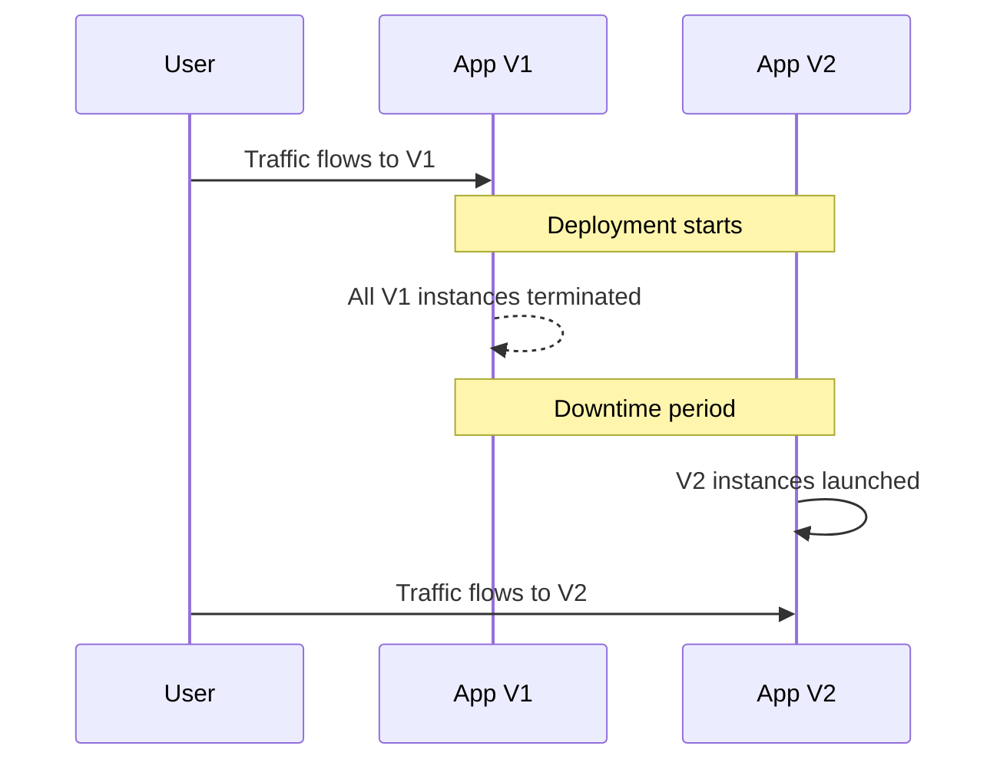
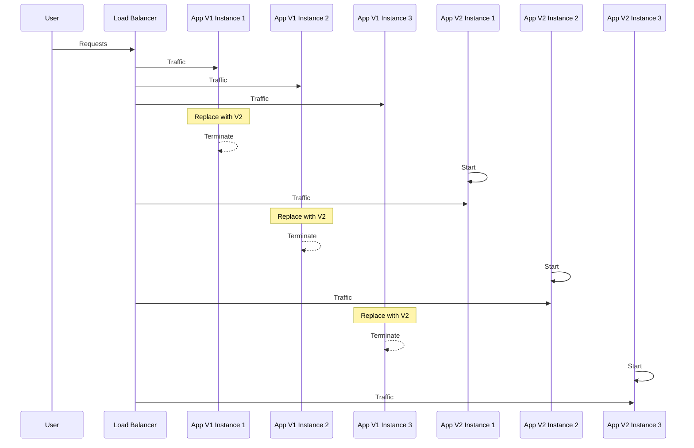
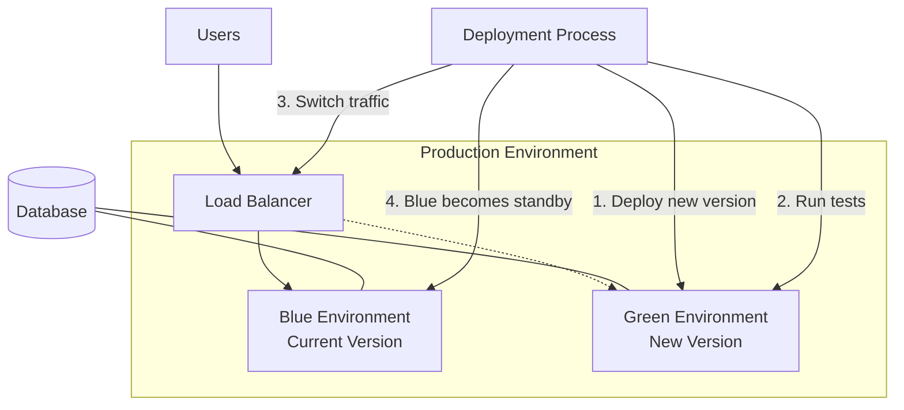
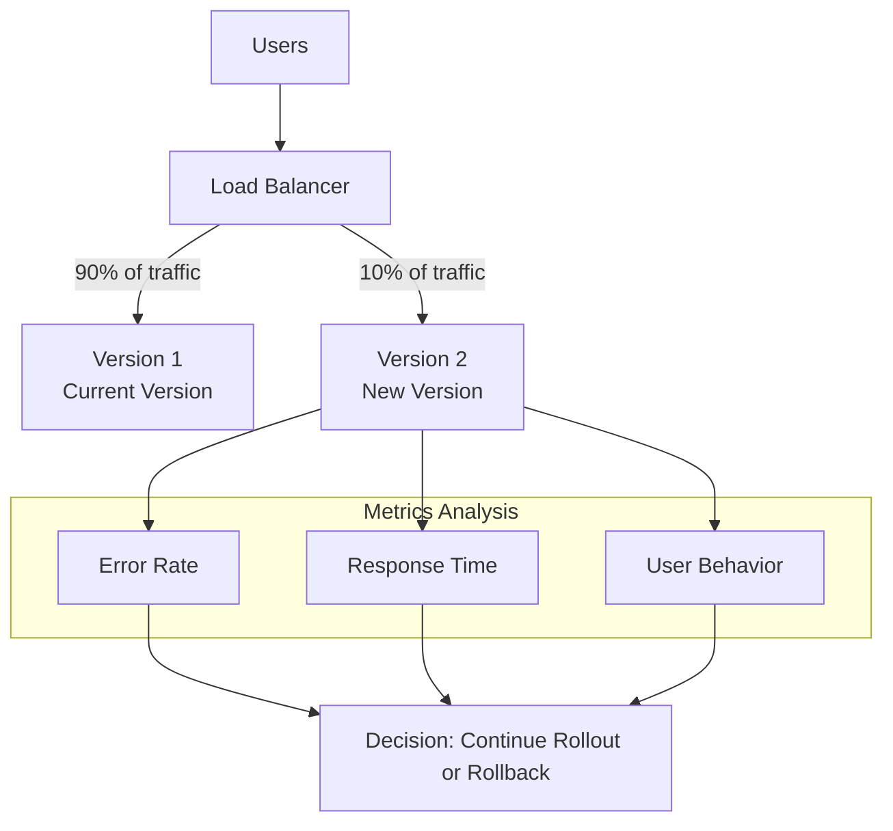
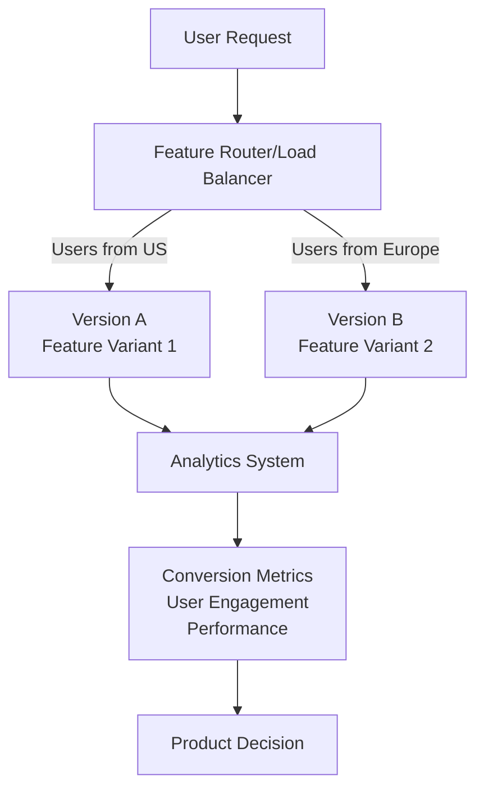
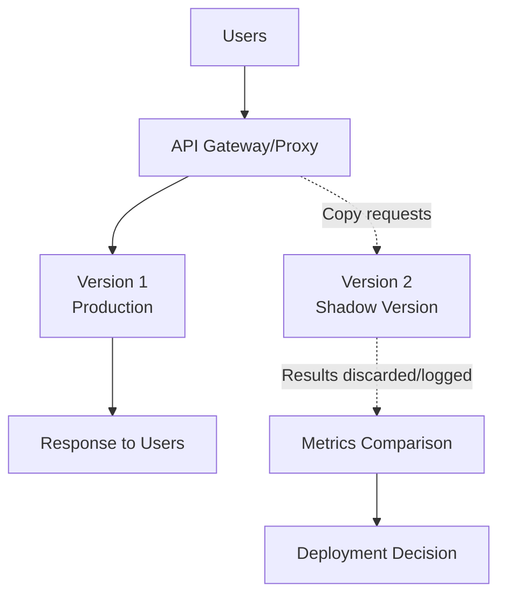
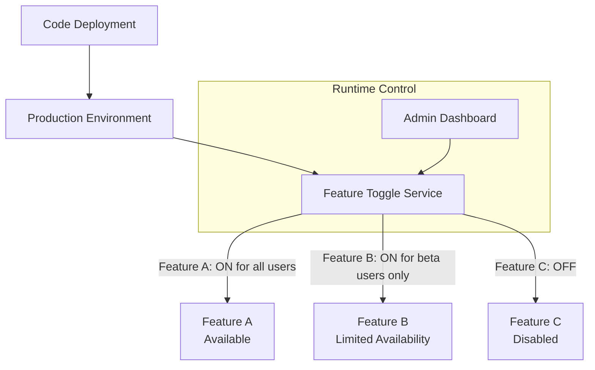
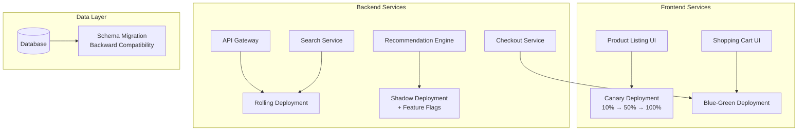

# CI/CD Deployment Patterns

## Introduction

Continuous Integration and Continuous Deployment (CI/CD) has revolutionized how software is delivered to users. A critical aspect of any CI/CD pipeline is the **deployment pattern** – the strategy used to release new versions of your application to production environments. Choosing the right deployment pattern is essential for maintaining system reliability while delivering new features quickly.

In this guide, we'll explore various CI/CD deployment patterns, understand their pros and cons, and learn when to use each approach based on your specific requirements.

## What are CI/CD Deployment Patterns?

CI/CD deployment patterns are standardized approaches to releasing new software versions to production environments. These patterns help teams balance the need for:

- Fast and frequent releases
- Minimal downtime
- Risk mitigation
- Easy rollback capabilities
- Resource optimization

Let's explore the most common deployment patterns used in modern CI/CD pipelines.

## Basic Deployment Patterns

### 1. Recreate Deployment

The recreate pattern is the simplest deployment strategy, involving:

1. Shutting down all instances of the current version
2. Deploying the new version



#### Example Implementation (Kubernetes):

```yaml
apiVersion: apps/v1
kind: Deployment
metadata:
  name: my-app
spec:
  replicas: 3
  strategy:
    type: Recreate
  selector:
    matchLabels:
      app: my-app
  template:
    metadata:
      labels:
        app: my-app
    spec:
      containers:
      - name: my-app
        image: my-app:2.0
```

#### Pros:
- Simple to implement and understand
- Ensures clean state for new version
- No version compatibility concerns

#### Cons:
- Results in downtime during deployment
- All-or-nothing approach with high risk
- Not suitable for user-facing production applications

#### Best for:
- Development environments
- Backend services that can tolerate downtime
- Small applications with minimal users

### 2. Rolling Deployment

The rolling deployment pattern gradually replaces instances of the old version with the new version:



#### Example Implementation (Kubernetes):

```yaml
apiVersion: apps/v1
kind: Deployment
metadata:
  name: my-app
spec:
  replicas: 6
  strategy:
    type: RollingUpdate
    rollingUpdate:
      maxSurge: 1
      maxUnavailable: 1
  selector:
    matchLabels:
      app: my-app
  template:
    metadata:
      labels:
        app: my-app
    spec:
      containers:
      - name: my-app
        image: my-app:2.0
```

#### Pros:
- No downtime during deployment
- Gradual release minimizes risk
- Easy to implement in most platforms
- Automatic rollback if new instances fail health checks

#### Cons:
- Slower deployment compared to recreate
- Both versions run simultaneously (potential compatibility issues)
- Higher resource requirements during transition

#### Best for:
- Production applications that require high availability
- Stateless applications
- When you have confidence in backward compatibility

## Advanced Deployment Patterns

### 3. Blue-Green Deployment

Blue-green deployment maintains two identical environments (blue and green), with only one serving production traffic at any time:



#### Implementation Example (AWS):

```yaml
# CloudFormation template snippet for Blue-Green deployment
Resources:
  ProductionLoadBalancer:
    Type: AWS::ElasticLoadBalancingV2::LoadBalancer
    Properties:
      # LoadBalancer configuration
      
  BlueTargetGroup:
    Type: AWS::ElasticLoadBalancingV2::TargetGroup
    Properties:
      # Blue target group configuration
      
  GreenTargetGroup:
    Type: AWS::ElasticLoadBalancingV2::TargetGroup
    Properties:
      # Green target group configuration
      
  LoadBalancerListener:
    Type: AWS::ElasticLoadBalancingV2::Listener
    Properties:
      DefaultActions:
        - Type: forward
          TargetGroupArn: !Ref BlueTargetGroup
      LoadBalancerArn: !Ref ProductionLoadBalancer
      Port: 80
      Protocol: HTTP
```

#### Pros:
- Zero downtime deployment
- Complete testing of new version before traffic switch
- Instant rollback capability (switch back to blue)
- Clear separation between versions

#### Cons:
- Requires double the resources
- Database schema changes need careful handling
- More complex to set up initially

#### Best for:
- Critical production applications
- Applications where thorough pre-production testing is essential
- Cases where instant rollback capability is required

### 4. Canary Deployment

Canary deployment directs a small percentage of traffic to the new version to test it with real users before full rollout:



#### Implementation Example (with Istio service mesh):

```yaml
apiVersion: networking.istio.io/v1alpha3
kind: VirtualService
metadata:
  name: my-service
spec:
  hosts:
  - my-service
  http:
  - route:
    - destination:
        host: my-service-v1
        subset: v1
      weight: 90
    - destination:
        host: my-service-v2
        subset: v2
      weight: 10
```

#### Shell script for gradual traffic shifting:

```bash
#!/bin/bash
# Canary deployment script

# Start with 10% traffic to new version
kubectl apply -f canary-10-percent.yaml
echo "Sending 10% traffic to new version"

# Wait and monitor
sleep 300
# Check error rates, response times from monitoring system
ERROR_RATE=$(curl -s http://metrics-api/error-rate)

if [ $ERROR_RATE -gt 2 ]; then
  echo "Error rate too high, rolling back"
  kubectl apply -f canary-0-percent.yaml
  exit 1
fi

# Increase to 30%
kubectl apply -f canary-30-percent.yaml
echo "Increased traffic to 30%"

# Continue similar steps until 100%
# ...

echo "Canary deployment complete"
```

#### Pros:
- Risk mitigation by limiting exposure of new version
- Real user feedback before full deployment
- Ability to monitor performance with real traffic
- Gradual rollout controls impact of potential issues

#### Cons:
- More complex to implement and monitor
- Slower full deployment
- Requires strong monitoring and metrics
- Multiple versions running simultaneously

#### Best for:
- User-facing applications with high traffic
- Critical systems where errors impact many users
- When collecting real-world metrics is essential
- Testing new features with limited audience

### 5. A/B Testing Deployment

While similar to canary, A/B testing focuses on testing specific features or changes with user segments:



#### Implementation with a feature flag service:

```javascript
// Example using a feature flag service (LaunchDarkly)
import { LDClient } from 'launchdarkly-node-server-sdk';

const ldClient = LDClient.initialize('sdk-key');

app.get('/api/checkout', async (req, res) => {
  const user = {
    key: req.user.id,
    country: req.user.country,
    deviceType: req.headers['user-agent']
  };
  
  // Check which checkout flow to show this user
  const showNewCheckout = await ldClient.variation('new-checkout-flow', user, false);
  
  if (showNewCheckout) {
    // Serve new checkout experience
    return res.render('checkout-new');
  } else {
    // Serve current checkout experience
    return res.render('checkout-current');
  }
});

// Track conversion metrics
app.post('/api/purchase-complete', (req, res) => {
  const user = {
    key: req.user.id,
    country: req.user.country
  };
  
  // Record which version the user converted on
  analytics.track('purchase_completed', {
    user: user.key,
    checkoutVersion: req.body.version,
    amount: req.body.amount
  });
  
  res.send('Success');
});
```

#### Pros:
- Tests actual user behavior and preferences
- Supports data-driven development decisions
- Can target specific user segments
- Allows feature comparison before full release

#### Cons:
- Requires advanced routing and user segmentation
- Needs analytics integration for meaningful results
- More complex codebase with conditional features
- May create inconsistent user experiences

#### Best for:
- Testing UI/UX changes
- When user metrics drive development decisions
- E-commerce or conversion-focused applications
- Gradual feature introduction

### 6. Shadow Deployment

Shadow deployment runs the new version in parallel with the production version, duplicating real production traffic to the new version without affecting users:



#### Implementation Example (with Envoy proxy):

```yaml
# Envoy configuration snippet for shadow traffic
static_resources:
  listeners:
  - address:
      socket_address:
        address: 0.0.0.0
        port_value: 8080
    filter_chains:
    - filters:
      - name: envoy.filters.network.http_connection_manager
        typed_config:
          "@type": type.googleapis.com/envoy.extensions.filters.network.http_connection_manager.v3.HttpConnectionManager
          stat_prefix: ingress_http
          route_config:
            name: local_route
            virtual_hosts:
            - name: backend
              domains: ["*"]
              routes:
              - match:
                  prefix: "/"
                route:
                  cluster: production_service
                  shadow_cluster: shadow_service
```

#### Pros:
- Zero risk to users or production environment
- Tests with real production traffic patterns
- Identifies performance issues before user exposure
- Helps validate capacity requirements

#### Cons:
- Doubles infrastructure and processing needs
- Complex to implement correctly
- State/database changes need careful handling
- Difficult to mirror stateful transactions

#### Best for:
- Performance testing with real-world traffic
- High-risk changes to critical systems
- Backend services or APIs
- When synthetic testing is insufficient

## Special Case: Feature Flags

Feature flags (or feature toggles) are not strictly a deployment pattern but complement CI/CD deployment strategies by decoupling feature release from code deployment:



#### Implementation Example:

```javascript
// Server-side feature flag check
function getProductRecommendations(user) {
  if (featureFlags.isEnabled('new-recommendation-algorithm', user)) {
    return newRecommendationEngine.getRecommendations(user);
  } else {
    return currentRecommendationEngine.getRecommendations(user);
  }
}

// Client-side feature flag implementation
function RenderUserProfile({ user }) {
  const flags = useFeatureFlags(user);
  
  return (
    <div className="profile">
      <UserInfo user={user} />
      
      {flags.newProfileLayout && (
        <NewProfileContent user={user} />
      )}
      
      {!flags.newProfileLayout && (
        <CurrentProfileContent user={user} />
      )}
      
      {flags.enableProfileAnalytics && (
        <AnalyticsDashboard userId={user.id} />
      )}
    </div>
  );
}
```

#### Pros:
- Decouples deployment from feature release
- Enables trunk-based development
- Supports gradual feature rollout
- Allows quick disabling of problematic features

#### Cons:
- Increases codebase complexity
- Technical debt if flags aren't removed
- Potential for unexpected feature interactions
- Testing complexity increases with multiple flags

#### Best for:
- Continuous deployment environments
- Large teams working on shared codebase
- Phased feature rollouts
- Experimental features

## Choosing the Right Deployment Pattern

The right deployment pattern depends on various factors:

| Pattern | Zero Downtime | Risk Level | Complexity | Resource Usage | Instant Rollback |
|---------|---------------|------------|------------|----------------|------------------|
| Recreate | ❌ | High | Low | Low | ❌ |
| Rolling | ✅ | Medium | Low | Medium | ❌ |
| Blue-Green | ✅ | Low | Medium | High | ✅ |
| Canary | ✅ | Very Low | High | Medium | ✅ |
| A/B Testing | ✅ | Medium | High | Medium | ✅ |
| Shadow | ✅ | None | Very High | Very High | N/A |

Consider these questions when selecting a deployment pattern:

1. Is downtime acceptable for your application?
2. How critical is the system to your business?
3. What is your risk tolerance?
4. What resources are available (infrastructure, monitoring)?
5. How confident are you in the new version?
6. Do you need user feedback before full deployment?

## Building a CI/CD Pipeline with Proper Deployment Patterns

Let's walk through creating a basic CI/CD pipeline that implements a blue-green deployment pattern using GitHub Actions and AWS:

```yaml
# .github/workflows/deploy.yml
name: Deploy Application

on:
  push:
    branches: [main]

jobs:
  deploy:
    runs-on: ubuntu-latest
    steps:
      - uses: actions/checkout@v2
      
      - name: Configure AWS credentials
        uses: aws-actions/configure-aws-credentials@v1
        with:
          aws-access-key-id: ${{ secrets.AWS_ACCESS_KEY_ID }}
          aws-secret-access-key: ${{ secrets.AWS_SECRET_ACCESS_KEY }}
          aws-region: us-west-2
      
      - name: Build application
        run: |
          npm install
          npm run build
          
      - name: Run tests
        run: npm test
      
      - name: Deploy to Green environment
        run: |
          # Deploy new version to the Green environment
          aws elasticbeanstalk create-application-version \
            --application-name my-app \
            --version-label ${{ github.sha }} \
            --source-bundle S3Bucket="my-app-deploy",S3Key="app-${{ github.sha }}.zip"
          
          aws elasticbeanstalk update-environment \
            --environment-name my-app-green \
            --version-label ${{ github.sha }}
      
      - name: Run smoke tests on Green
        run: |
          # Wait for deployment to complete
          aws elasticbeanstalk wait environment-updated --environment-name my-app-green
          
          # Run smoke tests against the Green environment
          npm run test:smoke -- --url https://green.my-app.com
      
      - name: Swap to Green environment
        if: success()
        run: |
          # Swap CNAME records to point production traffic to Green
          aws elasticbeanstalk swap-environment-cnames \
            --source-environment-name my-app-blue \
            --destination-environment-name my-app-green
      
      - name: Rollback if necessary
        if: failure()
        run: |
          echo "Deployment failed, not swapping environments"
```

## Real-World Example: E-commerce Platform Deployment

Let's consider an e-commerce platform implementing a deployment strategy:

### Requirements:
- Zero downtime during deployments
- Ability to quickly roll back if issues detected
- Cautious approach for critical checkout service
- Safe testing of new recommendation engine

### Solution: Multi-pattern Approach



This approach:
- Uses canary deployment for product listings to test new UI with a small percentage of users
- Implements blue-green deployment for checkout services to ensure zero-risk deployments
- Utilizes shadow deployment for the new recommendation engine to validate performance
- Uses feature flags to gradually enable the new recommendation algorithm for different user segments

## Summary

CI/CD deployment patterns offer different approaches to releasing software, each with its own advantages and challenges:

- **Recreate**: Simple but causes downtime
- **Rolling**: Balances risk and complexity with no downtime
- **Blue-Green**: Provides instant rollback capability with zero downtime
- **Canary**: Minimizes risk by testing with a subset of users
- **A/B Testing**: Tests feature variations with different user segments
- **Shadow**: Tests new versions with production traffic without user impact
- **Feature Flags**: Complements deployment patterns by decoupling feature release from code deployment

The right pattern depends on your specific requirements, risk tolerance, and resources. Often, organizations implement different patterns for different services based on criticality and risk.

## Additional Resources

To deepen your understanding of CI/CD deployment patterns:

- **Books**:
  - "Continuous Delivery" by Jez Humble and David Farley
  - "DevOps Handbook" by Gene Kim et al.

- **Online Courses**:
  - "Implementing DevOps in the Real World" on Pluralsight
  - "CI/CD with GitHub Actions" on LinkedIn Learning

- **Tools to Explore**:
  - Terraform for infrastructure provisioning
  - Spinnaker for multi-cloud deployments
  - ArgoCD for Kubernetes deployments
  - LaunchDarkly or FlagSmith for feature flags

## Practice Exercises

1. **Basic Exercise**: Implement a rolling deployment strategy for a simple web application using Docker and Docker Compose.

2. **Intermediate Exercise**: Create a blue-green deployment pipeline for a REST API using GitHub Actions and Kubernetes.

3. **Advanced Exercise**: Design and implement a canary deployment with automatic rollback based on error rates using a service mesh like Istio.

4. **Challenge Exercise**: Implement a feature flag system for a simple application and create a shadow deployment scenario that tests a new algorithm with production traffic.

Remember that successful CI/CD deployment is not just about the technical pattern but also about culture, monitoring, and feedback loops. Start simple, monitor carefully, and gradually adopt more advanced patterns as your team matures.