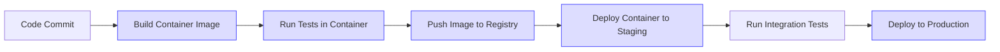

# CICD Containerization

## Introduction

Containerization has revolutionized how we develop, test, and deploy applications in modern software development. When combined with Continuous Integration and Continuous Deployment (CI/CD) practices, containerization creates a powerful framework for reliable and efficient software delivery.

In this guide, we'll explore how containerization fits into CI/CD pipelines, why this combination is so effective, and how to implement containerized workflows in your CI/CD infrastructure. Whether you're just starting your journey into DevOps or looking to improve your existing setup, this guide will provide the foundational knowledge you need.

## What is Containerization?

Containerization is a lightweight form of virtualization that packages an application and its dependencies (libraries, binaries, and configuration files) into a single, portable unit called a container. Unlike traditional virtual machines, containers share the host system's kernel but run in isolated user spaces.

### Key Components of Containerization

1. **Container Images**: Blueprint templates that contain everything needed to run an application
2. **Containers**: Running instances of container images
3. **Container Registries**: Repositories that store and distribute container images
4. **Container Orchestration**: Systems that manage multiple containers at scale

### Why Use Containers?

Containers offer several advantages:

- **Consistency**: The same container runs identically across different environments
- **Isolation**: Applications run in their own environment without interfering with others
- **Efficiency**: Containers are lightweight and start quickly
- **Portability**: Containers can run anywhere the container runtime is installed
- **Scalability**: Easy to scale up or down based on demand

## Integrating Containerization with CI/CD

CI/CD (Continuous Integration/Continuous Deployment) is a methodology that enables developers to frequently integrate code changes and automatically test and deploy applications. When combined with containerization, CI/CD becomes significantly more powerful.

### The Containerized CI/CD Workflow



1. **Code Integration**: Developers push code to version control
2. **Container Building**: CI/CD system builds a container image
3. **Testing**: Automated tests run in containers
4. **Image Storage**: Validated images are pushed to a container registry
5. **Deployment**: Images are deployed as containers to various environments

## Setting Up Docker for CI/CD

[Docker](https://www.docker.com/) is the most popular containerization platform. Let's learn how to integrate it into a CI/CD pipeline.

### Creating a Dockerfile

A Dockerfile is a text file that contains instructions for building a Docker image.

```dockerfile
# Use a specific version of Node.js as the base image
FROM node:16-alpine

# Set working directory
WORKDIR /app

# Copy package.json and package-lock.json
COPY package*.json ./

# Install dependencies
RUN npm install

# Copy source code
COPY . .

# Build the application
RUN npm run build

# Expose port
EXPOSE 3000

# Command to run the application
CMD ["npm", "start"]
```

### Building and Testing the Container

In your CI/CD pipeline configuration, you'd include steps to build and test the container:

```yaml
build:
  script:
    - docker build -t myapp:$CI_COMMIT_SHA .
    - docker run myapp:$CI_COMMIT_SHA npm test
```

### Pushing to a Container Registry

After successful testing, push the container to a registry:

```yaml
push:
  script:
    - docker tag myapp:$CI_COMMIT_SHA registry.example.com/myapp:$CI_COMMIT_SHA
    - docker push registry.example.com/myapp:$CI_COMMIT_SHA
```

## Implementing Containerization in Popular CI/CD Tools

Let's look at how to implement containerized workflows in some popular CI/CD platforms.

### GitHub Actions Example

```yaml
name: Build and Deploy

on:
  push:
    branches: [ main ]

jobs:
  build:
    runs-on: ubuntu-latest
    
    steps:
    - uses: actions/checkout@v3
    
    - name: Build container image
      run: docker build -t myapp:${{ github.sha }} .
    
    - name: Test
      run: docker run myapp:${{ github.sha }} npm test
    
    - name: Log in to GitHub Container Registry
      uses: docker/login-action@v2
      with:
        registry: ghcr.io
        username: ${{ github.actor }}
        password: ${{ secrets.GITHUB_TOKEN }}
    
    - name: Push to GitHub Container Registry
      run: |
        docker tag myapp:${{ github.sha }} ghcr.io/${{ github.repository }}/myapp:${{ github.sha }}
        docker push ghcr.io/${{ github.repository }}/myapp:${{ github.sha }}
```

### GitLab CI/CD Example

```yaml
stages:
  - build
  - test
  - push
  - deploy

build:
  stage: build
  image: docker:20.10.16
  services:
    - docker:20.10.16-dind
  script:
    - docker build -t myapp:$CI_COMMIT_SHA .
    - docker save myapp:$CI_COMMIT_SHA -o myapp.tar
  artifacts:
    paths:
      - myapp.tar

test:
  stage: test
  image: docker:20.10.16
  services:
    - docker:20.10.16-dind
  script:
    - docker load -i myapp.tar
    - docker run myapp:$CI_COMMIT_SHA npm test

push:
  stage: push
  image: docker:20.10.16
  services:
    - docker:20.10.16-dind
  script:
    - docker load -i myapp.tar
    - docker login -u $CI_REGISTRY_USER -p $CI_REGISTRY_PASSWORD $CI_REGISTRY
    - docker tag myapp:$CI_COMMIT_SHA $CI_REGISTRY_IMAGE:$CI_COMMIT_SHA
    - docker push $CI_REGISTRY_IMAGE:$CI_COMMIT_SHA
```

## Multi-Stage Builds for Optimized Containers

Multi-stage builds create smaller, more secure container images by using multiple FROM statements in a Dockerfile:

```dockerfile
# Build stage
FROM node:16-alpine AS build
WORKDIR /app
COPY package*.json ./
RUN npm install
COPY . .
RUN npm run build

# Production stage
FROM nginx:alpine
COPY --from=build /app/build /usr/share/nginx/html
EXPOSE 80
CMD ["nginx", "-g", "daemon off;"]
```

This approach:
1. Uses a larger image containing build tools for compilation
2. Copies only the built artifacts to a smaller production image
3. Results in a final image without development dependencies or source code

## Container Orchestration in CI/CD

For applications with multiple containers, orchestration tools like Kubernetes become essential in CI/CD pipelines.

### Kubernetes Deployment Example

```yaml
apiVersion: apps/v1
kind: Deployment
metadata:
  name: myapp
spec:
  replicas: 3
  selector:
    matchLabels:
      app: myapp
  template:
    metadata:
      labels:
        app: myapp
    spec:
      containers:
      - name: myapp
        image: registry.example.com/myapp:${VERSION}
        ports:
        - containerPort: 3000
```

### Helm for Package Management

Helm serves as a package manager for Kubernetes, allowing for templated deployments:

```yaml
# CI/CD step to deploy using Helm
deploy:
  script:
    - helm upgrade --install myapp ./charts/myapp --set image.tag=$CI_COMMIT_SHA
```

## Best Practices for CICD Containerization

1. **Use Specific Tags**: Avoid using `latest` tags; use specific versions or commit SHAs
2. **Cache Dependencies**: Leverage Docker's layer caching for faster builds
3. **Security Scanning**: Include container vulnerability scanning in your pipeline
4. **Minimize Image Size**: Use alpine or distroless base images when possible
5. **Environment Variables**: Pass configuration via environment variables, not hardcoded values
6. **Health Checks**: Implement health and readiness probes for your containers
7. **Immutable Images**: Treat container images as immutable artifacts
8. **Automated Rollbacks**: Configure automatic rollbacks on failed deployments

## Implementing Container Security in CI/CD

Security should be integrated throughout your containerized CI/CD pipeline:

```yaml
security_scan:
  script:
    - trivy image myapp:$CI_COMMIT_SHA
    - docker run --rm -v /var/run/docker.sock:/var/run/docker.sock aquasec/trivy image myapp:$CI_COMMIT_SHA
```

## Real-World Example: Containerized Web Application Pipeline

Let's walk through a complete example of containerizing a Node.js web application in a CI/CD pipeline:

1. **Development**: Developers use Docker Compose for local development

```yaml
# docker-compose.yml
version: '3'
services:
  app:
    build: .
    ports:
      - "3000:3000"
    volumes:
      - .:/app
    environment:
      - NODE_ENV=development
  db:
    image: mongo:4.4
    ports:
      - "27017:27017"
    volumes:
      - mongo-data:/data/db

volumes:
  mongo-data:
```

2. **CI Pipeline**: When code is pushed, the CI system builds and tests the container

```yaml
# .github/workflows/ci.yml
name: CI Pipeline

on:
  push:
    branches: [ main, develop ]
  pull_request:
    branches: [ main, develop ]

jobs:
  build-and-test:
    runs-on: ubuntu-latest
    
    services:
      mongodb:
        image: mongo:4.4
        ports:
          - 27017:27017
    
    steps:
    - uses: actions/checkout@v3
    
    - name: Build container
      run: docker build -t myapp:test .
    
    - name: Run unit tests
      run: docker run --network host -e MONGODB_URI=mongodb://localhost:27017/test myapp:test npm test
    
    - name: Run integration tests
      run: docker run --network host -e MONGODB_URI=mongodb://localhost:27017/test myapp:test npm run test:integration
```

3. **CD Pipeline**: On successful CI for the main branch, deploy to production

```yaml
# .github/workflows/cd.yml
name: CD Pipeline

on:
  workflow_run:
    workflows: ["CI Pipeline"]
    branches: [main]
    types: [completed]

jobs:
  deploy:
    if: ${{ github.event.workflow_run.conclusion == 'success' }}
    runs-on: ubuntu-latest
    
    steps:
    - uses: actions/checkout@v3
    
    - name: Build and tag image
      run: |
        docker build -t myapp:${{ github.sha }} .
        docker tag myapp:${{ github.sha }} ghcr.io/${{ github.repository }}/myapp:${{ github.sha }}
        docker tag myapp:${{ github.sha }} ghcr.io/${{ github.repository }}/myapp:latest
    
    - name: Login to GitHub Container Registry
      uses: docker/login-action@v2
      with:
        registry: ghcr.io
        username: ${{ github.actor }}
        password: ${{ secrets.GITHUB_TOKEN }}
    
    - name: Push images
      run: |
        docker push ghcr.io/${{ github.repository }}/myapp:${{ github.sha }}
        docker push ghcr.io/${{ github.repository }}/myapp:latest
    
    - name: Deploy to Kubernetes
      uses: steebchen/kubectl@v2.0.0
      with:
        config: ${{ secrets.KUBE_CONFIG_DATA }}
        command: set image deployment/myapp myapp=ghcr.io/${{ github.repository }}/myapp:${{ github.sha }}
    
    - name: Verify deployment
      uses: steebchen/kubectl@v2.0.0
      with:
        config: ${{ secrets.KUBE_CONFIG_DATA }}
        command: rollout status deployment/myapp
```

## Debugging Containerized CI/CD Pipelines

When things go wrong in containerized pipelines, try these debugging approaches:

1. **Inspect Images**: Use `docker inspect` to examine image metadata
2. **View Logs**: Check container logs with `docker logs` or your CI/CD platform's logging
3. **Interactive Debugging**: Add a debugging step that runs an interactive shell in the container
4. **Environment Variables**: Verify environment variables are correctly passed
5. **Layer Analysis**: Use `docker history` to analyze image layers

## Advanced Topics

### Blue/Green Deployments with Containers

Blue/green deployment uses two identical environments (blue and green) to minimize downtime:

```yaml
deploy_green:
  script:
    - kubectl apply -f k8s/deployment-green.yaml
    - kubectl wait --for=condition=available deployment/myapp-green --timeout=300s
    - kubectl apply -f k8s/service-switch-to-green.yaml

rollback_to_blue:
  when: on_failure
  script:
    - kubectl apply -f k8s/service-switch-to-blue.yaml
```

### Canary Releases

Canary releases gradually route traffic to new container versions:

```yaml
canary_deploy:
  script:
    - kubectl apply -f k8s/deployment-canary.yaml
    - kubectl patch service myapp -p '{"spec":{"selector":{"version":"canary"}}}'
    - sleep 300  # Monitor for 5 minutes
    - kubectl scale deployment myapp-canary --replicas=5  # Scale up if stable
```

## Summary

Containerization has become an essential part of modern CI/CD infrastructure, offering consistency, portability, and efficiency throughout the software delivery lifecycle. By adopting containerized workflows, teams can achieve:

- **Faster deployment cycles**: Containers start quickly and can be deployed in seconds
- **Improved reliability**: "It works on my machine" problems are eliminated
- **Better resource utilization**: Multiple containers can run efficiently on the same host
- **Simplified scaling**: Containers can be scaled up or down based on demand
- **Enhanced security**: Container isolation provides an additional security layer

As container technologies continue to evolve, staying updated with best practices will help you build robust, secure, and efficient CI/CD pipelines for your applications.

## Further Learning Resources

- **Official Documentation**:
  - [Docker Documentation](https://docs.docker.com/)
  - [Kubernetes Documentation](https://kubernetes.io/docs/home/)
  
- **Books**:
  - "Docker in Practice" by Ian Miell and Aiden Hobson Sayers
  - "Kubernetes Patterns" by Bilgin Ibryam and Roland Huß

- **Practice Exercises**:
  1. Create a multi-stage Dockerfile for a web application
  2. Set up a CI/CD pipeline using GitHub Actions and Docker
  3. Implement a blue/green deployment strategy with containers
  4. Configure a canary release process for your containerized application
  5. Add container security scanning to your pipeline

Remember that containerization is a journey, not a destination. Start small, iterate often, and gradually adopt more advanced techniques as your team builds confidence and expertise.