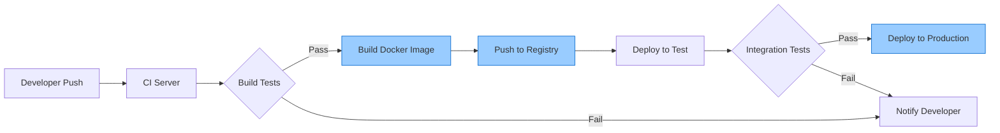

# CICD Docker

## Introduction

Docker has revolutionized how we package and deploy applications. When combined with Continuous Integration and Continuous Deployment (CI/CD) practices, Docker creates a powerful system that can significantly improve your development workflow.

In this guide, we'll explore how Docker fits into the CI/CD pipeline, why this combination is so powerful for modern software development, and how to implement a basic Docker-based CI/CD workflow. By the end, you'll understand how to leverage Docker to create consistent, reliable deployments as part of your automation strategy.

## What is Docker?

Before diving into CI/CD with Docker, let's clarify what Docker is:

Docker is a platform that uses containerization technology to package applications and their dependencies into standardized units called **containers**. These containers are:

- **Lightweight**: They share the host OS kernel but run as isolated processes
- **Portable**: They run the same way regardless of environment
- **Consistent**: They include all dependencies, eliminating "works on my machine" problems
- **Efficient**: They consume fewer resources than virtual machines

## Why Use Docker in CI/CD?

Integrating Docker into your CI/CD pipeline offers several key benefits:

1. **Environment Consistency**: The same container runs everywhere—development, testing, staging, and production
2. **Isolation**: Each application runs in its own container, preventing dependency conflicts
3. **Faster Builds and Deployments**: Containers start in seconds, not minutes
4. **Easy Rollbacks**: You can quickly revert to a previous container version if issues arise
5. **Scalability**: Containers can be easily scaled horizontally to handle increased load

## Understanding CI/CD with Docker

Let's visualize how Docker fits into a typical CI/CD pipeline:



## Setting Up Docker for CI/CD

### Prerequisites

Before we begin, ensure you have:

- Docker installed on your local machine
- A GitHub/GitLab account for source control
- Access to a CI/CD platform (Jenkins, GitLab CI, GitHub Actions, etc.)

### Step 1: Dockerize Your Application

First, you need a `Dockerfile` that defines how your application should be containerized:

```dockerfile
# Use a specific version for reproducibility
FROM node:16-alpine

# Set working directory
WORKDIR /app

# Copy package files first (for better caching)
COPY package*.json ./

# Install dependencies
RUN npm install

# Copy application code
COPY . .

# Build application (if needed)
RUN npm run build

# Expose port
EXPOSE 3000

# Define startup command
CMD ["npm", "start"]
```

This example is for a Node.js application, but Docker supports virtually any language or framework.

### Step 2: Create a Docker Compose File (Optional)

For applications with multiple services (web server, database, cache, etc.), a `docker-compose.yml` file helps define and run multi-container applications:

```yaml
version: '3'

services:
  app:
    build: .
    ports:
      - "3000:3000"
    depends_on:
      - db
    environment:
      - DATABASE_URL=postgres://postgres:password@db:5432/myapp
  
  db:
    image: postgres:13
    volumes:
      - postgres_data:/var/lib/postgresql/data
    environment:
      - POSTGRES_PASSWORD=password
      - POSTGRES_DB=myapp

volumes:
  postgres_data:
```

### Step 3: Set Up CI/CD Integration

Now let's integrate Docker into a CI/CD pipeline. Here's an example using GitHub Actions:

Create a `.github/workflows/ci-cd.yml` file in your repository:

```yaml
name: CI/CD Pipeline

on:
  push:
    branches: [ main ]
  pull_request:
    branches: [ main ]

jobs:
  build-and-deploy:
    runs-on: ubuntu-latest
    
    steps:
    - uses: actions/checkout@v3
    
    - name: Set up Docker Buildx
      uses: docker/setup-buildx-action@v2
    
    - name: Login to DockerHub
      uses: docker/login-action@v2
      with:
        username: ${{ secrets.DOCKERHUB_USERNAME }}
        password: ${{ secrets.DOCKERHUB_TOKEN }}
    
    - name: Build and Test
      run: |
        docker-compose build
        docker-compose run app npm test
    
    - name: Build and Push Docker image
      uses: docker/build-push-action@v4
      with:
        context: .
        push: true
        tags: yourusername/yourapp:latest
    
    - name: Deploy to Test Environment
      if: github.event_name != 'pull_request'
      run: |
        # Deploy commands for your hosting platform
        echo "Deploying to test environment..."
    
    - name: Deploy to Production
      if: github.ref == 'refs/heads/main' && github.event_name != 'pull_request'
      run: |
        # Production deployment commands
        echo "Deploying to production environment..."
```

## Real-World CI/CD Docker Workflow

Let's walk through a practical, real-world example of a CI/CD Docker workflow:

### Scenario: Web Application Development

Imagine you're building a web application with a React frontend and Node.js backend. Here's how the CI/CD Docker process would work:

1. **Local Development**:
   - Developers use Docker Compose for local development
   - Each component (frontend, backend, database) runs in separate containers
   - Code changes automatically reflect in the running containers

2. **Continuous Integration**:
   - Developer pushes code to a feature branch
   - CI server automatically:
     - Builds Docker images
     - Runs unit tests inside containers
     - Performs code quality checks

3. **Pull Request Review**:
   - A temporary test environment is spun up using the new Docker images
   - Reviewers can test features before merging
   - Automated integration tests run against the test environment

4. **Continuous Deployment**:
   - After the PR is merged, the CI/CD pipeline:
     - Rebuilds the Docker images with the latest code
     - Tags the images with version numbers
     - Pushes images to a Docker registry
     - Updates the staging environment using the new images
     - Runs integration tests on staging
     - If successful, deploys to production

### Example Pipeline Configuration (GitLab CI/CD)

Here's an example `.gitlab-ci.yml` file for the scenario above:

```yaml
stages:
  - build
  - test
  - release
  - deploy-staging
  - deploy-production

variables:
  DOCKER_REGISTRY: registry.example.com
  DOCKER_IMAGE_BACKEND: $DOCKER_REGISTRY/myapp/backend
  DOCKER_IMAGE_FRONTEND: $DOCKER_REGISTRY/myapp/frontend

build-backend:
  stage: build
  script:
    - docker build -t $DOCKER_IMAGE_BACKEND:$CI_COMMIT_SHORT_SHA ./backend
    - docker push $DOCKER_IMAGE_BACKEND:$CI_COMMIT_SHORT_SHA

build-frontend:
  stage: build
  script:
    - docker build -t $DOCKER_IMAGE_FRONTEND:$CI_COMMIT_SHORT_SHA ./frontend
    - docker push $DOCKER_IMAGE_FRONTEND:$CI_COMMIT_SHORT_SHA

test-backend:
  stage: test
  script:
    - docker pull $DOCKER_IMAGE_BACKEND:$CI_COMMIT_SHORT_SHA
    - docker run $DOCKER_IMAGE_BACKEND:$CI_COMMIT_SHORT_SHA npm test

test-frontend:
  stage: test
  script:
    - docker pull $DOCKER_IMAGE_FRONTEND:$CI_COMMIT_SHORT_SHA
    - docker run $DOCKER_IMAGE_FRONTEND:$CI_COMMIT_SHORT_SHA npm test

release-images:
  stage: release
  script:
    - docker pull $DOCKER_IMAGE_BACKEND:$CI_COMMIT_SHORT_SHA
    - docker pull $DOCKER_IMAGE_FRONTEND:$CI_COMMIT_SHORT_SHA
    - docker tag $DOCKER_IMAGE_BACKEND:$CI_COMMIT_SHORT_SHA $DOCKER_IMAGE_BACKEND:latest
    - docker tag $DOCKER_IMAGE_FRONTEND:$CI_COMMIT_SHORT_SHA $DOCKER_IMAGE_FRONTEND:latest
    - docker push $DOCKER_IMAGE_BACKEND:latest
    - docker push $DOCKER_IMAGE_FRONTEND:latest
  only:
    - main

deploy-staging:
  stage: deploy-staging
  script:
    - kubectl set image deployment/backend backend=$DOCKER_IMAGE_BACKEND:$CI_COMMIT_SHORT_SHA --namespace staging
    - kubectl set image deployment/frontend frontend=$DOCKER_IMAGE_FRONTEND:$CI_COMMIT_SHORT_SHA --namespace staging
  only:
    - main

deploy-production:
  stage: deploy-production
  script:
    - kubectl set image deployment/backend backend=$DOCKER_IMAGE_BACKEND:$CI_COMMIT_SHORT_SHA --namespace production
    - kubectl set image deployment/frontend frontend=$DOCKER_IMAGE_FRONTEND:$CI_COMMIT_SHORT_SHA --namespace production
  when: manual
  only:
    - main
```

## Best Practices for CI/CD with Docker

To maximize the benefits of Docker in your CI/CD pipeline:

1. **Use Specific Image Tags**: Avoid using `latest` tag in production; use specific versions or commit hashes
2. **Optimize Dockerfile for Caching**: Order commands from least to most frequently changing
3. **Implement Multi-Stage Builds**: Separate build environments from runtime environments
4. **Keep Images Small**: Include only what's necessary for your application to run
5. **Scan Images for Vulnerabilities**: Use tools like Trivy, Clair, or Snyk
6. **Use Secrets Management**: Never hardcode sensitive data in Docker images
7. **Implement Health Checks**: Ensure containers are running properly before completing deployment

### Example: Multi-Stage Build

Multi-stage builds help create optimized, secure production images:

```dockerfile
# Build stage
FROM node:16 AS builder
WORKDIR /app
COPY package*.json ./
RUN npm install
COPY . .
RUN npm run build

# Production stage
FROM node:16-alpine
WORKDIR /app
COPY --from=builder /app/dist ./dist
COPY --from=builder /app/package*.json ./
RUN npm install --only=production
EXPOSE 3000
CMD ["npm", "run", "start:prod"]
```

This approach:
- Uses a larger image with all build tools for compilation
- Creates a final image with only runtime dependencies
- Results in a smaller, more secure production container

## Common Issues and Troubleshooting

When implementing Docker in CI/CD, you might encounter these common issues:

1. **Build Context Too Large**
   - *Solution*: Use `.dockerignore` to exclude unnecessary files

   ```
   node_modules
   npm-debug.log
   .git
   .github
   docs
   tests
   *.md
   ```

2. **Container Networking Issues**
   - *Solution*: Use Docker networks and service discovery

3. **Pipeline Timeouts**
   - *Solution*: Optimize build process and consider caching strategies

4. **Resource Constraints**
   - *Solution*: Set resource limits in your Docker configuration
   
   ```yaml
   services:
     app:
       build: .
       deploy:
         resources:
           limits:
             cpus: '0.5'
             memory: 512M
   ```

5. **Security Vulnerabilities**
   - *Solution*: Regularly update base images and scan for vulnerabilities

## Advanced Topics

Once you have mastered the basics, consider exploring these advanced Docker CI/CD topics:

1. **Blue-Green Deployments**: Run two identical production environments, switching traffic between them
2. **Canary Releases**: Roll out changes to a small subset of users before full deployment
3. **Container Orchestration**: Use Kubernetes or Docker Swarm for managing container deployments
4. **Infrastructure as Code**: Define your Docker infrastructure using tools like Terraform
5. **Automated Rollbacks**: Automatically revert to previous versions if metrics indicate problems

## Summary

Integrating Docker into your CI/CD pipeline provides a powerful combination that:

- Ensures consistency across all environments
- Simplifies deployment and scaling
- Increases developer productivity
- Reduces integration issues
- Enables more reliable and frequent releases

By containerizing your applications and automating their deployment through CI/CD pipelines, you create a robust system that can adapt to changing requirements while maintaining stability and reliability.

## Additional Resources

To continue learning about CI/CD with Docker:

1. **Official Docker Documentation**: [https://docs.docker.com](https://docs.docker.com)
2. **GitHub Actions Documentation**: [https://docs.github.com/en/actions](https://docs.github.com/en/actions)
3. **GitLab CI/CD Documentation**: [https://docs.gitlab.com/ee/ci/](https://docs.gitlab.com/ee/ci/)
4. **Docker in Practice** by Ian Miell and Aidan Hobson Sayers
5. **Docker Deep Dive** by Nigel Poulton

## Exercises

To reinforce your learning, try these practical exercises:

1. Create a simple web application and dockerize it using a multi-stage build approach
2. Set up a GitHub Actions or GitLab CI/CD pipeline for automated testing and deployment
3. Implement a blue-green deployment strategy using Docker and a CI/CD platform
4. Create a Docker Compose file for a multi-service application (e.g., web app + database + cache)
5. Configure a vulnerability scanning step in your CI/CD pipeline to check Docker images