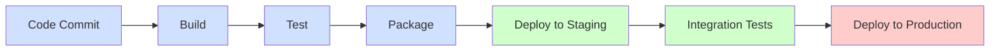

# CI/CD Infrastructure Monitoring

## Introduction

Continuous Integration and Continuous Delivery (CI/CD) have revolutionized software development by automating the build, test, and deployment processes. However, as CI/CD pipelines become more complex and critical to business operations, monitoring the infrastructure that supports these pipelines becomes equally important.

CI/CD infrastructure monitoring involves tracking, analyzing, and optimizing the performance and health of the systems that power your CI/CD pipelines. This includes servers, build agents, artifact repositories, and the various components that make up your deployment pipeline.

In this guide, we'll explore why monitoring your CI/CD infrastructure is crucial, what metrics to track, common monitoring tools, and best practices for implementing a robust monitoring strategy.

## Why Monitor Your CI/CD Infrastructure?

Before diving into the how, let's understand why monitoring your CI/CD infrastructure is essential:

1. **Pipeline Reliability** - Detect and resolve issues before they cause pipeline failures
2. **Resource Optimization** - Identify bottlenecks and optimize resource allocation
3. **Cost Management** - Track resource usage to control cloud and infrastructure costs
4. **Performance Insights** - Gain visibility into build and deployment times
5. **Capacity Planning** - Understand usage patterns to plan for future growth

Without proper monitoring, your CI/CD pipeline can become a black box - working well until it suddenly doesn't, with little insight into what went wrong or how to fix it.

## Key Metrics to Monitor

Let's explore the essential metrics you should track in your CI/CD infrastructure:

### System-Level Metrics

These metrics focus on the underlying infrastructure:

- **CPU Utilization** - High CPU usage can slow down builds and deployments
- **Memory Usage** - Memory constraints can cause job failures
- **Disk I/O** - Slow disk operations can bottleneck pipeline performance
- **Network Throughput** - Network issues can slow down artifact transfers

### CI/CD Pipeline Metrics

These metrics directly relate to your pipeline performance:

- **Build Duration** - How long builds take to complete
- **Build Success Rate** - Percentage of successful vs. failed builds
- **Queue Time** - How long jobs wait before being processed
- **Deployment Frequency** - How often you deploy to production
- **Mean Time to Recovery (MTTR)** - How quickly failures are resolved

### Application-Specific Metrics

These metrics help connect CI/CD performance to business outcomes:

- **Test Coverage** - Percentage of code covered by automated tests
- **Code Quality Metrics** - Code smells, technical debt, etc.
- **Deployment Success Rate** - Percentage of successful deployments
- **Rollback Frequency** - How often deployments need to be rolled back

## Setting Up Basic Infrastructure Monitoring

Let's walk through a basic setup for monitoring your CI/CD infrastructure using Prometheus and Grafana, two popular open-source tools:

### Step 1: Install Prometheus

Prometheus is an open-source monitoring and alerting toolkit that's become a standard for infrastructure monitoring.

```bash
# Using Docker
docker run -p 9090:9090 -v /path/to/prometheus.yml:/etc/prometheus/prometheus.yml prom/prometheus
```

Here's a basic `prometheus.yml` configuration:

```yaml
global:
  scrape_interval: 15s

scrape_configs:
  - job_name: 'ci_servers'
    static_configs:
      - targets: ['jenkins:8080', 'gitlab-runner:9252']
  
  - job_name: 'build_nodes'
    static_configs:
      - targets: ['build-node-1:9100', 'build-node-2:9100']
```

### Step 2: Install Node Exporter

Node Exporter collects system-level metrics from your CI/CD servers:

```bash
# Using Docker
docker run -d -p 9100:9100 prom/node-exporter
```

### Step 3: Install Grafana

Grafana provides visualization for your monitoring data:

```bash
# Using Docker
docker run -d -p 3000:3000 grafana/grafana
```

### Step 4: Create a Dashboard

Once Grafana is running, you can create dashboards to visualize your CI/CD metrics. Here's a simple example of how to query build duration from Jenkins:

```
sum(jenkins_build_duration_seconds) by (job_name)
```

## Real-World Example: Monitoring a Jenkins CI/CD Pipeline

Let's look at a practical example of monitoring a Jenkins-based CI/CD pipeline:

### 1. Install the Prometheus Plugin in Jenkins

In Jenkins, go to "Manage Jenkins" > "Manage Plugins" and install the Prometheus plugin.

### 2. Configure Jenkins to Expose Metrics

The plugin will expose metrics at `http://your-jenkins-server/prometheus/`.

### 3. Update Prometheus Configuration

Add the Jenkins target to your Prometheus configuration:

```yaml
- job_name: 'jenkins'
  metrics_path: '/prometheus'
  static_configs:
    - targets: ['jenkins:8080']
```

### 4. Create a Basic Jenkins Dashboard in Grafana

Import a pre-built Jenkins dashboard or create one with panels for:

- Build success/failure rate
- Average build duration
- Queue size and wait time
- Number of active builds

Here's an example Grafana dashboard configuration in JSON format:

```json
{
  "panels": [
    {
      "title": "Build Duration",
      "type": "graph",
      "targets": [
        {
          "expr": "jenkins_job_build_duration_seconds{job=\"my-application-build\"}",
          "legendFormat": "{{job}}"
        }
      ]
    },
    {
      "title": "Build Success Rate",
      "type": "gauge",
      "targets": [
        {
          "expr": "sum(jenkins_job_last_successful_build_total) / sum(jenkins_job_last_build_total) * 100"
        }
      ],
      "options": {
        "min": 0,
        "max": 100
      }
    }
  ]
}
```

## Visualizing Your CI/CD Pipeline Flow

A flow diagram can help visualize your CI/CD pipeline and identify bottlenecks. Here's a simple pipeline flow diagram:



By monitoring each step in this pipeline, you can identify which stages take the longest or fail most frequently.

## Implementing Alerts

Monitoring isn't useful without alerts for critical issues. Here's how to set up basic alerting in Prometheus:

### Step 1: Create an Alert Rule File

Create `alert.rules.yml`:

```yaml
groups:
- name: ci_alerts
  rules:
  - alert: HighFailureRate
    expr: sum(rate(jenkins_job_build_failed_total[15m])) / sum(rate(jenkins_job_build_total[15m])) > 0.3
    for: 15m
    labels:
      severity: critical
    annotations:
      summary: "Build failure rate is high"
      description: "Build failure rate is above 30% for more than 15 minutes."
  
  - alert: LongBuildQueue
    expr: jenkins_queue_size_value > 10
    for: 10m
    labels:
      severity: warning
    annotations:
      summary: "Jenkins build queue is long"
      description: "Jenkins has more than 10 jobs waiting in queue for more than 10 minutes."
```

### Step 2: Update Prometheus Configuration

Update your Prometheus configuration to include the alert rules:

```yaml
global:
  scrape_interval: 15s

rule_files:
  - 'alert.rules.yml'

scrape_configs:
  # ... existing config ...
```

### Step 3: Set Up Alertmanager

Install and configure Alertmanager to send notifications:

```bash
# Using Docker
docker run -p 9093:9093 -v /path/to/alertmanager.yml:/etc/alertmanager/alertmanager.yml prom/alertmanager
```

Here's a basic `alertmanager.yml`:

```yaml
route:
  group_by: ['alertname']
  group_wait: 30s
  group_interval: 5m
  repeat_interval: 1h
  receiver: 'email-notifications'

receivers:
- name: 'email-notifications'
  email_configs:
  - to: 'team@example.com'
    from: 'alertmanager@example.com'
    smarthost: 'smtp.example.com:587'
    auth_username: 'alertmanager'
    auth_password: 'password'
```

## Advanced Monitoring Strategies

As your CI/CD infrastructure grows, consider these advanced monitoring strategies:

### Distributed Tracing

Use tools like Jaeger or Zipkin to trace requests across different services in your CI/CD pipeline.

```bash
# Example Docker command to run Jaeger
docker run -d --name jaeger \
  -p 5775:5775/udp \
  -p 6831:6831/udp \
  -p 6832:6832/udp \
  -p 5778:5778 \
  -p 16686:16686 \
  -p 14268:14268 \
  jaegertracing/all-in-one:latest
```

### Log Aggregation

Centralize logs from all CI/CD components using the ELK stack (Elasticsearch, Logstash, Kibana) or similar solutions.

```bash
# Example Docker Compose snippet for ELK
version: '3'
services:
  elasticsearch:
    image: docker.elastic.co/elasticsearch/elasticsearch:7.10.0
    ports:
      - "9200:9200"
  
  logstash:
    image: docker.elastic.co/logstash/logstash:7.10.0
    ports:
      - "5044:5044"
    depends_on:
      - elasticsearch
  
  kibana:
    image: docker.elastic.co/kibana/kibana:7.10.0
    ports:
      - "5601:5601"
    depends_on:
      - elasticsearch
```

### CI/CD Metrics as Code

Store your monitoring configuration as code alongside your application code:

```yaml
# monitoring/grafana/dashboards/ci-dashboard.json
{
  "title": "CI/CD Pipeline Overview",
  "panels": [
    // ... dashboard configuration ...
  ]
}

# monitoring/prometheus/alerts/ci-alerts.yml
groups:
  - name: ci_alerts
    rules:
      // ... alert rules ...
```

## Best Practices for CI/CD Monitoring

Follow these best practices to get the most out of your monitoring:

1. **Start Simple** - Begin with basic metrics and expand as needed
2. **Monitor What Matters** - Focus on metrics that directly impact your workflow
3. **Set Baselines** - Establish normal performance patterns to detect anomalies
4. **Automate Responses** - Set up automated actions for common issues
5. **Use Contextual Alerts** - Include relevant information in alert notifications
6. **Regular Reviews** - Periodically review and update your monitoring strategy
7. **Correlation Analysis** - Look for relationships between different metrics
8. **End-to-End Visibility** - Monitor the entire pipeline, not just individual components

## Summary

Effective CI/CD infrastructure monitoring is crucial for maintaining reliable, efficient software delivery pipelines. By tracking key metrics, implementing proper alerting, and following best practices, you can ensure your CI/CD infrastructure remains healthy and performant.

Remember that monitoring is not a set-it-and-forget-it task—it requires ongoing attention and refinement as your CI/CD processes evolve.

## Additional Resources

Here are some resources to help you dive deeper into CI/CD infrastructure monitoring:

- **Books**:
  - "Implementing Service Level Objectives" by Alex Hidalgo
  - "Practical Monitoring" by Mike Julian

- **Online Courses**:
  - "Monitoring Distributed Systems" by Google SRE
  - "DevOps Monitoring Deep Dive" on Pluralsight

- **Practice Exercises**:
  1. Set up basic monitoring for a Jenkins or GitLab CI server
  2. Create custom Grafana dashboards for your specific CI/CD metrics
  3. Implement alerting for critical pipeline failures
  4. Correlate test failures with infrastructure metrics

By following the guidance in this tutorial, you'll be well on your way to building a robust monitoring system for your CI/CD infrastructure that helps you deliver software more reliably and efficiently.