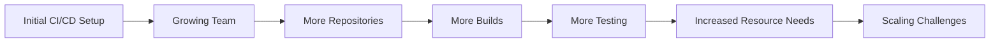
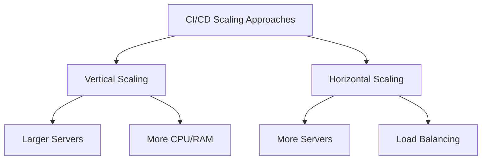

# CI/CD Infrastructure Scaling

## Introduction

As your development team grows and your projects become more complex, your Continuous Integration and Continuous Deployment (CI/CD) infrastructure needs to evolve with it. CI/CD infrastructure scaling refers to the strategies and practices for expanding your build, test, and deployment systems to handle increasing workloads efficiently.

In this guide, we'll explore why scaling matters, common scaling challenges, and practical approaches to ensure your CI/CD pipelines remain fast and reliable even as demands increase.

## Why CI/CD Scaling Matters

When you first implement CI/CD, a simple setup might be sufficient. However, as your organization evolves, you may encounter:

- Longer queue times for builds and tests
- Increased pipeline execution times
- Higher infrastructure costs
- Resource contention between teams
- Reduced developer productivity

Let's visualize how CI/CD demands typically grow over time:



## Scaling Challenges and Solutions

### 1. Build Queue Bottlenecks

**Challenge**: As more developers commit code, build requests pile up, creating long wait times.

**Solution**: Implement a job queue system with priority levels.

```javascript
// Example queue configuration with priority levels
const buildQueue = {
  highPriority: {
    concurrency: 5,
    timeout: 30 * 60 * 1000 // 30 minutes
  },
  normalPriority: {
    concurrency: 3,
    timeout: 60 * 60 * 1000 // 60 minutes
  },
  lowPriority: {
    concurrency: 1,
    timeout: 120 * 60 * 1000 // 120 minutes
  }
};

function scheduleBuild(repository, branch, priority = 'normalPriority') {
  // Add build to appropriate queue based on priority
  return buildQueue[priority].add(() => {
    return executeBuild(repository, branch);
  });
}
```

With this approach, critical builds (like production deployments) can be prioritized over routine feature branch builds.

### 2. Resource Allocation

**Challenge**: Different projects have different resource needs.

**Solution**: Implement dynamic resource allocation based on project requirements.

```yaml
# Example Jenkins resource configuration
jenkins:
  agent:
    kubernetes:
      templates:
        - name: small-agent
          containers:
            - name: jnlp
              image: jenkins/inbound-agent:4.11.2-4
              resources:
                requests:
                  cpu: "0.5"
                  memory: "1Gi"
                limits:
                  cpu: "1"
                  memory: "2Gi"
        - name: medium-agent
          containers:
            - name: jnlp
              image: jenkins/inbound-agent:4.11.2-4
              resources:
                requests:
                  cpu: "2"
                  memory: "4Gi"
                limits:
                  cpu: "4"
                  memory: "8Gi"
        - name: large-agent
          containers:
            - name: jnlp
              image: jenkins/inbound-agent:4.11.2-4
              resources:
                requests:
                  cpu: "8"
                  memory: "16Gi"
                limits:
                  cpu: "16"
                  memory: "32Gi"
```

In your pipeline definition:

```groovy
// Example Jenkins pipeline using different agent sizes
pipeline {
  agent {
    label params.BUILD_SIZE ?: 'medium-agent'
  }
  
  stages {
    stage('Build') {
      steps {
        echo "Building with ${env.NODE_NAME} resources"
        // build steps
      }
    }
  }
}
```

### 3. Horizontal vs. Vertical Scaling

CI/CD infrastructure can be scaled in two primary directions:

#### Vertical Scaling (Scaling Up)

This involves adding more resources (CPU, memory) to your existing CI/CD servers.

**Pros**:
- Simple to implement
- No need to modify job distribution logic

**Cons**:
- Limited by hardware constraints
- Can be expensive
- Single point of failure

#### Horizontal Scaling (Scaling Out)

This involves adding more CI/CD servers to distribute the workload.

**Pros**:
- More resilient to failures
- Can scale almost infinitely
- Often more cost-effective

**Cons**:
- More complex to set up and manage
- Requires job distribution mechanisms



### 4. Containerized Agents

One of the most effective scaling strategies is using containerized build agents with orchestration platforms like Kubernetes.

```yaml
# Example Kubernetes manifest for GitLab Runner
apiVersion: apps/v1
kind: Deployment
metadata:
  name: gitlab-runner
  namespace: ci-cd
spec:
  replicas: 3
  selector:
    matchLabels:
      app: gitlab-runner
  template:
    metadata:
      labels:
        app: gitlab-runner
    spec:
      containers:
      - name: gitlab-runner
        image: gitlab/gitlab-runner:latest
        args:
        - run
        volumeMounts:
        - name: config
          mountPath: /etc/gitlab-runner
          readOnly: true
        - name: docker-socket
          mountPath: /var/run/docker.sock
      volumes:
      - name: config
        configMap:
          name: gitlab-runner-config
      - name: docker-socket
        hostPath:
          path: /var/run/docker.sock
```

This allows your CI/CD system to:
- Spin up build agents on demand
- Scale automatically based on workload
- Isolate build environments
- Use cloud resources efficiently

## Scaling Patterns for CI/CD

### 1. Distributed Build Caching

Build caching dramatically improves build times by reusing previous build artifacts.

```bash
# Example using Gradle build cache configuration
gradle build \
  --build-cache \
  --gradle-user-home=/shared/gradle-cache
```

When scaling, implement distributed caching:

```javascript
// Example distributed cache configuration (Node.js)
const buildCache = new DistributedCache({
  type: 'redis',
  host: process.env.REDIS_HOST || 'localhost',
  port: process.env.REDIS_PORT || 6379,
  ttl: 60 * 60 * 24 * 7, // 1 week cache lifetime
  compression: true
});

async function buildWithCache(projectId, commitHash) {
  const cacheKey = `build:${projectId}:${commitHash}`;
  
  // Try to get from cache first
  const cachedBuild = await buildCache.get(cacheKey);
  if (cachedBuild) {
    console.log('Build cache hit, using cached artifacts');
    return cachedBuild;
  }
  
  // Execute build if not in cache
  console.log('Build cache miss, executing build');
  const buildResult = await executeBuild(projectId, commitHash);
  
  // Store in cache for future use
  await buildCache.set(cacheKey, buildResult);
  
  return buildResult;
}
```

### 2. Parallel and Matrix Testing

Split testing workloads across multiple agents to reduce overall execution time.

```yaml
# Example GitHub Actions workflow with matrix testing
name: Test

on: [push, pull_request]

jobs:
  test:
    runs-on: ubuntu-latest
    strategy:
      matrix:
        node-version: [14.x, 16.x, 18.x]
        test-group: [unit, integration, e2e]
    
    steps:
    - uses: actions/checkout@v3
    
    - name: Use Node.js ${{ matrix.node-version }}
      uses: actions/setup-node@v3
      with:
        node-version: ${{ matrix.node-version }}
        
    - name: Install dependencies
      run: npm ci
      
    - name: Run ${{ matrix.test-group }} tests
      run: npm run test:${{ matrix.test-group }}
```

### 3. Auto-Scaling Infrastructure

Implement auto-scaling based on usage patterns:

```terraform
# Example Terraform configuration for AWS auto-scaling group
resource "aws_autoscaling_group" "ci_workers" {
  name                 = "ci-workers"
  min_size             = 2
  max_size             = 10
  desired_capacity     = 2
  vpc_zone_identifier  = [aws_subnet.private_a.id, aws_subnet.private_b.id]
  launch_configuration = aws_launch_configuration.ci_worker.name
  
  tag {
    key                 = "Name"
    value               = "ci-worker"
    propagate_at_launch = true
  }
}

resource "aws_autoscaling_policy" "scale_up" {
  name                   = "scale-up"
  scaling_adjustment     = 1
  adjustment_type        = "ChangeInCapacity"
  cooldown               = 300
  autoscaling_group_name = aws_autoscaling_group.ci_workers.name
}

resource "aws_cloudwatch_metric_alarm" "high_queue_depth" {
  alarm_name          = "high-queue-depth"
  comparison_operator = "GreaterThanThreshold"
  evaluation_periods  = 2
  metric_name         = "QueueDepth"
  namespace           = "Custom/CI"
  period              = 60
  statistic           = "Average"
  threshold           = 5
  alarm_description   = "This metric monitors ci queue depth"
  alarm_actions       = [aws_autoscaling_policy.scale_up.arn]
}
```

## Real-World Implementation: Jenkins Scaling Case Study

Let's walk through a real-world example of scaling Jenkins for a growing organization:

### Initial Setup (Small Team)
- Single Jenkins server
- 5 developers
- 10 repositories
- ~50 builds per day

### Growing Pains
- Build times increasing
- Queue delays of 30+ minutes
- Developer complaints about waiting for CI

### Scaling Solution

1. **Implement Jenkins Controller/Agent Architecture**:

```groovy
// Example Jenkins pipeline with dynamic agent selection
pipeline {
  agent {
    kubernetes {
      yaml """
        apiVersion: v1
        kind: Pod
        spec:
          containers:
          - name: maven
            image: maven:3.8.6-openjdk-11
            command:
            - cat
            tty: true
            resources:
              requests:
                memory: "1Gi"
                cpu: "500m"
              limits:
                memory: "2Gi"
                cpu: "1"
          - name: docker
            image: docker:20.10.17-dind
            securityContext:
              privileged: true
            volumeMounts:
              - name: docker-socket
                mountPath: /var/run/docker.sock
          volumes:
          - name: docker-socket
            hostPath:
              path: /var/run/docker.sock
        """
    }
  }
  
  stages {
    stage('Build') {
      steps {
        container('maven') {
          sh 'mvn clean package'
        }
      }
    }
    
    stage('Docker build') {
      steps {
        container('docker') {
          sh 'docker build -t myapp:${BUILD_NUMBER} .'
        }
      }
    }
  }
}
```

2. **Implement Distributed Build Cache**:

```xml
<!-- Example Maven settings.xml for build cache -->
<settings>
  <mirrors>
    <mirror>
      <id>central-cache</id>
      <name>Central Repository Cache</name>
      <url>http://artifact-cache.internal/repository/maven-central/</url>
      <mirrorOf>central</mirrorOf>
    </mirror>
  </mirrors>
</settings>
```

3. **Auto-scaling Configuration**:

```yaml
# Kubernetes Horizontal Pod Autoscaler for Jenkins agents
apiVersion: autoscaling/v2
kind: HorizontalPodAutoscaler
metadata:
  name: jenkins-agent-hpa
spec:
  scaleTargetRef:
    apiVersion: apps/v1
    kind: Deployment
    name: jenkins-agent
  minReplicas: 3
  maxReplicas: 20
  metrics:
  - type: Resource
    resource:
      name: cpu
      target:
        type: Utilization
        averageUtilization: 70
```

### Results
- Build wait times reduced from 30+ minutes to under 5 minutes
- 300% increase in daily build capacity
- Automated scaling during peak hours
- Reduced costs during off-hours

## Best Practices for CI/CD Scaling

1. **Monitor Performance Metrics**
   - Track build times
   - Measure queue depths
   - Monitor resource utilization

2. **Optimize Before Scaling**
   - Improve build scripts
   - Remove unnecessary steps
   - Implement caching strategies

3. **Use Infrastructure as Code**
   - Define CI/CD infrastructure with code
   - Version control your configurations
   - Automate provisioning and scaling

4. **Implement Cost Controls**
   - Scale down during off-hours
   - Use spot/preemptible instances
   - Set resource quotas per team

5. **Standardize Build Environments**
   - Use containers for consistency
   - Define standard build images
   - Version your build environments

## Monitoring Your CI/CD Infrastructure

Implement monitoring to detect scaling needs:

```javascript
// Example Prometheus metrics for CI/CD monitoring
const prometheus = require('prom-client');

// Build queue metrics
const buildQueueSize = new prometheus.Gauge({
  name: 'ci_build_queue_size',
  help: 'Current number of builds in queue'
});

const buildDuration = new prometheus.Histogram({
  name: 'ci_build_duration_seconds',
  help: 'Build duration in seconds',
  buckets: [60, 180, 300, 600, 1200, 1800, 3600]
});

// Track build start
function startBuild(buildId) {
  const startTime = Date.now();
  buildQueueSize.dec();
  
  return {
    end: () => {
      const duration = (Date.now() - startTime) / 1000;
      buildDuration.observe(duration);
      return duration;
    }
  };
}

// Enqueue build
function enqueueBuild() {
  buildQueueSize.inc();
}
```

## Summary

Scaling your CI/CD infrastructure is essential for maintaining developer productivity as your team and codebase grow. Key strategies include:

- Implementing horizontal scaling with containerized agents
- Using dynamic resource allocation
- Setting up distributed caching
- Parallelizing tests and builds
- Implementing auto-scaling based on demand
- Continuous monitoring and optimization

By proactively addressing scaling challenges, you can ensure your CI/CD infrastructure supports rather than hinders your development process.

## Exercises

1. Set up a Jenkins or GitLab CI instance with Kubernetes agents.
2. Implement a build cache for your favorite build system.
3. Create an auto-scaling configuration for your CI/CD system.
4. Benchmark your current CI/CD system and identify bottlenecks.
5. Develop a monitoring dashboard for your CI/CD metrics.

## Additional Resources

- [Jenkins Kubernetes Plugin Documentation](https://plugins.jenkins.io/kubernetes/)
- [GitLab Runner Autoscaling with Kubernetes](https://docs.gitlab.com/runner/executors/kubernetes.html)
- [GitHub Actions: Scaling with Self-Hosted Runners](https://docs.github.com/en/actions/hosting-your-own-runners)
- [CircleCI Resource Classes](https://circleci.com/docs/resource-class-overview/)
- [Terraform Provider for Jenkins](https://registry.terraform.io/providers/taiidani/jenkins/latest/docs)