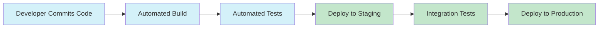
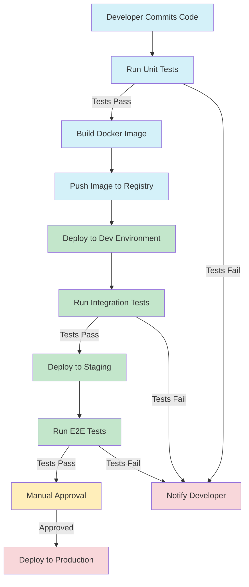

# CI/CD with Kubernetes

## Introduction

Welcome to our guide on Continuous Integration and Continuous Deployment (CI/CD) with Kubernetes! If you're looking to streamline your application deployment process, automate testing, and ensure reliable releases, you're in the right place.

In today's fast-paced development environment, manually deploying applications is time-consuming and error-prone. CI/CD practices help teams deliver code changes more frequently and reliably, while Kubernetes provides a powerful platform for container orchestration. When combined, they create a robust foundation for modern application deployment.

In this tutorial, we'll explore how to implement CI/CD pipelines that deploy applications to Kubernetes clusters, making your development workflow more efficient and reliable.

## What is CI/CD?

Before diving into Kubernetes specifics, let's clarify what CI/CD means:

- **Continuous Integration (CI)**: The practice of frequently merging code changes into a shared repository, followed by automated building and testing.
- **Continuous Deployment (CD)**: The practice of automatically deploying all code changes to production after passing through the CI pipeline.

Together, these practices form a pipeline that takes code from development to production with minimal manual intervention.



## What is Kubernetes?

Kubernetes (often abbreviated as K8s) is an open-source container orchestration platform that automates the deployment, scaling, and management of containerized applications. It provides:

- **Scalability**: Easily scale your applications up or down based on demand
- **Self-healing**: Automatically replaces and reschedules containers when nodes fail
- **Service discovery**: Containers can find and communicate with each other
- **Load balancing**: Distributes network traffic to ensure high availability
- **Automated rollouts and rollbacks**: Change application state gradually or revert to previous states

## Why Combine CI/CD with Kubernetes?

Combining CI/CD practices with Kubernetes offers several benefits:

1. **Infrastructure as Code**: Define your infrastructure declaratively
2. **Immutable deployments**: Each deployment creates new containers rather than modifying existing ones
3. **Easy rollbacks**: Quickly revert to previous versions if issues arise
4. **Consistent environments**: Development, staging, and production environments remain consistent
5. **Resource efficiency**: Optimize resource utilization in your cluster

## Setting Up a Basic CI/CD Pipeline for Kubernetes

Let's build a simple CI/CD pipeline for deploying an application to Kubernetes. We'll use GitHub Actions as our CI/CD tool, but the concepts apply to other tools like Jenkins, GitLab CI, or CircleCI.

### Prerequisites

Before we begin, you'll need:

- A GitHub repository with your application code
- A Kubernetes cluster (local like Minikube, or cloud-based)
- Docker installed for building container images
- `kubectl` configured to access your cluster

### Step 1: Containerize Your Application

First, create a `Dockerfile` in your project root:

```dockerfile
FROM node:14-alpine

WORKDIR /app

COPY package*.json ./

RUN npm install

COPY . .

EXPOSE 3000

CMD ["npm", "start"]
```

This Dockerfile builds a container image for a Node.js application.

### Step 2: Create Kubernetes Manifests

Next, create a directory called `kubernetes` and add a deployment manifest:

```yaml
# kubernetes/deployment.yaml
apiVersion: apps/v1
kind: Deployment
metadata:
  name: my-app
spec:
  replicas: 3
  selector:
    matchLabels:
      app: my-app
  template:
    metadata:
      labels:
        app: my-app
    spec:
      containers:
      - name: my-app
        image: ${DOCKER_USERNAME}/my-app:${VERSION}
        ports:
        - containerPort: 3000
        resources:
          limits:
            memory: "128Mi"
            cpu: "500m"
```

And a service manifest:

```yaml
# kubernetes/service.yaml
apiVersion: v1
kind: Service
metadata:
  name: my-app-service
spec:
  selector:
    app: my-app
  ports:
  - port: 80
    targetPort: 3000
  type: LoadBalancer
```

### Step 3: Set Up GitHub Actions Workflow

Create a workflow file in `.github/workflows/ci-cd.yaml`:

```yaml
name: CI/CD Pipeline

on:
  push:
    branches: [ main ]

env:
  DOCKER_USERNAME: ${{ github.repository_owner }}
  VERSION: ${{ github.sha }}

jobs:
  build-and-deploy:
    runs-on: ubuntu-latest
    steps:
      - name: Checkout code
        uses: actions/checkout@v2

      - name: Set up Docker Buildx
        uses: docker/setup-buildx-action@v1

      - name: Login to DockerHub
        uses: docker/login-action@v1
        with:
          username: ${{ secrets.DOCKER_USERNAME }}
          password: ${{ secrets.DOCKER_PASSWORD }}

      - name: Build and push Docker image
        uses: docker/build-push-action@v2
        with:
          context: .
          push: true
          tags: ${{ env.DOCKER_USERNAME }}/my-app:${{ env.VERSION }}

      - name: Set up kubectl
        uses: azure/setup-kubectl@v1

      - name: Configure AWS credentials
        uses: aws-actions/configure-aws-credentials@v1
        with:
          aws-access-key-id: ${{ secrets.AWS_ACCESS_KEY_ID }}
          aws-secret-access-key: ${{ secrets.AWS_SECRET_ACCESS_KEY }}
          aws-region: us-east-1

      - name: Update kubeconfig
        run: aws eks update-kubeconfig --name my-cluster --region us-east-1

      - name: Deploy to Kubernetes
        run: |
          # Replace placeholders in deployment.yaml
          sed -i "s|\${DOCKER_USERNAME}|$DOCKER_USERNAME|g" kubernetes/deployment.yaml
          sed -i "s|\${VERSION}|$VERSION|g" kubernetes/deployment.yaml
          
          # Apply Kubernetes manifests
          kubectl apply -f kubernetes/deployment.yaml
          kubectl apply -f kubernetes/service.yaml
          
          # Wait for deployment to complete
          kubectl rollout status deployment/my-app
```

This workflow:
1. Builds a Docker image from your application
2. Pushes the image to Docker Hub
3. Deploys the application to your Kubernetes cluster

### Step 4: Add Required Secrets to GitHub

In your GitHub repository, go to Settings > Secrets and add:

- `DOCKER_USERNAME`: Your Docker Hub username
- `DOCKER_PASSWORD`: Your Docker Hub password or token
- `AWS_ACCESS_KEY_ID`: Your AWS access key (if using EKS)
- `AWS_SECRET_ACCESS_KEY`: Your AWS secret key (if using EKS)

## Advanced CI/CD Techniques for Kubernetes

Once you have a basic pipeline working, you might want to explore these advanced techniques:

### Implementing Canary Deployments

Canary deployments involve routing a small percentage of traffic to a new version of your application to test it with real users before full deployment.

```yaml
# kubernetes/canary-deployment.yaml
apiVersion: apps/v1
kind: Deployment
metadata:
  name: my-app-canary
spec:
  replicas: 1
  selector:
    matchLabels:
      app: my-app
      version: canary
  template:
    metadata:
      labels:
        app: my-app
        version: canary
    spec:
      containers:
      - name: my-app
        image: ${DOCKER_USERNAME}/my-app:${VERSION}
        ports:
        - containerPort: 3000
```

In your CI/CD pipeline, you could add:

```yaml
- name: Deploy canary
  run: |
    kubectl apply -f kubernetes/canary-deployment.yaml
    
    # Wait and monitor for issues
    sleep 300
    
    # If successful, update the main deployment
    kubectl apply -f kubernetes/deployment.yaml
    
    # Then remove the canary
    kubectl delete -f kubernetes/canary-deployment.yaml
```

### Using Helm for Package Management

Helm is a package manager for Kubernetes that simplifies deployment of complex applications.

First, create a Helm chart:

```bash
helm create my-app
```

This creates a directory structure with templates for your Kubernetes resources. You can then use Helm in your CI/CD pipeline:

```yaml
- name: Install Helm
  uses: azure/setup-helm@v1

- name: Deploy with Helm
  run: |
    # Update the image tag in values.yaml
    sed -i "s|tag:.*|tag: $VERSION|g" my-app/values.yaml
    
    # Deploy or upgrade the release
    helm upgrade --install my-app ./my-app
```

### Implementing GitOps with ArgoCD

GitOps is an approach where Git repositories serve as the source of truth for your infrastructure. ArgoCD is a popular tool for implementing GitOps with Kubernetes.

1. Install ArgoCD in your cluster:

```bash
kubectl create namespace argocd
kubectl apply -n argocd -f https://raw.githubusercontent.com/argoproj/argo-cd/stable/manifests/install.yaml
```

2. Create an application manifest:

```yaml
# argocd-app.yaml
apiVersion: argoproj.io/v1alpha1
kind: Application
metadata:
  name: my-app
  namespace: argocd
spec:
  project: default
  source:
    repoURL: https://github.com/yourusername/your-repo.git
    targetRevision: HEAD
    path: kubernetes
  destination:
    server: https://kubernetes.default.svc
    namespace: default
  syncPolicy:
    automated:
      prune: true
      selfHeal: true
```

3. Apply it to your cluster:

```bash
kubectl apply -f argocd-app.yaml
```

Now, whenever you push changes to your Kubernetes manifests in the Git repository, ArgoCD will automatically sync them to your cluster.

## Best Practices for CI/CD with Kubernetes

To make the most of your CI/CD pipeline with Kubernetes, follow these best practices:

### 1. Use Namespaces to Separate Environments

Create separate namespaces for different environments:

```bash
kubectl create namespace development
kubectl create namespace staging
kubectl create namespace production
```

Then specify the namespace in your deployment commands:

```bash
kubectl apply -f kubernetes/deployment.yaml -n staging
```

### 2. Implement Environment-Specific Configurations

Use ConfigMaps and Secrets to manage environment-specific configurations:

```yaml
# kubernetes/configmap.yaml
apiVersion: v1
kind: ConfigMap
metadata:
  name: my-app-config
data:
  API_URL: "https://api.example.com"
  LOG_LEVEL: "info"
```

Reference these in your deployments:

```yaml
env:
  - name: API_URL
    valueFrom:
      configMapKeyRef:
        name: my-app-config
        key: API_URL
```

### 3. Implement Automated Testing in the Pipeline

Include automated testing in your CI/CD pipeline:

```yaml
- name: Run tests
  run: npm test

- name: Deploy to staging
  if: success()
  run: kubectl apply -f kubernetes/deployment.yaml -n staging

- name: Run integration tests
  run: npm run test:integration

- name: Deploy to production
  if: success()
  run: kubectl apply -f kubernetes/deployment.yaml -n production
```

### 4. Add Health Checks to Your Deployments

Implement liveness and readiness probes:

```yaml
containers:
- name: my-app
  image: ${DOCKER_USERNAME}/my-app:${VERSION}
  livenessProbe:
    httpGet:
      path: /health
      port: 3000
    initialDelaySeconds: 30
    periodSeconds: 10
  readinessProbe:
    httpGet:
      path: /ready
      port: 3000
    initialDelaySeconds: 5
    periodSeconds: 5
```

## Common CI/CD Pipeline Tools for Kubernetes

Several tools can help you build CI/CD pipelines for Kubernetes:

1. **Jenkins X**: A CI/CD solution designed specifically for Kubernetes
2. **GitLab CI/CD**: Integrated CI/CD with Kubernetes support
3. **GitHub Actions**: Workflow automation with Kubernetes support
4. **CircleCI**: Cloud-based CI/CD with Kubernetes integration
5. **ArgoCD**: GitOps continuous delivery for Kubernetes
6. **Flux**: GitOps operator for Kubernetes
7. **Tekton**: Kubernetes-native CI/CD framework
8. **Spinnaker**: Multi-cloud continuous delivery platform

## Example: Complete CI/CD Workflow with Testing

Let's look at a more complete example that includes testing:



And here's a GitHub Actions workflow implementing this pipeline:

```yaml
name: Complete CI/CD Pipeline

on:
  push:
    branches: [ main ]
  pull_request:
    branches: [ main ]

env:
  DOCKER_USERNAME: ${{ github.repository_owner }}
  VERSION: ${{ github.sha }}

jobs:
  test:
    runs-on: ubuntu-latest
    steps:
      - name: Checkout code
        uses: actions/checkout@v2
      
      - name: Setup Node.js
        uses: actions/setup-node@v2
        with:
          node-version: '14'
      
      - name: Install dependencies
        run: npm ci
      
      - name: Run tests
        run: npm test

  build-and-push:
    needs: test
    runs-on: ubuntu-latest
    if: github.event_name == 'push' && github.ref == 'refs/heads/main'
    steps:
      - name: Checkout code
        uses: actions/checkout@v2

      - name: Set up Docker Buildx
        uses: docker/setup-buildx-action@v1

      - name: Login to DockerHub
        uses: docker/login-action@v1
        with:
          username: ${{ secrets.DOCKER_USERNAME }}
          password: ${{ secrets.DOCKER_PASSWORD }}

      - name: Build and push Docker image
        uses: docker/build-push-action@v2
        with:
          context: .
          push: true
          tags: ${{ env.DOCKER_USERNAME }}/my-app:${{ env.VERSION }}

  deploy-dev:
    needs: build-and-push
    runs-on: ubuntu-latest
    steps:
      - name: Checkout code
        uses: actions/checkout@v2

      - name: Set up kubectl
        uses: azure/setup-kubectl@v1

      - name: Configure kubeconfig
        run: aws eks update-kubeconfig --name my-cluster --region us-east-1
        env:
          AWS_ACCESS_KEY_ID: ${{ secrets.AWS_ACCESS_KEY_ID }}
          AWS_SECRET_ACCESS_KEY: ${{ secrets.AWS_SECRET_ACCESS_KEY }}

      - name: Deploy to dev environment
        run: |
          sed -i "s|\${DOCKER_USERNAME}|$DOCKER_USERNAME|g" kubernetes/deployment.yaml
          sed -i "s|\${VERSION}|$VERSION|g" kubernetes/deployment.yaml
          kubectl apply -f kubernetes/deployment.yaml -n development

      - name: Run integration tests
        run: |
          # Wait for deployment to complete
          kubectl rollout status deployment/my-app -n development
          npm run test:integration

  deploy-staging:
    needs: deploy-dev
    runs-on: ubuntu-latest
    steps:
      - name: Checkout code
        uses: actions/checkout@v2

      - name: Set up kubectl
        uses: azure/setup-kubectl@v1

      - name: Configure kubeconfig
        run: aws eks update-kubeconfig --name my-cluster --region us-east-1
        env:
          AWS_ACCESS_KEY_ID: ${{ secrets.AWS_ACCESS_KEY_ID }}
          AWS_SECRET_ACCESS_KEY: ${{ secrets.AWS_SECRET_ACCESS_KEY }}

      - name: Deploy to staging environment
        run: |
          sed -i "s|\${DOCKER_USERNAME}|$DOCKER_USERNAME|g" kubernetes/deployment.yaml
          sed -i "s|\${VERSION}|$VERSION|g" kubernetes/deployment.yaml
          kubectl apply -f kubernetes/deployment.yaml -n staging

  deploy-production:
    needs: deploy-staging
    runs-on: ubuntu-latest
    environment: production  # Requires manual approval
    steps:
      - name: Checkout code
        uses: actions/checkout@v2

      - name: Set up kubectl
        uses: azure/setup-kubectl@v1

      - name: Configure kubeconfig
        run: aws eks update-kubeconfig --name my-cluster --region us-east-1
        env:
          AWS_ACCESS_KEY_ID: ${{ secrets.AWS_ACCESS_KEY_ID }}
          AWS_SECRET_ACCESS_KEY: ${{ secrets.AWS_SECRET_ACCESS_KEY }}

      - name: Deploy to production environment
        run: |
          sed -i "s|\${DOCKER_USERNAME}|$DOCKER_USERNAME|g" kubernetes/deployment.yaml
          sed -i "s|\${VERSION}|$VERSION|g" kubernetes/deployment.yaml
          kubectl apply -f kubernetes/deployment.yaml -n production
```

## Troubleshooting Common Issues

### Issue: Deployment Fails with ImagePullBackOff

This usually means Kubernetes can't pull your Docker image.

**Solution:**
1. Check that you've pushed the image to the registry
2. Verify the image name and tag are correct
3. If using a private registry, ensure you've set up the imagePullSecret:

```yaml
spec:
  containers:
  - name: my-app
    image: ${DOCKER_USERNAME}/my-app:${VERSION}
  imagePullSecrets:
  - name: regcred
```

To create the secret:
```bash
kubectl create secret docker-registry regcred \
  --docker-server=https://index.docker.io/v1/ \
  --docker-username=<your-username> \
  --docker-password=<your-password>
```

### Issue: Container Crashes After Deployment

**Solution:**
1. Check container logs:
```bash
kubectl logs <pod-name>
```

2. Add proper health checks to catch issues before deployment
3. Implement proper error handling in your application

### Issue: Pipeline Fails on Kubernetes Configuration

**Solution:**
1. Validate your Kubernetes manifests:
```bash
kubectl apply --validate=true --dry-run=client -f kubernetes/deployment.yaml
```

2. Use a linter for Kubernetes manifests such as `kubeval`

## Summary

In this tutorial, we've covered:

- The basics of CI/CD and Kubernetes
- Setting up a CI/CD pipeline for Kubernetes deployments
- Advanced techniques like canary deployments and GitOps
- Best practices for CI/CD with Kubernetes
- Common tools and troubleshooting tips

CI/CD with Kubernetes is a powerful combination that can significantly improve your development workflow. By automating the building, testing, and deployment processes, you can deliver changes more quickly and with greater confidence.

## Additional Resources

To continue your learning journey:

1. **Official Documentation**:
   - [Kubernetes Documentation](https://kubernetes.io/docs/)
   - [GitHub Actions Documentation](https://docs.github.com/en/actions)

2. **Books**:
   - "Kubernetes: Up and Running" by Brendan Burns, Joe Beda, and Kelsey Hightower
   - "Continuous Delivery with Kubernetes" by Mauricio Salatino

3. **Online Courses**:
   - Kubernetes Certified Administrator (CKA) course
   - CI/CD with Kubernetes on Udemy or Pluralsight

## Practice Exercises

1. Set up a basic CI/CD pipeline for a simple application using GitHub Actions and deploy it to Minikube.
2. Implement a canary deployment strategy for your application.
3. Create a multi-environment pipeline with development, staging, and production environments.
4. Implement automatic rollbacks if deployment metrics indicate issues.
5. Set up ArgoCD or Flux to implement GitOps for your Kubernetes deployments.