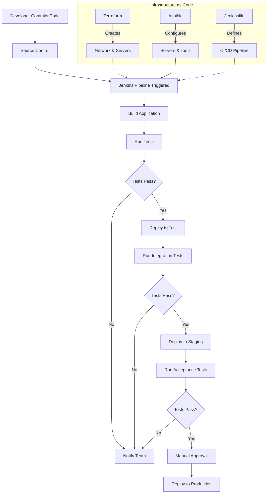

# CI/CD Infrastructure-as-Code

## Introduction

Infrastructure-as-Code (IaC) is a key practice in modern DevOps that allows you to manage and provision your CI/CD infrastructure through machine-readable definition files rather than physical hardware configuration or interactive configuration tools. When applied to CI/CD pipelines, IaC brings automation, consistency, and scalability to your development workflow.

In this guide, we'll explore how Infrastructure-as-Code can be used to build, manage, and scale your CI/CD systems, allowing you to treat your infrastructure with the same care and methodology as your application code.

## What is Infrastructure-as-Code?

Infrastructure-as-Code is the practice of managing infrastructure resources (servers, networks, storage, etc.) using code and automation rather than manual processes. In the context of CI/CD, it means defining your build servers, test environments, deployment targets, and pipeline configurations as code.

### Key Benefits

- **Consistency**: Every environment is built exactly the same way
- **Repeatability**: Infrastructure can be destroyed and recreated exactly as needed
- **Version Control**: Infrastructure configurations can be versioned alongside application code
- **Collaboration**: Teams can review and contribute to infrastructure changes using familiar development practices
- **Automation**: Reduces manual setup and configuration tasks
- **Documentation**: The code itself serves as documentation for how the infrastructure is configured

## Common IaC Tools for CI/CD

Several popular tools enable Infrastructure-as-Code for CI/CD environments:

### 1. Terraform

Terraform is an open-source IaC software tool that provides a consistent CLI workflow to manage hundreds of cloud services. It codifies APIs into declarative configuration files.

```hcl
# Example: Terraform configuration for a build server
resource "aws_instance" "build_server" {
  ami           = "ami-0c55b159cbfafe1f0"
  instance_type = "t2.medium"
  
  tags = {
    Name = "CI-Build-Server"
    Environment = "Production"
  }
  
  user_data = <<-EOF
              #!/bin/bash
              sudo apt-get update
              sudo apt-get install -y docker.io
              sudo systemctl start docker
              sudo systemctl enable docker
              EOF
}
```

### 2. Ansible

Ansible is an open-source software provisioning, configuration management, and application-deployment tool. It runs on many Unix-like systems and can configure both Unix-like systems as well as Microsoft Windows.

```yaml
# Example: Ansible playbook for configuring a Jenkins server
---
- name: Configure Jenkins CI server
  hosts: jenkins_server
  become: yes
  
  tasks:
    - name: Install Java
      apt:
        name: openjdk-11-jdk
        state: present
        
    - name: Add Jenkins repository key
      apt_key:
        url: https://pkg.jenkins.io/debian-stable/jenkins.io.key
        state: present
        
    - name: Add Jenkins repository
      apt_repository:
        repo: deb https://pkg.jenkins.io/debian-stable binary/
        state: present
        
    - name: Install Jenkins
      apt:
        name: jenkins
        state: present
        
    - name: Start Jenkins service
      service:
        name: jenkins
        state: started
        enabled: yes
```

### 3. Docker & Docker Compose

Docker and Docker Compose allow you to define container-based environments as code, perfect for creating consistent build and test environments.

```yaml
# Example: Docker Compose file for a CI environment
version: '3'
services:
  jenkins:
    image: jenkins/jenkins:lts
    ports:
      - "8080:8080"
    volumes:
      - jenkins_home:/var/jenkins_home
      
  sonarqube:
    image: sonarqube:latest
    ports:
      - "9000:9000"
    environment:
      - SONARQUBE_JDBC_URL=jdbc:postgresql://db:5432/sonar
      - SONARQUBE_JDBC_USERNAME=sonar
      - SONARQUBE_JDBC_PASSWORD=sonar
      
  db:
    image: postgres:12
    environment:
      - POSTGRES_USER=sonar
      - POSTGRES_PASSWORD=sonar
      - POSTGRES_DB=sonar
    volumes:
      - postgresql:/var/lib/postgresql
      - postgresql_data:/var/lib/postgresql/data
      
volumes:
  jenkins_home:
  postgresql:
  postgresql_data:
```

### 4. GitLab CI/CD Configuration

GitLab CI/CD configurations are defined in a `.gitlab-ci.yml` file, which is an example of Infrastructure-as-Code focused specifically on CI/CD pipelines.

```yaml
# Example: GitLab CI configuration
stages:
  - build
  - test
  - deploy

build_job:
  stage: build
  script:
    - echo "Building the application..."
    - npm install
    - npm run build
  artifacts:
    paths:
      - dist/

test_job:
  stage: test
  script:
    - echo "Running tests..."
    - npm run test

deploy_job:
  stage: deploy
  script:
    - echo "Deploying application..."
    - aws s3 sync dist/ s3://my-bucket/
  only:
    - main
```

## Building a CI/CD Infrastructure with IaC: A Practical Example

Let's walk through a practical example of setting up a complete CI/CD infrastructure using Infrastructure-as-Code. We'll create a system that includes:

1. A Jenkins server for orchestrating the CI/CD pipeline
2. A test environment
3. A staging environment
4. A production environment

### Step 1: Define Network Infrastructure

First, we'll define our network infrastructure using Terraform:

```hcl
# Create a VPC for our CI/CD infrastructure
resource "aws_vpc" "cicd_vpc" {
  cidr_block = "10.0.0.0/16"
  
  tags = {
    Name = "CICD-VPC"
  }
}

# Create subnets for different environments
resource "aws_subnet" "cicd_subnet" {
  vpc_id     = aws_vpc.cicd_vpc.id
  cidr_block = "10.0.1.0/24"
  
  tags = {
    Name = "CICD-Subnet"
  }
}

resource "aws_subnet" "test_subnet" {
  vpc_id     = aws_vpc.cicd_vpc.id
  cidr_block = "10.0.2.0/24"
  
  tags = {
    Name = "Test-Subnet"
  }
}

resource "aws_subnet" "staging_subnet" {
  vpc_id     = aws_vpc.cicd_vpc.id
  cidr_block = "10.0.3.0/24"
  
  tags = {
    Name = "Staging-Subnet"
  }
}

resource "aws_subnet" "production_subnet" {
  vpc_id     = aws_vpc.cicd_vpc.id
  cidr_block = "10.0.4.0/24"
  
  tags = {
    Name = "Production-Subnet"
  }
}
```

### Step 2: Create CI/CD Server Infrastructure

Next, we'll create our Jenkins server:

```hcl
resource "aws_instance" "jenkins_server" {
  ami           = "ami-0c55b159cbfafe1f0"
  instance_type = "t2.large"
  subnet_id     = aws_subnet.cicd_subnet.id
  
  tags = {
    Name = "Jenkins-Server"
  }
  
  # Install necessary software
  user_data = <<-EOF
              #!/bin/bash
              sudo apt-get update
              sudo apt-get install -y openjdk-11-jdk
              
              # Add Jenkins repository
              wget -q -O - https://pkg.jenkins.io/debian-stable/jenkins.io.key | sudo apt-key add -
              sudo sh -c 'echo deb https://pkg.jenkins.io/debian-stable binary/ > /etc/apt/sources.list.d/jenkins.list'
              
              # Install Jenkins
              sudo apt-get update
              sudo apt-get install -y jenkins
              sudo systemctl start jenkins
              sudo systemctl enable jenkins
              EOF
}
```

### Step 3: Create Environment Servers

Now we'll create servers for our different environments:

```hcl
resource "aws_instance" "test_server" {
  ami           = "ami-0c55b159cbfafe1f0"
  instance_type = "t2.medium"
  subnet_id     = aws_subnet.test_subnet.id
  
  tags = {
    Name = "Test-Environment"
  }
}

resource "aws_instance" "staging_server" {
  ami           = "ami-0c55b159cbfafe1f0"
  instance_type = "t2.medium"
  subnet_id     = aws_subnet.staging_subnet.id
  
  tags = {
    Name = "Staging-Environment"
  }
}

resource "aws_instance" "production_server" {
  ami           = "ami-0c55b159cbfafe1f0"
  instance_type = "t2.large"
  subnet_id     = aws_subnet.production_subnet.id
  
  tags = {
    Name = "Production-Environment"
  }
}
```

### Step 4: Configure CI/CD Tools with Ansible

After our infrastructure is created with Terraform, we can use Ansible to configure our servers:

```yaml
# playbook.yml - Configure all environments
---
- name: Configure Jenkins server
  hosts: jenkins_server
  become: yes
  tasks:
    - name: Install Jenkins plugins
      jenkins_plugin:
        name: "{{ item }}"
        with_dependencies: yes
      with_items:
        - git
        - pipeline
        - docker-workflow
        - ansible
        
    - name: Create Jenkins job
      jenkins_job:
        name: "example-pipeline"
        config: "{{ lookup('file', 'jenkins_job.xml') }}"

- name: Configure Test Environment
  hosts: test_server
  become: yes
  tasks:
    - name: Install Docker
      apt:
        name: docker.io
        state: present
        
    - name: Start Docker service
      service:
        name: docker
        state: started
        enabled: yes

# Similar configurations for staging and production...
```

### Step 5: Define CI/CD Pipeline as Code

Finally, we define our actual CI/CD pipeline as code using a Jenkinsfile:

```groovy
// Jenkinsfile
pipeline {
    agent any
    
    stages {
        stage('Build') {
            steps {
                echo 'Building the application...'
                sh 'npm install'
                sh 'npm run build'
            }
        }
        
        stage('Test') {
            steps {
                echo 'Running tests...'
                sh 'npm run test'
            }
        }
        
        stage('Deploy to Test') {
            steps {
                echo 'Deploying to test environment...'
                sh 'ansible-playbook -i inventory/test deploy.yml'
            }
        }
        
        stage('Deploy to Staging') {
            when {
                branch 'develop'
            }
            steps {
                echo 'Deploying to staging environment...'
                sh 'ansible-playbook -i inventory/staging deploy.yml'
            }
        }
        
        stage('Deploy to Production') {
            when {
                branch 'main'
            }
            steps {
                input message: 'Deploy to production?'
                echo 'Deploying to production environment...'
                sh 'ansible-playbook -i inventory/production deploy.yml'
            }
        }
    }
    
    post {
        success {
            echo 'Pipeline completed successfully!'
        }
        failure {
            echo 'Pipeline failed!'
        }
    }
}
```

## End-to-End CI/CD Infrastructure Flow

Here's a visual representation of how the entire Infrastructure-as-Code CI/CD system works together:



## Best Practices for CI/CD Infrastructure-as-Code

1. **Immutable Infrastructure**: Prefer replacing servers over modifying them
2. **Infrastructure Versioning**: Keep your infrastructure code in version control
3. **Environment Parity**: Keep all environments as similar as possible
4. **Automation**: Automate everything that can be automated
5. **Security**: Use secure storage for sensitive data (not in your IaC code)
6. **Modularity**: Create reusable modules for common infrastructure patterns
7. **Testing**: Test your infrastructure code just like application code
8. **Documentation**: Document your infrastructure alongside the code

## Implementing CI/CD for Infrastructure-as-Code

It's also a good practice to apply CI/CD principles to your infrastructure code itself:

```yaml
# Example GitLab CI pipeline for infrastructure code
stages:
  - validate
  - plan
  - apply
  
terraform:validate:
  stage: validate
  script:
    - terraform init
    - terraform validate
  
terraform:plan:
  stage: plan
  script:
    - terraform init
    - terraform plan -out=tfplan
  artifacts:
    paths:
      - tfplan
      
terraform:apply:
  stage: apply
  script:
    - terraform init
    - terraform apply -auto-approve tfplan
  dependencies:
    - terraform:plan
  when: manual
  only:
    - main
```

## Summary

Infrastructure-as-Code is a powerful approach to managing CI/CD systems that brings the benefits of software development practices to infrastructure management. By treating your infrastructure as code, you can achieve greater consistency, automation, and scalability for your development workflows.

The key takeaways from this guide are:

1. IaC allows you to define, provision, and manage CI/CD infrastructure using code
2. Popular tools include Terraform, Ansible, Docker, and native CI/CD configurations
3. IaC brings consistency, version control, and automation to your CI/CD infrastructure
4. An end-to-end IaC approach includes defining servers, networks, configurations, and pipelines
5. Best practices include immutability, versioning, and applying CI/CD to infrastructure code itself

## Additional Resources and Exercises

### Resources
- [Terraform Documentation](https://www.terraform.io/docs/index.html)
- [Ansible Documentation](https://docs.ansible.com/)
- [Jenkins Pipeline Documentation](https://www.jenkins.io/doc/book/pipeline/)
- [GitLab CI/CD Documentation](https://docs.gitlab.com/ee/ci/)

### Exercises

1. **Basic Setup**: Create a simple Terraform configuration to provision a single Jenkins server on AWS, Azure, or GCP.

2. **Multi-environment**: Extend your Terraform configuration to create separate test, staging, and production environments.

3. **Configuration**: Write an Ansible playbook to configure Jenkins with necessary plugins and a sample job.

4. **Pipeline**: Create a Jenkinsfile that defines a basic CI/CD pipeline with build, test, and deploy stages.

5. **Advanced**: Implement a complete CI/CD infrastructure with infrastructure validation, secrets management, and self-healing capabilities.

6. **Challenge**: Create a CI/CD pipeline that tests and deploys changes to your infrastructure code itself.