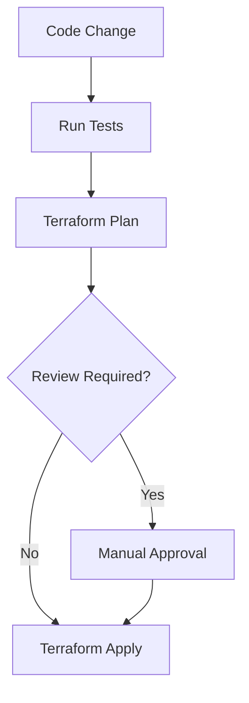
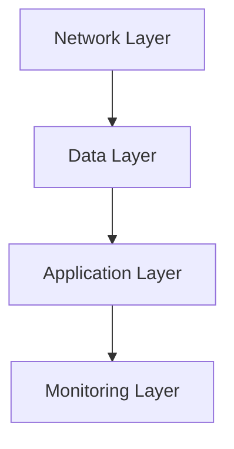

# CI/CD with Terraform

## Introduction

Continuous Integration and Continuous Deployment (CI/CD) has revolutionized how we deliver software. Similarly, Infrastructure as Code (IaC) has transformed how we manage infrastructure. When these two powerful approaches are combined, we can automate both application and infrastructure deployments in a consistent, repeatable way.

In this guide, we'll explore how Terraform, a popular IaC tool, can be integrated into CI/CD pipelines to automate infrastructure provisioning and management. By the end, you'll understand how to set up a pipeline that automatically plans, applies, and tests infrastructure changes whenever your code is updated.

## What is Terraform?

Terraform is an open-source IaC tool created by HashiCorp that allows you to define and provision infrastructure using a declarative configuration language called HashiCorp Configuration Language (HCL). With Terraform, you can:

- Define infrastructure as code in configuration files
- Version control your infrastructure
- Create reusable infrastructure modules
- Manage infrastructure across multiple cloud providers

## Why Use Terraform in CI/CD?

Integrating Terraform into your CI/CD pipeline offers several benefits:

1. **Consistency**: Infrastructure is deployed the same way every time
2. **Automation**: Reduces manual steps in infrastructure deployment
3. **Version Control**: Infrastructure changes are tracked alongside application code
4. **Testing**: Infrastructure can be tested before deployment to production
5. **Visibility**: Changes to infrastructure are visible to the entire team

## Basic Terraform Concepts

Before diving into CI/CD integration, let's review some key Terraform concepts:

### Terraform Files

A basic Terraform project typically consists of these files:

- `main.tf` - Contains the main set of configuration for your project
- `variables.tf` - Contains variable declarations
- `outputs.tf` - Contains outputs from resources
- `terraform.tfvars` - Contains variable definitions (values)
- `.terraform.lock.hcl` - Lock file for provider versions
- `backend.tf` - Configures where Terraform state is stored

### Terraform Workflow

The standard Terraform workflow includes these commands:

1. `terraform init` - Initialize a working directory
2. `terraform plan` - Preview changes before applying
3. `terraform apply` - Apply the changes
4. `terraform destroy` - Destroy provisioned infrastructure

## Setting Up Terraform for CI/CD

### Step 1: Store Terraform State Remotely

For CI/CD, Terraform state should be stored remotely so it's accessible to the pipeline:

```hcl
# backend.tf
terraform {
  backend "s3" {
    bucket         = "my-terraform-state"
    key            = "terraform.tfstate"
    region         = "us-west-2"
    encrypt        = true
    dynamodb_table = "terraform-locks"
  }
}
```

### Step 2: Structure Your Project

Organize your Terraform code into modules for reusability:

```
project/
├── environments/
│   ├── dev/
│   │   ├── main.tf
│   │   └── terraform.tfvars
│   └── prod/
│       ├── main.tf
│       └── terraform.tfvars
└── modules/
    ├── networking/
    │   ├── main.tf
    │   ├── variables.tf
    │   └── outputs.tf
    └── compute/
        ├── main.tf
        ├── variables.tf
        └── outputs.tf
```

### Step 3: Implement a Sample Infrastructure

Here's a simple example of a Terraform configuration for AWS:

```hcl
# main.tf
provider "aws" {
  region = var.region
}

module "vpc" {
  source = "../modules/networking"
  
  vpc_cidr        = var.vpc_cidr
  environment     = var.environment
}

module "ec2_instance" {
  source = "../modules/compute"
  
  subnet_id       = module.vpc.subnet_id
  instance_type   = var.instance_type
  environment     = var.environment
}
```

```hcl
# variables.tf
variable "region" {
  description = "AWS region to deploy resources"
  type        = string
  default     = "us-west-2"
}

variable "vpc_cidr" {
  description = "CIDR block for the VPC"
  type        = string
  default     = "10.0.0.0/16"
}

variable "environment" {
  description = "Deployment environment"
  type        = string
}

variable "instance_type" {
  description = "EC2 instance type"
  type        = string
  default     = "t2.micro"
}
```

## Integrating Terraform with CI/CD Pipelines

Now, let's explore how to integrate Terraform into various CI/CD platforms:

### GitHub Actions

Here's a simple GitHub Actions workflow for Terraform:

```yaml
# .github/workflows/terraform.yml
name: "Terraform CI/CD"

on:
  push:
    branches: [ main ]
  pull_request:
    branches: [ main ]

jobs:
  terraform:
    name: "Terraform"
    runs-on: ubuntu-latest
    
    steps:
      - name: Checkout
        uses: actions/checkout@v3
      
      - name: Setup Terraform
        uses: hashicorp/setup-terraform@v2
        
      - name: Terraform Init
        run: terraform init
        
      - name: Terraform Format
        run: terraform fmt -check
        
      - name: Terraform Validate
        run: terraform validate
        
      - name: Terraform Plan
        run: terraform plan
        
      - name: Terraform Apply
        if: github.ref == 'refs/heads/main' && github.event_name == 'push'
        run: terraform apply -auto-approve
```

### GitLab CI/CD

For GitLab, you can use the following configuration:

```yaml
# .gitlab-ci.yml
stages:
  - validate
  - plan
  - apply

image:
  name: hashicorp/terraform:latest
  entrypoint:
    - '/usr/bin/env'
    - 'PATH=/usr/local/sbin:/usr/local/bin:/usr/sbin:/usr/bin:/sbin:/bin'

before_script:
  - terraform init

validate:
  stage: validate
  script:
    - terraform validate
    - terraform fmt -check

plan:
  stage: plan
  script:
    - terraform plan -out=tfplan
  artifacts:
    paths:
      - tfplan

apply:
  stage: apply
  script:
    - terraform apply -auto-approve tfplan
  dependencies:
    - plan
  only:
    - main
```

### Jenkins Pipeline

For Jenkins, create a Jenkinsfile:

```groovy
pipeline {
    agent {
        docker {
            image 'hashicorp/terraform:latest'
        }
    }
    
    stages {
        stage('Init') {
            steps {
                sh 'terraform init'
            }
        }
        
        stage('Validate') {
            steps {
                sh 'terraform validate'
                sh 'terraform fmt -check'
            }
        }
        
        stage('Plan') {
            steps {
                sh 'terraform plan -out=tfplan'
            }
        }
        
        stage('Apply') {
            when {
                branch 'main'
            }
            steps {
                sh 'terraform apply -auto-approve tfplan'
            }
        }
    }
}
```

## Handling Terraform Workflow in CI/CD

### Terraform Plan Stage

The `terraform plan` command generates an execution plan showing what actions Terraform will take to change your infrastructure to match your configuration. In a CI/CD context:

1. Run on every pull request
2. Save the plan output as an artifact
3. Post the plan as a comment on the PR for review

Here's how the output might look:

```
Terraform will perform the following actions:

  # aws_instance.example will be created
  + resource "aws_instance" "example" {
      + ami                          = "ami-0c55b159cbfafe1f0"
      + instance_type                = "t2.micro"
      + vpc_security_group_ids       = (known after apply)
      # ... more attributes
    }

Plan: 1 to add, 0 to change, 0 to destroy.
```

### Terraform Apply Stage

The `terraform apply` command executes the actions proposed in a Terraform plan. In CI/CD:

1. Only run on merges to the main branch
2. Use the saved plan from the plan stage
3. Run with `-auto-approve` to avoid manual intervention

## Best Practices for Terraform in CI/CD

### 1. Use Workspaces for Environments

Terraform workspaces help manage multiple environments:

```bash
# Create workspaces for different environments
terraform workspace new dev
terraform workspace new staging
terraform workspace new prod

# Select a workspace
terraform workspace select dev
```

In your configuration, use the workspace name:

```hcl
locals {
  environment = terraform.workspace
}

resource "aws_instance" "example" {
  # ...
  tags = {
    Environment = local.environment
  }
}
```

### 2. Implement Drift Detection

Regularly run `terraform plan` to detect manual changes:

```yaml
# In GitHub Actions
name: "Detect Infrastructure Drift"

on:
  schedule:
    - cron: '0 8 * * *'  # Run daily at 8 AM

jobs:
  drift:
    name: "Detect Drift"
    runs-on: ubuntu-latest
    
    steps:
      - name: Checkout
        uses: actions/checkout@v3
      
      - name: Setup Terraform
        uses: hashicorp/setup-terraform@v2
        
      - name: Terraform Init
        run: terraform init
        
      - name: Detect Drift
        run: |
          terraform plan -detailed-exitcode
          if [ $? -eq 2 ]; then
            echo "Infrastructure drift detected!"
            exit 1
          fi
```

### 3. Secure Sensitive Variables

Never store secrets in your Terraform code. Instead, use environment variables or a secret manager:

```yaml
# In GitHub Actions
jobs:
  terraform:
    # ...
    env:
      AWS_ACCESS_KEY_ID: ${{ secrets.AWS_ACCESS_KEY_ID }}
      AWS_SECRET_ACCESS_KEY: ${{ secrets.AWS_SECRET_ACCESS_KEY }}
```

### 4. Implement Automated Testing

Use tools like Terratest or Kitchen-Terraform to test your infrastructure:

```go
// test/vpc_test.go
package test

import (
  "testing"
  "github.com/gruntwork-io/terratest/modules/terraform"
  "github.com/stretchr/testify/assert"
)

func TestVPC(t *testing.T) {
  terraformOptions := &terraform.Options{
    TerraformDir: "../modules/networking",
  }
  
  defer terraform.Destroy(t, terraformOptions)
  terraform.InitAndApply(t, terraformOptions)
  
  vpcID := terraform.Output(t, terraformOptions, "vpc_id")
  assert.NotEmpty(t, vpcID, "VPC ID should not be empty")
}
```

## Advanced Terraform CI/CD Workflows

Let's explore some advanced CI/CD techniques with Terraform:

### Approval Workflow for Production Changes

Use a manual approval process for production changes:



### Blue-Green Deployments with Terraform

Implement blue-green deployments for zero-downtime updates:

```hcl
resource "aws_lb_target_group" "blue" {
  name = "blue-target-group"
  # ...
}

resource "aws_lb_target_group" "green" {
  name = "green-target-group"
  # ...
}

resource "aws_lb_listener_rule" "traffic_distribution" {
  listener_arn = aws_lb_listener.front_end.arn
  
  action {
    type             = "forward"
    target_group_arn = var.enable_green ? aws_lb_target_group.green.arn : aws_lb_target_group.blue.arn
  }
}
```

## Real-World Example: Complete CI/CD Pipeline for AWS Infrastructure

Let's walk through a complete example of a CI/CD pipeline that deploys a simple web application infrastructure to AWS:

### Project Structure

```
project/
├── .github/
│   └── workflows/
│       └── terraform.yml
├── environments/
│   ├── dev/
│   │   ├── main.tf
│   │   └── terraform.tfvars
│   └── prod/
│       ├── main.tf
│       └── terraform.tfvars
├── modules/
│   ├── networking/
│   │   ├── main.tf
│   │   ├── variables.tf
│   │   └── outputs.tf
│   ├── database/
│   │   ├── main.tf
│   │   ├── variables.tf
│   │   └── outputs.tf
│   └── web_app/
│       ├── main.tf
│       ├── variables.tf
│       └── outputs.tf
└── README.md
```

### Module Example: Web App

```hcl
# modules/web_app/main.tf
resource "aws_launch_configuration" "web_app" {
  name_prefix   = "${var.app_name}-"
  image_id      = var.ami_id
  instance_type = var.instance_type
  
  user_data = <<-EOF
    #!/bin/bash
    echo "Hello from ${var.environment}" > index.html
    nohup python -m SimpleHTTPServer 80 &
    EOF
  
  lifecycle {
    create_before_destroy = true
  }
}

resource "aws_autoscaling_group" "web_app" {
  launch_configuration = aws_launch_configuration.web_app.id
  min_size             = var.min_size
  max_size             = var.max_size
  vpc_zone_identifier  = var.subnet_ids
  
  tag {
    key                 = "Name"
    value               = "${var.app_name}-${var.environment}"
    propagate_at_launch = true
  }
}

resource "aws_lb" "web_app" {
  name               = "${var.app_name}-lb"
  internal           = false
  load_balancer_type = "application"
  subnets            = var.subnet_ids
}

resource "aws_lb_target_group" "web_app" {
  name     = "${var.app_name}-target-group"
  port     = 80
  protocol = "HTTP"
  vpc_id   = var.vpc_id
  
  health_check {
    path                = "/"
    healthy_threshold   = 2
    unhealthy_threshold = 2
    timeout             = 3
    interval            = 30
  }
}

resource "aws_lb_listener" "web_app" {
  load_balancer_arn = aws_lb.web_app.arn
  port              = 80
  protocol          = "HTTP"
  
  default_action {
    type             = "forward"
    target_group_arn = aws_lb_target_group.web_app.arn
  }
}
```

### Environment Configuration

```hcl
# environments/dev/main.tf
provider "aws" {
  region = var.region
}

module "networking" {
  source = "../../modules/networking"
  
  vpc_cidr         = var.vpc_cidr
  environment      = "dev"
  public_subnets   = var.public_subnets
}

module "database" {
  source = "../../modules/database"
  
  db_name          = var.db_name
  engine           = "mysql"
  instance_class   = "db.t3.small"
  subnet_ids       = module.networking.private_subnet_ids
  environment      = "dev"
}

module "web_app" {
  source = "../../modules/web_app"
  
  app_name         = var.app_name
  environment      = "dev"
  vpc_id           = module.networking.vpc_id
  subnet_ids       = module.networking.public_subnet_ids
  instance_type    = "t3.small"
  min_size         = 2
  max_size         = 4
  ami_id           = var.ami_id
}

output "web_app_url" {
  value = module.web_app.lb_dns_name
}
```

### CI/CD Pipeline Configuration

```yaml
# .github/workflows/terraform.yml
name: "Terraform CI/CD"

on:
  push:
    branches: [ main ]
  pull_request:
    branches: [ main ]

jobs:
  terraform:
    name: "Terraform"
    runs-on: ubuntu-latest
    
    steps:
      - name: Checkout
        uses: actions/checkout@v3
      
      - name: Setup Terraform
        uses: hashicorp/setup-terraform@v2
        
      - name: Configure AWS Credentials
        uses: aws-actions/configure-aws-credentials@v1
        with:
          aws-access-key-id: ${{ secrets.AWS_ACCESS_KEY_ID }}
          aws-secret-access-key: ${{ secrets.AWS_SECRET_ACCESS_KEY }}
          aws-region: us-west-2
      
      - name: Terraform Init
        run: |
          cd environments/dev
          terraform init
        
      - name: Terraform Format
        run: terraform fmt -check -recursive
        
      - name: Terraform Validate
        run: |
          cd environments/dev
          terraform validate
        
      - name: Terraform Plan
        id: plan
        run: |
          cd environments/dev
          terraform plan -out=tfplan
        continue-on-error: true
        
      - name: Terraform Plan Status
        if: steps.plan.outcome == 'failure'
        run: exit 1
        
      - name: Terraform Apply
        if: github.ref == 'refs/heads/main' && github.event_name == 'push'
        run: |
          cd environments/dev
          terraform apply -auto-approve tfplan
        
      - name: Output Web App URL
        if: github.ref == 'refs/heads/main' && github.event_name == 'push'
        run: |
          cd environments/dev
          echo "Web App URL: $(terraform output web_app_url)"
```

## Common Challenges and Solutions

### Challenge 1: State Locking in CI/CD

**Problem**: Multiple pipeline runs can conflict when accessing state.

**Solution**: Use a backend that supports state locking, like S3 with DynamoDB:

```hcl
terraform {
  backend "s3" {
    bucket         = "terraform-state-bucket"
    key            = "path/to/state"
    region         = "us-east-1"
    dynamodb_table = "terraform-locks"
  }
}
```

### Challenge 2: Long-Running Operations

**Problem**: Some resources take a long time to create, causing pipeline timeouts.

**Solution**: Split your infrastructure into layers with dependencies:



### Challenge 3: Managing Multiple Environments

**Problem**: Duplicating code for different environments leads to maintenance issues.

**Solution**: Use a combination of modules, workspaces, and variable files:

```
environments/
├── global.tfvars
├── dev.tfvars
├── staging.tfvars
└── prod.tfvars
```

Then in your pipeline:

```bash
terraform apply -var-file=environments/global.tfvars -var-file=environments/dev.tfvars
```

## Summary

In this guide, we've explored how to integrate Terraform with CI/CD pipelines to automate infrastructure deployments. We've covered:

- Basic Terraform concepts and workflow
- Setting up Terraform for CI/CD
- Integrating Terraform with popular CI/CD platforms
- Best practices for Terraform in CI/CD
- Advanced Terraform CI/CD workflows
- A real-world example of a complete CI/CD pipeline

By combining the power of Infrastructure as Code with CI/CD automation, you can achieve:

- Faster, more reliable infrastructure deployments
- Consistency across environments
- Better collaboration between development and operations teams
- Increased confidence in infrastructure changes

## Additional Resources

Here are some resources to further your learning:

- [Terraform Documentation](https://www.terraform.io/docs)
- [HashiCorp Learn: Terraform](https://learn.hashicorp.com/terraform)
- [Terraform Best Practices](https://www.terraform-best-practices.com/)

## Exercises

1. Set up a basic Terraform project with remote state storage
2. Create a GitHub Actions workflow to apply Terraform changes
3. Implement a multi-environment setup using Terraform workspaces
4. Add automated testing to your Terraform modules
5. Create a blue-green deployment pipeline for a web application