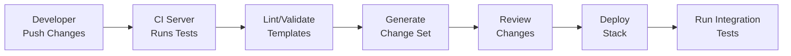

# CICD CloudFormation

## Introduction

CloudFormation is AWS's Infrastructure as Code (IaC) service that allows you to define your cloud infrastructure resources using templates. When integrated into a Continuous Integration and Continuous Deployment (CI/CD) pipeline, CloudFormation enables automated, consistent, and version-controlled infrastructure deployments.

In this tutorial, we'll explore how to incorporate CloudFormation into your CI/CD workflow, allowing you to treat infrastructure changes with the same rigor as application code changes.

## What is CloudFormation?

AWS CloudFormation is a service that helps you model and set up your AWS resources. You create a template that describes all the AWS resources you want (like EC2 instances or RDS DB instances), and CloudFormation takes care of provisioning and configuring those resources for you.

Key benefits include:

- **Infrastructure as Code**: Define your infrastructure in template files that can be versioned
- **Automation**: Reduce manual processes and human error
- **Dependency Management**: CloudFormation handles resource dependencies automatically
- **Change Tracking**: Track infrastructure changes through template version control

## CloudFormation Basics

### Template Structure

CloudFormation templates are written in either JSON or YAML format. Here's a basic structure:

```yaml
AWSTemplateFormatVersion: '2010-09-09'
Description: 'A sample template'

Parameters:
  # Input parameters that customize your template

Resources:
  # The AWS resources to create

Outputs:
  # Values that are returned after stack creation
```

### Key Concepts

- **Stack**: A collection of AWS resources that are created, updated, or deleted as a single unit
- **StackSet**: Enables you to create stacks across multiple accounts and regions with a single operation
- **Change Set**: A preview of changes to be applied to a stack
- **Drift Detection**: Identifies differences between the expected and actual configuration of resources

## Integrating CloudFormation with CI/CD

### CI/CD Pipeline Overview

A typical CI/CD pipeline for CloudFormation looks like this:



### Setting Up AWS Authentication

Before running CloudFormation in your CI/CD pipeline, you need to set up authentication:

```yaml
# Example AWS credentials setup in a GitHub Actions workflow
jobs:
  deploy:
    runs-on: ubuntu-latest
    steps:
      - uses: actions/checkout@v3
      
      - name: Configure AWS credentials
        uses: aws-actions/configure-aws-credentials@v1
        with:
          aws-access-key-id: ${{ secrets.AWS_ACCESS_KEY_ID }}
          aws-secret-access-key: ${{ secrets.AWS_SECRET_ACCESS_KEY }}
          aws-region: us-east-1
```

### Validating Templates

Always validate your templates before deployment:

```bash
# Validate a CloudFormation template
aws cloudformation validate-template --template-body file://template.yaml
```

In your CI/CD pipeline:

```yaml
# Example validation step in a Jenkins pipeline
stage('Validate Template') {
  steps {
    sh 'aws cloudformation validate-template --template-body file://infrastructure/template.yaml'
  }
}
```

### Creating and Updating Stacks

Deploy your infrastructure using the AWS CLI:

```bash
# Create a new stack
aws cloudformation create-stack \
  --stack-name my-network-stack \
  --template-body file://network.yaml \
  --parameters ParameterKey=VPCCidr,ParameterValue=10.0.0.0/16

# Update an existing stack
aws cloudformation update-stack \
  --stack-name my-network-stack \
  --template-body file://network.yaml \
  --parameters ParameterKey=VPCCidr,ParameterValue=10.0.0.0/16
```

### Using Change Sets

For safer deployments, use change sets to preview changes:

```bash
# Create a change set
aws cloudformation create-change-set \
  --stack-name my-network-stack \
  --template-body file://network.yaml \
  --change-set-name network-changes \
  --parameters ParameterKey=VPCCidr,ParameterValue=10.0.0.0/16

# Execute the change set after review
aws cloudformation execute-change-set \
  --stack-name my-network-stack \
  --change-set-name network-changes
```

## Practical Example: A Web Application Infrastructure

Let's create a CI/CD pipeline that deploys a web application infrastructure using CloudFormation.

### The Infrastructure Template

```yaml
AWSTemplateFormatVersion: '2010-09-09'
Description: 'Web Application Infrastructure'

Parameters:
  EnvironmentName:
    Description: Environment name (dev, staging, prod)
    Type: String
    Default: dev
  
  VpcCIDR:
    Description: CIDR block for the VPC
    Type: String
    Default: 10.0.0.0/16

Resources:
  # VPC Definition
  VPC:
    Type: AWS::EC2::VPC
    Properties:
      CidrBlock: !Ref VpcCIDR
      EnableDnsSupport: true
      EnableDnsHostnames: true
      Tags:
        - Key: Name
          Value: !Sub ${EnvironmentName}-vpc

  # Internet Gateway
  InternetGateway:
    Type: AWS::EC2::InternetGateway
    Properties:
      Tags:
        - Key: Name
          Value: !Sub ${EnvironmentName}-igw

  # Attach Internet Gateway to VPC
  InternetGatewayAttachment:
    Type: AWS::EC2::VPCGatewayAttachment
    Properties:
      InternetGatewayId: !Ref InternetGateway
      VpcId: !Ref VPC

  # Public Subnet
  PublicSubnet:
    Type: AWS::EC2::Subnet
    Properties:
      VpcId: !Ref VPC
      AvailabilityZone: !Select [0, !GetAZs '']
      CidrBlock: !Select [0, !Cidr [!Ref VpcCIDR, 4, 8]]
      MapPublicIpOnLaunch: true
      Tags:
        - Key: Name
          Value: !Sub ${EnvironmentName}-public-subnet

  # Web Server Security Group
  WebServerSG:
    Type: AWS::EC2::SecurityGroup
    Properties:
      GroupDescription: Allow HTTP and SSH access
      VpcId: !Ref VPC
      SecurityGroupIngress:
        - IpProtocol: tcp
          FromPort: 80
          ToPort: 80
          CidrIp: 0.0.0.0/0
        - IpProtocol: tcp
          FromPort: 22
          ToPort: 22
          CidrIp: 0.0.0.0/0

  # Web Server Instance
  WebServerInstance:
    Type: AWS::EC2::Instance
    Properties:
      InstanceType: t2.micro
      SecurityGroupIds:
        - !Ref WebServerSG
      SubnetId: !Ref PublicSubnet
      ImageId: ami-0c55b159cbfafe1f0  # Amazon Linux 2 (update as needed)
      UserData:
        Fn::Base64: !Sub |
          #!/bin/bash
          yum update -y
          yum install -y httpd
          systemctl start httpd
          systemctl enable httpd
          echo "<h1>Hello from ${EnvironmentName} environment!</h1>" > /var/www/html/index.html
      Tags:
        - Key: Name
          Value: !Sub ${EnvironmentName}-web-server

Outputs:
  WebServerPublicIP:
    Description: Public IP address of the web server
    Value: !GetAtt WebServerInstance.PublicIp
  WebsiteURL:
    Description: URL of the website
    Value: !Sub http://${WebServerInstance.PublicDnsName}
```

### The CI/CD Pipeline

Here's an example GitHub Actions workflow that deploys this infrastructure:

```yaml
name: Deploy Infrastructure

on:
  push:
    branches: [ main ]
    paths:
      - 'infrastructure/**'

jobs:
  deploy:
    runs-on: ubuntu-latest
    steps:
      - name: Checkout code
        uses: actions/checkout@v3

      - name: Configure AWS credentials
        uses: aws-actions/configure-aws-credentials@v1
        with:
          aws-access-key-id: ${{ secrets.AWS_ACCESS_KEY_ID }}
          aws-secret-access-key: ${{ secrets.AWS_SECRET_ACCESS_KEY }}
          aws-region: us-east-1

      - name: Validate CloudFormation template
        run: |
          aws cloudformation validate-template \
            --template-body file://infrastructure/webserver.yaml

      - name: Create Change Set
        id: change-set
        run: |
          CHANGE_SET_ID=$(aws cloudformation create-change-set \
            --stack-name web-app-${GITHUB_REF##*/} \
            --template-body file://infrastructure/webserver.yaml \
            --change-set-name web-app-changes-${GITHUB_SHA::7} \
            --parameters ParameterKey=EnvironmentName,ParameterValue=${GITHUB_REF##*/} \
            --capabilities CAPABILITY_IAM \
            --query 'Id' --output text || echo "")
          
          echo "::set-output name=change-set-id::${CHANGE_SET_ID}"

      - name: Wait for change set creation
        if: steps.change-set.outputs.change-set-id != ''
        run: |
          aws cloudformation wait change-set-create-complete \
            --stack-name web-app-${GITHUB_REF##*/} \
            --change-set-name web-app-changes-${GITHUB_SHA::7}

      - name: Execute Change Set
        if: steps.change-set.outputs.change-set-id != ''
        run: |
          aws cloudformation execute-change-set \
            --stack-name web-app-${GITHUB_REF##*/} \
            --change-set-name web-app-changes-${GITHUB_SHA::7}

      - name: Wait for stack update/creation
        if: steps.change-set.outputs.change-set-id != ''
        run: |
          aws cloudformation wait stack-update-complete \
            --stack-name web-app-${GITHUB_REF##*/} || \
          aws cloudformation wait stack-create-complete \
            --stack-name web-app-${GITHUB_REF##*/}

      - name: Get stack outputs
        run: |
          aws cloudformation describe-stacks \
            --stack-name web-app-${GITHUB_REF##*/} \
            --query 'Stacks[0].Outputs' --output table
```

## Best Practices for CloudFormation in CI/CD

### Template Organization

1. **Break down complex templates**: Use nested stacks for reusable components
2. **Use descriptive naming**: Make resource names clear and consistent
3. **Organize by lifecycle**: Group resources that change at similar rates

### Parameter Management

Store environment-specific parameters in parameter stores:

```yaml
# Example using AWS Systems Manager Parameter Store
Parameters:
  DatabasePassword:
    Type: AWS::SSM::Parameter::Value<String>
    Default: /myapp/database/password
    NoEcho: true
```

### Cross-Stack References

Use exports and imports for cross-stack references:

```yaml
# Stack A exports a value
Outputs:
  VPCId:
    Description: The ID of the VPC
    Value: !Ref VPC
    Export:
      Name: !Sub "${AWS::StackName}-VPCID"

# Stack B imports the value
Resources:
  Subnet:
    Type: AWS::EC2::Subnet
    Properties:
      VpcId: !ImportValue MyNetworkStack-VPCID
      # Other properties...
```

### Environment Strategy

Use different stacks or parameters for different environments:

```bash
# Deploy to development
aws cloudformation create-stack \
  --stack-name webapp-dev \
  --template-body file://webapp.yaml \
  --parameters ParameterKey=EnvironmentName,ParameterValue=dev

# Deploy to production
aws cloudformation create-stack \
  --stack-name webapp-prod \
  --template-body file://webapp.yaml \
  --parameters ParameterKey=EnvironmentName,ParameterValue=prod
```

### Security Considerations

1. **Least privilege**: Use IAM roles with minimal permissions
2. **Secure parameters**: Use NoEcho and AWS Systems Manager for sensitive data
3. **Enable stack policy**: Prevent unintended updates to critical resources

## Advanced CloudFormation Techniques

### Custom Resources

Extend CloudFormation with custom resources:

```yaml
Resources:
  MyCustomResource:
    Type: Custom::ResourceType
    Properties:
      ServiceToken: !GetAtt MyLambdaFunction.Arn
      # Custom properties...
```

### Dynamic References

Use dynamic references to securely reference secrets:

```yaml
Resources:
  MyDatabase:
    Type: AWS::RDS::DBInstance
    Properties:
      # Other properties...
      MasterUserPassword: '{{resolve:secretsmanager:MyRDSSecret:SecretString:password}}'
```

### Macro Transformations

Use macros to transform templates:

```yaml
Transform: 'MyMacro'

Resources:
  # Resources to be transformed
```

## Testing CloudFormation Templates

### Unit Testing with cfn-lint

```bash
# Install cfn-lint
pip install cfn-lint

# Lint your templates
cfn-lint templates/*.yaml
```

### Integration Testing with TaskCat

```bash
# Install TaskCat
pip install taskcat

# Configure project and run tests
taskcat test run
```

## Rollback and Recovery Strategies

### Automatic Rollbacks

CloudFormation performs automatic rollbacks on failed deployments:

```bash
aws cloudformation create-stack \
  --stack-name my-stack \
  --template-body file://template.yaml \
  --on-failure ROLLBACK
```

### Manual Rollbacks

To manually rollback to a previous version:

```bash
# Get the previous template
aws cloudformation get-template \
  --stack-name my-stack \
  --template-stage Original \
  --output text > original-template.json

# Update the stack with the previous template
aws cloudformation update-stack \
  --stack-name my-stack \
  --template-body file://original-template.json
```

## Drift Detection and Resolution

Detect and resolve infrastructure drift:

```bash
# Detect drift on the entire stack
aws cloudformation detect-stack-drift \
  --stack-name my-stack

# Get the drift detection results
aws cloudformation describe-stack-resource-drifts \
  --stack-name my-stack
```

## Summary

In this tutorial, we've explored how to integrate AWS CloudFormation with CI/CD pipelines to automate infrastructure deployment. Key takeaways include:

- CloudFormation enables Infrastructure as Code for AWS resources
- CI/CD pipelines can automate the validation and deployment of CloudFormation templates
- Best practices include template organization, parameter management, and testing
- Advanced techniques like custom resources and macros extend CloudFormation's capabilities

By incorporating CloudFormation into your CI/CD workflow, you can achieve more reliable, consistent, and version-controlled infrastructure deployments.

## Additional Resources

Here are some exercises to reinforce your learning:

1. Create a CloudFormation template for a simple three-tier web application
2. Set up a CI/CD pipeline to deploy the template to dev, staging, and production environments
3. Implement drift detection and auto-remediation in your pipeline
4. Create a custom resource that extends CloudFormation's capabilities

For further reading, check out:
- AWS CloudFormation documentation
- Infrastructure as Code by Kief Morris
- The DevOps Handbook by Gene Kim et al.