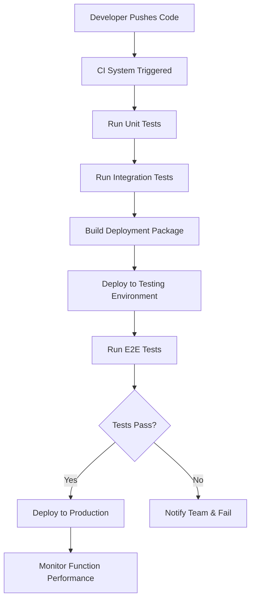

# CI/CD for Serverless Applications

## Introduction

Serverless computing has revolutionized how we build and deploy applications by allowing developers to focus on writing code without worrying about the underlying infrastructure. However, to fully leverage the benefits of serverless architecture, we need efficient ways to test, build, and deploy our functions. This is where Continuous Integration and Continuous Deployment (CI/CD) for serverless applications comes in.

In this guide, we'll explore how to implement CI/CD pipelines specifically tailored for serverless applications. We'll look at the unique challenges of serverless deployments, tools that can help, and practical examples to get you started.

## What is Serverless CI/CD?

Serverless CI/CD is the application of continuous integration and continuous deployment practices to serverless functions and applications. Unlike traditional applications where you might deploy entire servers or containers, serverless CI/CD focuses on:

1. **Function-level deployments**: Deploying individual functions or groups of functions
2. **Infrastructure as Code**: Managing cloud resources alongside your application code
3. **Event-driven testing**: Testing functions against the events that will trigger them
4. **Cold start optimization**: Managing deployment packages to minimize cold start times

## Key Components of Serverless CI/CD

### 1. Version Control

Just like any CI/CD pipeline, everything starts with version control:

```bash
# Initialize a new git repository for your serverless project
git init
git add .
git commit -m "Initial serverless project"
git push origin main
```

### 2. Infrastructure as Code (IaC)

Serverless applications require cloud resources (like API Gateways, databases, etc.) that should be defined as code:

```yaml
# Example serverless.yml file for AWS Lambda using the Serverless Framework
service: my-first-serverless-app

provider:
  name: aws
  runtime: nodejs18.x
  region: us-east-1

functions:
  hello:
    handler: handler.hello
    events:
      - http:
          path: hello
          method: get
```

### 3. Testing Framework

Testing serverless functions requires simulating the cloud environment:

```javascript
// Example test for AWS Lambda function using Jest
const { hello } = require('./handler');

test('hello function returns greeting', async () => {
  // Mock event that would come from API Gateway
  const event = {
    pathParameters: {
      name: 'World'
    }
  };
  
  const response = await hello(event);
  
  expect(response.statusCode).toBe(200);
  expect(JSON.parse(response.body).message).toBe('Hello, World!');
});
```

### 4. CI/CD Pipeline Configuration

Let's look at a practical example using GitHub Actions for a serverless application:

```yaml
# .github/workflows/deploy.yml
name: Deploy Serverless Application

on:
  push:
    branches:
      - main

jobs:
  deploy:
    name: deploy
    runs-on: ubuntu-latest
    steps:
      - uses: actions/checkout@v3
      
      - name: Setup Node.js
        uses: actions/setup-node@v3
        with:
          node-version: '18'
      
      - name: Install dependencies
        run: npm ci
      
      - name: Run tests
        run: npm test
      
      - name: Install Serverless Framework
        run: npm install -g serverless
      
      - name: Deploy
        run: serverless deploy
        env:
          AWS_ACCESS_KEY_ID: ${{ secrets.AWS_ACCESS_KEY_ID }}
          AWS_SECRET_ACCESS_KEY: ${{ secrets.AWS_SECRET_ACCESS_KEY }}
```

## Serverless CI/CD Workflow

Let's visualize the end-to-end workflow of a serverless CI/CD pipeline:



## Practical Example: Building a Serverless CI/CD Pipeline

Let's build a simple CI/CD pipeline for an AWS Lambda function that responds to HTTP requests. We'll use the Serverless Framework and GitHub Actions.

### Step 1: Create Your Lambda Function

Create a file named `handler.js`:

```javascript
// handler.js
module.exports.hello = async (event) => {
  const name = event.pathParameters?.name || 'World';
  
  return {
    statusCode: 200,
    body: JSON.stringify(
      {
        message: `Hello, ${name}!`,
        timestamp: new Date().toISOString(),
      }
    ),
  };
};
```

### Step 2: Define Your Serverless Configuration

Create a file named `serverless.yml`:

```yaml
# serverless.yml
service: serverless-hello-world

provider:
  name: aws
  runtime: nodejs18.x
  region: us-east-1
  stage: ${opt:stage, 'dev'}

functions:
  hello:
    handler: handler.hello
    events:
      - http:
          path: hello/{name}
          method: get
```

### Step 3: Set Up Testing

Create a file named `handler.test.js`:

```javascript
// handler.test.js
const { hello } = require('./handler');

describe('Hello function', () => {
  it('should return a greeting with name from path parameter', async () => {
    const event = {
      pathParameters: {
        name: 'Serverless'
      }
    };
    
    const response = await hello(event);
    
    expect(response.statusCode).toBe(200);
    expect(JSON.parse(response.body).message).toBe('Hello, Serverless!');
  });
  
  it('should return a default greeting when no name provided', async () => {
    const event = {
      pathParameters: null
    };
    
    const response = await hello(event);
    
    expect(response.statusCode).toBe(200);
    expect(JSON.parse(response.body).message).toBe('Hello, World!');
  });
});
```

### Step 4: Create GitHub Actions Workflow

Create a file named `.github/workflows/deploy.yml`:

```yaml
name: Deploy Serverless

on:
  push:
    branches:
      - main
  pull_request:
    branches:
      - main

jobs:
  test-and-deploy:
    runs-on: ubuntu-latest
    steps:
      - uses: actions/checkout@v3
      
      - name: Setup Node.js
        uses: actions/setup-node@v3
        with:
          node-version: '18'
      
      - name: Install dependencies
        run: npm ci
      
      - name: Run tests
        run: npm test
      
      - name: Deploy to dev (on PR)
        if: github.event_name == 'pull_request'
        run: npx serverless deploy --stage dev
        env:
          AWS_ACCESS_KEY_ID: ${{ secrets.AWS_ACCESS_KEY_ID }}
          AWS_SECRET_ACCESS_KEY: ${{ secrets.AWS_SECRET_ACCESS_KEY }}
      
      - name: Deploy to production (on merge to main)
        if: github.event_name == 'push' && github.ref == 'refs/heads/main'
        run: npx serverless deploy --stage prod
        env:
          AWS_ACCESS_KEY_ID: ${{ secrets.AWS_ACCESS_KEY_ID }}
          AWS_SECRET_ACCESS_KEY: ${{ secrets.AWS_SECRET_ACCESS_KEY }}
```

### Step 5: Test and Deploy

With this configuration, your CI/CD pipeline will:
1. Run tests when you create a pull request
2. Deploy to the dev environment if tests pass on a PR
3. Deploy to production when code is merged to the main branch

## Best Practices for Serverless CI/CD

### 1. Keep Function Packages Small

Large deployment packages lead to slower cold starts. Keep your packages lean:

```javascript
// In your serverless.yml file, exclude unnecessary files
package:
  exclude:
    - "node_modules/**"
    - "tests/**"
    - "*.test.js"
  include:
    - "handler.js"
    - "node_modules/some-critical-dependency/**"
```

### 2. Implement Canary Deployments

Gradually shift traffic to new function versions:

```yaml
# Using AWS CodeDeploy for Lambda deployment
functions:
  hello:
    handler: handler.hello
    deploymentSettings:
      type: Linear10PercentEvery1Minute
      alias: live
```

### 3. Set Up Environment-specific Variables

```yaml
# Environment variables in serverless.yml
provider:
  environment:
    DATABASE_NAME: ${self:custom.environment.${self:provider.stage}.DATABASE_NAME}

custom:
  environment:
    dev:
      DATABASE_NAME: my-app-dev
    prod:
      DATABASE_NAME: my-app-prod
```

### 4. Monitor Your Functions

Include monitoring setup in your CI/CD pipeline:

```yaml
# Setting up CloudWatch alarms in serverless.yml
resources:
  Resources:
    ErrorAlarm:
      Type: AWS::CloudWatch::Alarm
      Properties:
        AlarmName: ${self:service}-${self:provider.stage}-errors
        AlarmDescription: "Alert when errors are detected"
        Namespace: "AWS/Lambda"
        MetricName: Errors
        Dimensions:
          - Name: FunctionName
            Value: ${self:service}-${self:provider.stage}-hello
        ComparisonOperator: GreaterThanThreshold
        Threshold: 0
        EvaluationPeriods: 1
        Period: 60
        Statistic: Sum
        TreatMissingData: notBreaching
```

## Common Challenges and Solutions

### Cold Start Performance

**Challenge**: Serverless functions can experience cold starts, especially in CI/CD where they're frequently redeployed.

**Solution**: 
- Pre-warm functions with scheduled events
- Keep deployment packages small
- Consider using provisioned concurrency for critical functions

```yaml
functions:
  criticalFunction:
    handler: critical.handler
    provisionedConcurrency: 5
```

### Testing Event-Driven Architectures

**Challenge**: Serverless applications often use event-driven architectures that are difficult to test.

**Solution**: Use mock events and environments:

```javascript
// Testing an S3 trigger
const { handler } = require('./s3-processor');

test('processes S3 event correctly', async () => {
  // Mock S3 event
  const event = {
    Records: [{
      s3: {
        bucket: { name: 'test-bucket' },
        object: { key: 'test-file.jpg' }
      }
    }]
  };
  
  // Mock S3 service
  jest.mock('aws-sdk/clients/s3', () => {
    return jest.fn().mockImplementation(() => ({
      getObject: jest.fn().mockReturnValue({
        promise: jest.fn().mockResolvedValue({
          Body: Buffer.from('test-image-data')
        })
      })
    }));
  });
  
  const result = await handler(event);
  expect(result.statusCode).toBe(200);
});
```

### Managing Multiple Environments

**Challenge**: Managing separate dev, staging, and production environments for serverless.

**Solution**: Use stage-specific configurations and deployments:

```yaml
# serverless.yml
provider:
  stage: ${opt:stage, 'dev'}
  environment:
    TABLE_NAME: ${self:service}-${self:provider.stage}

custom:
  domains:
    dev: api-dev.example.com
    staging: api-staging.example.com
    prod: api.example.com
```

## Tools for Serverless CI/CD

Several tools can help streamline your serverless CI/CD pipelines:

1. **Serverless Framework**: Simplifies deploying and managing serverless applications
2. **AWS SAM**: AWS's own serverless application model
3. **Terraform**: Infrastructure as code with support for multiple cloud providers
4. **GitHub Actions/GitLab CI/Circle CI**: CI/CD platforms with serverless-specific actions
5. **Seed.io**: CI/CD platform specifically designed for serverless applications

## Summary

Implementing CI/CD for serverless applications allows you to fully realize the benefits of the serverless architecture: rapid iteration, scalability, and reduced operational overhead. By following the best practices and examples in this guide, you can set up an efficient pipeline that automatically tests and deploys your serverless functions whenever you push changes.

Remember these key points:
- Use Infrastructure as Code to define all resources
- Set up comprehensive testing for your serverless functions
- Keep deployment packages small for better performance
- Implement progressive deployments to reduce risk
- Monitor your functions in production

## Additional Resources

Here are some exercises to help you practice serverless CI/CD:

1. **Exercise 1**: Create a simple serverless API with two endpoints and set up a CI/CD pipeline that runs tests and deploys to a dev environment.

2. **Exercise 2**: Extend your pipeline to include multiple environments (dev, staging, production) with different configurations for each.

3. **Exercise 3**: Implement canary deployments for your serverless application to gradually shift traffic to new versions.

4. **Exercise 4**: Add monitoring and alerting to your serverless application as part of your CI/CD pipeline.