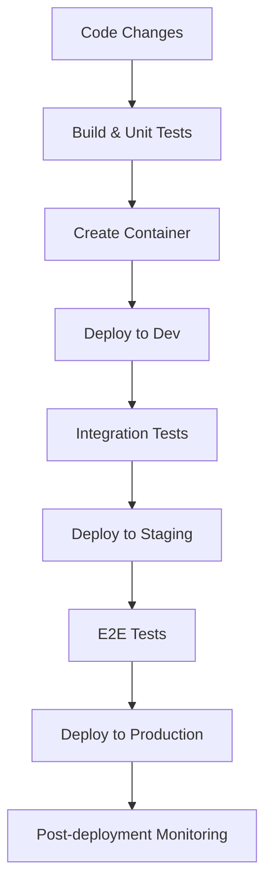

# CI/CD for Microservices

## Introduction

Continuous Integration and Continuous Deployment (CI/CD) for microservices represents a specialized approach to automating the building, testing, and deployment of applications built using a microservices architecture. Unlike monolithic applications, microservices present unique challenges and opportunities when implementing CI/CD pipelines.

In this guide, we'll explore how CI/CD principles apply specifically to microservices, the challenges you might face, and practical solutions to implement effective automation for your microservices ecosystem.

## What are Microservices?

Before diving into CI/CD for microservices, let's briefly understand what microservices are:

Microservices architecture is an approach to building applications as a collection of small, independently deployable services, each running in its own process and communicating through lightweight mechanisms, often HTTP/API calls.

For example, an e-commerce application might be split into services for:
- User authentication
- Product catalog
- Shopping cart
- Order processing
- Payment processing
- Shipping

Each service can be developed, deployed, and scaled independently.

## CI/CD Challenges with Microservices

Implementing CI/CD for microservices introduces several challenges that don't exist with monolithic applications:

1. **Multiple Repositories**: Each microservice typically has its own codebase and repository
2. **Inter-service Dependencies**: Changes in one service might affect others
3. **Complex Testing**: Need for integration testing across service boundaries
4. **Versioning**: Managing compatible versions across services
5. **Deployment Complexity**: Coordinating deployments of multiple services
6. **Infrastructure Management**: Handling the infrastructure for numerous services

## Building CI/CD Pipelines for Microservices

Let's explore how to implement effective CI/CD pipelines for microservices:

### 1. Repository Structure

There are two common approaches:

**Mono-repo**: All microservices in a single repository
- Pros: Easier to coordinate changes, simpler tooling
- Cons: Can become unwieldy with large teams

**Multi-repo**: Each microservice in its own repository
- Pros: Clear ownership, independent evolution
- Cons: More complex to coordinate cross-service changes

Here's a simplified example of a multi-repo structure:

```
github.com/company/
  ├── user-service/
  ├── product-service/
  ├── order-service/
  ├── payment-service/
  └── shared-libraries/
```

### 2. Implementing Individual CI Pipelines

Each microservice should have its own CI pipeline that:

1. Builds the service
2. Runs unit tests
3. Analyzes code quality
4. Creates deployable artifacts (containers)

Here's an example GitHub Actions workflow for a Java microservice:

```yaml
name: User Service CI

on:
  push:
    branches: [ main ]
  pull_request:
    branches: [ main ]

jobs:
  build:
    runs-on: ubuntu-latest
    
    steps:
    - uses: actions/checkout@v3
    
    - name: Set up JDK 17
      uses: actions/setup-java@v3
      with:
        java-version: '17'
        distribution: 'temurin'
        
    - name: Build with Maven
      run: mvn -B package --file pom.xml
      
    - name: Run Tests
      run: mvn test
      
    - name: Build Docker image
      run: |
        docker build -t mycompany/user-service:${{ github.sha }} .
        docker tag mycompany/user-service:${{ github.sha }} mycompany/user-service:latest
        
    - name: Login to DockerHub
      uses: docker/login-action@v2
      with:
        username: ${{ secrets.DOCKERHUB_USERNAME }}
        password: ${{ secrets.DOCKERHUB_TOKEN }}
        
    - name: Push Docker image
      run: |
        docker push mycompany/user-service:${{ github.sha }}
        docker push mycompany/user-service:latest
```

### 3. Integration Testing

For microservices, integration testing is crucial. Some approaches include:

**Contract Testing**: Ensures services interact correctly
- Tools like [Pact](https://pact.io/) help define and verify contracts between services

**API Testing**: Validates service endpoints
- Example using Jest for a Node.js service:

```javascript
const request = require('supertest');
const app = require('../app');

describe('Product API', () => {
  it('GET /products should return list of products', async () => {
    const response = await request(app).get('/products');
    expect(response.statusCode).toBe(200);
    expect(Array.isArray(response.body)).toBeTruthy();
  });
  
  it('GET /products/:id should return a product', async () => {
    const response = await request(app).get('/products/1');
    expect(response.statusCode).toBe(200);
    expect(response.body).toHaveProperty('id');
    expect(response.body).toHaveProperty('name');
  });
});
```

**End-to-End Testing**: Tests complete user journeys across services
- Tools like Cypress or Selenium can be used for this purpose

### 4. Coordinated Deployments

For deploying microservices, consider these strategies:

**Independent Deployments**: Each service is deployed independently
- Pros: Fast, low risk
- Cons: Can lead to compatibility issues

**Coordinated Deployments**: Related services are deployed together
- Pros: Ensures compatibility
- Cons: Slower, more complex

A deployment pipeline for microservices might look like this:



### 5. Service Mesh for Deployment Control

A service mesh like Istio or Linkerd can help with deployment strategies:

**Canary Deployments**: Rolling out to a small percentage of users
**Blue/Green Deployments**: Switching between two identical environments
**Feature Flags**: Enabling features for specific users

Here's a simplified example of a canary deployment with Kubernetes and Istio:

```yaml
apiVersion: networking.istio.io/v1alpha3
kind: VirtualService
metadata:
  name: user-service
spec:
  hosts:
  - user-service
  http:
  - route:
    - destination:
        host: user-service
        subset: v1
      weight: 90
    - destination:
        host: user-service
        subset: v2
      weight: 10
```

### 6. Infrastructure as Code (IaC)

Managing infrastructure for microservices is best done with IaC tools:

- **Terraform**: For provisioning cloud resources
- **Kubernetes manifests**: For container orchestration
- **Helm charts**: For packaging Kubernetes applications

Example Helm chart structure for a microservice:

```
my-service/
├── Chart.yaml
├── values.yaml
├── templates/
│   ├── deployment.yaml
│   ├── service.yaml
│   ├── ingress.yaml
│   └── configmap.yaml
└── charts/  # Dependencies
```

## Practical Example: Building a CI/CD Pipeline for an E-commerce Microservices Application

Let's walk through a practical example of setting up CI/CD for a simple e-commerce application with three microservices:

1. **Product Service**: Manages product catalog (Python/Flask)
2. **Order Service**: Handles orders (Node.js/Express)
3. **User Service**: Manages user accounts (Java/Spring Boot)

### Step 1: Individual CI Pipelines

Each service has its own repository with a CI pipeline. Here's the one for Product Service:

```yaml
# .github/workflows/product-service-ci.yml
name: Product Service CI

on:
  push:
    branches: [ main ]
  pull_request:
    branches: [ main ]

jobs:
  test:
    runs-on: ubuntu-latest
    
    steps:
    - uses: actions/checkout@v3
    
    - name: Set up Python
      uses: actions/setup-python@v4
      with:
        python-version: '3.10'
        
    - name: Install dependencies
      run: |
        python -m pip install --upgrade pip
        pip install -r requirements.txt
        pip install pytest
        
    - name: Run tests
      run: pytest
      
  build:
    needs: test
    runs-on: ubuntu-latest
    
    steps:
    - uses: actions/checkout@v3
    
    - name: Build Docker image
      run: docker build -t mycompany/product-service:${{ github.sha }} .
      
    - name: Login to DockerHub
      uses: docker/login-action@v2
      with:
        username: ${{ secrets.DOCKERHUB_USERNAME }}
        password: ${{ secrets.DOCKERHUB_TOKEN }}
        
    - name: Push Docker image
      run: docker push mycompany/product-service:${{ github.sha }}
```

### Step 2: Deployment Pipeline with ArgoCD

We'll use ArgoCD for declarative GitOps deployments:

1. Create a deployment repository with Kubernetes manifests:

```
deployment-repo/
├── product-service/
│   ├── deployment.yaml
│   ├── service.yaml
│   └── configmap.yaml
├── order-service/
│   ├── deployment.yaml
│   ├── service.yaml
│   └── configmap.yaml
└── user-service/
    ├── deployment.yaml
    ├── service.yaml
    └── configmap.yaml
```

2. Example deployment manifest:

```yaml
# product-service/deployment.yaml
apiVersion: apps/v1
kind: Deployment
metadata:
  name: product-service
spec:
  replicas: 3
  selector:
    matchLabels:
      app: product-service
  template:
    metadata:
      labels:
        app: product-service
    spec:
      containers:
      - name: product-service
        image: mycompany/product-service:${IMAGE_TAG}
        ports:
        - containerPort: 5000
        env:
        - name: DB_HOST
          valueFrom:
            configMapKeyRef:
              name: product-service-config
              key: db_host
```

3. Update manifests as part of CI pipeline:

```yaml
# Add to the CI workflow:
    - name: Update Deployment Manifests
      run: |
        git clone https://github.com/mycompany/deployment-repo.git
        cd deployment-repo
        sed -i "s|\${IMAGE_TAG}|${{ github.sha }}|g" product-service/deployment.yaml
        git config --global user.email "ci@example.com"
        git config --global user.name "CI"
        git add .
        git commit -m "Update product-service to ${{ github.sha }}"
        git push
```

4. ArgoCD will detect the changes and automatically sync the deployment.

### Step 3: Observability and Monitoring

Set up monitoring to ensure all services are running correctly:

- **Prometheus**: For metrics collection
- **Grafana**: For visualization
- **Jaeger or Zipkin**: For distributed tracing
- **ELK Stack**: For centralized logging

### Step 4: Feature Flags

Implement feature flags to safely roll out features:

```javascript
// order-service code example
const client = new LaunchDarkly.initialize(process.env.LAUNCH_DARKLY_SDK_KEY);

app.get('/api/orders/:id', async (req, res) => {
  const showNewOrderDetails = await client.variation(
    'new-order-details', 
    {key: req.user.id}, 
    false
  );
  
  if (showNewOrderDetails) {
    // New implementation
    return res.json(await getEnhancedOrderDetails(req.params.id));
  } else {
    // Old implementation
    return res.json(await getOrderDetails(req.params.id));
  }
});
```

## Best Practices for CI/CD with Microservices

Here are some key best practices to follow:

1. **Automate Everything**: From testing to deployment to rollbacks
2. **Implement Immutable Infrastructure**: Never modify deployed services
3. **Use Container Orchestration**: Kubernetes is the industry standard
4. **Implement Service Discovery**: Use DNS or a service mesh
5. **Centralize Logging and Monitoring**: For easier debugging
6. **Version Your APIs**: To maintain backward compatibility
7. **Implement Circuit Breakers**: To prevent cascading failures
8. **Use Feature Flags**: For safer deployments
9. **Practice Chaos Engineering**: Test resilience by introducing failures
10. **Document Service Interfaces**: Make it easy for other teams to use your services

## Tools for Microservices CI/CD

Here's a summary of popular tools in the microservices CI/CD ecosystem:

| Category | Tools |
|----------|-------|
| CI Platforms | GitHub Actions, Jenkins, CircleCI, GitLab CI |
| Container Registries | Docker Hub, Amazon ECR, GitHub Container Registry |
| Orchestration | Kubernetes, Amazon ECS, Google Cloud Run |
| Deployment | Helm, ArgoCD, Spinnaker, Flux |
| Service Mesh | Istio, Linkerd, Consul |
| Observability | Prometheus, Grafana, Jaeger, ELK Stack |
| Feature Flags | LaunchDarkly, Optimizely, Split.io |

## Summary

CI/CD for microservices requires a different approach compared to monolithic applications. The key differences include:

- Managing multiple pipelines for different services
- Handling inter-service dependencies
- Implementing comprehensive testing strategies
- Coordinating deployments
- Managing the infrastructure at scale

By applying the principles and tools covered in this guide, you can build robust CI/CD pipelines that enable your team to deliver microservices with confidence, speed, and reliability.

## Additional Resources and Exercises

### Resources

- [The Twelve-Factor App](https://12factor.net/) - Methodology for building modern, scalable applications
- [Microservices.io](https://microservices.io/) - Patterns and practices for microservices
- [Kubernetes Documentation](https://kubernetes.io/docs/home/) - For container orchestration
- [Istio Documentation](https://istio.io/latest/docs/) - For service mesh implementation

### Exercises

1. **Basic Setup**: Create a simple microservice and implement a CI pipeline for it using GitHub Actions or Jenkins.

2. **Docker Practice**: Containerize an existing application and push it to a container registry.

3. **Kubernetes Deployment**: Deploy a microservice to a Kubernetes cluster using a Helm chart.

4. **Service Mesh Implementation**: Add Istio to your Kubernetes cluster and implement a canary deployment.

5. **Feature Flag Practice**: Implement a feature flag in one of your microservices using an open-source feature flag system.

6. **Advanced Challenge**: Set up a complete CI/CD pipeline for a small application with 3-4 microservices, including automated testing, deployment, and monitoring.