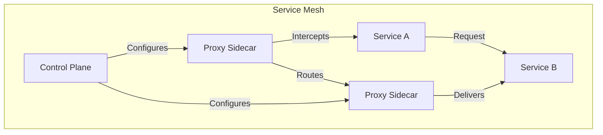

# CICD Service Mesh

## Introduction

A Service Mesh is a dedicated infrastructure layer that handles service-to-service communication in a microservices architecture. When combined with Continuous Integration and Continuous Deployment (CI/CD), it creates a powerful framework that enhances the reliability, security, and observability of your applications.

In this guide, we'll explore how Service Mesh integrates with CI/CD pipelines to create robust, scalable, and maintainable infrastructure for modern applications. Whether you're just starting with microservices or looking to enhance your existing setup, understanding CICD Service Mesh is crucial for modern application delivery.

## What is a Service Mesh?

A Service Mesh is a configurable infrastructure layer for microservices applications that makes communication between service instances flexible, reliable, and fast. The mesh provides critical capabilities including:

- **Traffic Management**: Routing, load balancing, and circuit breaking
- **Security**: mTLS encryption, identity verification, and authorization
- **Observability**: Metrics, monitoring, and tracing

Instead of implementing these features in application code, a service mesh abstracts them into a separate layer, typically using a sidecar proxy pattern.

## Key Components of a Service Mesh

A typical service mesh consists of two main components:

1. **Data Plane**: A set of intelligent proxies (sidecars) deployed alongside application code
2. **Control Plane**: A centralized management component that configures the proxies



## Integrating Service Mesh with CI/CD

### Why Combine Service Mesh with CI/CD?

CI/CD automates the building, testing, and deployment of applications, while Service Mesh manages inter-service communication. When combined, they provide:

1. **Consistent Deployment Practices**: Automated deployment with built-in traffic control
2. **Progressive Delivery**: Canary deployments, blue/green deployments, and A/B testing
3. **Enhanced Resilience**: Automatic retries, circuit breaking, and fault injection
4. **Comprehensive Observability**: End-to-end tracing and monitoring

### Implementation Steps

#### 1. Choose Your Service Mesh

Several service mesh options are available:

- **Istio**: Feature-rich and widely adopted
- **Linkerd**: Lightweight and easy to adopt
- **Consul Connect**: Integrated with HashiCorp stack
- **AWS App Mesh**: Native to AWS environment

#### 2. Set Up Your CI/CD Pipeline

Let's create a basic GitLab CI/CD pipeline that builds an application and deploys it with Istio service mesh:

```yaml
stages:
  - build
  - test
  - deploy

build-app:
  stage: build
  image: docker:latest
  services:
    - docker:dind
  script:
    - docker build -t $CI_REGISTRY_IMAGE:$CI_COMMIT_SHA .
    - docker push $CI_REGISTRY_IMAGE:$CI_COMMIT_SHA

test-app:
  stage: test
  image: $CI_REGISTRY_IMAGE:$CI_COMMIT_SHA
  script:
    - npm test

deploy-to-kubernetes:
  stage: deploy
  image: 
    name: bitnami/kubectl:latest
  script:
    - kubectl apply -f k8s/namespace.yaml
    - kubectl label namespace my-app istio-injection=enabled --overwrite
    - envsubst < k8s/deployment.yaml | kubectl apply -f -
    - kubectl apply -f k8s/service.yaml
    - kubectl apply -f k8s/virtual-service.yaml
```

In this pipeline:
1. We build a Docker image of our application
2. We run tests against the image
3. We deploy to Kubernetes with Istio injection enabled

#### 3. Configure Service Mesh Resources

Now, let's look at the Kubernetes configuration for our service with Istio:

```yaml
# deployment.yaml
apiVersion: apps/v1
kind: Deployment
metadata:
  name: my-service
  namespace: my-app
spec:
  replicas: 3
  selector:
    matchLabels:
      app: my-service
  template:
    metadata:
      labels:
        app: my-service
        version: v1
    spec:
      containers:
      - name: my-service
        image: ${CI_REGISTRY_IMAGE}:${CI_COMMIT_SHA}
        ports:
        - containerPort: 8080
```

```yaml
# service.yaml
apiVersion: v1
kind: Service
metadata:
  name: my-service
  namespace: my-app
spec:
  ports:
  - port: 80
    targetPort: 8080
  selector:
    app: my-service
```

```yaml
# virtual-service.yaml
apiVersion: networking.istio.io/v1alpha3
kind: VirtualService
metadata:
  name: my-service
  namespace: my-app
spec:
  hosts:
  - my-service
  http:
  - route:
    - destination:
        host: my-service
        subset: v1
      weight: 100
---
apiVersion: networking.istio.io/v1alpha3
kind: DestinationRule
metadata:
  name: my-service
  namespace: my-app
spec:
  host: my-service
  subsets:
  - name: v1
    labels:
      version: v1
```

## Advanced Service Mesh Patterns in CI/CD

### Canary Deployments

Canary deployments allow you to roll out changes to a small subset of users before full deployment:

```yaml
# canary-virtual-service.yaml
apiVersion: networking.istio.io/v1alpha3
kind: VirtualService
metadata:
  name: my-service
  namespace: my-app
spec:
  hosts:
  - my-service
  http:
  - route:
    - destination:
        host: my-service
        subset: v1
      weight: 90
    - destination:
        host: my-service
        subset: v2
      weight: 10
```

In your CI/CD pipeline, you can automate the gradual shift from v1 to v2:

```yaml
deploy-canary:
  stage: deploy
  script:
    - kubectl apply -f k8s/deployment-v2.yaml
    - kubectl apply -f k8s/canary-virtual-service.yaml
    - sleep 300  # Monitor for 5 minutes
    - if [ $CANARY_SUCCESS ]; then
        kubectl apply -f k8s/promote-canary.yaml;
      else
        kubectl apply -f k8s/rollback-canary.yaml;
      fi
```

### Traffic Mirroring

Traffic mirroring (or shadowing) allows you to send a copy of live traffic to a test service:

```yaml
# mirror-virtual-service.yaml
apiVersion: networking.istio.io/v1alpha3
kind: VirtualService
metadata:
  name: my-service
  namespace: my-app
spec:
  hosts:
  - my-service
  http:
  - route:
    - destination:
        host: my-service
        subset: v1
    mirror:
      host: my-service
      subset: v2
    mirrorPercentage:
      value: 100.0
```

This can be integrated into your CI/CD pipeline:

```yaml
deploy-with-mirroring:
  stage: deploy
  script:
    - kubectl apply -f k8s/deployment-v2.yaml
    - kubectl apply -f k8s/mirror-virtual-service.yaml
    - sleep 600  # Monitor mirrored traffic for 10 minutes
    - if [ $MIRROR_SUCCESS ]; then
        kubectl apply -f k8s/promote-v2.yaml;
      else
        kubectl delete -f k8s/deployment-v2.yaml;
      fi
```

## Observability in a CICD Service Mesh

One of the key benefits of using a service mesh with CI/CD is enhanced observability. Here's how to set up monitoring:

### Metrics and Monitoring

Istio integrates with Prometheus and Grafana for metrics:

```yaml
# monitoring.yaml
apiVersion: install.istio.io/v1alpha1
kind: IstioOperator
metadata:
  name: istio-monitoring
spec:
  addonComponents:
    grafana:
      enabled: true
    prometheus:
      enabled: true
    kiali:
      enabled: true
    tracing:
      enabled: true
```

### Distributed Tracing

Service meshes like Istio can automatically propagate tracing headers:

```javascript
// Example of receiving traces in Express.js
const app = express();

app.get('/api/products', (req, res) => {
  // Service mesh automatically propagates trace headers
  const traceId = req.headers['x-b3-traceid'];
  console.log(`Processing request with trace ID: ${traceId}`);
  
  // Your application logic here
  res.json({ products: [...] });
});
```

### Monitoring Deployments in CI/CD

Add a verification step in your CI/CD pipeline:

```yaml
verify-deployment:
  stage: verify
  script:
    - curl -s $PROMETHEUS_URL/api/v1/query?query=istio_requests_total | jq '.data.result'
    - if [ $(curl -s $PROMETHEUS_URL/api/v1/query?query=istio_requests_total{response_code=\"500\",destination_service=\"my-service.my-app.svc.cluster.local\"} | jq '.data.result | length') -gt 0 ]; then
        echo "Errors detected in service";
        kubectl rollback deployment my-service;
        exit 1;
      fi
```

## Practical Example: Building a Complete CICD Service Mesh Pipeline

Let's put everything together with a real-world example of deploying a microservice application with Istio and GitLab CI/CD:

### Project Structure

```
├── src/
│   └── ...
├── tests/
│   └── ...
├── Dockerfile
├── .gitlab-ci.yml
└── k8s/
    ├── base/
    │   ├── deployment.yaml
    │   ├── service.yaml
    │   └── kustomization.yaml
    ├── overlays/
    │   ├── dev/
    │   │   ├── kustomization.yaml
    │   │   └── virtual-service.yaml
    │   └── prod/
    │       ├── kustomization.yaml
    │       └── virtual-service.yaml
    └── istio/
        ├── gateway.yaml
        └── authorization-policy.yaml
```

### GitLab CI/CD Pipeline

```yaml
stages:
  - build
  - test
  - deploy-dev
  - integration-test
  - deploy-prod
  - post-deploy

variables:
  DOCKER_REGISTRY: registry.example.com
  APP_NAME: user-service
  KUBE_NAMESPACE: microservices

build:
  stage: build
  image: docker:latest
  services:
    - docker:dind
  script:
    - docker build -t $DOCKER_REGISTRY/$APP_NAME:$CI_COMMIT_SHA .
    - docker push $DOCKER_REGISTRY/$APP_NAME:$CI_COMMIT_SHA

unit-test:
  stage: test
  image: node:16
  script:
    - npm install
    - npm run test:unit

deploy-to-dev:
  stage: deploy-dev
  image: 
    name: bitnami/kubectl:latest
  script:
    # Apply Istio configurations
    - kubectl apply -f k8s/istio/gateway.yaml
    - kubectl apply -f k8s/istio/authorization-policy.yaml
    
    # Update deployment image
    - cd k8s/base
    - kustomize edit set image $DOCKER_REGISTRY/$APP_NAME=$DOCKER_REGISTRY/$APP_NAME:$CI_COMMIT_SHA
    
    # Deploy to dev environment
    - kubectl apply -k ../overlays/dev
  environment:
    name: dev

integration-test:
  stage: integration-test
  image: postman/newman
  script:
    - newman run tests/integration/collection.json -e tests/integration/dev-environment.json
    # Check service mesh metrics
    - curl -s $PROMETHEUS_URL/api/v1/query?query=istio_requests_total{destination_service=\"$APP_NAME.$KUBE_NAMESPACE.svc.cluster.local\",response_code=\"500\"} | grep -q "value"
    - if [ $? -eq 0 ]; then exit 1; fi

canary-deploy-prod:
  stage: deploy-prod
  image:
    name: bitnami/kubectl:latest
  script:
    # Create canary deployment with 10% traffic
    - cd k8s/overlays/prod
    - cat virtual-service.yaml | sed 's/weight: 100/weight: 90/' > canary-vs.yaml
    - echo '- destination: { host: user-service, subset: canary } weight: 10' >> canary-vs.yaml
    - kubectl apply -f canary-vs.yaml
    
    # Deploy the canary version
    - cd ../../base
    - kustomize edit set image $DOCKER_REGISTRY/$APP_NAME=$DOCKER_REGISTRY/$APP_NAME:$CI_COMMIT_SHA
    - kubectl apply -k ../overlays/prod
  environment:
    name: production
    
promote-canary:
  stage: post-deploy
  image: 
    name: bitnami/kubectl:latest
  script:
    # Check error rates before promoting
    - ERROR_RATE=$(curl -s $PROMETHEUS_URL/api/v1/query?query=sum(rate(istio_requests_total{destination_service=\"$APP_NAME.$KUBE_NAMESPACE.svc.cluster.local\",response_code=~\"5.*\"}[5m]))/sum(rate(istio_requests_total{destination_service=\"$APP_NAME.$KUBE_NAMESPACE.svc.cluster.local\"}[5m])))
    - if (( $(echo "$ERROR_RATE > 0.01" | bc -l) )); then
        echo "Error rate too high: $ERROR_RATE";
        kubectl apply -f k8s/overlays/prod/rollback.yaml;
        exit 1;
      fi
    
    # Promote to 100% production traffic
    - kubectl apply -f k8s/overlays/prod/virtual-service.yaml
  environment:
    name: production
  when: manual
```

### Key Istio Configurations

```yaml
# k8s/istio/gateway.yaml
apiVersion: networking.istio.io/v1alpha3
kind: Gateway
metadata:
  name: microservices-gateway
  namespace: microservices
spec:
  selector:
    istio: ingressgateway
  servers:
  - port:
      number: 80
      name: http
      protocol: HTTP
    hosts:
    - "api.example.com"
```

```yaml
# k8s/overlays/prod/virtual-service.yaml
apiVersion: networking.istio.io/v1alpha3
kind: VirtualService
metadata:
  name: user-service
  namespace: microservices
spec:
  hosts:
  - "api.example.com"
  gateways:
  - microservices-gateway
  http:
  - match:
    - uri:
        prefix: /users
    route:
    - destination:
        host: user-service
        port:
          number: 80
        subset: stable
      weight: 100
---
apiVersion: networking.istio.io/v1alpha3
kind: DestinationRule
metadata:
  name: user-service
  namespace: microservices
spec:
  host: user-service
  subsets:
  - name: stable
    labels:
      version: stable
  - name: canary
    labels:
      version: canary
```

## Common Challenges and Solutions

### 1. Performance Overhead

**Challenge**: Service mesh proxies add latency to service communication.

**Solution**:
- Use lightweight service meshes like Linkerd for performance-sensitive applications
- Configure resource limits for sidecars
- Implement selective sidecar injection

```yaml
# Selective sidecar injection
apiVersion: apps/v1
kind: Deployment
metadata:
  name: performance-critical-service
spec:
  template:
    metadata:
      annotations:
        sidecar.istio.io/inject: "false"
```

### 2. Complexity

**Challenge**: Service meshes add complexity to infrastructure.

**Solution**:
- Start with basic configurations and add complexity gradually
- Use abstraction tools like Helm charts
- Implement GitOps workflows for mesh configuration

```yaml
# Using helm in CI/CD for service mesh deployment
deploy-service-mesh:
  stage: infrastructure
  script:
    - helm repo add istio https://istio-release.storage.googleapis.com/charts
    - helm upgrade --install istio-base istio/base -n istio-system --create-namespace
    - helm upgrade --install istiod istio/istiod -n istio-system
```

### 3. Configuration Drift

**Challenge**: Managing consistent configurations across environments.

**Solution**:
- Use IaC (Infrastructure as Code) for mesh configuration
- Implement configuration validation in CI/CD
- Use GitOps for configuration management

```yaml
# Configuration validation in CI/CD
validate-mesh-config:
  stage: validate
  script:
    - istioctl analyze -n microservices k8s/istio/
```

## Summary

A CICD Service Mesh combines the power of continuous integration/continuous deployment with the advanced networking capabilities of a service mesh. This integration provides:

1. **Reliable Deployments**: Canary releases, traffic shifting, and rollbacks
2. **Enhanced Security**: mTLS encryption and fine-grained access control
3. **Deep Observability**: Metrics, logging, and tracing across services
4. **Progressive Delivery**: Controlled rollouts with automated verification

By implementing a service mesh within your CI/CD pipeline, you can achieve more reliable, secure, and observable microservices architectures.

## Additional Resources

- **Learn More About Istio**: [Istio Documentation](https://istio.io/latest/docs/)
- **Linkerd Service Mesh**: [Linkerd Website](https://linkerd.io/)
- **GitOps with Service Mesh**: [Flux Documentation](https://fluxcd.io/docs/)

## Exercises

1. **Basic Setup**: Install Istio in a local Kubernetes cluster and deploy a simple application with sidecar injection.

2. **Traffic Splitting**: Create a CI/CD pipeline that includes canary deployments with traffic splitting between two versions.

3. **Observability Practice**: Set up Prometheus and Grafana to monitor your service mesh and create dashboards for key metrics.

4. **Security Implementation**: Configure mTLS between services and implement authorization policies.

5. **Advanced Challenge**: Create a complete CI/CD pipeline that includes automated canary analysis based on service mesh metrics before promoting to full production.