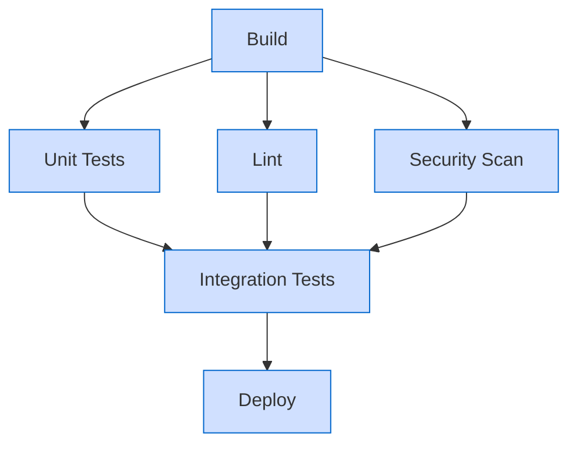
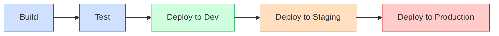

# CICD Pipeline Design

## Introduction

Continuous Integration and Continuous Deployment (CI/CD) pipelines form the backbone of modern software development practices. A well-designed CI/CD pipeline automates the process of building, testing, and deploying your code, allowing developers to focus on writing features rather than manual deployment tasks.

In this guide, we'll explore how to design effective CI/CD pipelines for your projects. Whether you're a beginner just starting with automation or looking to improve your existing workflows, this article will provide you with the knowledge to build robust pipelines that enhance your development process.

## What is a CI/CD Pipeline?

A CI/CD pipeline is an automated workflow that takes your code from source control through various stages until it reaches production. It consists of a series of steps that verify, build, test and deploy your application automatically whenever changes are pushed to your repository.


### Benefits of CI/CD Pipelines

- **Faster feedback**: Developers get immediate feedback on their changes
- **Reduced manual errors**: Automation eliminates human error in repetitive tasks
- **Improved collaboration**: Teams can integrate changes more frequently
- **Consistent deployments**: Every deployment follows the same process
- **Higher quality code**: Automated testing catches issues early

## Key Components of a CI/CD Pipeline

### 1. Source Control Management

Every pipeline begins with code stored in a version control system like Git. This provides a single source of truth for your codebase.

```bash
# Example of pushing code to trigger a pipeline
git add .
git commit -m "Add new feature"
git push origin main
```

### 2. Build Stage

The build stage compiles your code and creates artifacts (like executable files, containers, or packages) that will be used in later stages.

```yaml
# Example build configuration in GitLab CI
build:
  stage: build
  script:
    - npm install
    - npm run build
  artifacts:
    paths:
      - dist/
```

### 3. Testing Stages

Multiple testing stages verify that your code works as expected:

#### Unit Tests

Tests individual components of your application in isolation.

```javascript
// Example unit test with Jest
test('adds 1 + 2 to equal 3', () => {
  expect(sum(1, 2)).toBe(3);
});
```

#### Integration Tests

Tests how components work together.

```javascript
// Example integration test
test('user registration flow', async () => {
  const user = await registerUser({
    username: 'testuser',
    password: 'password123'
  });
  const login = await loginUser({
    username: 'testuser',
    password: 'password123'
  });
  expect(login.success).toBe(true);
});
```

#### End-to-End Tests

Tests the complete application flow from start to finish.

```javascript
// Example E2E test with Cypress
describe('Login Page', () => {
  it('should login successfully', () => {
    cy.visit('/login');
    cy.get('#username').type('testuser');
    cy.get('#password').type('password123');
    cy.get('#login-button').click();
    cy.url().should('include', '/dashboard');
  });
});
```

### 4. Deployment Stages

Deployment stages move your application to different environments.

```yaml
# Example deployment stage in GitHub Actions
deploy-staging:
  needs: [build, test]
  runs-on: ubuntu-latest
  steps:
    - uses: actions/checkout@v3
    - name: Deploy to staging
      run: |
        echo "Deploying to staging environment"
        ./deploy.sh --env=staging
```

## Designing Your First CI/CD Pipeline

Let's create a basic CI/CD pipeline for a simple web application. We'll use GitHub Actions as our CI/CD tool.

### Step 1: Create a Workflow File

Create a file at `.github/workflows/main.yml` in your repository:

```yaml
name: CI/CD Pipeline

on:
  push:
    branches: [ main ]
  pull_request:
    branches: [ main ]

jobs:
  build:
    runs-on: ubuntu-latest
    
    steps:
    - uses: actions/checkout@v3
    
    - name: Set up Node.js
      uses: actions/setup-node@v3
      with:
        node-version: '16'
        
    - name: Install dependencies
      run: npm install
      
    - name: Build
      run: npm run build
      
    - name: Test
      run: npm test
      
    - name: Upload build artifacts
      uses: actions/upload-artifact@v3
      with:
        name: build-files
        path: ./build
        
  deploy-staging:
    needs: build
    runs-on: ubuntu-latest
    if: github.event_name == 'push' && github.ref == 'refs/heads/main'
    
    steps:
    - name: Download build artifacts
      uses: actions/download-artifact@v3
      with:
        name: build-files
        path: ./build
        
    - name: Deploy to staging
      run: |
        echo "Deploying to staging environment"
        # Add your deployment commands here
```

### Step 2: Review and Understand the Workflow

This workflow:
1. Triggers on pushes to main and pull requests
2. Builds and tests the application
3. Uploads the build artifacts
4. Deploys to staging (only for pushes to main)

## Advanced Pipeline Design Patterns

As your projects grow, you'll need more sophisticated pipeline designs.

### Parallel Execution

Running jobs in parallel can significantly speed up your pipeline:



### Feature Branch Workflows

Different pipelines for different types of branches:

```yaml
# Example conditional pipeline stages
test:
  stage: test
  script:
    - run_tests.sh
  
deploy-staging:
  stage: deploy
  script:
    - deploy_to_staging.sh
  only:
    - develop
    
deploy-production:
  stage: deploy
  script:
    - deploy_to_production.sh
  only:
    - main
  when: manual
```

### Multi-Environment Deployments

Progressively deploying through multiple environments:



## Real-World CI/CD Pipeline Example

Let's look at a more comprehensive pipeline for a microservice architecture:

```yaml
name: Microservice CI/CD Pipeline

on:
  push:
    branches: [ main, develop, 'feature/*' ]
  pull_request:
    branches: [ main, develop ]

jobs:
  code-quality:
    runs-on: ubuntu-latest
    steps:
    - uses: actions/checkout@v3
    - name: Set up Node.js
      uses: actions/setup-node@v3
      with:
        node-version: '16'
    - name: Install dependencies
      run: npm install
    - name: Lint code
      run: npm run lint
    - name: Check formatting
      run: npm run format:check
      
  security-scan:
    runs-on: ubuntu-latest
    steps:
    - uses: actions/checkout@v3
    - name: Run security scan
      run: npm audit
      
  build-and-test:
    runs-on: ubuntu-latest
    needs: [code-quality, security-scan]
    steps:
    - uses: actions/checkout@v3
    - name: Set up Node.js
      uses: actions/setup-node@v3
      with:
        node-version: '16'
    - name: Install dependencies
      run: npm install
    - name: Build
      run: npm run build
    - name: Run unit tests
      run: npm test
    - name: Run integration tests
      run: npm run test:integration
    - name: Upload build artifacts
      uses: actions/upload-artifact@v3
      with:
        name: build-files
        path: ./dist
        
  deploy-dev:
    runs-on: ubuntu-latest
    needs: build-and-test
    if: github.ref == 'refs/heads/develop' || startsWith(github.ref, 'refs/heads/feature/')
    steps:
    - name: Download build artifacts
      uses: actions/download-artifact@v3
      with:
        name: build-files
        path: ./dist
    - name: Deploy to development
      run: |
        echo "Deploying to development environment"
        
  deploy-staging:
    runs-on: ubuntu-latest
    needs: deploy-dev
    if: github.ref == 'refs/heads/develop'
    steps:
    - name: Download build artifacts
      uses: actions/download-artifact@v3
      with:
        name: build-files
        path: ./dist
    - name: Deploy to staging
      run: |
        echo "Deploying to staging environment"
        
  deploy-production:
    runs-on: ubuntu-latest
    needs: deploy-staging
    if: github.ref == 'refs/heads/main'
    environment: production
    steps:
    - name: Download build artifacts
      uses: actions/download-artifact@v3
      with:
        name: build-files
        path: ./dist
    - name: Deploy to production
      run: |
        echo "Deploying to production environment"
```

This pipeline:
1. Runs code quality and security checks in parallel
2. Builds and tests the application
3. Deploys to development for all branches
4. Deploys to staging only for the develop branch
5. Deploys to production only for the main branch with approval

## Best Practices for CI/CD Pipeline Design

### 1. Keep Pipelines Fast

The faster your pipelines, the quicker you get feedback:
- Use parallelization where possible
- Optimize test suites
- Use incremental builds
- Cache dependencies

### 2. Make Pipelines Reliable

Flaky pipelines lead to ignored alerts:
- Avoid dependencies on external services for tests
- Use consistent test environments
- Implement proper error handling
- Add retries for network-dependent steps

### 3. Design for Observability

Make it easy to understand what's happening:
- Add detailed logs
- Include test reports
- Set up notifications
- Visualize pipeline metrics

```javascript
// Example of adding more context to tests
test('user registration - positive path', () => {
  console.log('Testing user registration with valid credentials');
  expect(registerUser('validuser', 'password123')).toBeTruthy();
});
```

### 4. Implement Security Checks

Add security at every stage:
- Scan dependencies
- Run SAST (Static Application Security Testing)
- Check for secrets in code
- Verify image signatures

### 5. Automate Everything

If a task is repeated, automate it:
- Environment provisioning
- Database migrations
- Configuration changes
- Rollbacks

## Common CI/CD Tools

Several tools can help you implement CI/CD pipelines:

### 1. Jenkins

A self-hosted automation server with extensive plugin support.

```groovy
// Example Jenkinsfile
pipeline {
    agent any
    stages {
        stage('Build') {
            steps {
                sh 'npm install'
                sh 'npm run build'
            }
        }
        stage('Test') {
            steps {
                sh 'npm test'
            }
        }
        stage('Deploy') {
            steps {
                sh './deploy.sh'
            }
        }
    }
}
```

### 2. GitHub Actions

GitHub's built-in CI/CD solution that works directly from your repository.

### 3. GitLab CI/CD

Integrated CI/CD as part of the GitLab platform.

### 4. CircleCI

A cloud-based CI/CD service with a focus on speed.

### 5. Azure DevOps Pipelines

Microsoft's CI/CD solution that integrates with Azure services.

## Troubleshooting Common Pipeline Issues

### Failed Builds

1. Check logs for specific error messages
2. Verify that the build environment matches development
3. Ensure all dependencies are available

### Flaky Tests

1. Identify tests that fail intermittently
2. Look for race conditions or timing issues
3. Isolate tests from external dependencies

### Deployment Failures

1. Verify environment configuration
2. Check connection permissions
3. Ensure resources are available

## Summary

A well-designed CI/CD pipeline is essential for modern software development. By automating the build, test, and deployment processes, you can deliver software faster, with fewer bugs, and with greater confidence.

Remember these key points:
- Start simple and iterate on your pipeline design
- Focus on speed and reliability
- Include comprehensive testing
- Implement proper security checks
- Continuously improve your process

As you gain experience, you'll be able to design more sophisticated pipelines that meet your specific project needs.

## Exercise: Build Your First Pipeline

1. Take a simple application (like a static website or basic API)
2. Set up a GitHub repository for it
3. Create a `.github/workflows/main.yml` file similar to the example
4. Push your code and watch the pipeline run
5. Gradually add more stages to your pipeline (linting, testing, etc.)

## Additional Resources

- [GitHub Actions Documentation](https://docs.github.com/en/actions)
- [CI/CD Best Practices Guide](https://www.jetbrains.com/teamcity/ci-cd-guide/)
- [The DevOps Handbook](https://itrevolution.com/book/the-devops-handbook/)
- [Continuous Delivery](https://continuousdelivery.com/)