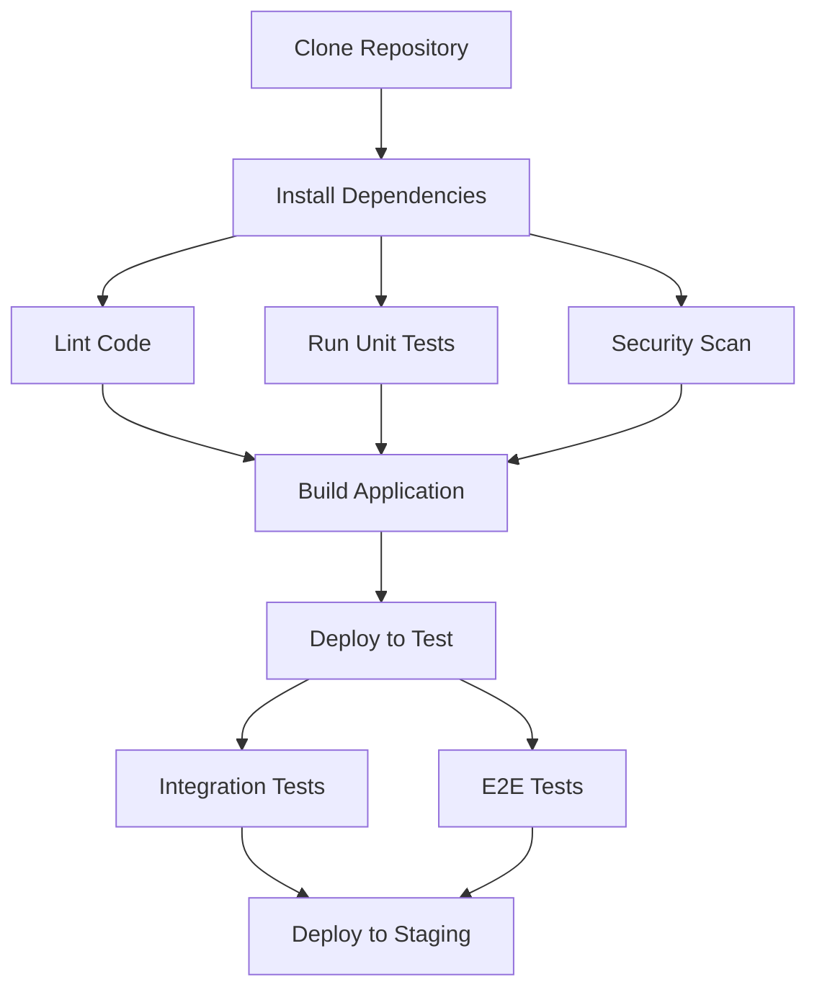

# CI/CD Pipeline Optimization

## Introduction

Continuous Integration and Continuous Deployment (CI/CD) pipelines are the backbone of modern software development practices. They automate the process of building, testing, and deploying code, enabling teams to deliver software faster and more reliably. However, as your projects grow in complexity, these pipelines can become slow, inefficient, and expensive to maintain.

In this guide, we'll explore various techniques to optimize your CI/CD pipelines. Whether you're facing long build times, resource constraints, or flaky tests, these optimization strategies will help you create more efficient pipelines that deliver value faster without sacrificing quality.

## Why Optimize Your CI/CD Pipeline?

Before diving into optimization techniques, let's understand why optimization matters:

- **Faster Feedback**: A faster pipeline means developers get feedback more quickly
- **Increased Productivity**: Less time waiting for builds means more time coding
- **Resource Efficiency**: Optimized pipelines use fewer computing resources
- **Cost Savings**: More efficient pipelines can significantly reduce cloud computing costs
- **Developer Satisfaction**: Nobody likes waiting for slow builds to complete

## Pipeline Visualization

A typical CI/CD pipeline consists of several stages. Before optimization, it might look something like this:


Now, let's explore how to optimize each stage of this pipeline.

## 1. Optimize Repository Operations

### Shallow Cloning

Instead of cloning the entire repository history, use shallow cloning to retrieve only the latest commit:

```bash
# Before optimization
git clone https://github.com/your-org/your-repo.git

# After optimization
git clone --depth=1 https://github.com/your-org/your-repo.git
```

This can drastically reduce clone time for repositories with long histories.

### Sparse Checkout

If you only need specific directories for your build, use sparse checkout:

```bash
git clone --no-checkout https://github.com/your-org/your-repo.git
cd your-repo
git sparse-checkout init --cone
git sparse-checkout set src tests
git checkout main
```

## 2. Dependency Management Optimization

### Caching Dependencies

Most CI/CD platforms offer caching mechanisms. Use them to cache dependencies between builds:

```yaml
# GitHub Actions example
steps:
  - uses: actions/checkout@v3
  
  - name: Cache npm dependencies
    uses: actions/cache@v3
    with:
      path: ~/.npm
      key: ${{ runner.os }}-node-${{ hashFiles('**/package-lock.json') }}
      restore-keys: |
        ${{ runner.os }}-node-

  - name: Install dependencies
    run: npm ci
```

### Use Lockfiles

Always commit lockfiles (`package-lock.json`, `yarn.lock`, `Gemfile.lock`, etc.) to ensure consistent and faster installs.

### Consider Vendoring

For critical dependencies that rarely change, consider vendoring (including them directly in your repository).

## 3. Parallelizing Pipeline Stages

Break your pipeline into stages that can run in parallel:



### Example: Parallel Testing in GitHub Actions

```yaml
jobs:
  test:
    runs-on: ubuntu-latest
    strategy:
      matrix:
        test-group: [unit, integration, e2e]
    steps:
      - uses: actions/checkout@v3
      - name: Set up Node.js
        uses: actions/setup-node@v3
        with:
          node-version: '16'
      - name: Install dependencies
        run: npm ci
      - name: Run tests
        run: npm run test:${{ matrix.test-group }}
```

## 4. Test Optimization Strategies

### Test Splitting and Parallelization

Split your test suite into smaller chunks that can run in parallel:

```javascript
// jest.config.js example for splitting tests
module.exports = {
  // ... other config
  shard: {
    current: process.env.SHARD_INDEX || 0,
    total: process.env.SHARD_TOTAL || 1,
  },
};
```

### Test Selection and Prioritization

Only run tests that are relevant to the changes made:

```bash
# Example using Git to find changed files and run related tests
CHANGED_FILES=$(git diff --name-only HEAD~1 HEAD | grep -E '\.js$')
npx jest --findRelatedTests $CHANGED_FILES
```

### Flaky Test Detection

Identify and fix or quarantine flaky tests that slow down your pipeline:

```javascript
// Example of marking a flaky test in Jest
test.flaky('sometimes this test fails randomly', () => {
  // Test code here
});
```

## 5. Build Optimization

### Incremental Builds

Use build tools that support incremental builds to avoid rebuilding unchanged code:

```javascript
// webpack.config.js example
module.exports = {
  // ... other config
  cache: {
    type: 'filesystem',
  },
};
```

### Optimize Docker Builds

Improve Docker build performance with better layer caching:

```dockerfile
# Bad example - changes to source code invalidate dependency layer
FROM node:16
COPY . /app
WORKDIR /app
RUN npm ci
CMD ["npm", "start"]

# Good example - better layer caching
FROM node:16
WORKDIR /app
COPY package*.json ./
RUN npm ci
COPY . .
CMD ["npm", "start"]
```

### Multi-stage Builds

Use multi-stage builds to keep final images small:

```dockerfile
# Build stage
FROM node:16 AS build
WORKDIR /app
COPY package*.json ./
RUN npm ci
COPY . .
RUN npm run build

# Production stage
FROM nginx:alpine
COPY --from=build /app/dist /usr/share/nginx/html
EXPOSE 80
CMD ["nginx", "-g", "daemon off;"]
```

## 6. Resource Optimization

### Right-sizing CI/CD Runners

Make sure your build runners have appropriate resources:

```yaml
# GitHub Actions example with larger runner
jobs:
  build:
    runs-on: ubuntu-latest-16-core
    steps:
      # ...
```

### Self-hosted Runners

For specific needs, consider self-hosted runners with optimized configurations:

```yaml
# GitHub Actions example with self-hosted runner
jobs:
  build:
    runs-on: self-hosted
    steps:
      # ...
```

## 7. Pipeline Configuration and Tooling

### Pipeline as Code

Store your pipeline configuration in your repository for better version control:

```yaml
# .github/workflows/ci.yml for GitHub Actions
name: CI/CD Pipeline

on:
  push:
    branches: [ main ]
  pull_request:
    branches: [ main ]

jobs:
  build:
    runs-on: ubuntu-latest
    steps:
    - uses: actions/checkout@v3
    # ... other steps
```

### Pipeline Linting

Lint your pipeline configuration files to catch errors early:

```bash
# Example for GitHub Actions
npx actionlint
```

## 8. Advanced Optimization Techniques

### Caching Build Artifacts

Cache build artifacts between pipeline runs:

```yaml
# GitLab CI example
build:
  script:
    - npm run build
  cache:
    paths:
      - dist/
```

### Branch-specific Pipelines

Run different pipelines based on branch patterns:

```yaml
# GitHub Actions example
on:
  push:
    branches:
      - main
      - 'releases/**'
  pull_request:
    branches: [ main ]

jobs:
  test:
    if: github.event_name == 'pull_request'
    runs-on: ubuntu-latest
    steps:
      - run: npm test
      
  deploy:
    if: github.ref == 'refs/heads/main'
    runs-on: ubuntu-latest
    steps:
      - run: npm run deploy
```

### Scheduled Maintenance Jobs

Separate long-running maintenance jobs from your regular pipeline:

```yaml
# GitHub Actions scheduled workflow
on:
  schedule:
    - cron: '0 0 * * 0'  # Every Sunday at midnight

jobs:
  maintenance:
    runs-on: ubuntu-latest
    steps:
      - run: npm run full-lint
      - run: npm audit
```

## 9. Monitoring and Continuous Improvement

### Pipeline Analytics

Measure your pipeline performance over time:

```javascript
// Example script to analyze GitHub Actions workflow runs
const { Octokit } = require("@octokit/rest");
const octokit = new Octokit({ auth: process.env.GITHUB_TOKEN });

async function getWorkflowRunTimes() {
  const { data } = await octokit.actions.listWorkflowRuns({
    owner: "your-org",
    repo: "your-repo",
    workflow_id: "ci.yml",
  });
  
  return data.workflow_runs.map(run => ({
    id: run.id,
    created_at: run.created_at,
    updated_at: run.updated_at,
    duration: new Date(run.updated_at) - new Date(run.created_at),
  }));
}

getWorkflowRunTimes().then(console.table);
```

### Automated Optimization

Consider tools that can automatically optimize your pipeline:

```bash
# Example of using webpack-bundle-analyzer to find optimization opportunities
npm install --save-dev webpack-bundle-analyzer
```

## Real-World Example: Optimizing a Node.js Application Pipeline

Let's walk through a complete example of optimizing a CI/CD pipeline for a Node.js application:

### Before Optimization

```yaml
# .github/workflows/ci-before.yml
name: CI/CD Pipeline

on:
  push:
    branches: [ main ]
  pull_request:
    branches: [ main ]

jobs:
  build-and-test:
    runs-on: ubuntu-latest
    steps:
      - uses: actions/checkout@v3
      
      - name: Set up Node.js
        uses: actions/setup-node@v3
        with:
          node-version: '16'
          
      - name: Install dependencies
        run: npm install
        
      - name: Lint code
        run: npm run lint
        
      - name: Run tests
        run: npm test
        
      - name: Build
        run: npm run build
        
      - name: Deploy to staging
        if: github.ref == 'refs/heads/main'
        run: npm run deploy:staging
```

### After Optimization

```yaml
# .github/workflows/ci-after.yml
name: Optimized CI/CD Pipeline

on:
  push:
    branches: [ main ]
  pull_request:
    branches: [ main ]

jobs:
  setup:
    runs-on: ubuntu-latest
    outputs:
      cache-key: ${{ steps.cache-key.outputs.value }}
    steps:
      - uses: actions/checkout@v3
        with:
          fetch-depth: 1
      
      - name: Generate cache key
        id: cache-key
        run: echo "value=${{ runner.os }}-node-${{ hashFiles('**/package-lock.json') }}" >> $GITHUB_OUTPUT
      
  lint:
    needs: setup
    runs-on: ubuntu-latest
    steps:
      - uses: actions/checkout@v3
        with:
          fetch-depth: 1
          
      - name: Set up Node.js
        uses: actions/setup-node@v3
        with:
          node-version: '16'
          
      - name: Cache dependencies
        uses: actions/cache@v3
        with:
          path: ~/.npm
          key: ${{ needs.setup.outputs.cache-key }}
          
      - name: Install dependencies
        run: npm ci
        
      - name: Lint code
        run: npm run lint
  
  test:
    needs: setup
    runs-on: ubuntu-latest
    strategy:
      matrix:
        test-group: [unit, integration]
    steps:
      - uses: actions/checkout@v3
        with:
          fetch-depth: 1
          
      - name: Set up Node.js
        uses: actions/setup-node@v3
        with:
          node-version: '16'
          
      - name: Cache dependencies
        uses: actions/cache@v3
        with:
          path: ~/.npm
          key: ${{ needs.setup.outputs.cache-key }}
          
      - name: Install dependencies
        run: npm ci
        
      - name: Run ${{ matrix.test-group }} tests
        run: npm run test:${{ matrix.test-group }}
        
  build:
    needs: [lint, test]
    runs-on: ubuntu-latest
    steps:
      - uses: actions/checkout@v3
        with:
          fetch-depth: 1
          
      - name: Set up Node.js
        uses: actions/setup-node@v3
        with:
          node-version: '16'
          
      - name: Cache dependencies
        uses: actions/cache@v3
        with:
          path: ~/.npm
          key: ${{ needs.setup.outputs.cache-key }}
          
      - name: Install dependencies
        run: npm ci
        
      - name: Build application
        run: npm run build
        
      - name: Cache build artifacts
        uses: actions/cache@v3
        with:
          path: dist
          key: build-${{ github.sha }}
  
  deploy:
    needs: build
    if: github.ref == 'refs/heads/main'
    runs-on: ubuntu-latest
    steps:
      - uses: actions/checkout@v3
        with:
          fetch-depth: 1
          
      - name: Set up Node.js
        uses: actions/setup-node@v3
        with:
          node-version: '16'
          
      - name: Restore build artifacts
        uses: actions/cache@v3
        with:
          path: dist
          key: build-${{ github.sha }}
          
      - name: Deploy to staging
        run: npm run deploy:staging
```

The optimized pipeline introduces several improvements:
- Shallow cloning to speed up checkout
- Proper dependency caching with `npm ci` instead of `npm install`
- Parallel jobs for linting and different test groups
- Caching build artifacts between jobs
- Job dependencies to create a proper workflow

## Summary

Optimizing your CI/CD pipelines is an ongoing process that requires attention to detail and continuous measurement. By implementing the strategies covered in this guide, you can significantly reduce build times, improve resource utilization, and create a more efficient development workflow.

Key takeaways:
- Cache everything that can be cached (dependencies, build artifacts)
- Parallelize jobs whenever possible
- Only run the tests that matter for each change
- Use incremental builds and smart Docker layer caching
- Continuously monitor and improve your pipeline

Remember that the goal is to provide fast feedback to developers while maintaining or improving the quality of your software delivery process.

## Additional Resources

- Learn more about specific CI/CD platforms:
  - [GitHub Actions Documentation](https://docs.github.com/en/actions)
  - [GitLab CI Documentation](https://docs.gitlab.com/ee/ci/)
  - [CircleCI Documentation](https://circleci.com/docs/)
  - [Jenkins Documentation](https://www.jenkins.io/doc/)

- Books on CI/CD:
  - "Continuous Delivery" by Jez Humble and David Farley
  - "DevOps Handbook" by Gene Kim, Jez Humble, Patrick Debois, and John Willis

## Exercises

1. Analyze your current CI/CD pipeline and identify the three longest-running stages.
2. Implement dependency caching in your pipeline and measure the time saved.
3. Split your test suite to run in parallel and compare the total execution time.
4. Optimize your Docker build process and measure the reduction in build time.
5. Create a script to track your pipeline performance over time and visualize the trends.