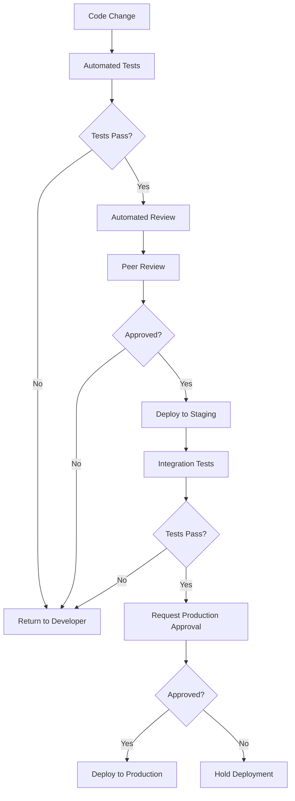

# CICD Change Management

## Introduction

Change management in the context of Continuous Integration and Continuous Deployment (CI/CD) refers to the process of controlling, tracking, and implementing changes to your codebase and infrastructure in a safe, efficient, and sustainable manner. As development teams embrace automation and rapid deployment cycles, proper change management becomes crucial to maintain system stability while fostering innovation.

In this guide, we'll explore how to implement effective change management practices within your CI/CD pipeline, helping you balance the need for speed with the requirements for stability and reliability.

## Why Change Management Matters in CI/CD

Traditional change management often involved lengthy approval processes and scheduled release windows. CI/CD introduces a paradigm shift with:

- Frequent, smaller changes instead of large, infrequent ones
- Automated testing and deployment replacing manual processes
- Faster feedback cycles for developers
- The potential for continuous delivery to production

Without proper change management, this acceleration can lead to:

- Unintended service disruptions
- Configuration drift
- Security vulnerabilities
- Compliance issues
- Difficulty tracking the source of problems

## Core Principles of CI/CD Change Management

### 1. Everything as Code

The foundation of effective CI/CD change management is treating everything as code:

- **Infrastructure as Code (IaC)**: Define your infrastructure using code (Terraform, CloudFormation, etc.)
- **Configuration as Code**: Manage application configurations with version control
- **Pipeline as Code**: Define your CI/CD pipelines in code (Jenkinsfile, GitHub Actions workflow files)

This approach ensures:
- Changes are tracked in version control
- Changes can be reviewed before implementation
- Changes can be tested before deployment
- Changes can be rolled back if needed

### 2. Automated Testing

Implement comprehensive automated testing to validate changes before they reach production:

```yaml
# Example GitHub Actions workflow segment for testing
name: Test and Validate
on: [push, pull_request]
jobs:
  test:
    runs-on: ubuntu-latest
    steps:
      - uses: actions/checkout@v3
      - name: Set up environment
        run: npm install
      - name: Run unit tests
        run: npm test
      - name: Run integration tests
        run: npm run test:integration
      - name: Run security scans
        run: npm run security-scan
```

### 3. Approval Workflows

Even in automated environments, human oversight remains important for critical changes:



## Implementing Change Management in Your CI/CD Pipeline

### Version Control Strategies

Adopt a version control strategy that supports your change management needs:

#### Git Flow

For teams that prefer structured releases:

```bash
# Create a feature branch
git checkout -b feature/new-login-page

# Make changes, commit them
git add .
git commit -m "Implement new login page design"

# Push to remote and create a pull request
git push origin feature/new-login-page

# After review and approval, merge to develop
git checkout develop
git merge feature/new-login-page

# Later, prepare a release
git checkout -b release/v1.2.0
# Run final tests, fix any issues

# When ready, merge to main and tag
git checkout main
git merge release/v1.2.0
git tag -a v1.2.0 -m "Version 1.2.0"
```

#### Trunk-Based Development

For teams emphasizing continuous deployment:

```bash
# Create a short-lived feature branch
git checkout -b feature/quick-fix

# Make changes, commit them
git add .
git commit -m "Fix login button alignment"

# Push and create a pull request
git push origin feature/quick-fix

# After automated tests and quick review, merge to main
# CI/CD pipeline automatically deploys the change
```

### Branch Protection Rules

Configure branch protection rules to enforce your change management policies:

- Require pull request reviews before merging
- Require status checks to pass before merging
- Require signed commits
- Restrict who can push to matching branches

### Deployment Strategies

Implement deployment strategies that minimize risk:

#### Blue-Green Deployments

Deploy the new version alongside the old one and switch traffic when ready:

```yaml
# Example Kubernetes manifest for blue-green deployment
apiVersion: apps/v1
kind: Deployment
metadata:
  name: myapp-green
spec:
  replicas: 3
  template:
    metadata:
      labels:
        app: myapp
        version: green
    spec:
      containers:
      - name: myapp
        image: myapp:2.0.0
---
# Service pointing to the current active deployment (blue)
apiVersion: v1
kind: Service
metadata:
  name: myapp
spec:
  selector:
    app: myapp
    version: blue
  ports:
  - port: 80
    targetPort: 8080
```

To switch traffic to the green deployment:

```bash
# Update the service selector to point to green
kubectl patch service myapp -p '{"spec":{"selector":{"version":"green"}}}'
```

#### Canary Releases

Gradually route traffic to the new version:

```yaml
# Example configuration for a canary release with Istio
apiVersion: networking.istio.io/v1alpha3
kind: VirtualService
metadata:
  name: myapp
spec:
  hosts:
  - myapp.example.com
  http:
  - route:
    - destination:
        host: myapp-v1
      weight: 90
    - destination:
        host: myapp-v2
      weight: 10
```

## Change Tracking and Auditing

Maintain clear records of all changes to support troubleshooting and compliance:

### Automated Changelog Generation

Generate changelogs automatically from commit messages:

```bash
# Using conventional commits and standard-version
npm install --save-dev standard-version
npx standard-version
```

Example output:

```markdown
# Changelog

## 1.1.0 (2023-04-15)

### Features

* add user profile page (a1b2c3d)
* implement multi-factor authentication (e5f6g7h)

### Bug Fixes

* fix memory leak in image processing (i9j0k1l)
* correct header alignment on mobile devices (m2n3o4p)
```

### Audit Logging

Implement comprehensive logging for all pipeline activities:

```javascript
// Example logging middleware for a Node.js application
const winston = require('winston');

const logger = winston.createLogger({
  level: 'info',
  format: winston.format.json(),
  defaultMeta: { service: 'user-service' },
  transports: [
    new winston.transports.File({ filename: 'error.log', level: 'error' }),
    new winston.transports.File({ filename: 'combined.log' }),
  ],
});

// For CI/CD changes
function logDeployment(version, environment, changedBy) {
  logger.info({
    message: 'Deployment completed',
    version,
    environment,
    changedBy,
    timestamp: new Date().toISOString()
  });
}

// Usage
logDeployment('v1.2.3', 'production', 'CI/CD Pipeline');
```

## Rollback Strategies

Always plan for failure by implementing reliable rollback mechanisms:

### Automated Rollbacks

Configure your pipeline to automatically roll back failed deployments:

```yaml
# Example CircleCI config with automated rollback
version: 2.1
jobs:
  deploy:
    steps:
      - checkout
      - run:
          name: Deploy to production
          command: ./deploy.sh
      - run:
          name: Health check
          command: ./health_check.sh
          # If health check fails, trigger rollback
          when: on_fail
      - run:
          name: Rollback on failure
          command: ./rollback.sh
          when: on_fail
```

### Database Changes

Handle database migrations with special care:

```javascript
// Example database migration with rollback capability
module.exports = {
  up: async (queryInterface, Sequelize) => {
    await queryInterface.createTable('users', {
      id: {
        type: Sequelize.INTEGER,
        primaryKey: true,
        autoIncrement: true
      },
      name: {
        type: Sequelize.STRING,
        allowNull: false
      },
      email: {
        type: Sequelize.STRING,
        unique: true
      },
      created_at: Sequelize.DATE,
      updated_at: Sequelize.DATE
    });
  },
  down: async (queryInterface) => {
    // Rollback operation
    await queryInterface.dropTable('users');
  }
};
```

## Communication and Notifications

Keep all stakeholders informed about changes:

```javascript
// Example Slack notification from CI/CD pipeline
const axios = require('axios');

async function notifySlack(message, channel) {
  await axios.post('https://hooks.slack.com/services/YOUR_WEBHOOK_URL', {
    channel,
    username: 'Deployment Bot',
    text: message,
    icon_emoji: ':rocket:'
  });
}

// Usage
notifySlack('🚀 v1.2.3 has been deployed to production successfully', '#deployments');
```

## Real-World Change Management Workflow

Let's walk through a complete example of a change management workflow in a CI/CD environment:

### 1. Change Request

The process begins with a change request, typically in the form of a ticket or issue:

```markdown
Issue #245: Implement password strength meter

Priority: Medium
Description: Add a visual password strength meter to the signup form to help users create stronger passwords.
Acceptance Criteria:
- Show real-time feedback as the user types their password
- Use color coding (red/yellow/green) to indicate strength
- Provide text suggestions for improvement
```

### 2. Development

A developer implements the change in a feature branch:

```bash
git checkout -b feature/245-password-strength-meter
```

```javascript
// Implementation of password strength meter
function checkPasswordStrength(password) {
  let strength = 0;
  
  // Length check
  if (password.length >= 8) strength += 1;
  if (password.length >= 12) strength += 1;
  
  // Complexity checks
  if (/[0-9]/.test(password)) strength += 1;  // Has number
  if (/[a-z]/.test(password)) strength += 1;  // Has lowercase
  if (/[A-Z]/.test(password)) strength += 1;  // Has uppercase
  if (/[^A-Za-z0-9]/.test(password)) strength += 1;  // Has special char
  
  // Return result
  if (strength < 3) return { score: 1, label: 'Weak', color: 'red' };
  if (strength < 5) return { score: 2, label: 'Moderate', color: 'yellow' };
  return { score: 3, label: 'Strong', color: 'green' };
}
```

### 3. Automated Testing

The developer commits and pushes the changes, triggering automated tests:

```bash
git add .
git commit -m "feat: implement password strength meter"
git push origin feature/245-password-strength-meter
```

The CI/CD pipeline runs:
- Unit tests
- Integration tests
- UI tests
- Security scanning
- Performance testing

### 4. Code Review

After tests pass, other team members review the code:

```diff
+ function checkPasswordStrength(password) {
+   let strength = 0;
+   
+   // Length check
+   if (password.length >= 8) strength += 1;
+   if (password.length >= 12) strength += 1;
+   
+   // Complexity checks
+   if (/[0-9]/.test(password)) strength += 1;  // Has number
+   if (/[a-z]/.test(password)) strength += 1;  // Has lowercase
+   if (/[A-Z]/.test(password)) strength += 1;  // Has uppercase
+   if (/[^A-Za-z0-9]/.test(password)) strength += 1;  // Has special char
+   
+   // Return result
+   if (strength < 3) return { score: 1, label: 'Weak', color: 'red' };
+   if (strength < 5) return { score: 2, label: 'Moderate', color: 'yellow' };
+   return { score: 3, label: 'Strong', color: 'green' };
+ }
```

Reviewer: "Looks good! Consider adding a check for common passwords."

### 5. Approval and Staging Deployment

After addressing feedback and receiving approval, the changes merge to the development branch and deploy to staging:

```bash
git checkout develop
git merge feature/245-password-strength-meter
```

The CI/CD pipeline automatically:
- Builds the application
- Deploys to a staging environment
- Runs end-to-end tests

### 6. User Acceptance Testing

Stakeholders test the feature in the staging environment:

```markdown
UAT Feedback:
- Password meter works correctly
- Strength indicator is clear
- Suggestion: Add more specific feedback for each improvement area
```

### 7. Production Deployment

After UAT approval, the changes go through a final review and deploy to production:

```yaml
# Production deployment approval step
approval:
  type: manual
  required: true
  approvers:
    - security-team
    - product-owner
```

The deployment uses a canary strategy:
1. Deploy to 10% of servers
2. Monitor for errors
3. If stable, gradually increase to 100%

### 8. Post-Deployment Verification

After deployment, automated tests run against the production environment to verify functionality:

```bash
# Automated smoke test
curl -s https://example.com/health | grep -q "status:ok" && echo "Health check passed" || echo "Health check failed"
```

### 9. Documentation and Communication

The change is documented and communicated to all stakeholders:

```markdown
## Release Notes: v1.5.2

### New Features
- Password strength meter added to signup form
  - Provides real-time feedback on password strength
  - Offers suggestions for creating stronger passwords
  - Uses color-coding for visual feedback

### How to Use
When creating a password, the strength meter will appear below the password field, indicating the current strength level and providing guidance on improvement.
```

## Best Practices for CI/CD Change Management

### 1. Start Small and Iterate

Begin with simple changes and gradually increase complexity as your team gains confidence in the process.

### 2. Standardize Change Processes

Create templates for:
- Change requests
- Pull requests
- Deployment plans
- Rollback procedures

### 3. Automate Everything Possible

The more you automate, the less room for human error:
- Testing
- Code quality checks
- Security scanning
- Deployment validation
- Documentation generation

### 4. Monitor and Measure

Implement comprehensive monitoring to detect issues quickly:

```javascript
// Example Prometheus metrics in Node.js
const client = require('prom-client');
const deploymentCounter = new client.Counter({
  name: 'app_deployments_total',
  help: 'Total number of deployments',
  labelNames: ['environment', 'result']
});

function recordDeployment(environment, successful) {
  deploymentCounter.inc({
    environment,
    result: successful ? 'success' : 'failure'
  });
}

// Track key metrics
recordDeployment('production', true);
```

### 5. Continuous Improvement

Regularly review and refine your change management process:
- Conduct post-mortems after incidents
- Track metrics like deployment frequency and failure rate
- Gather feedback from team members and stakeholders

## Summary

Effective CI/CD change management balances the need for speed with the requirements for stability and reliability. By implementing proper controls, automation, and communication channels, you can build a process that allows for rapid innovation while minimizing risks.

The key elements of a successful CI/CD change management approach include:

- Everything as code for traceability and version control
- Comprehensive automated testing to catch issues early
- Appropriate approval workflows for critical changes
- Safe deployment strategies like blue-green and canary releases
- Reliable rollback mechanisms for when things go wrong
- Clear communication channels for all stakeholders

As you implement these practices, remember that CI/CD change management is not about adding bureaucracy—it's about creating a framework that enables your team to move faster with confidence.

## Additional Resources

- **Learn More**:
  - The book "Accelerate" by Nicole Forsgren, Jez Humble, and Gene Kim
  - The "DevOps Handbook" by Gene Kim, Patrick Debois, John Willis, and Jez Humble

- **Practice Exercises**:
  1. Implement a basic CI/CD pipeline with built-in change management controls
  2. Create a rollback plan for your current application
  3. Design a canary deployment strategy for a feature release
  4. Implement automated changelog generation in your project

- **Tools to Explore**:
  - GitLab CI/CD
  - GitHub Actions
  - Jenkins
  - CircleCI
  - ArgoCD
  - Spinnaker