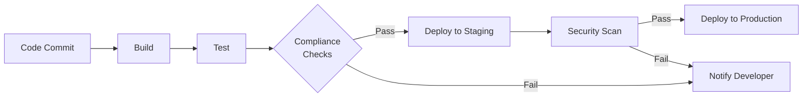

# CI/CD Compliance

## Introduction

Continuous Integration and Continuous Delivery (CI/CD) has revolutionized how software is built and deployed. However, as organizations adopt these practices, they must also ensure their automated pipelines meet various compliance requirements. CI/CD compliance refers to integrating regulatory, security, and organizational standards directly into your development and deployment workflows.

In this guide, we'll explore how to build compliant CI/CD pipelines that satisfy security requirements while maintaining the speed and efficiency benefits of automation.

## Why CI/CD Compliance Matters

For beginners, it might seem like compliance is something only large enterprises need to worry about. However, understanding compliance early in your development journey helps build good habits and prepares you for professional environments.

Compliance in CI/CD serves several critical purposes:

- **Security**: Prevents vulnerabilities from reaching production
- **Regulatory Requirements**: Meets industry-specific regulations (HIPAA, GDPR, SOC2, etc.)
- **Consistency**: Ensures all code meets the same quality standards
- **Auditability**: Creates records of who changed what and when

## Key Components of CI/CD Compliance

### 1. Code Scanning and Security Testing

The first step in a compliant CI/CD pipeline is automated security testing. This involves scanning your code for vulnerabilities, potential bugs, and compliance issues.

```yaml
# Example GitHub Actions workflow with security scanning
name: Security Scan

on:
  push:
    branches: [ main ]
  pull_request:
    branches: [ main ]

jobs:
  security-scan:
    runs-on: ubuntu-latest
    steps:
      - uses: actions/checkout@v3
      
      - name: Run SAST scan
        uses: github/codeql-action/analyze@v2
        with:
          languages: javascript, python
      
      - name: Run dependency check
        run: |
          npm install
          npm audit
```

This workflow automatically scans your code for security vulnerabilities whenever code is pushed to the main branch or a pull request is created.

### 2. Policy as Code

Modern compliance approaches use "policy as code" - defining compliance rules in machine-readable formats that can be version-controlled and automatically enforced.

For example, using Open Policy Agent (OPA):

```yaml
# Example OPA policy for Kubernetes deployments
package kubernetes.admission

deny[msg] {
  input.request.kind.kind == "Deployment"
  not input.request.object.spec.template.spec.securityContext.runAsNonRoot
  
  msg := "Containers must not run as root"
}
```

This policy prevents Kubernetes deployments that attempt to run containers as the root user, enforcing a security best practice.

### 3. Compliance Checks in CI/CD Pipelines

Let's look at how compliance checks can be integrated into various stages of your pipeline:



### 4. Automated Compliance Reports

Generate compliance reports automatically as part of your pipeline:

```python
# Example Python script to generate a compliance report
import json
import datetime

def generate_compliance_report(scan_results, test_results, dependencies):
    report = {
        "timestamp": datetime.datetime.now().isoformat(),
        "scan_summary": {
            "vulnerabilities_found": len(scan_results.get("vulnerabilities", [])),
            "security_score": scan_results.get("score", 0)
        },
        "test_coverage": test_results.get("coverage", 0),
        "dependency_compliance": {
            "total": len(dependencies),
            "compliant": len([d for d in dependencies if d.get("compliant")])
        },
        "overall_status": "PASS" if (
            scan_results.get("score", 0) > 80 and
            test_results.get("coverage", 0) > 75 and
            len([d for d in dependencies if d.get("compliant")]) == len(dependencies)
        ) else "FAIL"
    }
    
    with open("compliance_report.json", "w") as f:
        json.dump(report, f, indent=2)
    
    return report["overall_status"] == "PASS"
```

This script creates a standardized report that can be stored for audit purposes.

## Real-World Implementation Examples

### Example 1: Banking Application CI/CD Pipeline

For a banking application where security and regulatory compliance are critical:

```yaml
# GitLab CI configuration with compliance checks
stages:
  - build
  - test
  - compliance
  - deploy

build:
  stage: build
  script:
    - npm install
    - npm run build
  artifacts:
    paths:
      - dist/

test:
  stage: test
  script:
    - npm run test
    - npm run test:coverage
  artifacts:
    paths:
      - coverage/

compliance:
  stage: compliance
  script:
    - npm run lint
    - npm audit
    - ./scripts/check_licenses.sh
    - ./scripts/run_security_scan.sh
    - ./scripts/check_pii_data.sh
  artifacts:
    paths:
      - compliance-report.json

deploy-production:
  stage: deploy
  script:
    - ./scripts/deploy.sh
  rules:
    - if: $CI_COMMIT_BRANCH == "main" && $COMPLIANCE_CHECK_PASSED == "true"
  environment:
    name: production
```

This pipeline ensures that:
1. Code is properly tested
2. Security vulnerabilities are identified
3. License compliance is verified
4. No personally identifiable information (PII) is accidentally committed
5. Deployment only happens if all compliance checks pass

### Example 2: Healthcare Application with HIPAA Compliance

For a healthcare application that must comply with HIPAA:

```yaml
# Jenkins pipeline with HIPAA compliance
pipeline {
    agent any
    
    stages {
        stage('Build') {
            steps {
                sh 'npm install'
                sh 'npm run build'
            }
        }
        
        stage('Test') {
            steps {
                sh 'npm test'
            }
        }
        
        stage('HIPAA Compliance') {
            steps {
                sh 'npm run scan:phi-data'
                sh 'npm run check:encryption'
                sh 'npm run verify:access-controls'
                sh 'npm run audit:data-flows'
            }
            post {
                always {
                    archiveArtifacts artifacts: 'hipaa-compliance-report.json'
                }
            }
        }
        
        stage('Security Scan') {
            steps {
                sh 'npm audit'
                sh './security/run_owasp_zap.sh'
            }
        }
        
        stage('Deploy') {
            when {
                expression {
                    return env.BRANCH_NAME == 'main' && currentBuild.resultIsBetterOrEqualTo('SUCCESS')
                }
            }
            steps {
                sh './deploy.sh'
            }
        }
    }
    
    post {
        always {
            junit 'test-results/*.xml'
        }
    }
}
```

This pipeline implements specific checks for Protected Health Information (PHI), encryption standards, and access controls required by HIPAA.

## Implementing Compliance for Beginners

If you're just starting out, here's how to approach CI/CD compliance:

### 1. Start with Basic Security Practices

Begin with fundamental security checks:

```yaml
# Simple GitHub Actions workflow with basic security
name: Basic Security Checks

on: [push, pull_request]

jobs:
  security:
    runs-on: ubuntu-latest
    steps:
      - uses: actions/checkout@v3
      
      - name: Setup Node.js
        uses: actions/setup-node@v3
        with:
          node-version: '16'
      
      - name: Install dependencies
        run: npm install
      
      - name: Run security audit
        run: npm audit
      
      - name: Run linting
        run: npm run lint
```

### 2. Implement Code Reviews as a Compliance Measure

Code reviews are a simple but effective compliance tool:

```yaml
# GitHub branch protection rules (configured through UI)
# - Require pull request reviews before merging
# - Require status checks to pass before merging
# - Require signed commits
```

### 3. Document Your Compliance Process

Create a simple `COMPLIANCE.md` file in your repository:

```markdown
# Project Compliance Guidelines

## Code Standards
- All code must pass linting with `npm run lint`
- Test coverage must be at least 80%
- No secrets or credentials in code

## Security Requirements
- Dependencies must be updated monthly
- Security scans must pass before deployment
- All APIs must implement proper authentication

## Review Process
- All changes require at least one review
- Security-related changes require two reviews
```

## Best Practices for CI/CD Compliance

1. **Shift Left**: Move compliance checks earlier in your development process
2. **Automate Everything**: Manual compliance checks are error-prone
3. **Fail Fast**: Configure pipelines to fail immediately on compliance issues
4. **Generate Evidence**: Store compliance artifacts for future audits
5. **Continuous Improvement**: Regularly update your compliance checks

## Addressing Compliance Failures

When your pipeline fails due to compliance issues:

1. **Review the Logs**: Understand exactly what failed
2. **Fix at the Source**: Address the root cause, not just the symptom
3. **Update Documentation**: If necessary, update your compliance guidelines
4. **Improve Tests**: Add tests to prevent similar issues in the future

Example of handling a dependency vulnerability:

```bash
# Example commands to fix a dependency vulnerability
# 1. Identify the issue
npm audit

# 2. Fix the vulnerability
npm audit fix

# 3. If a direct fix isn't possible, update the specific package
npm update vulnerable-package

# 4. If update isn't possible, evaluate alternatives
npm uninstall vulnerable-package
npm install safe-alternative
```

## Summary

CI/CD compliance is about building security and regulatory requirements directly into your automated pipelines. By implementing compliance as code, you ensure that:

- Security is consistently enforced
- Regulatory requirements are met automatically
- Development speed is maintained while improving quality
- Audit trails are created for verification

As you grow as a developer, these practices will become second nature and prepare you for working in enterprise environments with strict compliance requirements.

## Additional Resources

- [OWASP DevSecOps Guideline](https://owasp.org/www-project-devsecops-guideline/)
- [NIST Application Security Verification Standard](https://nvlpubs.nist.gov/nistpubs/SpecialPublications/NIST.SP.800-53r5.pdf)
- Interactive Course: [Building Secure CI/CD Pipelines](https://www.edx.org/course/devsecops-implementing-security-in-devops)

## Practice Exercises

1. Set up a basic GitHub Actions workflow with security scanning for a sample project
2. Implement a pre-commit hook that checks for secrets or credentials in code
3. Create a compliance report template for your projects
4. Design a CI/CD pipeline with at least three different compliance checks
5. Implement a "policy as code" solution using Open Policy Agent or a similar tool