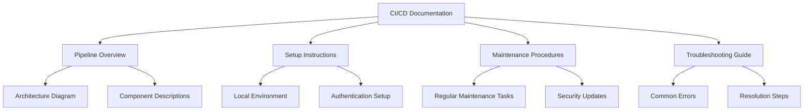

# CI/CD Maintenance

## Introduction

Continuous Integration and Continuous Deployment (CI/CD) pipelines are powerful tools that automate the process of building, testing, and deploying software. However, like any system, they require regular maintenance to ensure they continue functioning efficiently and securely. This guide will walk you through the essential practices for maintaining your CI/CD pipelines, helping you avoid common pitfalls and ensuring your development workflow remains smooth and productive.

Think of your CI/CD pipeline as a car – even the most well-designed vehicle needs regular oil changes, tire rotations, and inspections to keep running at its best. Similarly, your CI/CD pipelines need consistent attention to prevent them from becoming outdated, insecure, or inefficient.

## Why CI/CD Maintenance Matters

Before diving into maintenance techniques, let's understand why regular upkeep of your CI/CD pipelines is crucial:

1. **Pipeline Health**: Ensures your builds remain reliable and don't suddenly break
2. **Security**: Protects against vulnerabilities in your pipeline tools and dependencies
3. **Performance**: Maintains efficient build times and resource usage
4. **Cost Control**: Prevents unnecessary expenses from idle or inefficient resources
5. **Developer Experience**: Keeps the development team productive and focused

## Essential CI/CD Maintenance Tasks

### 1. Regular Monitoring and Logging

Monitoring is your first line of defense against CI/CD pipeline issues.

#### Setting Up Basic Monitoring

```yaml
# Example monitoring configuration for GitHub Actions
name: Pipeline Monitoring

on:
  schedule:
    - cron: '0 */6 * * *'  # Runs every 6 hours

jobs:
  monitor:
    runs-on: ubuntu-latest
    steps:
      - name: Check pipeline health
        run: |
          curl -s https://api.github.com/repos/yourorg/yourrepo/actions/runs?status=completed | \
          jq '.workflow_runs | map(select(.conclusion != "success")) | length'
      
      - name: Send alert if failures exceed threshold
        if: ${{ steps.check.outputs.failed_count > 3 }}
        uses: some-notification-action@v1
        with:
          message: "CI/CD pipeline alert: Multiple failures detected"
```

#### Key Metrics to Track

- **Build Success Rate**: The percentage of successful builds over time
- **Build Duration**: How long your builds take to complete
- **Test Coverage**: The percentage of code covered by automated tests
- **Resource Utilization**: CPU, memory, and network usage during builds
- **Deployment Frequency**: How often code is deployed to production

Implementing proper logging helps troubleshoot issues when they arise:

```bash
# Example bash function to add to your scripts for better logging
function log_with_timestamp() {
  echo "[$(date '+%Y-%m-%d %H:%M:%S')] $1"
}

log_with_timestamp "Starting build process"
# Build commands here
log_with_timestamp "Build completed with status: $?"
```

### 2. Dependency Management

Outdated dependencies can lead to security vulnerabilities, compatibility issues, and missed feature improvements.

#### Automated Dependency Updates

Tools like Dependabot, Renovate, or Snyk can automatically create pull requests when dependencies need updating:

```yaml
# Example Dependabot configuration (.github/dependabot.yml)
version: 2
updates:
  - package-ecosystem: "npm"
    directory: "/"
    schedule:
      interval: "weekly"
    open-pull-requests-limit: 5
    
  - package-ecosystem: "docker"
    directory: "/"
    schedule:
      interval: "weekly"
```

#### Version Pinning Strategy

It's important to balance between staying updated and maintaining stability:

```json
// Example package.json with strategic version pinning
{
  "dependencies": {
    "express": "^4.18.2",     // Accepts minor updates (stability + security fixes)
    "lodash": "4.17.21",      // Pinned exactly (critical dependency)
    "debug": "~4.3.4"         // Accepts patch updates only (security fixes)
  }
}
```

### 3. Pipeline Configuration Reviews

Regularly reviewing your pipeline configuration helps identify inefficiencies and improvement opportunities.

#### Configuration Audit Checklist

1. Are there unnecessary steps that could be removed?
2. Could any steps be parallelized to improve build times?
3. Are you caching dependencies and build artifacts effectively?
4. Is the pipeline triggering on the appropriate events?
5. Are there any hardcoded secrets or credentials that should be moved to a secure store?

#### Optimized Pipeline Example

```yaml
# Before optimization
name: Build and Test
on: [push]
jobs:
  build:
    runs-on: ubuntu-latest
    steps:
      - uses: actions/checkout@v3
      - name: Install dependencies
        run: npm install
      - name: Run linter
        run: npm run lint
      - name: Run tests
        run: npm test
      - name: Build
        run: npm run build
```

```yaml
# After optimization
name: Build and Test
on:
  push:
    paths-ignore:
      - '**.md'
      - 'docs/**'
jobs:
  build:
    runs-on: ubuntu-latest
    steps:
      - uses: actions/checkout@v3
      
      - name: Cache dependencies
        uses: actions/cache@v3
        with:
          path: ~/.npm
          key: npm-${{ hashFiles('**/package-lock.json') }}
          
      - name: Install dependencies
        run: npm ci
        
      - name: Parallel tasks
        run: |
          npm run lint &
          npm test &
          wait
          
      - name: Build
        run: npm run build
```

### 4. Security Maintenance

Security should be a continuous concern in your CI/CD pipeline maintenance.

#### Secret Management

Never hardcode secrets in your pipeline configuration:

```yaml
# Bad practice - Don't do this!
steps:
  - name: Deploy
    run: |
      API_KEY="sk_live_123456789abcdef"
      curl -H "Authorization: Bearer $API_KEY" https://api.example.com/deploy
```

```yaml
# Good practice - Use secret management
steps:
  - name: Deploy
    run: |
      curl -H "Authorization: Bearer ${{ secrets.API_KEY }}" https://api.example.com/deploy
```

#### Security Scanning

Integrate security scanning into your pipeline:

```yaml
name: Security Scan
on: [push, pull_request]
jobs:
  security:
    runs-on: ubuntu-latest
    steps:
      - uses: actions/checkout@v3
      
      - name: Run SAST scan
        uses: some-security-scanner@v1
        
      - name: Check dependencies for vulnerabilities
        run: npm audit
        
      - name: Run container scan
        uses: docker-container-scanner@v2
        with:
          image: 'myapp:latest'
```

### 5. Documentation and Knowledge Sharing

Document your CI/CD pipeline to ensure the entire team can maintain it.



### 6. Build Artifact Management

Managing build artifacts properly prevents storage bloat and ensures you can access historical builds when needed.

#### Artifact Retention Policy

```yaml
# Example artifact retention in GitHub Actions
- name: Upload build artifact
  uses: actions/upload-artifact@v3
  with:
    name: build-output
    path: dist/
    retention-days: 14  # Only keep for 2 weeks
```

#### Automated Cleanup

```bash
#!/bin/bash
# Example cleanup script for Jenkins

# Delete artifacts older than 30 days
find /var/jenkins_home/jobs -name "*.zip" -type f -mtime +30 -delete

# Log the cleanup
echo "Cleanup completed on $(date)" >> /var/log/jenkins/cleanup.log
```

## Implementing a Maintenance Schedule

Creating a regular maintenance schedule helps ensure your CI/CD pipelines receive consistent attention:

| Frequency | Maintenance Task |
|-----------|------------------|
| Daily     | Review pipeline logs for errors |
| Weekly    | Check for failed builds and address issues |
| Monthly   | Update dependencies with security patches |
| Quarterly | Perform complete pipeline review and optimization |
| Bi-annually | Review and update pipeline documentation |
| Annually  | Conduct a full security audit |

## Maintenance Automation

The best maintenance is automated maintenance. Here's how to set up a CI/CD pipeline for your CI/CD pipeline:

```yaml
# Meta-pipeline for CI/CD maintenance
name: CI/CD Maintenance

on:
  schedule:
    - cron: '0 0 * * 1'  # Weekly on Monday

jobs:
  maintain:
    runs-on: ubuntu-latest
    steps:
      - uses: actions/checkout@v3
      
      - name: Validate pipeline configurations
        run: |
          # Tool to validate your CI/CD configuration files
          npx yaml-validator .github/workflows/*.yml
      
      - name: Check for outdated actions
        run: |
          # Script to check for outdated GitHub Actions
          ./scripts/check-actions-versions.sh
          
      - name: Test pipeline performance
        run: |
          # Measure how long key workflows take
          ./scripts/measure-workflow-durations.sh
          
      - name: Generate maintenance report
        run: |
          # Create a report of maintenance findings
          ./scripts/generate-maintenance-report.sh
          
      - name: Send report to team
        uses: some-notification-action@v1
        with:
          channel: "#devops"
          message: "Weekly CI/CD maintenance report"
          attachment: "./maintenance-report.md"
```

## Troubleshooting Common Maintenance Issues

### Build Failures After Dependency Updates

When dependencies update, compatibility issues may arise. Create a process for safely updating dependencies:

```bash
# Example script to test dependency updates
#!/bin/bash

# Create a temporary branch
git checkout -b test-dependency-update

# Update dependencies
npm update

# Run tests
npm test

# If tests pass, create a PR
if [ $? -eq 0 ]; then
  git commit -am "Update dependencies"
  git push origin test-dependency-update
  # Create PR using GitHub CLI
  gh pr create --title "Update dependencies" --body "Automatically tested dependency updates"
else
  echo "Tests failed after dependency update"
  git checkout main
  git branch -D test-dependency-update
fi
```

### Slow Pipeline Performance

If your pipelines are getting slower, consider:

1. Implementing better caching:

```yaml
- name: Cache node modules
  uses: actions/cache@v3
  with:
    path: node_modules
    key: ${{ runner.os }}-node-${{ hashFiles('**/package-lock.json') }}
    restore-keys: |
      ${{ runner.os }}-node-
```

2. Running tests in parallel:

```yaml
- name: Run tests in parallel
  run: npx jest --maxWorkers=4
```

3. Using more powerful runners:

```yaml
jobs:
  build:
    # Use a more powerful runner for intensive tasks
    runs-on: ubuntu-latest-16-core
```

## Summary

Effective CI/CD maintenance is crucial for ensuring your development pipeline remains efficient, secure, and reliable. By implementing regular monitoring, dependency updates, configuration reviews, security practices, documentation, and artifact management, you can prevent many common issues before they impact your team's productivity.

Remember that the goal of CI/CD is to make development more efficient – if your maintenance processes are becoming burdensome, look for ways to automate them further. The best CI/CD pipelines are those that quietly do their job without requiring constant attention.

## Additional Resources

- [GitHub Actions Documentation](https://docs.github.com/en/actions)
- [Jenkins Handbook](https://www.jenkins.io/doc/book/)
- [GitLab CI/CD Documentation](https://docs.gitlab.com/ee/ci/)
- [CircleCI Documentation](https://circleci.com/docs/)

## Exercises

1. **Audit Your Pipeline**: Review your current CI/CD pipeline configuration and identify at least three areas for improvement.
2. **Create a Monitoring Dashboard**: Set up a simple dashboard to track your key CI/CD metrics.
3. **Automate Dependency Updates**: Configure a tool like Dependabot for one of your projects.
4. **Document Your Pipeline**: Create documentation that would allow a new team member to understand your CI/CD process.
5. **Security Check**: Run a security scan on your CI/CD configuration and address any issues found.