# CICD Pipeline Security

## Introduction

CI/CD (Continuous Integration and Continuous Deployment) pipelines have revolutionized how we build, test, and deploy software. However, as these pipelines automate the journey from code to production, they also introduce potential security risks. A vulnerable CI/CD pipeline can compromise your entire software supply chain, giving attackers access to sensitive credentials, code, or even production environments.

This guide will walk you through the essential security considerations for your CI/CD pipelines, helping you build a secure automated delivery process that protects your code at every stage.

## Why CI/CD Pipeline Security Matters

CI/CD pipelines typically have:

- Access to source code repositories
- Permissions to deploy to production environments
- Access to sensitive credentials and secrets
- Ability to modify application artifacts

Without proper security measures, attackers could:

- Inject malicious code
- Steal sensitive credentials
- Deploy unauthorized changes
- Compromise production environments

## Securing Your CI/CD Pipeline: A Step-by-Step Approach

Let's explore the key security measures for your CI/CD pipeline:

### 1. Secure Access Controls

#### Implement the Principle of Least Privilege

Only grant the minimum permissions necessary for each component of your pipeline.

```yaml
# Example: GitHub Actions workflow with scoped permissions
name: Build and Deploy

permissions:
  contents: read
  packages: write
  deployments: write
  # Only request permissions actually needed
```

#### Use Strong Authentication

Implement strong authentication for accessing your CI/CD systems:

- Require multi-factor authentication (MFA)
- Use token-based authentication with limited scopes
- Implement IP restrictions when possible

### 2. Secrets Management

Never hardcode secrets in your pipeline configuration files or source code.

```yaml
# DON'T do this ❌
steps:
  - name: Deploy to production
    run: |
      API_KEY="s3cr3t-k3y-v4lu3" 
      deploy-script.sh
```

Instead, use your CI/CD platform's secrets management:

```yaml
# DO this ✅
steps:
  - name: Deploy to production
    run: deploy-script.sh
    env:
      API_KEY: ${{ secrets.API_KEY }}
```

Consider using specialized secret management tools:

- HashiCorp Vault
- AWS Secrets Manager
- Azure Key Vault
- Google Secret Manager

### 3. Secure Your Build Environment

#### Isolated Build Environments

Use isolated, ephemeral environments for your builds:

- Containerized builds (Docker)
- Clean environments for each build
- Regular rebuilds of base build images

#### Example: Dockerfile for a Secure Build Environment

```dockerfile
FROM ubuntu:22.04

# Update and install minimal required packages
RUN apt-get update && \
    apt-get install -y --no-install-recommends \
    build-essential \
    curl \
    git \
    && rm -rf /var/lib/apt/lists/*

# Create non-root user to run builds
RUN useradd -m builder
USER builder

WORKDIR /home/builder

# Entry point script that cleans environment after build
COPY --chown=builder:builder clean-env.sh /usr/local/bin/
ENTRYPOINT ["/usr/local/bin/clean-env.sh"]
```

### 4. Implement Pipeline Integrity Checks

#### Code Signing

Sign your artifacts to ensure they haven't been tampered with:

```bash
# Example: Signing a container image with cosign
cosign sign --key cosign.key myregistry.io/myapp:1.0.0

# Example: Verifying the signature
cosign verify --key cosign.pub myregistry.io/myapp:1.0.0
```

#### Software Bill of Materials (SBOM)

Generate and verify SBOMs to track dependencies:

```bash
# Example: Generating SBOM with Syft
syft myapp:1.0.0 -o json > sbom.json

# Verify SBOM matches expected dependencies
sbom-validator verify sbom.json
```

### 5. Security Scanning in Your Pipeline

Integrate automated security tools into your pipeline:

#### Static Application Security Testing (SAST)

```yaml
# Example: Adding SAST scanning in GitHub Actions
name: Security Scan

on: [push, pull_request]

jobs:
  security-scan:
    runs-on: ubuntu-latest
    steps:
      - uses: actions/checkout@v3
      
      - name: Run SAST scan
        uses: github/codeql-action/analyze@v2
        with:
          languages: javascript, python
```

#### Container Image Scanning

```yaml
# Example: Scanning container images with Trivy in GitLab CI
container_scanning:
  stage: test
  image: 
    name: aquasec/trivy:latest
    entrypoint: [""]
  script:
    - trivy image $CI_REGISTRY_IMAGE:$CI_COMMIT_SHA
  artifacts:
    reports:
      container_scanning: gl-container-scanning-report.json
```

#### Dependency Scanning

```yaml
# Example: Scanning dependencies with OWASP Dependency-Check
dependency_check:
  stage: test
  script:
    - /usr/share/dependency-check/bin/dependency-check.sh --project "My Project" --scan . --format XML --out odc-report.xml
  artifacts:
    paths: 
      - odc-report.xml
```

### 6. Infrastructure as Code (IaC) Security

Secure your infrastructure definitions:

```yaml
# Example: Scanning Terraform code with tfsec in GitHub Actions
name: Terraform Security Scan

jobs:
  tfsec:
    runs-on: ubuntu-latest
    steps:
      - uses: actions/checkout@v3
      - name: Run tfsec
        uses: aquasecurity/tfsec-action@v1.0.0
        with:
          soft_fail: true
```

### 7. CI/CD Pipeline Visualization

Let's visualize a secure CI/CD pipeline:

```mermaid
graph LR
    A[Developer Commit] --> B[Source Control]
    B --> C[CI/CD Trigger]
    C --> D[Secret Management]
    D --> E[Secure Build Environment]
    E --> F[Code Analysis/SAST]
    F --> G[Build]
    G --> H[Container Scan]
    H --> I[Sign Artifacts]
    I --> J[Generate SBOM]
    J --> K[Deploy to Testing]
    K --> L[Dynamic/Pen Testing]
    L --> M[Deploy to Production]
    
    style D fill:#f9f,stroke:#333,stroke-width:2px
    style F fill:#bbf,stroke:#333,stroke-width:2px
    style H fill:#bbf,stroke:#333,stroke-width:2px
    style I fill:#f9f,stroke:#333,stroke-width:2px
    style L fill:#bbf,stroke:#333,stroke-width:2px
```



## Real-World Example: Securing a Web Application Pipeline

Let's walk through a complete example of a secure pipeline for a Node.js web application:

### Step 1: Secure Repository Configuration

Implement branch protection rules in your repository:

- Require pull request reviews
- Require status checks to pass
- Require signed commits

### Step 2: Secure Pipeline Configuration

```yaml
# Example: GitHub Actions workflow with security measures
name: Secure CI/CD Pipeline

on:
  push:
    branches: [ main ]
  pull_request:
    branches: [ main ]

permissions:
  contents: read
  security-events: write
  packages: write

jobs:
  security-scan:
    runs-on: ubuntu-latest
    steps:
      - uses: actions/checkout@v3
      
      # Secret scanning
      - name: Detect hardcoded secrets
        uses: gitleaks/gitleaks-action@v2
      
      # SAST scanning
      - name: Run ESLint
        run: |
          npm ci
          npm run lint
      
      # Dependency scanning
      - name: Run npm audit
        run: npm audit --production
  
  build:
    needs: security-scan
    runs-on: ubuntu-latest
    steps:
      - uses: actions/checkout@v3
      
      - name: Set up Node.js
        uses: actions/setup-node@v3
        with:
          node-version: '18'
          cache: 'npm'
      
      - name: Install dependencies
        run: npm ci
      
      - name: Run tests
        run: npm test
      
      - name: Build application
        run: npm run build
      
      - name: Build container
        uses: docker/build-push-action@v4
        with:
          context: .
          push: false
          tags: myapp:${{ github.sha }}
          
      - name: Scan container for vulnerabilities
        uses: aquasecurity/trivy-action@master
        with:
          image-ref: myapp:${{ github.sha }}
          format: 'sarif'
          output: 'trivy-results.sarif'
      
      - name: Sign container image
        uses: sigstore/cosign-installer@main
        
      - name: Login to container registry
        uses: docker/login-action@v2
        with:
          registry: ghcr.io
          username: ${{ github.actor }}
          password: ${{ secrets.GITHUB_TOKEN }}
      
      - name: Push and sign container
        run: |
          docker tag myapp:${{ github.sha }} ghcr.io/${{ github.repository }}/myapp:${{ github.sha }}
          docker push ghcr.io/${{ github.repository }}/myapp:${{ github.sha }}
          cosign sign --key ${{ secrets.COSIGN_KEY }} ghcr.io/${{ github.repository }}/myapp:${{ github.sha }}
  
  deploy:
    needs: build
    if: github.ref == 'refs/heads/main'
    runs-on: ubuntu-latest
    environment: production
    steps:
      - name: Deploy to production
        run: |
          # Deploy using a secure token with minimal permissions
          curl -X POST ${{ secrets.DEPLOYMENT_WEBHOOK_URL }} \
            -H "Authorization: Bearer ${{ secrets.DEPLOYMENT_TOKEN }}" \
            -d '{"image": "ghcr.io/${{ github.repository }}/myapp:${{ github.sha }}"}'
```

## Best Practices Checklist

Use this checklist to ensure your CI/CD pipeline is secure:

- [ ] Implement least privilege access controls
- [ ] Use a secure secrets management solution
- [ ] Run builds in isolated, ephemeral environments
- [ ] Sign all artifacts and verify signatures during deployment
- [ ] Generate and validate Software Bill of Materials (SBOM)
- [ ] Implement multiple security scanning tools (SAST, DAST, container scanning)
- [ ] Validate infrastructure as code
- [ ] Implement branch protection rules
- [ ] Regularly audit and rotate credentials
- [ ] Update base images and dependencies
- [ ] Monitor pipeline activities for suspicious patterns

## Common Vulnerabilities and Mitigations

| Vulnerability | Mitigation |
|---------------|------------|
| Hardcoded secrets | Use secrets managers, rotate regularly |
| Insecure dependencies | Implement dependency scanning, keep dependencies updated |
| Build server compromise | Use ephemeral build environments, limit access |
| Supply chain attacks | Sign artifacts, verify signatures, use trusted sources |
| Insufficient access controls | Implement least privilege, use MFA, audit regularly |
| Insecure build configurations | Use validated templates, scan IaC, implement peer reviews |

## Summary

Securing your CI/CD pipeline is essential for protecting your software supply chain. By implementing the security measures covered in this guide, you can build a robust pipeline that:

- Protects sensitive credentials and secrets
- Prevents unauthorized code from entering production
- Detects vulnerabilities before they reach users
- Maintains the integrity of your software supply chain

Remember that CI/CD security is not a one-time setup but an ongoing process. Regularly review and update your security measures as new threats emerge and best practices evolve.

## Additional Resources

- [OWASP CI/CD Security Top 10](https://owasp.org/www-project-top-10-ci-cd-security-risks/)
- [Supply Chain Levels for Software Artifacts (SLSA)](https://slsa.dev/)
- [The Secure Software Factory](https://github.com/cncf/tag-security/blob/main/supply-chain-security/secure-software-factory/Secure_Software_Factory_Whitepaper.pdf)
- [NIST Secure Software Development Framework](https://csrc.nist.gov/Projects/ssdf)

## Practice Exercises

1. Audit an existing CI/CD pipeline using the best practices checklist from this guide.
2. Set up a secure secrets management solution for your pipeline.
3. Implement at least three different security scanning tools in your pipeline.
4. Create a container signing and verification process.
5. Design a pipeline with security gates at each stage.