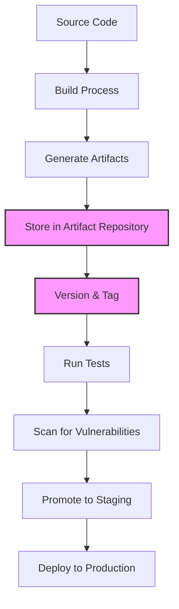
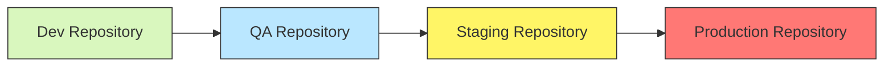

# CI/CD Artifact Management

## Introduction

In the world of continuous integration and continuous deployment (CI/CD), **artifacts** play a crucial role in the overall pipeline. But what exactly are artifacts, and why should you care about managing them effectively?

Artifacts are the files produced during the various stages of your CI/CD pipeline. These could be compiled binaries, container images, documentation files, test reports, or any other outputs that are generated during the build, test, and deployment processes. Proper management of these artifacts ensures reproducibility, traceability, and reliability in your software delivery process.

In this guide, we'll explore the fundamentals of artifact management in CI/CD pipelines, including best practices, tools, and real-world examples to help you implement an effective artifact management strategy.

## What Are CI/CD Artifacts?

Artifacts in CI/CD are the outputs of your build process that need to be stored, versioned, and deployed. Common examples include:

- Compiled application binaries (`.jar`, `.war`, `.exe`, etc.)
- Container images (Docker, OCI)
- Packages (npm, PyPI, NuGet, etc.)
- Static website files (HTML, CSS, JavaScript)
- Documentation
- Test reports and code coverage results
- Infrastructure as Code (IaC) templates

Each artifact represents a specific version of your software or a component of it, making artifact management essential for traceability and reproducibility.

## Why Artifact Management Matters

Proper artifact management offers several benefits:

1. **Reproducibility**: The ability to recreate any environment or deployment exactly as it was at a specific point in time.
2. **Traceability**: Knowing exactly which version of your code is running in each environment.
3. **Efficiency**: Avoiding rebuilding artifacts that haven't changed.
4. **Security**: Ensuring artifacts are scanned for vulnerabilities before deployment.
5. **Compliance**: Meeting regulatory requirements by maintaining an audit trail.

## Artifact Management Workflow

Let's look at a typical artifact management workflow in a CI/CD pipeline:



## Setting Up an Artifact Repository

An artifact repository is a specialized storage system designed to manage binary files. Here are some popular options:

- **JFrog Artifactory**: Supports virtually all package types
- **Nexus Repository**: Open-source option with commercial support
- **GitHub Packages**: Integrated with GitHub
- **AWS CodeArtifact**: Cloud-based artifact management
- **Docker Registry**: For container images

### Example: Setting Up a Simple Artifact Repository with Nexus

Here's how to set up Nexus Repository Manager using Docker:

```bash
# Pull and run Nexus Repository Manager
docker run -d -p 8081:8081 --name nexus sonatype/nexus3:latest

# Wait for Nexus to start (this may take a minute)
# Then access it at http://localhost:8081
# Default credentials: admin / admin123
```

## Versioning Artifacts

Proper versioning is crucial for artifact management. Common versioning strategies include:

1. **Semantic Versioning (SemVer)**: Using MAJOR.MINOR.PATCH format
2. **Date-based versioning**: YYYY.MM.DD.BUILD
3. **Git commit hash**: Using commit SHA as version identifier

### Example: Implementing Semantic Versioning in a Node.js Project

```json
// package.json
{
  "name": "my-app",
  "version": "1.2.3",
  "scripts": {
    "build": "webpack --mode production",
    "release:patch": "npm version patch && npm publish",
    "release:minor": "npm version minor && npm publish",
    "release:major": "npm version major && npm publish"
  }
}
```

## Publishing Artifacts

Let's see how to publish artifacts to different repositories:

### Maven/Java Example

```xml
<!-- pom.xml -->
<distributionManagement>
    <repository>
        <id>central</id>
        <name>Central Repository</name>
        <url>https://repo.mycompany.com/artifactory/libs-release</url>
    </repository>
    <snapshotRepository>
        <id>snapshots</id>
        <name>Snapshot Repository</name>
        <url>https://repo.mycompany.com/artifactory/libs-snapshot</url>
    </snapshotRepository>
</distributionManagement>
```

```bash
# Publish to the repository
mvn deploy
```

### Node.js Example

```bash
# Set the registry
npm config set registry https://npm.mycompany.com

# Publish the package
npm publish
```

### Docker Image Example

```bash
# Tag the image
docker tag my-app:latest docker.mycompany.com/my-app:1.2.3

# Push to registry
docker push docker.mycompany.com/my-app:1.2.3
```

## Integrating Artifact Management in CI/CD Pipelines

Let's look at examples of integrating artifact management in popular CI/CD tools:

### GitHub Actions Example

```yaml
name: Build and Publish

on:
  push:
    branches: [ main ]
  pull_request:
    branches: [ main ]

jobs:
  build:
    runs-on: ubuntu-latest
    
    steps:
    - uses: actions/checkout@v3
    
    - name: Set up JDK 17
      uses: actions/setup-java@v3
      with:
        java-version: '17'
        distribution: 'temurin'
        
    - name: Build with Maven
      run: mvn -B package
      
    - name: Upload artifact
      uses: actions/upload-artifact@v3
      with:
        name: my-app
        path: target/*.jar
        
  publish:
    needs: build
    if: github.event_name == 'push' && github.ref == 'refs/heads/main'
    runs-on: ubuntu-latest
    
    steps:
    - uses: actions/checkout@v3
    
    - name: Download artifact
      uses: actions/download-artifact@v3
      with:
        name: my-app
        
    - name: Set up JDK 17
      uses: actions/setup-java@v3
      with:
        java-version: '17'
        distribution: 'temurin'
        server-id: central
        server-username: MAVEN_USERNAME
        server-password: MAVEN_PASSWORD
        
    - name: Publish to Repository
      run: mvn deploy -DskipTests
      env:
        MAVEN_USERNAME: ${{ secrets.REPO_USERNAME }}
        MAVEN_PASSWORD: ${{ secrets.REPO_PASSWORD }}
```

### Jenkins Pipeline Example

```groovy
pipeline {
    agent any
    
    stages {
        stage('Build') {
            steps {
                sh 'mvn clean package'
            }
        }
        
        stage('Archive Artifacts') {
            steps {
                archiveArtifacts artifacts: 'target/*.jar', fingerprint: true
            }
        }
        
        stage('Publish to Repository') {
            when {
                branch 'main'
            }
            steps {
                withCredentials([usernamePassword(credentialsId: 'repo-credentials', 
                                                 usernameVariable: 'USERNAME', 
                                                 passwordVariable: 'PASSWORD')]) {
                    sh 'mvn deploy -DskipTests'
                }
            }
        }
    }
}
```

## Best Practices for Artifact Management

1. **Immutability**: Once published, artifacts should never be modified or overwritten
2. **Retention Policy**: Define how long to keep artifacts and implement lifecycle management
3. **Metadata**: Add relevant metadata to artifacts (build number, git hash, etc.)
4. **Access Control**: Implement proper access controls to prevent unauthorized modifications
5. **Vulnerability Scanning**: Scan artifacts for security vulnerabilities before deployment
6. **Cache Dependencies**: Cache external dependencies to improve build speed and reliability

### Example: Setting Up Artifact Retention in JFrog Artifactory

```yaml
# In .jfrog/artifactory/cleanup-policy.yaml
policies:
  - name: cleanup-snapshot
    description: "Remove snapshots older than 30 days"
    criteria:
      artifacts:
        - include: "libs-snapshot-local/**/*"
      properties:
        - name: "created"
          value: "*"
          type: "BEFORE"
          offset: 30
          unit: "DAYS"
```

## Real-World Artifact Management Scenario

Let's consider a real-world scenario of a Java web application with a React frontend:

1. **Backend Artifacts**: JAR/WAR files for the Java application
2. **Frontend Artifacts**: Bundled JavaScript/CSS files
3. **Documentation**: Generated API documentation
4. **Container Images**: Docker images for deployment

### Implementation with GitLab CI

```yaml
stages:
  - build
  - test
  - publish
  - deploy

variables:
  MAVEN_CLI_OPTS: "-s .m2/settings.xml --batch-mode"
  MAVEN_OPTS: "-Dmaven.repo.local=.m2/repository"
  DOCKER_REGISTRY: "registry.mycompany.com"

# Build backend
build-backend:
  stage: build
  image: maven:3.8-openjdk-17
  script:
    - mvn $MAVEN_CLI_OPTS clean package
  artifacts:
    paths:
      - target/*.jar
    expire_in: 1 week

# Build frontend
build-frontend:
  stage: build
  image: node:16
  script:
    - cd frontend
    - npm ci
    - npm run build
  artifacts:
    paths:
      - frontend/build/
    expire_in: 1 week

# Run tests and generate reports
test:
  stage: test
  image: maven:3.8-openjdk-17
  script:
    - mvn $MAVEN_CLI_OPTS test
  artifacts:
    paths:
      - target/surefire-reports/
      - target/site/jacoco/
    expire_in: 1 week
    reports:
      junit: target/surefire-reports/*.xml

# Publish artifacts to repository
publish:
  stage: publish
  image: maven:3.8-openjdk-17
  script:
    - mvn $MAVEN_CLI_OPTS deploy -DskipTests
    - docker build -t $DOCKER_REGISTRY/myapp:$CI_COMMIT_SHA .
    - docker tag $DOCKER_REGISTRY/myapp:$CI_COMMIT_SHA $DOCKER_REGISTRY/myapp:latest
    - docker push $DOCKER_REGISTRY/myapp:$CI_COMMIT_SHA
    - docker push $DOCKER_REGISTRY/myapp:latest
  only:
    - main

# Deploy to staging
deploy-staging:
  stage: deploy
  image: bitnami/kubectl:latest
  script:
    - kubectl set image deployment/myapp myapp=$DOCKER_REGISTRY/myapp:$CI_COMMIT_SHA --namespace=staging
  environment:
    name: staging
  only:
    - main
```

## Troubleshooting Common Artifact Management Issues

### Problem: Artifacts Not Being Published

**Solution:**
```bash
# Check repository permissions
curl -u username:password https://repo.mycompany.com/artifactory/api/repositories

# Verify artifact path and format
mvn help:effective-pom | grep -A 10 distributionManagement
```

### Problem: Version Conflicts

**Solution:**
```bash
# For Maven, use dependency:tree to identify conflicts
mvn dependency:tree -Dverbose

# For npm, use npm ls to check dependency versions
npm ls
```

### Problem: Storage Space Issues

**Solution:**
```bash
# Implement a cleanup job in your CI pipeline
find /path/to/artifacts -type f -name "*.jar" -mtime +30 -delete

# Or use the repository's API to clean up old artifacts
curl -X DELETE -u username:password https://repo.mycompany.com/artifactory/api/storage/libs-snapshot-local/com/mycompany/old-artifact
```

## Setting Up Artifact Promotion

Artifact promotion means moving artifacts between repositories as they progress through your pipeline:



### Example: Promoting Artifacts in JFrog Artifactory

```bash
#!/bin/bash
# Script to promote an artifact from staging to production

# Variables
ARTIFACTORY_URL="https://artifactory.mycompany.com/artifactory"
SOURCE_REPO="libs-staging-local"
TARGET_REPO="libs-release-local"
ARTIFACT_PATH="com/mycompany/myapp/1.0.0/myapp-1.0.0.jar"

# Promote the artifact
curl -X POST -u $ARTIFACTORY_USER:$ARTIFACTORY_PASSWORD \
  -H "Content-Type: application/json" \
  -d '{
    "targetRepo": "'$TARGET_REPO'",
    "copy": true,
    "failFast": true
  }' \
  "$ARTIFACTORY_URL/api/copy/$SOURCE_REPO/$ARTIFACT_PATH?to=$TARGET_REPO/$ARTIFACT_PATH"
```

## Summary

Effective artifact management is a crucial aspect of any mature CI/CD pipeline. By implementing the practices and tools discussed in this guide, you can:

- Ensure reproducibility and traceability in your software delivery process
- Improve build speed and reliability
- Enhance security by scanning artifacts for vulnerabilities
- Meet compliance requirements through proper versioning and audit trails

Remember that artifact management is not just about storage—it's about creating a reliable, repeatable process for delivering software from development to production.

## Additional Resources

- [JFrog Artifactory Documentation](https://www.jfrog.com/confluence/display/JFROG/JFrog+Artifactory)
- [Nexus Repository Documentation](https://help.sonatype.com/repomanager3)
- [Maven Repository Guide](https://maven.apache.org/guides/introduction/introduction-to-repositories.html)
- [Docker Registry Documentation](https://docs.docker.com/registry/)

## Exercises

1. Set up a local Nexus Repository Manager using Docker and publish a simple artifact to it.
2. Create a CI/CD pipeline in GitHub Actions that builds, tests, and publishes artifacts to GitHub Packages.
3. Implement a retention policy for your artifact repository to automatically clean up old snapshots.
4. Create a promotion workflow that moves artifacts from development to production repositories based on test results.
5. Configure vulnerability scanning for your artifacts using a tool like JFrog Xray or Snyk.