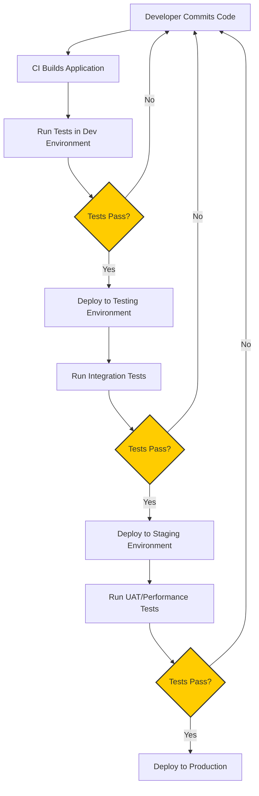

# CICD Environment Parity

## Introduction

Environment parity is a crucial concept in Continuous Integration and Continuous Deployment (CI/CD) practices. It refers to keeping all environments—development, testing, staging, and production—as identical as possible. When environments have "parity," it means they share the same configurations, dependencies, and infrastructure, differing only in scale and data.

Why is this important? Imagine building an application that works perfectly on your laptop but fails when deployed to production. This frustrating scenario, often summarized as "it works on my machine," is exactly what environment parity aims to eliminate.

## Why Environment Parity Matters

Environment parity addresses several critical challenges in the software development lifecycle:

1. **Reduces "It Works on My Machine" Problems**: Minimizes discrepancies between where code is developed and where it runs in production.
2. **Increases Deployment Confidence**: When testing environments mirror production, successful tests provide greater assurance for production deployments.
3. **Simplifies Debugging**: When issues occur, developers can reproduce them reliably across environments.
4. **Speeds Up Onboarding**: New team members can get started quickly with environments that match production.

## Achieving Environment Parity

Let's explore practical strategies to implement environment parity in your CI/CD pipeline:

### 1. Infrastructure as Code (IaC)

Using Infrastructure as Code tools like Terraform, AWS CloudFormation, or Pulumi ensures your environments are defined consistently through code.

```javascript
// Example Terraform configuration for consistent environment setup
resource "aws_instance" "web_server" {
  ami           = "ami-0c55b159cbfafe1f0"
  instance_type = "t2.micro"
  
  tags = {
    Name = "WebServer-${var.environment}"
    Environment = var.environment
  }
}
```

The above Terraform snippet creates the same server configuration across different environments, with only the environment name changing.

### 2. Containerization

Containers package applications with their dependencies, ensuring consistency across environments.

```bash
# Dockerfile example
FROM node:16-alpine

WORKDIR /app

COPY package*.json ./
RUN npm install

COPY . .

EXPOSE 3000
CMD ["npm", "start"]
```

With this Dockerfile, your application runs in the same container environment whether it's on a developer's laptop or in production.

### 3. Environment Configuration Management

Use environment variables or configuration files to manage environment-specific settings without changing code.

```javascript
// config.js
const config = {
  database: {
    host: process.env.DB_HOST || 'localhost',
    port: process.env.DB_PORT || '5432',
    username: process.env.DB_USER || 'dev_user',
    password: process.env.DB_PASSWORD || 'dev_password',
  },
  api: {
    url: process.env.API_URL || 'http://localhost:8080',
    timeout: process.env.API_TIMEOUT || 5000,
  },
};

export default config;
```

This approach allows your application to use different configuration values in different environments while maintaining the same codebase.

### 4. Continuous Integration Testing

Implement tests that verify environment configurations are consistent with expectations.

```javascript
// Example Jest test for environment configuration
test('Database configuration is valid', () => {
  const config = require('../config').database;
  
  expect(config.host).toBeDefined();
  expect(config.port).toBeDefined();
  expect(config.username).toBeDefined();
  expect(config.password).toBeDefined();
});
```

## Implementation Process Flow

Let's visualize the environment parity workflow in a typical CI/CD pipeline:



## Common Challenges and Solutions

### Challenge 1: Production Data

Production databases are typically larger and contain real user data that can't be replicated in lower environments.

**Solution**: Use data masking, synthetic data generation, or subset production data for testing environments.

```javascript
// Example data masking function
function maskSensitiveData(userData) {
  return {
    ...userData,
    email: `user_${userData.id}@example.com`,
    phone: '555-123-4567',
    creditCard: 'XXXX-XXXX-XXXX-1234',
  };
}

// Usage in data export script
const maskedUsers = productionUsers.map(maskSensitiveData);
writeToTestingDatabase(maskedUsers);
```

### Challenge 2: Third-Party Services

External services like payment processors usually have sandbox environments that behave differently from production.

**Solution**: Use service virtualization or mock services in non-production environments.

```javascript
// Mock payment service for testing
class MockPaymentService {
  async processPayment(amount, cardDetails) {
    console.log(`Mock processing payment of $${amount}`);
    
    // Simulate various scenarios based on card number
    if (cardDetails.number.endsWith('0000')) {
      return { status: 'failed', error: 'Insufficient funds' };
    }
    
    return { status: 'success', transactionId: `mock-${Date.now()}` };
  }
}

// Usage in non-production code
const paymentService = process.env.NODE_ENV === 'production' 
  ? new RealPaymentService() 
  : new MockPaymentService();
```

### Challenge 3: Infrastructure Costs

Running multiple identical environments can be expensive.

**Solution**: Scale down non-production environments while maintaining the same architecture.

```terraform
// Infrastructure as Code with environment-based scaling
resource "aws_autoscaling_group" "web_asg" {
  name                 = "web-asg-${var.environment}"
  min_size             = lookup(var.asg_sizes[var.environment], "min", 1)
  max_size             = lookup(var.asg_sizes[var.environment], "max", 2)
  desired_capacity     = lookup(var.asg_sizes[var.environment], "desired", 1)
  
  launch_configuration = aws_launch_configuration.web.id
  vpc_zone_identifier  = var.subnet_ids
}

// Environment-specific sizing
variable "asg_sizes" {
  default = {
    dev = {
      min = 1,
      max = 1,
      desired = 1,
    },
    staging = {
      min = 1,
      max = 2,
      desired = 1,
    },
    production = {
      min = 2,
      max = 10,
      desired = 4,
    },
  }
}
```

## Real-World Case Study: E-commerce Application

Let's examine a practical implementation of environment parity for an e-commerce application:

### Before Environment Parity

- Development: Local MySQL, Node.js on developers' machines
- Testing: Shared MySQL server, Node.js on Jenkins
- Staging: PostgreSQL (different database!), Node.js on AWS EC2
- Production: PostgreSQL cluster, Node.js on Kubernetes

**Result**: Features worked in development but failed in production due to database differences.

### After Environment Parity

- All environments: PostgreSQL (scaled appropriately), Node.js on Docker containers
- Infrastructure defined in Terraform
- Environment-specific configurations managed through environment variables
- Database migrations tested across all environments

**Result**: Deployments became predictable and reliable, with far fewer production surprises.

### Key Technologies Used

- Docker for containerization
- Kubernetes for orchestration
- Terraform for infrastructure
- Helm charts for consistent deployments
- GitLab CI/CD for pipeline automation

## Implementation Checklist

Use this checklist to assess your environment parity implementation:

1. ☐ All environments use the same operating system
2. ☐ Dependency versions are identical across environments
3. ☐ Infrastructure is defined as code
4. ☐ Container images are used consistently
5. ☐ Configuration management is environment-aware
6. ☐ CI/CD pipeline validates environment consistency
7. ☐ Developers can reproduce production-like environments locally
8. ☐ Database schemas are managed with migration tools
9. ☐ External service dependencies are properly mocked or sandboxed
10. ☐ Monitoring and logging are consistent across environments

## Practical Tips for Beginners

1. **Start Simple**: Begin with containerizing your application before tackling full infrastructure parity.
2. **Use Docker Compose**: Create a `docker-compose.yml` file to define your application's services and dependencies.

```yaml
# docker-compose.yml example
version: '3'
services:
  app:
    build: .
    ports:
      - "3000:3000"
    environment:
      - NODE_ENV=development
      - DB_HOST=db
    depends_on:
      - db
  
  db:
    image: postgres:13
    environment:
      - POSTGRES_USER=app_user
      - POSTGRES_PASSWORD=app_password
      - POSTGRES_DB=app_database
    volumes:
      - db-data:/var/lib/postgresql/data

volumes:
  db-data:
```

3. **Use Feature Flags**: Implement feature flags to control feature availability across environments.

```javascript
// Feature flag implementation
const features = {
  newCheckout: process.env.FEATURE_NEW_CHECKOUT === 'true',
  darkMode: process.env.FEATURE_DARK_MODE === 'true',
  beta: process.env.FEATURE_BETA === 'true',
};

function isFeatureEnabled(featureName) {
  return features[featureName] || false;
}

// Usage
if (isFeatureEnabled('newCheckout')) {
  // Show new checkout process
} else {
  // Show old checkout process
}
```

4. **Document Environment Differences**: Keep a record of any intentional differences between environments.

## Summary

Environment parity is a foundational practice in modern CI/CD pipelines that ensures consistency across all stages of deployment. By implementing the strategies outlined in this guide, you can significantly reduce deployment risks, eliminate "it works on my machine" problems, and build a more reliable development workflow.

Key takeaways include:
- Use Infrastructure as Code to define environments consistently
- Leverage containerization for application consistency
- Manage environment-specific configurations through environment variables
- Address common challenges like data differences and third-party services
- Scale environments appropriately while maintaining architectural similarity

## Additional Resources

- [The Twelve-Factor App](https://12factor.net/) - Methodology for building software-as-a-service apps with strong environment parity
- [Docker Documentation](https://docs.docker.com/) - Comprehensive guide to containerization
- [Terraform Getting Started](https://learn.hashicorp.com/terraform) - Infrastructure as Code tutorials
- [GitLab CI/CD Documentation](https://docs.gitlab.com/ee/ci/) - Guide to implementing CI/CD pipelines

## Exercises

1. Create a `Dockerfile` and `docker-compose.yml` for a simple web application.
2. Implement a configuration system that loads different values based on the current environment.
3. Write a CI/CD pipeline that validates environment consistency before deployment.
4. Design a strategy for managing sensitive data across different environments.
5. Create a checklist for your own project to evaluate its environment parity level.