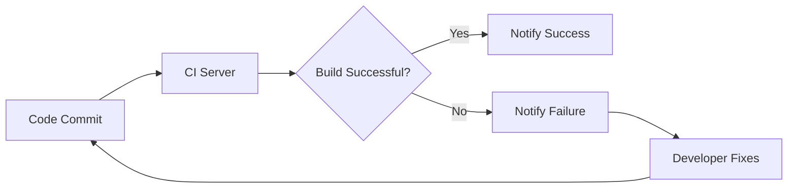
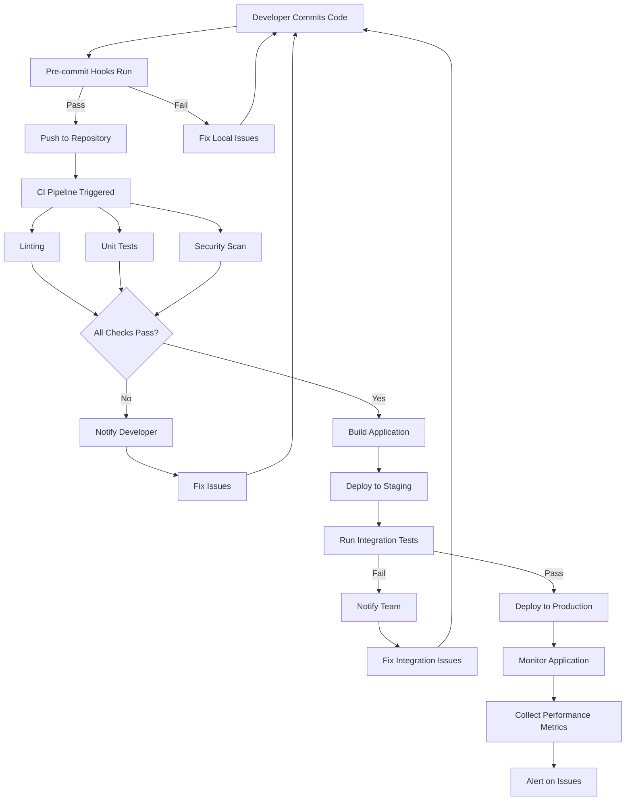

# CICD Continuous Feedback

## Introduction

Continuous feedback is a critical component of effective CI/CD pipelines, enabling development teams to receive immediate insights throughout the software development lifecycle. Unlike traditional development approaches where feedback might come days or weeks after code changes, continuous feedback mechanisms provide real-time information about code quality, test results, and deployment status. This immediate response system empowers developers to identify and address issues quickly, leading to higher quality software and faster delivery cycles.

In this guide, we'll explore what continuous feedback means in the context of CI/CD, the different types of feedback mechanisms you can implement, and practical examples of setting up effective feedback loops in your development workflow.

## What is Continuous Feedback in CI/CD?

Continuous feedback in CI/CD refers to the practice of establishing automated systems that provide immediate information about the state of your code and deployments throughout the development pipeline. These systems notify stakeholders about:

- Code quality issues
- Test failures
- Build status
- Deployment success or failure
- Performance metrics
- Security vulnerabilities

The key principle is that feedback should be:

1. **Immediate**: Available as soon as possible after a change
2. **Relevant**: Targeted to the appropriate team members
3. **Actionable**: Providing enough information to address issues
4. **Integrated**: Embedded within the development workflow

## Types of Continuous Feedback

### 1. Build and Integration Feedback

This type of feedback tells developers whether their code integrates successfully with the main codebase.



**Example implementation with GitHub Actions:**

```yaml
name: CI Build

on:
  push:
    branches: [ main ]
  pull_request:
    branches: [ main ]

jobs:
  build:
    runs-on: ubuntu-latest
    steps:
    - uses: actions/checkout@v3
    - name: Set up Node.js
      uses: actions/setup-node@v3
      with:
        node-version: '16'
    - name: Install dependencies
      run: npm ci
    - name: Build project
      run: npm run build
    - name: Notify on success
      if: success()
      uses: rtCamp/action-slack-notify@v2
      env:
        SLACK_WEBHOOK: ${{ secrets.SLACK_WEBHOOK }}
        SLACK_TITLE: "✅ Build Successful"
        SLACK_MESSAGE: "The build passed for ${{ github.repository }}"
```

### 2. Code Quality Feedback

This feedback helps developers identify issues with code style, complexity, and potential bugs.

**Example implementation with SonarQube:**

```yaml
name: SonarQube Analysis

on:
  push:
    branches: [ main ]
  pull_request:
    branches: [ main ]

jobs:
  sonarqube:
    runs-on: ubuntu-latest
    steps:
    - uses: actions/checkout@v3
      with:
        fetch-depth: 0
    - name: SonarQube Scan
      uses: SonarSource/sonarqube-scan-action@master
      env:
        SONAR_TOKEN: ${{ secrets.SONAR_TOKEN }}
        SONAR_HOST_URL: ${{ secrets.SONAR_HOST_URL }}
```

The output from SonarQube might look like:

```
SonarQube Analysis Results:
✅ 0 bugs
✅ 0 vulnerabilities
⚠️ 12 code smells
  - 3 functions have cognitive complexity > 15
  - 5 functions are too long (> 50 lines)
  - 4 instances of duplicated code
Code Coverage: 82.3%
```

### 3. Testing Feedback

Automated tests provide feedback about the functional correctness of your code.

**Example with Jest and GitHub Actions:**

```yaml
name: Test Suite

on:
  push:
    branches: [ main ]
  pull_request:
    branches: [ main ]

jobs:
  test:
    runs-on: ubuntu-latest
    steps:
    - uses: actions/checkout@v3
    - name: Set up Node.js
      uses: actions/setup-node@v3
      with:
        node-version: '16'
    - name: Install dependencies
      run: npm ci
    - name: Run tests
      run: npm test
    - name: Generate test report
      if: always()
      run: npm run test:report
    - name: Upload test results
      if: always()
      uses: actions/upload-artifact@v3
      with:
        name: test-results
        path: test-report.html
```

### 4. Deployment Feedback

This feedback informs teams about the status of deployments and the health of applications in production.

**Example with deployment monitoring:**

```javascript
// Simple health check endpoint in an Express.js app
const express = require('express');
const app = express();

app.get('/health', (req, res) => {
  const healthStatus = {
    status: 'UP',
    uptime: process.uptime(),
    timestamp: new Date(),
    memory: process.memoryUsage(),
    version: process.env.APP_VERSION || '1.0.0'
  };
  
  res.json(healthStatus);
});

app.listen(3000);
```

## Setting Up Feedback Notifications

### Slack Integration

```javascript
// Node.js function to send Slack notifications
const axios = require('axios');

async function sendSlackNotification(webhookUrl, message) {
  try {
    await axios.post(webhookUrl, {
      text: message
    });
    console.log('Notification sent to Slack');
  } catch (error) {
    console.error('Error sending notification:', error);
  }
}

// Example usage
sendSlackNotification(
  process.env.SLACK_WEBHOOK,
  '🚀 Deployment to production successful! Version 1.2.3 is now live.'
);
```

### Email Notifications

```yaml
# GitHub Actions workflow for email notifications
name: Email Notification

on:
  workflow_run:
    workflows: ["CI Build"]
    types:
      - completed

jobs:
  notify:
    runs-on: ubuntu-latest
    steps:
    - name: Send email
      uses: dawidd6/action-send-mail@v3
      with:
        server_address: smtp.gmail.com
        server_port: 465
        username: ${{ secrets.EMAIL_USERNAME }}
        password: ${{ secrets.EMAIL_PASSWORD }}
        subject: Build ${{ github.event.workflow_run.conclusion }}
        body: The build for ${{ github.repository }} has ${{ github.event.workflow_run.conclusion }}
        to: team@example.com
        from: CI System
```

## Real-world Continuous Feedback Example

Let's walk through a complete example of setting up continuous feedback for a web application:

### 1. Developer Workflow with Feedback



### 2. Setting Up Pre-commit Hooks

Create a `.husky/pre-commit` file:

```bash
#!/bin/sh
. "$(dirname "$0")/_/husky.sh"

npm run lint
npm run test:unit
```

Initialize with:

```bash
npx husky install
npm set-script prepare "husky install"
```

### 3. Dashboard for Continuous Feedback

Many teams implement dashboards that aggregate feedback from various sources:

```javascript
// Example React component for a CI/CD dashboard
import React, { useEffect, useState } from 'react';
import axios from 'axios';

function CICDDashboard() {
  const [builds, setBuilds] = useState([]);
  const [tests, setTests] = useState({});
  const [deployments, setDeployments] = useState([]);

  useEffect(() => {
    // Fetch data from your CI/CD APIs
    const fetchData = async () => {
      try {
        const [buildsRes, testsRes, deploymentsRes] = await Promise.all([
          axios.get('/api/builds'),
          axios.get('/api/tests'),
          axios.get('/api/deployments')
        ]);
        
        setBuilds(buildsRes.data);
        setTests(testsRes.data);
        setDeployments(deploymentsRes.data);
      } catch (error) {
        console.error('Error fetching CI/CD data:', error);
      }
    };
    
    fetchData();
    const interval = setInterval(fetchData, 30000); // Update every 30 seconds
    
    return () => clearInterval(interval);
  }, []);

  return (
    <div className="dashboard">
      <h1>CI/CD Dashboard</h1>
      
      <section className="builds">
        <h2>Recent Builds</h2>
        <ul>
          {builds.map(build => (
            <li key={build.id} className={build.status}>
              Build #{build.number}: {build.status}
              <span className="time">{new Date(build.timestamp).toLocaleString()}</span>
            </li>
          ))}
        </ul>
      </section>
      
      <section className="tests">
        <h2>Test Results</h2>
        <div className="test-summary">
          <div className="metric">
            <span className="value">{tests.passing || 0}</span>
            <span className="label">Passing</span>
          </div>
          <div className="metric">
            <span className="value">{tests.failing || 0}</span>
            <span className="label">Failing</span>
          </div>
          <div className="metric">
            <span className="value">{tests.coverage || 0}%</span>
            <span className="label">Coverage</span>
          </div>
        </div>
      </section>
      
      <section className="deployments">
        <h2>Recent Deployments</h2>
        <ul>
          {deployments.map(deployment => (
            <li key={deployment.id} className={deployment.status}>
              {deployment.environment}: {deployment.version}
              <span className="time">{new Date(deployment.timestamp).toLocaleString()}</span>
            </li>
          ))}
        </ul>
      </section>
    </div>
  );
}

export default CICDDashboard;
```

## Best Practices for Continuous Feedback

1. **Keep feedback cycles short**: The faster feedback arrives, the quicker issues can be resolved.

2. **Make feedback visible**: Use dashboards, notifications, and status indicators to ensure feedback is easily accessible.

3. **Prioritize critical feedback**: Not all feedback requires immediate attention—establish severity levels.

4. **Automate where possible**: Manual feedback processes slow down development.

5. **Provide context**: Ensure feedback includes enough information to understand and address the issue.

6. **Close the loop**: Track whether feedback leads to improvements by measuring how quickly issues are resolved.

7. **Target the right audience**: Direct feedback to the team members who can act on it.

8. **Monitor feedback metrics**: Track metrics like mean time to resolution (MTTR) to measure the effectiveness of your feedback systems.

## Implementing Continuous Feedback for Small Teams

Even small teams can benefit from continuous feedback with minimal setup:

1. **Set up a simple CI pipeline** with GitHub Actions or GitLab CI/CD.

2. **Implement automated testing** with frameworks like Jest, Mocha, or Pytest.

3. **Add a linter and code formatter** like ESLint, Prettier, or Black.

4. **Configure basic notifications** through Slack, Discord, or email.

5. **Use pull request reviews** to provide manual feedback.

Example minimal GitHub Actions workflow:

```yaml
name: Simple CI/CD Pipeline

on:
  push:
    branches: [ main ]
  pull_request:
    branches: [ main ]

jobs:
  build-and-test:
    runs-on: ubuntu-latest
    steps:
    - uses: actions/checkout@v3
    - name: Set up Node.js
      uses: actions/setup-node@v3
      with:
        node-version: '16'
    - name: Install dependencies
      run: npm ci
    - name: Lint code
      run: npm run lint
    - name: Run tests
      run: npm test
    - name: Build
      run: npm run build
    - name: Notify on completion
      if: always()
      uses: rtCamp/action-slack-notify@v2
      env:
        SLACK_WEBHOOK: ${{ secrets.SLACK_WEBHOOK }}
        SLACK_TITLE: "CI/CD Pipeline ${{ job.status }}"
        SLACK_MESSAGE: "Build and tests ${{ job.status }} for ${{ github.repository }}"
```

## Summary

Continuous feedback is a fundamental element of successful CI/CD pipelines that:

- Accelerates development cycles by providing immediate information
- Improves code quality by catching issues early
- Reduces the cost of fixing bugs by identifying them before they reach production
- Enhances team collaboration and visibility into the development process

By implementing automated feedback mechanisms throughout your pipeline, you create a responsive system that helps teams deliver higher quality software faster and with greater confidence.

## Exercises

1. **Set up a basic CI pipeline** with GitHub Actions or GitLab CI for one of your projects that runs tests and linting on each push.

2. **Implement a Slack or Discord notification system** that alerts your team when builds fail or succeed.

3. **Create a simple dashboard** that displays the current status of your pipelines and recent deployments.

4. **Add code coverage reporting** to your test process and set up alerts when coverage drops below a certain threshold.

5. **Configure a monitoring system** for a deployed application that provides feedback about performance and errors.

## Additional Resources

- [DevOps Handbook](https://itrevolution.com/product/the-devops-handbook/) by Gene Kim et al.
- [Continuous Delivery](https://continuousdelivery.com/) by Jez Humble and David Farley
- [GitHub Actions Documentation](https://docs.github.com/en/actions)
- [Jenkins Pipeline Documentation](https://www.jenkins.io/doc/book/pipeline/)
- [GitLab CI/CD Documentation](https://docs.gitlab.com/ee/ci/)