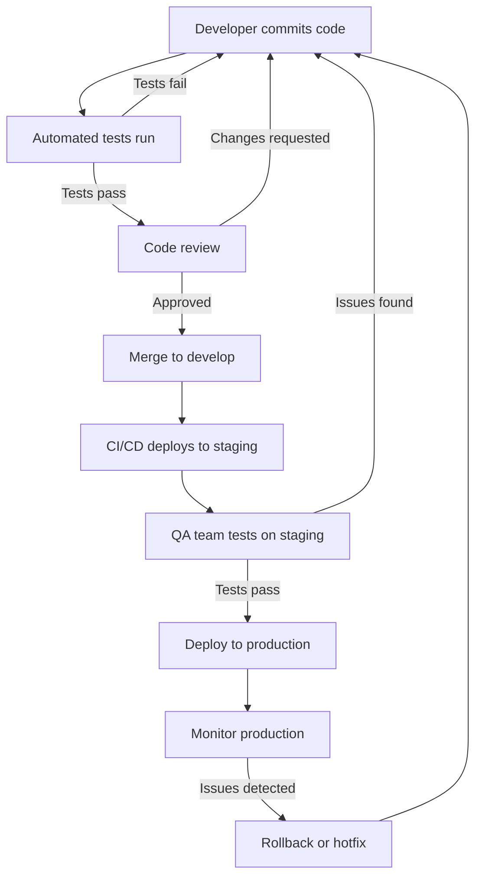

# CICD Collaboration

## Introduction

Continuous Integration and Continuous Deployment (CI/CD) isn't just about automation and tooling—it's also about fostering effective collaboration among team members. This guide explores how CI/CD practices can transform the way developers, testers, operations, and other stakeholders work together to create high-quality software more efficiently.

CI/CD collaboration represents the intersection of technical processes and team dynamics, creating a shared responsibility model where code quality, deployment success, and system reliability become everyone's concern.

## Understanding Collaborative CI/CD

At its core, CI/CD collaboration means breaking down traditional silos between development, testing, and operations teams. Instead of working in isolation and "throwing code over the wall" to the next team, everyone contributes to a unified pipeline.

### Key Principles of CI/CD Collaboration

1. **Shared Ownership**: Everyone is responsible for the quality and deployability of the code
2. **Transparency**: All team members have visibility into the pipeline and its status
3. **Fast Feedback**: Quick notification of issues allows rapid resolution
4. **Automation First**: Manual processes are minimized to reduce human error
5. **Continuous Improvement**: The pipeline itself evolves based on team feedback

## Setting Up a Collaborative CI/CD Environment

Let's explore the practical steps to foster collaboration in your CI/CD workflow:

### 1. Create a Central Configuration Repository

Store all CI/CD configuration in a version-controlled repository that all team members can access:

```yaml
# .github/workflows/team-pipeline.yml
name: Team Collaboration Pipeline

on:
  push:
    branches: [ main, develop ]
  pull_request:
    branches: [ main, develop ]

jobs:
  build:
    runs-on: ubuntu-latest
    steps:
    - uses: actions/checkout@v3
    - name: Build application
      run: ./build.sh
    
  test:
    needs: build
    runs-on: ubuntu-latest
    steps:
    - uses: actions/checkout@v3
    - name: Run tests
      run: ./run-tests.sh
      
  notify:
    needs: [build, test]
    runs-on: ubuntu-latest
    steps:
    - name: Send notification
      uses: some-action/notify@v1
      with:
        channel: '#team-builds'
        message: 'Build and tests completed successfully!'
```

This configuration is accessible to everyone, can be reviewed through pull requests, and ensures the entire team understands the pipeline.

### 2. Implement Team Notifications

Set up notifications that keep everyone informed about build and deployment status:

```javascript
// webhook-handler.js
const notifyTeam = async (buildStatus) => {
  const message = `Build ${buildStatus.id} ${buildStatus.success ? 'succeeded' : 'failed'}`;
  
  // Notify via chat application
  await sendToChat(message);
  
  // Notify via email for critical failures
  if (!buildStatus.success && buildStatus.branch === 'main') {
    await sendEmail({
      to: 'team@example.com',
      subject: 'CRITICAL: Main branch build failure',
      body: `Build failed: ${buildStatus.errorMessage}`
    });
  }
}
```

### 3. Define Collaborative Workflows

Create clearly defined processes for how team members interact with the CI/CD pipeline:



## Collaboration Tools and Practices

Effective CI/CD collaboration relies on the right tools and practices:

### 1. Shared Dashboards

Create dashboards that give everyone visibility into the pipeline status:

```javascript
// Example dashboard component
const CICDDashboard = () => {
  const [builds, setBuilds] = useState([]);
  
  useEffect(() => {
    // Fetch latest builds
    fetchBuildsFromAPI().then(data => setBuilds(data));
    
    // Set up real-time updates
    const socket = new WebSocket('wss://builds.example.com/updates');
    socket.onmessage = (event) => {
      const newBuild = JSON.parse(event.data);
      setBuilds(prevBuilds => [newBuild, ...prevBuilds]);
    };
    
    return () => socket.close();
  }, []);
  
  return (
    <div className="dashboard">
      <h2>Build Status</h2>
      <table>
        <thead>
          <tr>
            <th>Build ID</th>
            <th>Branch</th>
            <th>Status</th>
            <th>Triggered By</th>
            <th>Time</th>
          </tr>
        </thead>
        <tbody>
          {builds.map(build => (
            <tr key={build.id} className={build.status}>
              <td>{build.id}</td>
              <td>{build.branch}</td>
              <td>{build.status}</td>
              <td>{build.triggeredBy}</td>
              <td>{new Date(build.timestamp).toLocaleString()}</td>
            </tr>
          ))}
        </tbody>
      </table>
    </div>
  );
};
```

### 2. Collaborative Testing

Encourage shared responsibility for testing across team roles:

```python
# testing_collaboration.py
class TestCollaboration:
    def setup_method(self):
        """
        This setup creates test data that's useful for developers,
        QA specialists, and product owners alike.
        """
        self.test_data = {
            "user_stories": load_user_stories_from_jira(),
            "expected_outputs": load_acceptance_criteria(),
            "performance_thresholds": load_performance_requirements()
        }
    
    def test_feature_meets_user_story(self):
        """
        Test that validates the feature against user stories.
        This test is reviewed by product owners.
        """
        for story in self.test_data["user_stories"]:
            result = execute_feature_with_inputs(story["inputs"])
            assert result == story["expected_outcome"]
    
    def test_performance_requirements(self):
        """
        Performance test that operations team members care about.
        """
        start_time = time.time()
        result = execute_feature_under_load()
        duration = time.time() - start_time
        
        assert duration < self.test_data["performance_thresholds"]["max_response_time"]
```

### 3. Cross-Functional Review Process

Implement reviews that include different team roles:

```bash
# Example Git hook script (pre-merge)
#!/bin/bash

# Extract the PR information
PR_NUMBER=$(git config --get branch.$(git symbolic-ref --short HEAD).merge-request-id)

# Check if we have all required approvals
DEV_APPROVED=$(curl -s "$API_URL/pull/$PR_NUMBER/reviews" | jq '.[] | select(.user.team=="dev" and .state=="APPROVED") | .id' | wc -l)
QA_APPROVED=$(curl -s "$API_URL/pull/$PR_NUMBER/reviews" | jq '.[] | select(.user.team=="qa" and .state=="APPROVED") | .id' | wc -l)
OPS_REVIEWED=$(curl -s "$API_URL/pull/$PR_NUMBER/reviews" | jq '.[] | select(.user.team=="ops" and .state=="APPROVED") | .id' | wc -l)

# For production-impacting changes, we need approvals from all teams
if [[ "$TARGET_BRANCH" == "main" ]]; then
  if [[ $DEV_APPROVED -lt 1 || $QA_APPROVED -lt 1 || $OPS_REVIEWED -lt 1 ]]; then
    echo "Error: Production changes require approval from dev, QA, and ops teams"
    exit 1
  fi
fi

# For develop branch, we need dev and QA
if [[ "$TARGET_BRANCH" == "develop" ]]; then
  if [[ $DEV_APPROVED -lt 1 || $QA_APPROVED -lt 1 ]]; then
    echo "Error: Develop branch changes require approval from dev and QA teams"
    exit 1
  fi
fi

exit 0
```

## Real-World Collaboration Scenarios

Let's look at practical examples of CI/CD collaboration in action:

### Feature Development Collaboration

When developing a new feature, collaboration might flow like this:

1. Product owner defines requirements
2. Developers write code and tests
3. CI pipeline automatically runs tests on commit
4. QA engineers review test results and add additional tests
5. Operations team reviews deployment configuration
6. Product owner verifies feature meets requirements
7. Feature is automatically deployed through CD pipeline

### Handling Production Issues Collaboratively

When production issues arise:

1. Monitoring alerts the team to a problem
2. Developer creates a hotfix branch
3. CI pipeline runs critical tests
4. Operations reviews the change for system impact
5. After approval, CD pipeline deploys the fix
6. Team conducts a blameless post-mortem
7. Improvements are made to the CI/CD pipeline

## Best Practices for CI/CD Collaboration

Incorporate these practices to enhance your team's collaborative CI/CD approach:

### 1. Define Shared Conventions

Create documented standards for:

- Branch naming conventions
- Commit message formats
- Test naming and organization
- Deployment targets and environments

```bash
# Example git hook enforcing commit message convention
#!/bin/bash

commit_msg_file=$1
commit_msg=$(cat $commit_msg_file)

# Check for conventional commit format
if ! echo "$commit_msg" | grep -qE '^(feat|fix|docs|style|refactor|test|chore)(\([a-z-]+\))?: .+$'; then
  echo "Error: Commit message doesn't follow our convention."
  echo "Format: type(scope): message"
  echo "Example: feat(login): add remember me option"
  exit 1
fi

exit 0
```

### 2. Collective Ownership of the Pipeline

Treat your CI/CD pipeline as a product that the entire team owns:

- Regular reviews and improvements
- Shared access to modify configurations
- Rotation of responsibility for maintenance
- Documentation that all team members contribute to

### 3. Balanced Automation and Human Collaboration

Automate processes but keep humans in the loop for critical decisions:

```yaml
# Automation with human approval for production
name: Deploy to Production

on:
  workflow_dispatch:
    inputs:
      approved_by:
        description: 'Who approved this deployment?'
        required: true
      ticket_number:
        description: 'Related ticket number'
        required: true

jobs:
  verify_approval:
    runs-on: ubuntu-latest
    steps:
    - name: Check approval requirements
      run: |
        # Verify the approver is authorized
        if ! echo "${{ github.event.inputs.approved_by }}" | grep -q -E '^(manager1|manager2|teamlead1)$'; then
          echo "Error: Unauthorized approver"
          exit 1
        fi
        
        # Verify there's a valid ticket
        TICKET_STATUS=$(curl -s "https://jira.example.com/api/ticket/${{ github.event.inputs.ticket_number }}")
        if ! echo "$TICKET_STATUS" | grep -q '"status":"Approved for production"'; then
          echo "Error: Ticket not approved for production"
          exit 1
        fi
  
  deploy:
    needs: verify_approval
    runs-on: ubuntu-latest
    steps:
    - uses: actions/checkout@v3
    - name: Deploy to production
      run: ./deploy-production.sh
```

## Overcoming Common Challenges

CI/CD collaboration faces several common challenges:

### 1. Skill Gaps

Not all team members may have the same level of expertise with CI/CD tools.

**Solution**: Create paired programming sessions where CI/CD experts work with less experienced team members to update pipeline configurations:

```bash
# Script to schedule pairing sessions based on expertise
#!/bin/bash

# List of team members and their expertise levels (1-5)
declare -A expertise
expertise["alex"]=5
expertise["taylor"]=2
expertise["jordan"]=4
expertise["casey"]=1

# Schedule pairing sessions
for member in "${!expertise[@]}"; do
  if [ ${expertise[$member]} -lt 3 ]; then
    # Find an expert to pair with
    for expert in "${!expertise[@]}"; do
      if [ ${expertise[$expert]} -ge 4 ]; then
        echo "Scheduling: $expert to pair with $member on CI/CD tasks"
        # Add calendar invitation logic here
        break
      fi
    done
  fi
done
```

### 2. Blame Culture

When builds break or deployments fail, teams may fall into finger-pointing.

**Solution**: Implement blameless post-mortems that focus on process improvement rather than individual mistakes:

```markdown
# Blameless Post-Mortem Template

## Incident Summary
- **Date/Time**: [When did it happen]
- **Duration**: [How long did it last]
- **Impact**: [What systems/users were affected]

## Timeline
- [Time]: [Event] - Focus on what happened, not who did what

## Root Cause Analysis
- [Technical factors that contributed]
- [Process factors that contributed]
- [Environmental factors that contributed]

## What Went Well
- [Positive aspects of the response]

## What Could Be Improved
- [Areas for improvement in systems]
- [Areas for improvement in processes]

## Action Items
- [ ] [Specific, assignable actions to prevent recurrence]
- [ ] [Updates needed to monitoring]
- [ ] [Updates needed to documentation]
- [ ] [Updates needed to CI/CD pipeline]
```

### 3. Balancing Speed and Quality

Teams may struggle to balance rapid delivery with maintaining quality.

**Solution**: Implement progressive quality gates that become stricter as code moves toward production:

```yaml
# Multi-stage quality pipeline
stages:
  - build
  - unit_test
  - integration_test
  - performance_test
  - security_scan
  - deploy_staging
  - deploy_production

build:
  stage: build
  script: ./build.sh
  
unit_test:
  stage: unit_test
  script: ./run-unit-tests.sh
  # Fast feedback - allow some failures but flag them
  allow_failure: true
  
integration_test:
  stage: integration_test
  script: ./run-integration-tests.sh
  # Must pass all integration tests
  allow_failure: false
  
performance_test:
  stage: performance_test
  script: ./run-performance-tests.sh
  rules:
    # Only run performance tests on larger changes
    - if: $CI_COMMIT_BRANCH == "main" || $PERFORMANCE_IMPACT == "high"
      when: always
    - when: manual
  
security_scan:
  stage: security_scan
  script: ./security-scan.sh
  # Must pass security scans before production
  rules:
    - if: $CI_COMMIT_BRANCH == "main"
      when: always
      allow_failure: false
    - when: always
      allow_failure: true
```

## Building a CI/CD Collaboration Culture

Technical solutions are only part of the equation. Building a culture that supports CI/CD collaboration is equally important:

1. **Celebrate Successes**: Recognize when the team successfully implements CI/CD improvements
2. **Share Knowledge**: Regular lunch-and-learn sessions about CI/CD concepts
3. **Rotate Responsibilities**: Let different team members lead CI/CD improvements
4. **Value Feedback**: Create mechanisms for team members to suggest pipeline improvements

## Summary

CI/CD collaboration transforms software delivery from a series of handoffs to a unified team effort. By breaking down silos, sharing ownership, and creating transparent processes, teams can deliver higher quality software more rapidly.

Remember these key points:
- CI/CD is as much about people as it is about technology
- Automation should enhance collaboration, not replace it
- Shared visibility and ownership lead to better outcomes
- The pipeline itself should continuously improve based on team feedback

As you implement collaborative CI/CD practices, start small, measure improvements, and gradually expand. The goal is to create a system where the entire team feels responsible for and empowered to contribute to the delivery pipeline.

## Additional Resources

For further learning, consider exploring:

- Books: "Accelerate" by Nicole Forsgren, Jez Humble, and Gene Kim
- Training: CI/CD certification courses
- Tools: Explore collaborative features in GitHub Actions, GitLab CI, Jenkins, and CircleCI
- Communities: Join DevOps and CI/CD user groups

## Exercises

1. **Pipeline Audit**: Review your current CI/CD pipeline and identify opportunities to improve collaboration.
2. **Cross-Functional Pairing**: Pair developers with operations team members to work on pipeline improvements.
3. **Notification Enhancement**: Implement or improve build and deployment notifications to ensure all team members stay informed.
4. **Feedback Mechanism**: Create a process for collecting and acting on team feedback about the CI/CD pipeline.
5. **Post-Mortem Practice**: Conduct a blameless post-mortem for a recent deployment issue, focusing on process improvements.