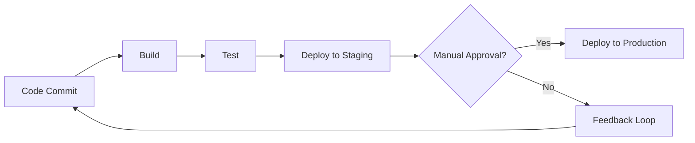
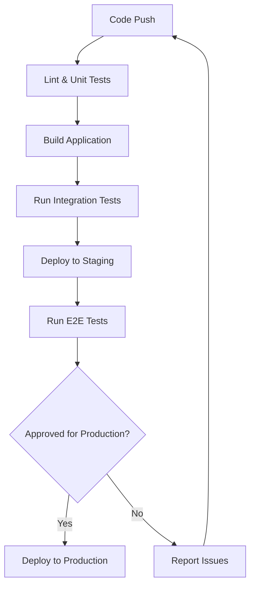

# CI/CD Documentation

## Introduction

Documentation is often an overlooked yet critical component of any CI/CD (Continuous Integration/Continuous Deployment) pipeline. Well-structured documentation ensures that your automation processes are understandable, maintainable, and can be effectively used by the entire team. In this guide, we'll explore why documentation matters in CI/CD workflows and how to create documentation that serves as both a learning resource and operational reference.

## Why Document Your CI/CD Pipeline?

Documentation serves several important purposes in the CI/CD context:

1. **Knowledge Transfer** - Helps new team members understand how the pipeline works
2. **Troubleshooting Aid** - Provides guidance when things go wrong
3. **Compliance Requirements** - Meets organizational or regulatory documentation needs
4. **Maintenance Support** - Makes future updates easier to implement
5. **Collaboration Tool** - Enables teams to work together more effectively

## Essential Elements of CI/CD Documentation

### 1. Pipeline Overview Diagram

A visual representation of your pipeline helps users quickly understand the flow and components.



### 2. Configuration Files Documentation

Document your configuration files with explanations of key settings and parameters.

```yaml
# Example .gitlab-ci.yml with documentation
# This configuration defines a simple pipeline with build, test, and deploy stages

stages:          # List of stages for jobs, and their order of execution
  - build
  - test
  - deploy

build-job:       # This job runs in the build stage
  stage: build
  script:
    - echo "Compiling the code..."
    - echo "Compile complete."
  # The job outputs artifacts that are stored and can be downloaded
  artifacts:
    paths:
      - build/
```

### 3. Environment Configuration

Document all environments in your pipeline, including their purpose and configuration differences.

| Environment | Purpose | URL | Special Configurations |
|-------------|---------|-----|------------------------|
| Development | Daily developer testing | dev.example.com | Debug enabled, mock services |
| Staging | Pre-release testing | staging.example.com | Production-like data |
| Production | Live environment | www.example.com | Full security measures |

### 4. Trigger Documentation

Document how your pipeline can be triggered and under what conditions automated processes begin.

```markdown
## Pipeline Triggers

The CI/CD pipeline can be triggered through the following events:

1. **Git Push**: Any push to the `main` branch automatically triggers the pipeline
   ```bash
   git push origin main
   ```

2. **Manual Trigger**: Pipeline can be manually triggered via the GitLab UI

3. **Scheduled Runs**: Pipeline automatically runs every day at midnight UTC
   ```
   schedule: 0 0 * * *
   ```
```

## Creating Effective Documentation

### Use a Template Approach

Establish a consistent template for documenting different parts of your CI/CD process:

```markdown
## [Component Name]

**Purpose**: [Brief description of what this component does]

**Inputs**: [What triggers or inputs this component requires]

**Process**: [Step-by-step breakdown of what happens]

**Outputs**: [What results or artifacts are produced]

**Failure Handling**: [What happens if this component fails]

**Ownership**: [Team or individual responsible for this component]
```

### Document Pipeline Variables

Variables play a crucial role in CI/CD pipelines. Document them clearly:

```markdown
## Environment Variables

| Variable Name | Description | Default Value | Notes |
|---------------|-------------|---------------|-------|
| `API_TOKEN` | Authentication token for API calls | None | Must be set as a protected variable |
| `DEPLOY_ENV` | Target environment for deployment | `development` | Options: `development`, `staging`, `production` |
| `DEBUG_MODE` | Enables additional logging | `false` | Set to `true` for troubleshooting |
```

## Real-World Example: Documenting a Node.js Application CI/CD Pipeline

Let's walk through documenting a complete CI/CD pipeline for a typical Node.js application:

### Pipeline Overview

This example documents a CI/CD pipeline for a Node.js web application using GitHub Actions:



### Configuration File

```yaml
# .github/workflows/main.yml
name: Node.js CI/CD Pipeline

on:
  push:
    branches: [ main ]
  pull_request:
    branches: [ main ]

jobs:
  build-and-test:
    runs-on: ubuntu-latest
    
    steps:
    - uses: actions/checkout@v3
    
    - name: Set up Node.js
      uses: actions/setup-node@v3
      with:
        node-version: '16'
        
    - name: Install dependencies
      run: npm ci
      
    - name: Lint code
      run: npm run lint
      
    - name: Run unit tests
      run: npm test
      
    - name: Build
      run: npm run build
      
  deploy-staging:
    needs: build-and-test
    if: github.event_name == 'push' && github.ref == 'refs/heads/main'
    runs-on: ubuntu-latest
    
    steps:
    - uses: actions/checkout@v3
    
    - name: Deploy to staging
      run: |
        echo "Deploying to staging environment"
        # Add your deployment script here
```

### Troubleshooting Guide

An essential part of CI/CD documentation is a troubleshooting section:

```markdown
## Common Issues and Resolutions

### Build Failures

**Symptoms**: The build job fails with errors related to missing dependencies

**Possible Causes**:
- Package-lock.json is out of sync
- Node version mismatch
- Missing build dependencies

**Resolution**:
1. Ensure you're using the correct Node.js version (v16+)
2. Run `npm ci` locally to verify dependencies
3. Check for any system dependencies required by your build process

### Deployment Failures

**Symptoms**: Build succeeds but deployment to staging fails

**Possible Causes**:
- Invalid deployment credentials
- Network connectivity issues
- Insufficient permissions on target environment

**Resolution**:
1. Verify that `DEPLOY_TOKEN` secret is correctly set in GitHub repository
2. Check network access between GitHub Actions and deployment target
3. Verify permissions for the deployment user
```

## Documentation Maintenance Strategy

Document how your CI/CD documentation itself should be maintained:

1. **Review Schedule**: Set a regular cadence (e.g., quarterly) to review and update documentation
2. **Change Process**: Document the process for updating the documentation when CI/CD changes occur
3. **Ownership**: Clearly define who is responsible for maintaining different sections

## Documenting CI/CD Security Aspects

Security is a critical component of CI/CD that should be documented:

```markdown
## Security Considerations

### Secret Management

All sensitive credentials are stored as protected variables in the CI/CD platform:
- API tokens
- Database credentials
- Deployment keys

### Access Controls

The following permissions are configured for the CI/CD pipeline:
- **Developers**: Can trigger pipelines but cannot modify workflows
- **DevOps Team**: Full access to configure and modify workflows
- **Security Team**: Read access to audit configurations

### Security Scanning

The pipeline includes the following security measures:
1. Dependency scanning for vulnerable packages
2. Static Application Security Testing (SAST)
3. Container scanning for Docker images
```

## Summary

Effective CI/CD documentation is more than just describing your pipeline—it's about creating a resource that empowers your team to understand, use, and maintain your automation processes. Key takeaways include:

- Use visual diagrams to illustrate pipeline flow
- Document configuration files, environment details, and triggers
- Create comprehensive troubleshooting guides
- Establish templates for consistency
- Include real-world examples relevant to your technology stack
- Document security aspects of your CI/CD processes
- Establish a maintenance strategy for the documentation itself

By implementing these documentation practices, you'll create more resilient, maintainable CI/CD pipelines that can be effectively utilized by your entire team.

## Additional Resources

- [GitHub Actions Documentation](https://docs.github.com/en/actions)
- [GitLab CI/CD Documentation](https://docs.gitlab.com/ee/ci/)
- [Jenkins Pipeline Documentation](https://www.jenkins.io/doc/book/pipeline/)
- [The Twelve-Factor App Methodology](https://12factor.net/)

## Practice Exercises

1. Create a documentation template for your current CI/CD pipeline
2. Draw a pipeline diagram for your existing build and deployment process
3. Document all environment variables used in your pipeline
4. Create a troubleshooting guide for common issues in your CI/CD workflow
5. Review your documentation with a team member who is unfamiliar with the pipeline to identify gaps