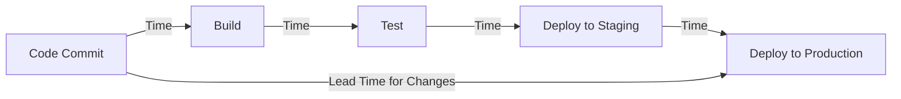

# CI/CD Metrics

## Introduction

Continuous Integration and Continuous Deployment (CI/CD) pipelines are essential for modern software development. But how do you know if your pipeline is effective? How can you identify bottlenecks or areas for improvement? This is where CI/CD metrics come in.

CI/CD metrics help you quantify the performance of your development and deployment processes, allowing you to track improvements over time and make data-driven decisions about where to focus optimization efforts.

In this guide, we'll explore the most important metrics for measuring CI/CD effectiveness, how to collect them, and how to use them to improve your software delivery process.

## Key CI/CD Metrics to Track

### 1. Deployment Frequency

**Definition**: How often you successfully deploy to production.

**Why it matters**: Higher deployment frequency typically indicates smaller, less risky changes and more agile development processes.

**How to measure**: Count the number of successful deployments to production over a time period (per day, week, or month).

**Example implementation using a simple bash script**:

```bash
#!/bin/bash
# Simple script to count deployments from git tags

# Count deployments in the last 7 days
LAST_WEEK_DEPLOYMENTS=$(git tag --list "deploy-*" --sort=-creatordate | grep "$(date -d '7 days ago' '+%Y-%m')" | wc -l)

echo "Deployments in the last 7 days: $LAST_WEEK_DEPLOYMENTS"
```

### 2. Lead Time for Changes

**Definition**: The time it takes for a commit to reach production.

**Why it matters**: Shorter lead times indicate an efficient pipeline and the ability to deliver value to users quickly.

**How to measure**: Track the time from when code is committed until it is successfully deployed to production.

**Visualization**:



### 3. Change Failure Rate

**Definition**: The percentage of deployments that result in a failure requiring remediation (like a hotfix, rollback, etc.).

**Why it matters**: Lower failure rates indicate higher quality code and more effective testing processes.

**How to measure**: 
```
Change Failure Rate = (Number of Failed Deployments / Total Number of Deployments) × 100%
```

**Example tracking in Python**:

```python
def calculate_change_failure_rate(deployments_data):
    """
    Calculate the change failure rate from deployment data
    
    Args:
        deployments_data: List of dictionaries containing deployment info
                         Each dict should have a 'success' boolean field
    
    Returns:
        float: The failure rate as a percentage
    """
    total_deployments = len(deployments_data)
    if total_deployments == 0:
        return 0
        
    failed_deployments = sum(1 for d in deployments_data if not d['success'])
    
    failure_rate = (failed_deployments / total_deployments) * 100
    return failure_rate

# Example usage
deployments = [
    {'id': 1, 'date': '2023-01-01', 'success': True},
    {'id': 2, 'date': '2023-01-02', 'success': True},
    {'id': 3, 'date': '2023-01-03', 'success': False},
    {'id': 4, 'date': '2023-01-04', 'success': True},
]

print(f"Change Failure Rate: {calculate_change_failure_rate(deployments):.2f}%")
# Output: Change Failure Rate: 25.00%
```

### 4. Mean Time to Recovery (MTTR)

**Definition**: How long it takes to recover from a failure in production.

**Why it matters**: Lower MTTR values indicate more resilient systems and effective incident response processes.

**How to measure**: Track the time from when a failure is detected until it is resolved.

**Example tracking system in JavaScript**:

```javascript
class IncidentTracker {
  constructor() {
    this.incidents = [];
  }
  
  recordIncident(startTime, endTime, description) {
    this.incidents.push({
      startTime: new Date(startTime),
      endTime: new Date(endTime),
      description,
      recoveryTime: (new Date(endTime) - new Date(startTime)) / (1000 * 60) // in minutes
    });
  }
  
  calculateMTTR(startDate, endDate) {
    const relevantIncidents = this.incidents.filter(incident => 
      incident.startTime >= new Date(startDate) && 
      incident.endTime <= new Date(endDate)
    );
    
    if (relevantIncidents.length === 0) return 0;
    
    const totalRecoveryTime = relevantIncidents.reduce(
      (sum, incident) => sum + incident.recoveryTime, 0
    );
    
    return totalRecoveryTime / relevantIncidents.length;
  }
}

// Example usage
const tracker = new IncidentTracker();

tracker.recordIncident(
  '2023-01-01T10:00:00Z', 
  '2023-01-01T11:30:00Z',
  'Database connection failure'
);

tracker.recordIncident(
  '2023-01-05T14:15:00Z', 
  '2023-01-05T14:45:00Z',
  'API gateway timeout'
);

const mttr = tracker.calculateMTTR('2023-01-01', '2023-01-31');
console.log(`Mean Time to Recovery: ${mttr.toFixed(2)} minutes`);
// Output: Mean Time to Recovery: 60.00 minutes
```

### 5. Build Time

**Definition**: The time it takes for your CI system to build and test your code.

**Why it matters**: Shorter build times allow for faster feedback loops and more efficient development.

**How to measure**: Track the duration of build jobs in your CI system.

**Visualization**:



```mermaid
gantt
    title CI Pipeline Duration Breakdown
    dateFormat  HH:mm
    axisFormat %M:%S
    
    Checkout       :a1, 00:00, 1m
    Dependencies   :a2, after a1, 3m
    Compile        :a3, after a2, 2m
    Unit Tests     :a4, after a3, 5m
    Integration    :a5, after a4, 8m
    Package        :a6, after a5, 2m
```

### 6. Test Coverage

**Definition**: The percentage of your codebase covered by automated tests.

**Why it matters**: Higher test coverage typically indicates more thorough testing and can lead to fewer bugs in production.

**How to measure**: Use code coverage tools integrated with your CI pipeline.

**Example with Jest**:

```javascript
// package.json configuration for Jest coverage reporting
{
  "scripts": {
    "test": "jest",
    "test:coverage": "jest --coverage"
  },
  "jest": {
    "coverageThreshold": {
      "global": {
        "branches": 80,
        "functions": 80,
        "lines": 80,
        "statements": 80
      }
    }
  }
}
```

### 7. Pipeline Success Rate

**Definition**: The percentage of CI/CD pipeline runs that complete successfully.

**Why it matters**: Higher success rates indicate more stable code and tests.

**How to measure**: 
```
Pipeline Success Rate = (Number of Successful Pipeline Runs / Total Pipeline Runs) × 100%
```

### 8. Deployment Size

**Definition**: The amount of changes included in each deployment (measured in commits, lines of code, or story points).

**Why it matters**: Smaller, more frequent deployments typically carry less risk and are easier to troubleshoot.

**How to measure**: Count the number of commits or changed lines of code in each deployment.

**Example Git command**:

```bash
# Count lines changed in the last deployment
git diff HEAD~1..HEAD --stat | tail -n 1
```

## Implementing CI/CD Metrics Collection

Now that we understand what metrics to track, let's look at how to collect them.

### Using Built-in CI/CD Tools

Most CI/CD platforms provide built-in metrics:

- **GitHub Actions**: Check the "Insights" tab for workflow runtime statistics
- **GitLab CI**: Provides pipeline analytics under the "Analytics" section
- **Jenkins**: Offers the "Metrics" plugin for detailed statistics
- **CircleCI**: Provides "Insights" dashboard with performance metrics

### Custom Metrics Collection

For more detailed metrics, you can implement a custom solution:

```python
# Example metrics collector in Python
import requests
import json
import datetime
import time

class CICDMetricsCollector:
    def __init__(self, ci_api_url, ci_token):
        self.ci_api_url = ci_api_url
        self.headers = {"Authorization": f"Bearer {ci_token}"}
        
    def get_pipelines(self, start_date, end_date):
        # Convert dates to timestamps
        start_timestamp = int(time.mktime(start_date.timetuple()))
        end_timestamp = int(time.mktime(end_date.timetuple()))
        
        # Get pipelines from the CI system
        response = requests.get(
            f"{self.ci_api_url}/pipelines?updated_after={start_timestamp}&updated_before={end_timestamp}",
            headers=self.headers
        )
        
        return response.json()
    
    def calculate_metrics(self, pipelines):
        total_pipelines = len(pipelines)
        successful_pipelines = sum(1 for p in pipelines if p["status"] == "success")
        failed_pipelines = sum(1 for p in pipelines if p["status"] == "failed")
        
        # Calculate durations in minutes
        durations = [p["duration"] / 60 for p in pipelines if p["duration"] is not None]
        avg_duration = sum(durations) / len(durations) if durations else 0
        
        # Calculate deployment frequency (daily)
        deployments = [p for p in pipelines if p["status"] == "success" and p["environment"] == "production"]
        days_in_period = (end_date - start_date).days or 1  # Avoid division by zero
        deployment_frequency = len(deployments) / days_in_period
        
        return {
            "total_pipelines": total_pipelines,
            "success_rate": (successful_pipelines / total_pipelines * 100) if total_pipelines else 0,
            "failure_rate": (failed_pipelines / total_pipelines * 100) if total_pipelines else 0,
            "average_duration_minutes": avg_duration,
            "deployment_frequency_per_day": deployment_frequency
        }

# Example usage
collector = CICDMetricsCollector("https://ci-system.example.com/api/v4", "YOUR_API_TOKEN")
start_date = datetime.datetime(2023, 1, 1)
end_date = datetime.datetime(2023, 1, 31)

pipelines = collector.get_pipelines(start_date, end_date)
metrics = collector.calculate_metrics(pipelines)

print(json.dumps(metrics, indent=2))
```

### Storing and Visualizing Metrics

Once collected, you should store your metrics in a time-series database and visualize them with dashboarding tools:

1. **Prometheus and Grafana**: A popular combination for metrics collection and visualization
2. **ELK Stack**: Elasticsearch, Logstash, and Kibana for log-based metrics
3. **DataDog or New Relic**: Commercial solutions with built-in CI/CD metrics

## Real-World Example: Setting Up a CI/CD Dashboard

Let's walk through setting up a simple dashboard with Prometheus and Grafana:

### 1. Define Prometheus metrics in your CI script

```yaml
# .github/workflows/main.yml
name: CI Pipeline

on: [push, pull_request]

jobs:
  build-and-test:
    runs-on: ubuntu-latest
    steps:
      - uses: actions/checkout@v3
      
      - name: Set up Python
        uses: actions/setup-python@v4
        with:
          python-version: '3.10'
          
      - name: Install dependencies
        run: |
          python -m pip install --upgrade pip
          pip install -r requirements.txt
          
      - name: Start build timer
        id: build_start
        run: echo "::set-output name=start_time::$(date +%s)"
          
      - name: Build and test
        run: |
          python -m pytest --cov=src tests/
          
      - name: Record metrics
        run: |
          END_TIME=$(date +%s)
          BUILD_DURATION=$((END_TIME - ${{ steps.build_start.outputs.start_time }}))
          
          # Push metrics to Pushgateway
          cat <<EOF | curl --data-binary @- http://pushgateway.example.com:9091/metrics/job/ci_pipeline/instance/${{ github.repository }}
          # HELP ci_build_duration_seconds Total time to build and test the project
          # TYPE ci_build_duration_seconds gauge
          ci_build_duration_seconds $BUILD_DURATION
          
          # HELP ci_pipeline_status Status of the CI pipeline (1 for success, 0 for failure)
          # TYPE ci_pipeline_status gauge
          ci_pipeline_status 1
          EOF
```

### 2. Create a Grafana dashboard

```json
{
  "annotations": {
    "list": [
      {
        "builtIn": 1,
        "datasource": "-- Grafana --",
        "enable": true,
        "hide": true,
        "iconColor": "rgba(0, 211, 255, 1)",
        "name": "Annotations & Alerts",
        "type": "dashboard"
      }
    ]
  },
  "editable": true,
  "gnetId": null,
  "graphTooltip": 0,
  "id": 1,
  "links": [],
  "panels": [
    {
      "datasource": null,
      "fieldConfig": {
        "defaults": {
          "color": {
            "mode": "thresholds"
          },
          "mappings": [],
          "thresholds": {
            "mode": "absolute",
            "steps": [
              {
                "color": "green",
                "value": null
              },
              {
                "color": "red",
                "value": 240
              }
            ]
          },
          "unit": "s"
        },
        "overrides": []
      },
      "gridPos": {
        "h": 8,
        "w": 12,
        "x": 0,
        "y": 0
      },
      "id": 2,
      "options": {
        "colorMode": "value",
        "graphMode": "area",
        "justifyMode": "auto",
        "orientation": "auto",
        "reduceOptions": {
          "calcs": [
            "lastNotNull"
          ],
          "fields": "",
          "values": false
        },
        "text": {},
        "textMode": "auto"
      },
      "pluginVersion": "7.5.5",
      "targets": [
        {
          "exemplar": true,
          "expr": "ci_build_duration_seconds{job=\"ci_pipeline\"}",
          "interval": "",
          "legendFormat": "",
          "refId": "A"
        }
      ],
      "title": "Latest Build Duration",
      "type": "stat"
    },
    {
      "datasource": null,
      "fieldConfig": {
        "defaults": {
          "color": {
            "mode": "palette-classic"
          },
          "custom": {
            "axisLabel": "",
            "axisPlacement": "auto",
            "barAlignment": 0,
            "drawStyle": "line",
            "fillOpacity": 10,
            "gradientMode": "none",
            "hideFrom": {
              "legend": false,
              "tooltip": false,
              "viz": false
            },
            "lineInterpolation": "linear",
            "lineWidth": 1,
            "pointSize": 5,
            "scaleDistribution": {
              "type": "linear"
            },
            "showPoints": "never",
            "spanNulls": true
          },
          "mappings": [],
          "thresholds": {
            "mode": "absolute",
            "steps": [
              {
                "color": "green",
                "value": null
              }
            ]
          },
          "unit": "s"
        },
        "overrides": []
      },
      "gridPos": {
        "h": 8,
        "w": 12,
        "x": 12,
        "y": 0
      },
      "id": 4,
      "options": {
        "legend": {
          "calcs": [
            "mean",
            "max",
            "min"
          ],
          "displayMode": "list",
          "placement": "bottom"
        },
        "tooltip": {
          "mode": "single"
        }
      },
      "pluginVersion": "7.5.5",
      "targets": [
        {
          "exemplar": true,
          "expr": "ci_build_duration_seconds{job=\"ci_pipeline\"}",
          "interval": "",
          "legendFormat": "{{instance}}",
          "refId": "A"
        }
      ],
      "title": "Build Duration Trend",
      "type": "timeseries"
    },
    {
      "datasource": null,
      "fieldConfig": {
        "defaults": {
          "color": {
            "mode": "thresholds"
          },
          "mappings": [
            {
              "from": "0",
              "id": 0,
              "text": "Failed",
              "to": "0",
              "type": 1,
              "value": "0"
            },
            {
              "from": "1",
              "id": 1,
              "text": "Success",
              "to": "1",
              "type": 1,
              "value": "1"
            }
          ],
          "thresholds": {
            "mode": "absolute",
            "steps": [
              {
                "color": "red",
                "value": null
              },
              {
                "color": "green",
                "value": 1
              }
            ]
          }
        },
        "overrides": []
      },
      "gridPos": {
        "h": 8,
        "w": 12,
        "x": 0,
        "y": 8
      },
      "id": 6,
      "options": {
        "colorMode": "value",
        "graphMode": "area",
        "justifyMode": "auto",
        "orientation": "auto",
        "reduceOptions": {
          "calcs": [
            "lastNotNull"
          ],
          "fields": "",
          "values": false
        },
        "text": {},
        "textMode": "auto"
      },
      "pluginVersion": "7.5.5",
      "targets": [
        {
          "exemplar": true,
          "expr": "ci_pipeline_status{job=\"ci_pipeline\"}",
          "interval": "",
          "legendFormat": "",
          "refId": "A"
        }
      ],
      "title": "Latest Pipeline Status",
      "type": "stat"
    }
  ],
  "refresh": "5s",
  "schemaVersion": 27,
  "style": "dark",
  "tags": [],
  "templating": {
    "list": []
  },
  "time": {
    "from": "now-24h",
    "to": "now"
  },
  "timepicker": {},
  "timezone": "",
  "title": "CI/CD Metrics Dashboard",
  "uid": "ci-cd-metrics",
  "version": 1
}
```

## Best Practices for CI/CD Metrics

### 1. Focus on the Four Key Metrics

The DevOps Research and Assessment (DORA) group has identified four key metrics that correlate with high-performing software teams:

1. Deployment Frequency
2. Lead Time for Changes
3. Mean Time to Recovery
4. Change Failure Rate

Prioritize tracking these first before implementing more detailed metrics.

### 2. Set Baseline and Targets

For each metric:
- Establish a baseline by collecting data for a few weeks
- Set realistic improvement targets
- Share the targets with your team

### 3. Use Metrics to Drive Improvements

Some examples of how to use metrics to improve your CI/CD pipeline:

| Metric | Poor Performance | Potential Solutions |
| ------ | ---------------- | ------------------- |
| Long Build Times | > 10 minutes | - Parallelize tests<br />- Optimize dependencies<br />- Implement test splitting |
| High Change Failure Rate | > 15% | - Improve automated testing<br />- Implement code reviews<br />- Add pre-deployment validation |
| Low Deployment Frequency | < 1 per week | - Break down work into smaller chunks<br />- Automate manual steps<br />- Reduce approval bottlenecks |
| Long MTTR | > 24 hours | - Implement feature flags<br />- Improve monitoring and alerting<br />- Create runbooks for common issues |

### 4. Don't Just Collect Data—Act on It

Regular review meetings:
- Hold weekly or bi-weekly meetings to review metrics
- Identify trends and areas for improvement
- Assign action items for optimization

## Advanced CI/CD Metrics

As your pipeline matures, consider tracking these advanced metrics:

### 1. Deployment Stability

**Definition**: How frequently your deployments require rollbacks or emergency fixes.

**How to measure**: Count the number of deployments that remain stable for at least 24 hours.

### 2. Environment Uptime

**Definition**: The percentage of time your environments are available for deployments.

**How to measure**: Track downtime of your CI/CD infrastructure and deployment targets.

### 3. Value Delivery

**Definition**: How quickly new features reach users and deliver business value.

**How to measure**: Track the time from feature request to production deployment and user adoption.

## Summary

CI/CD metrics are essential for understanding and improving your software delivery process. By tracking key metrics like deployment frequency, lead time, and change failure rate, you can identify bottlenecks, measure improvements, and make data-driven decisions.

Remember these key points:

1. Start with the four DORA metrics to benchmark your performance
2. Implement automated collection of metrics in your CI/CD pipeline
3. Visualize metrics on dashboards for transparency
4. Set improvement targets and regularly review progress
5. Use metrics to drive specific improvements in your process

As your CI/CD practice matures, your metrics approach should evolve too—from basic build statistics to comprehensive delivery metrics that connect directly to business outcomes.

## Additional Resources

### Tools for CI/CD Metrics

- [Prometheus](https://prometheus.io/) - Metrics collection and alerting
- [Grafana](https://grafana.com/) - Metrics visualization
- [New Relic](https://newrelic.com/) - Application performance monitoring with CI/CD insights
- [DataDog](https://www.datadoghq.com/) - Monitoring and analytics platform

### Further Reading

- "Accelerate: The Science of Lean Software and DevOps" by Nicole Forsgren, Jez Humble, and Gene Kim
- "Continuous Delivery" by Jez Humble and David Farley
- [Google's DevOps Research and Assessment (DORA)](https://www.devops-research.com/research.html)
- [The 2023 State of DevOps Report](https://cloud.google.com/devops/state-of-devops/)

### Exercises

1. **Baseline Assessment**: Measure your team's current performance using the four key DORA metrics.
2. **Dashboard Creation**: Implement a CI/CD metrics dashboard using Grafana or a similar tool.
3. **Bottleneck Identification**: Use your metrics to identify the biggest bottleneck in your current pipeline and create an action plan to address it.
4. **Pipeline Optimization**: Set a goal to reduce your build time by 20% and implement changes to achieve it.