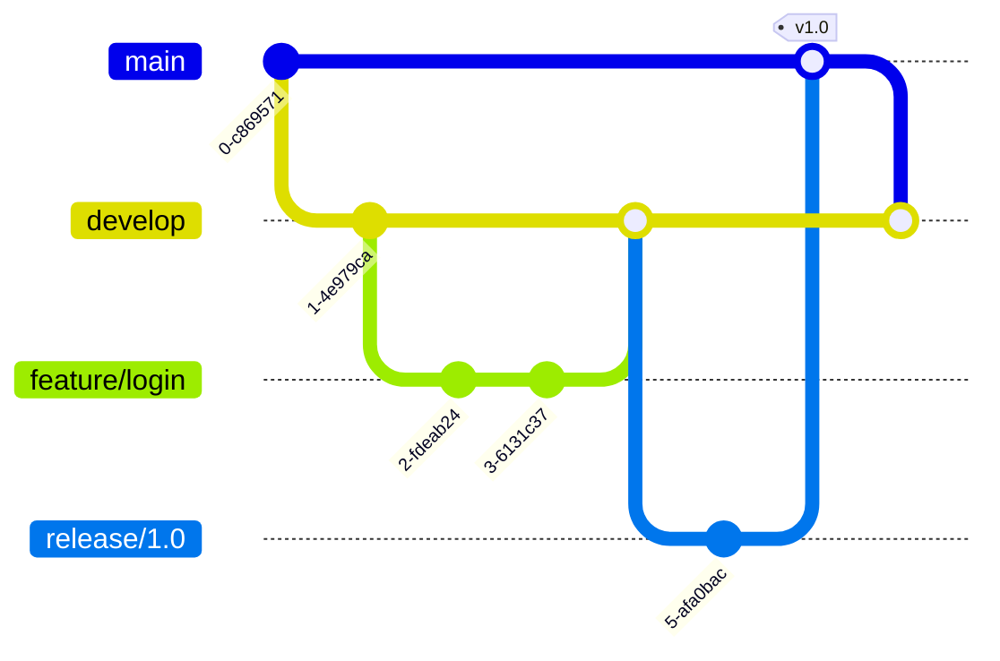
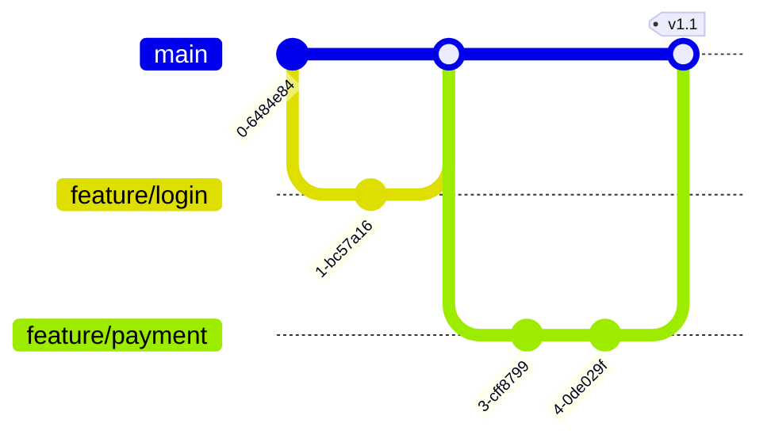

# CICD Web Application

## Introduction

Continuous Integration and Continuous Deployment (CI/CD) is a modern software development practice that enables developers to deliver code changes more frequently and reliably. In this tutorial, we'll explore how to set up a CI/CD pipeline for a web application, allowing you to automatically test, build, and deploy your web applications whenever you push changes to your repository.

CI/CD helps bridge the gap between development and operations by automating the process of integrating code changes, running tests, and deploying applications. This automation reduces human error, increases development speed, and ensures consistent quality throughout the development lifecycle.

## What You'll Learn

- Understanding CI/CD concepts and benefits
- Setting up a basic web application for CI/CD
- Configuring automated testing
- Implementing continuous integration with GitHub Actions
- Deploying your application automatically to a hosting service
- Monitoring your CI/CD pipeline

## Prerequisites

- Basic knowledge of web development (HTML, CSS, JavaScript)
- A GitHub account
- Familiarity with Git commands
- Node.js installed on your computer

## Understanding CI/CD Concepts

Let's break down what CI/CD actually means:

**Continuous Integration (CI)** involves automatically testing code changes when they're pushed to a repository. This helps catch bugs early and ensures that new code doesn't break existing functionality.

**Continuous Deployment (CD)** extends CI by automatically deploying applications to production when all tests pass and code quality checks succeed.

Here's a simplified diagram of a CI/CD workflow:


## Setting Up a Basic Web Application

Let's start by creating a simple Express.js web application that we'll use to demonstrate CI/CD principles.

### Project Structure

First, create a new directory for your project and initialize it:

```bash
mkdir cicd-web-app
cd cicd-web-app
npm init -y
```

### Installing Dependencies

Now, let's install Express.js and some testing tools:

```bash
npm install express
npm install --save-dev jest supertest
```

### Creating the Web Application

Create an `app.js` file with a basic Express application:

```javascript
// app.js
const express = require('express');
const app = express();

app.use(express.json());

// Simple in-memory "database"
let items = [
  { id: 1, name: 'Item 1', completed: false },
  { id: 2, name: 'Item 2', completed: true }
];

// Get all items
app.get('/api/items', (req, res) => {
  res.json(items);
});

// Get a single item
app.get('/api/items/:id', (req, res) => {
  const item = items.find(i => i.id === parseInt(req.params.id));
  if (!item) return res.status(404).json({ message: 'Item not found' });
  res.json(item);
});

// Create a new item
app.post('/api/items', (req, res) => {
  const item = {
    id: items.length + 1,
    name: req.body.name,
    completed: req.body.completed || false
  };
  items.push(item);
  res.status(201).json(item);
});

// For testing purposes, we export the app
module.exports = app;
```

Next, create a `server.js` file to run the application:

```javascript
// server.js
const app = require('./app');
const PORT = process.env.PORT || 3000;

app.listen(PORT, () => {
  console.log(`Server running on port ${PORT}`);
});
```

### Setting Up Automated Testing

Create a tests directory and add a test file for our API:

```bash
mkdir tests
touch tests/api.test.js
```

Now, let's write some tests for our API endpoints:

```javascript
// tests/api.test.js
const request = require('supertest');
const app = require('../app');

describe('Items API', () => {
  test('GET /api/items should return all items', async () => {
    const response = await request(app).get('/api/items');
    expect(response.status).toBe(200);
    expect(response.body.length).toBeGreaterThan(0);
  });

  test('GET /api/items/:id should return a single item', async () => {
    const response = await request(app).get('/api/items/1');
    expect(response.status).toBe(200);
    expect(response.body.id).toBe(1);
  });

  test('POST /api/items should create a new item', async () => {
    const newItem = { name: 'Test Item', completed: false };
    const response = await request(app)
      .post('/api/items')
      .send(newItem);
    
    expect(response.status).toBe(201);
    expect(response.body.name).toBe('Test Item');
  });
});
```

Update your `package.json` to include test scripts:

```json
"scripts": {
  "start": "node server.js",
  "test": "jest --forceExit",
  "test:watch": "jest --watch"
}
```

You can now run your tests with:

```bash
npm test
```

Your test output should look something like this:

```
 PASS  tests/api.test.js
  Items API
    ✓ GET /api/items should return all items (19 ms)
    ✓ GET /api/items/:id should return a single item (3 ms)
    ✓ POST /api/items should create a new item (4 ms)

Test Suites: 1 passed, 1 total
Tests:       3 passed, 3 total
Snapshots:   0 total
Time:        1.5 s
```

## Setting Up Continuous Integration with GitHub Actions

Now, let's set up CI with GitHub Actions. First, initialize a Git repository and push it to GitHub:

```bash
git init
git add .
git commit -m "Initial commit"
```

Create a `.github/workflows` directory in your project:

```bash
mkdir -p .github/workflows
```

Now, create a CI workflow file:

```bash
touch .github/workflows/ci.yml
```

Add the following configuration to `ci.yml`:

```yaml
name: Node.js CI

on:
  push:
    branches: [ main ]
  pull_request:
    branches: [ main ]

jobs:
  build:
    runs-on: ubuntu-latest

    strategy:
      matrix:
        node-version: [14.x, 16.x, 18.x]

    steps:
    - uses: actions/checkout@v2
    - name: Use Node.js ${{ matrix.node-version }}
      uses: actions/setup-node@v2
      with:
        node-version: ${{ matrix.node-version }}
        cache: 'npm'
    - run: npm ci
    - run: npm test
```

This workflow will run your tests whenever you push to the main branch or create a pull request.

## Implementing Continuous Deployment

Let's now set up continuous deployment to automatically deploy our application to a cloud provider when tests pass on the main branch. We'll use Heroku for this example.

First, add a `Procfile` for Heroku:

```
web: node server.js
```

Now, let's create a deployment workflow:

```bash
touch .github/workflows/cd.yml
```

Add the following configuration to `cd.yml`:

```yaml
name: Deploy to Heroku

on:
  push:
    branches: [ main ]

jobs:
  build:
    runs-on: ubuntu-latest
    steps:
    - uses: actions/checkout@v2
    - uses: actions/setup-node@v2
      with:
        node-version: '16.x'
        cache: 'npm'
    - run: npm ci
    - run: npm test
    
    - name: Deploy to Heroku
      uses: akhileshns/heroku-deploy@v3.12.12
      with:
        heroku_api_key: ${{ secrets.HEROKU_API_KEY }}
        heroku_app_name: ${{ secrets.HEROKU_APP_NAME }}
        heroku_email: ${{ secrets.HEROKU_EMAIL }}
```

To make this work, you'll need to set up Heroku secrets in your GitHub repository:

1. Create a Heroku account and create a new app
2. Generate an API key from your Heroku account settings
3. Add the following secrets to your GitHub repository:
   - `HEROKU_API_KEY`: Your Heroku API key
   - `HEROKU_APP_NAME`: Your Heroku app name
   - `HEROKU_EMAIL`: Your Heroku account email

## Enhancing Your CI/CD Pipeline

### Adding Code Quality Checks

Let's add ESLint to our project to enforce code quality:

```bash
npm install --save-dev eslint
npx eslint --init
```

Create a test script for linting in `package.json`:

```json
"scripts": {
  "lint": "eslint ."
}
```

Update your CI workflow to include linting:

```yaml
- run: npm run lint
```

### Adding Code Coverage Reports

Add Jest code coverage to your tests:

```json
"scripts": {
  "test": "jest --coverage --forceExit"
}
```

### Environment-Specific Configurations

Create a `.env.example` file and add configuration variables:

```
PORT=3000
NODE_ENV=development
```

Use the `dotenv` package to load environment variables:

```bash
npm install dotenv
```

Update your `server.js` file:

```javascript
// server.js
require('dotenv').config();
const app = require('./app');
const PORT = process.env.PORT || 3000;

app.listen(PORT, () => {
  console.log(`Server running on port ${PORT} in ${process.env.NODE_ENV} mode`);
});
```

## Monitoring Your CI/CD Pipeline

To monitor your CI/CD pipeline, you can:

1. Set up notifications for workflow failures using GitHub's notification settings
2. Integrate with Slack, Discord, or email for real-time alerts
3. Use the GitHub Actions dashboard to view workflow runs and statuses

## Real-World Example: Complete CI/CD Pipeline

Here's a comprehensive CI/CD workflow for a production web application:

```yaml
name: Complete CI/CD Pipeline

on:
  push:
    branches: [ main, develop ]
  pull_request:
    branches: [ main, develop ]

jobs:
  test:
    runs-on: ubuntu-latest
    steps:
    - uses: actions/checkout@v2
    - name: Set up Node.js
      uses: actions/setup-node@v2
      with:
        node-version: '16.x'
        cache: 'npm'
    - name: Install dependencies
      run: npm ci
    - name: Run linter
      run: npm run lint
    - name: Run tests with coverage
      run: npm test

  build:
    needs: test
    if: github.event_name == 'push' && (github.ref == 'refs/heads/main' || github.ref == 'refs/heads/develop')
    runs-on: ubuntu-latest
    steps:
    - uses: actions/checkout@v2
    - name: Set up Node.js
      uses: actions/setup-node@v2
      with:
        node-version: '16.x'
        cache: 'npm'
    - name: Install dependencies
      run: npm ci
    - name: Build application
      run: npm run build
    - name: Upload build artifacts
      uses: actions/upload-artifact@v2
      with:
        name: build
        path: ./build

  deploy-staging:
    needs: build
    if: github.ref == 'refs/heads/develop'
    runs-on: ubuntu-latest
    steps:
    - uses: actions/checkout@v2
    - name: Download build artifacts
      uses: actions/download-artifact@v2
      with:
        name: build
        path: ./build
    - name: Deploy to staging
      uses: akhileshns/heroku-deploy@v3.12.12
      with:
        heroku_api_key: ${{ secrets.HEROKU_API_KEY }}
        heroku_app_name: ${{ secrets.HEROKU_STAGING_APP_NAME }}
        heroku_email: ${{ secrets.HEROKU_EMAIL }}

  deploy-production:
    needs: build
    if: github.ref == 'refs/heads/main'
    runs-on: ubuntu-latest
    steps:
    - uses: actions/checkout@v2
    - name: Download build artifacts
      uses: actions/download-artifact@v2
      with:
        name: build
        path: ./build
    - name: Deploy to production
      uses: akhileshns/heroku-deploy@v3.12.12
      with:
        heroku_api_key: ${{ secrets.HEROKU_API_KEY }}
        heroku_app_name: ${{ secrets.HEROKU_PRODUCTION_APP_NAME }}
        heroku_email: ${{ secrets.HEROKU_EMAIL }}
```

This workflow:
1. Runs tests on all branches and pull requests
2. Builds the application for `main` and `develop` branches
3. Deploys to staging for the `develop` branch
4. Deploys to production for the `main` branch

## Branching Strategies for CI/CD

A successful CI/CD pipeline often relies on a well-defined branching strategy. Here are some popular approaches:

### GitFlow



### Trunk-Based Development



## Summary

In this tutorial, we've explored how to set up a complete CI/CD pipeline for a web application. We learned:

1. How to create a basic Express.js application with automated tests
2. Setting up continuous integration with GitHub Actions
3. Implementing continuous deployment to Heroku
4. Adding code quality checks and test coverage
5. Creating a complete CI/CD workflow with staging and production environments
6. Different branching strategies for CI/CD

By implementing CI/CD practices, you can:
- Reduce manual errors during deployment
- Catch bugs early in the development cycle
- Deploy more frequently with confidence
- Increase team productivity
- Improve code quality and maintainability

## Additional Resources

- [GitHub Actions Documentation](https://docs.github.com/en/actions)
- [Jest Testing Framework](https://jestjs.io/)
- [Express.js Documentation](https://expressjs.com/)
- [Heroku DevCenter](https://devcenter.heroku.com/)

## Exercises

1. Add a feature to the sample application and create a new workflow that deploys to different environments based on Git tags.
2. Implement database migrations in your CI/CD pipeline.
3. Set up end-to-end tests using Cypress and integrate them into your workflow.
4. Create a workflow that generates and publishes API documentation when code changes.
5. Implement security scanning in your CI/CD pipeline using a tool like OWASP ZAP.