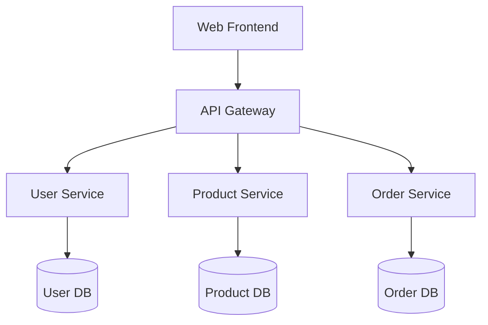
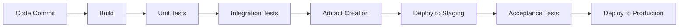
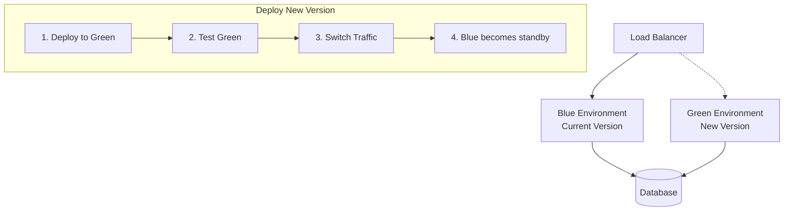

# CICD Microservice

## Introduction

In modern software development, microservices and CI/CD (Continuous Integration/Continuous Deployment) represent two powerful concepts that work exceptionally well together. This tutorial will guide you through implementing a CI/CD pipeline for a microservice architecture, helping you automate testing, build, and deployment processes.

A microservice architecture breaks down applications into small, independent services that communicate via APIs. When combined with CI/CD practices, you gain the ability to rapidly develop, test, and deploy individual services without affecting the entire application.

## What You'll Learn

- Understanding microservices and CI/CD fundamentals
- Setting up a CI/CD pipeline for a simple microservice
- Automating tests, builds, and deployments
- Implementing best practices for microservice CI/CD

## Prerequisites

- Basic knowledge of Docker and containerization
- Familiarity with Git version control
- Basic understanding of web services
- A GitHub account

## Understanding Microservices

Microservices architecture breaks down an application into smaller, loosely coupled services that:

1. Focus on specific business capabilities
2. Can be developed, deployed, and scaled independently
3. Communicate via well-defined APIs
4. Can use different technologies and databases

Let's visualize a simple microservice architecture:



## CI/CD Pipeline Explained

A CI/CD pipeline automates the software delivery process. It consists of:

1. **Continuous Integration (CI)**: Automatically build and test code changes
2. **Continuous Delivery**: Prepare code for deployment
3. **Continuous Deployment (CD)**: Automatically deploy code to production

Here's what a typical CI/CD pipeline looks like:



## Project: Creating a CI/CD Pipeline for a Weather Microservice

Let's create a simple weather microservice and build a CI/CD pipeline for it.

### Step 1: Create a Simple Weather Microservice

First, let's create a simple weather service using Node.js and Express:

```javascript
// server.js
const express = require('express');
const app = express();
const port = process.env.PORT || 3000;

// Weather data (in a real service, this would come from a database or external API)
const weatherData = {
  'new york': { temp: 20, condition: 'Sunny' },
  'london': { temp: 15, condition: 'Cloudy' },
  'tokyo': { temp: 25, condition: 'Rainy' },
  'sydney': { temp: 28, condition: 'Clear' }
};

app.get('/weather/:city', (req, res) => {
  const city = req.params.city.toLowerCase();
  if (weatherData[city]) {
    res.json(weatherData[city]);
  } else {
    res.status(404).json({ error: 'City not found' });
  }
});

app.get('/health', (req, res) => {
  res.status(200).json({ status: 'UP' });
});

app.listen(port, () => {
  console.log(`Weather service listening at http://localhost:${port}`);
});
```

Create a `package.json` file:

```json
{
  "name": "weather-microservice",
  "version": "1.0.0",
  "description": "Simple weather microservice",
  "main": "server.js",
  "scripts": {
    "start": "node server.js",
    "test": "jest"
  },
  "dependencies": {
    "express": "^4.17.1"
  },
  "devDependencies": {
    "jest": "^27.0.6",
    "supertest": "^6.1.3"
  }
}
```

Add some tests in `server.test.js`:

```javascript
const request = require('supertest');
const express = require('express');
const app = express();

// Import the route handlers
const weatherData = {
  'new york': { temp: 20, condition: 'Sunny' },
  'london': { temp: 15, condition: 'Cloudy' },
  'tokyo': { temp: 25, condition: 'Rainy' },
  'sydney': { temp: 28, condition: 'Clear' }
};

app.get('/weather/:city', (req, res) => {
  const city = req.params.city.toLowerCase();
  if (weatherData[city]) {
    res.json(weatherData[city]);
  } else {
    res.status(404).json({ error: 'City not found' });
  }
});

app.get('/health', (req, res) => {
  res.status(200).json({ status: 'UP' });
});

describe('Weather API', () => {
  test('GET /weather/london should return London weather', async () => {
    const response = await request(app).get('/weather/london');
    expect(response.status).toBe(200);
    expect(response.body).toEqual({ temp: 15, condition: 'Cloudy' });
  });

  test('GET /weather/unknown should return 404', async () => {
    const response = await request(app).get('/weather/unknown');
    expect(response.status).toBe(404);
  });

  test('GET /health should return UP status', async () => {
    const response = await request(app).get('/health');
    expect(response.status).toBe(200);
    expect(response.body.status).toBe('UP');
  });
});
```

### Step 2: Containerize the Microservice

Create a `Dockerfile`:

```dockerfile
FROM node:14-alpine

WORKDIR /app

COPY package*.json ./
RUN npm install --production

COPY server.js ./

EXPOSE 3000

HEALTHCHECK --interval=30s --timeout=3s --start-period=5s --retries=3 \
  CMD wget -qO- http://localhost:3000/health || exit 1

CMD ["node", "server.js"]
```

### Step 3: Set Up GitHub Actions for CI/CD

Create a workflow file in `.github/workflows/main.yml`:

```yaml
name: Weather Microservice CI/CD

on:
  push:
    branches: [ main ]
  pull_request:
    branches: [ main ]

jobs:
  build:
    runs-on: ubuntu-latest
    
    steps:
    - uses: actions/checkout@v2
    
    - name: Setup Node.js
      uses: actions/setup-node@v2
      with:
        node-version: '14'
        
    - name: Install dependencies
      run: npm install
      
    - name: Run tests
      run: npm test
      
    - name: Build and push Docker image
      if: github.event_name == 'push' && github.ref == 'refs/heads/main'
      uses: docker/build-push-action@v2
      with:
        context: .
        push: true
        tags: yourregistry/weather-microservice:latest
      env:
        DOCKER_USERNAME: ${{ secrets.DOCKER_USERNAME }}
        DOCKER_PASSWORD: ${{ secrets.DOCKER_PASSWORD }}

  deploy:
    needs: build
    if: github.event_name == 'push' && github.ref == 'refs/heads/main'
    runs-on: ubuntu-latest
    
    steps:
    - name: Deploy to staging
      run: |
        echo "Deploying to staging environment"
        # In a real project, you would include deployment commands here
        # For example, using kubectl to update a Kubernetes deployment
        
    - name: Run integration tests
      run: |
        echo "Running integration tests against staging"
        # In a real project, you would run tests against your staging environment
        
    - name: Deploy to production
      run: |
        echo "Deploying to production environment"
        # In a real project, you would include production deployment commands
```

### Step 4: Implement Feature Branches and Pull Requests

A key part of CI/CD for microservices is using feature branches. Here's how the workflow typically goes:

1. Create a new branch for a feature or bug fix
2. Make your changes and push to that branch
3. Create a Pull Request (PR) to merge your changes into the main branch
4. Automated tests run on your PR
5. Code is reviewed by team members
6. Once approved and tests pass, merge into main branch
7. The CI/CD pipeline automatically deploys the changes

## Best Practices for Microservice CI/CD

### 1. Independent Pipelines

Each microservice should have its own CI/CD pipeline. This ensures:

- Changes to one service don't affect others
- Faster builds and deployments
- Service-specific testing and validation

Example folder structure:

```
/microservices
  /weather-service
    /src
    Dockerfile
    .github/workflows/weather-service-pipeline.yml
  /user-service
    /src
    Dockerfile
    .github/workflows/user-service-pipeline.yml
```

### 2. Versioning Strategy

Implement proper versioning for your microservices:

```javascript
// Add to your Express app
app.get('/version', (req, res) => {
  res.json({
    name: 'weather-service',
    version: '1.0.3',
    commit: process.env.COMMIT_HASH || 'development'
  });
});
```

Ensure each build is tagged with a unique version:

```yaml
# In your CI/CD pipeline
- name: Set version
  run: |
    COMMIT_SHORT=$(git rev-parse --short HEAD)
    VERSION=$(cat package.json | jq -r .version)
    DOCKER_TAG="$VERSION-$COMMIT_SHORT"
    echo "DOCKER_TAG=$DOCKER_TAG" >> $GITHUB_ENV
    
- name: Build and push Docker image
  uses: docker/build-push-action@v2
  with:
    tags: yourregistry/weather-service:${{ env.DOCKER_TAG }}
```

### 3. Environment-Specific Deployments

Set up configuration for different environments:

```javascript
// config.js
const config = {
  development: {
    logLevel: 'debug',
    externalApiUrl: 'https://dev-api.example.com'
  },
  staging: {
    logLevel: 'info',
    externalApiUrl: 'https://staging-api.example.com'
  },
  production: {
    logLevel: 'warn',
    externalApiUrl: 'https://api.example.com'
  }
};

const env = process.env.NODE_ENV || 'development';
module.exports = config[env];
```

### 4. Automated Testing Layers

Implement multiple testing layers:

1. **Unit tests**: Test individual functions
2. **Integration tests**: Test service APIs
3. **Contract tests**: Verify service interactions
4. **End-to-end tests**: Test complete user flows

Example contract test:

```javascript
// contract-test.js
const axios = require('axios');

describe('Weather service contract tests', () => {
  test('Weather API returns data in the expected format', async () => {
    const response = await axios.get('http://localhost:3000/weather/london');
    
    // Verify the contract
    expect(response.status).toBe(200);
    expect(response.data).toHaveProperty('temp');
    expect(typeof response.data.temp).toBe('number');
    expect(response.data).toHaveProperty('condition');
    expect(typeof response.data.condition).toBe('string');
  });
});
```

### 5. Monitoring and Observability

Include health checks and metrics endpoints:

```javascript
const promClient = require('prom-client');
const register = new promClient.Registry();

// Add metrics
const httpRequestDurationMicroseconds = new promClient.Histogram({
  name: 'http_request_duration_ms',
  help: 'Duration of HTTP requests in ms',
  labelNames: ['route', 'method', 'status'],
  buckets: [5, 10, 25, 50, 100, 250, 500, 1000]
});
register.registerMetric(httpRequestDurationMicroseconds);

// Middleware to track metrics
app.use((req, res, next) => {
  const end = httpRequestDurationMicroseconds.startTimer();
  res.on('finish', () => {
    end({ route: req.path, method: req.method, status: res.statusCode });
  });
  next();
});

// Metrics endpoint
app.get('/metrics', async (req, res) => {
  res.set('Content-Type', register.contentType);
  res.end(await register.metrics());
});
```

## Practical Example: Blue-Green Deployment

A popular deployment strategy for microservices is Blue-Green deployment:



Implementation in Kubernetes:

```yaml
# kubernetes-deploy.yaml
apiVersion: apps/v1
kind: Deployment
metadata:
  name: weather-service-green
spec:
  replicas: 3
  selector:
    matchLabels:
      app: weather-service
      version: green
  template:
    metadata:
      labels:
        app: weather-service
        version: green
    spec:
      containers:
      - name: weather-service
        image: yourregistry/weather-service:${DOCKER_TAG}
        ports:
        - containerPort: 3000
        env:
        - name: NODE_ENV
          value: production
```

CI/CD step to switch traffic:

```yaml
- name: Switch traffic to new deployment
  if: success()
  run: |
    # Update the service to point to the green deployment
    kubectl patch service weather-service -p '{"spec":{"selector":{"version":"green"}}}'
    
    # Wait for traffic to stabilize
    sleep 30
    
    # Verify deployment
    ERRORS=$(kubectl logs -l app=weather-service,version=green --tail=100 | grep ERROR | wc -l)
    if [ $ERRORS -gt 0 ]; then
      # Rollback if errors detected
      kubectl patch service weather-service -p '{"spec":{"selector":{"version":"blue"}}}'
      exit 1
    fi
    
    # Rename deployments for next cycle
    kubectl patch deployment weather-service-blue -p '{"metadata":{"name":"weather-service-old"}}'
    kubectl patch deployment weather-service-green -p '{"metadata":{"name":"weather-service-blue"}}'
    kubectl patch deployment weather-service-old -p '{"spec":{"replicas":0}}'
```

## Hands-on Exercise: Build Your Own Microservice CI/CD Pipeline

Now, let's apply what you've learned:

1. Create a simple microservice (can be the weather service from this tutorial)
2. Set up GitHub Actions CI/CD for your repository
3. Implement automated testing
4. Create a containerized deployment
5. Set up multiple environments (dev, staging)

### Exercise Steps:

1. Fork the starter code repository (you can use the code snippets from this tutorial)
2. Complete the CI/CD pipeline configuration
3. Add at least one new feature to the microservice
4. Create a Pull Request with your changes
5. Observe the CI/CD pipeline in action

## Summary

In this tutorial, you've learned:

- How to combine microservices with CI/CD practices
- Setting up a basic CI/CD pipeline using GitHub Actions
- Containerizing a microservice with Docker
- Implementing automated testing
- Best practices for microservice deployments
- Advanced deployment strategies like Blue-Green deployments

These skills form the foundation of modern DevOps practices for microservice architectures. By automating your build, test, and deployment processes, you can focus on developing new features while maintaining high reliability and quality.

## Additional Resources

- [Martin Fowler's Microservices Guide](https://martinfowler.com/articles/microservices.html)
- [GitHub Actions Documentation](https://docs.github.com/en/actions)
- [Docker Documentation](https://docs.docker.com/)
- [Kubernetes Documentation](https://kubernetes.io/docs/home/)
- [The Twelve-Factor App Methodology](https://12factor.net/)

## What's Next?

Continue your learning journey with these related topics:

- **Service Mesh**: Implementing Istio or Linkerd for microservice communication
- **API Gateways**: Using Kong or AWS API Gateway to manage service APIs
- **Infrastructure as Code**: Learning Terraform or AWS CloudFormation
- **Observability**: Setting up logging, monitoring, and tracing for microservices