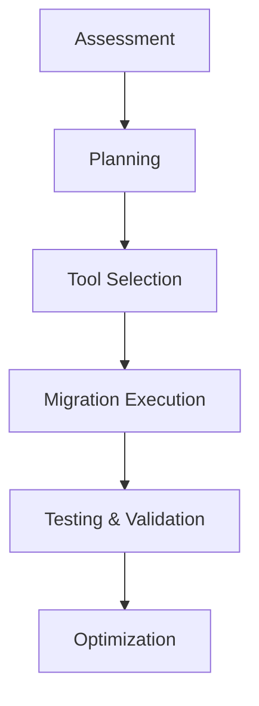

# CICD Cloud Migration

## Introduction

Continuous Integration and Continuous Delivery (CI/CD) pipelines form the backbone of modern software development. As organizations grow, migrating these pipelines to cloud environments becomes essential for scalability, flexibility, and efficiency. This guide will walk you through the process of migrating your existing CI/CD workflows to cloud-based solutions, helping you leverage the power of cloud computing for your development processes.

Cloud migration for CI/CD involves moving your build, test, and deployment processes from on-premises infrastructure to cloud platforms. This transition brings numerous benefits, including reduced maintenance overhead, improved scalability, and access to managed services.

## Understanding CI/CD Cloud Migration

### What is CI/CD?

Before diving into migration, let's ensure we understand the core concepts:

- **Continuous Integration (CI)**: The practice of frequently merging code changes into a central repository, followed by automated builds and tests
- **Continuous Delivery (CD)**: The ability to release software to production at any time through automation
- **CI/CD Pipeline**: A series of automated steps that code changes go through from development to production

### Why Migrate to the Cloud?

Migrating your CI/CD pipelines to the cloud offers several advantages:

1. **Scalability**: Cloud resources can scale up or down based on demand
2. **Cost-efficiency**: Pay only for what you use
3. **Managed services**: Reduce maintenance overhead
4. **Global availability**: Deploy closer to your users
5. **Integration**: Easy integration with other cloud services

## Step-by-Step Migration Process

Let's break down the migration process into manageable steps:



### 1. Assessment

Begin by assessing your current CI/CD infrastructure:

```javascript
// Example assessment checklist
const cicdAssessment = {
  currentTools: ['Jenkins', 'Maven', 'SonarQube'],
  buildFrequency: '15 daily builds',
  pipelineSteps: ['compile', 'unit test', 'integration test', 'deploy'],
  infrastructure: 'On-premise VMs',
  painPoints: ['Scaling during peak times', 'Maintenance overhead'],
  securityRequirements: ['Secrets management', 'Compliance checks']
};
```

Document your current workflows, dependencies, and requirements. Identify pain points and opportunities for improvement during migration.

### 2. Planning

Create a detailed migration plan:

- Set clear objectives and success criteria
- Define timeline and phases
- Identify risks and mitigation strategies
- Allocate resources and responsibilities

Example planning document:

```yaml
migration_plan:
  objectives:
    - Reduce build time by 40%
    - Eliminate maintenance overhead
    - Improve scalability for peak development periods
  
  phases:
    - name: Pilot
      duration: 2 weeks
      description: Migrate one non-critical project
    
    - name: Production Migration
      duration: 4 weeks
      description: Migrate remaining projects in batches
    
    - name: Optimization
      duration: Ongoing
      description: Continuous improvement of cloud pipelines
  
  risks:
    - description: Knowledge gap in cloud technologies
      mitigation: Training and documentation
    
    - description: Service disruptions during migration
      mitigation: Parallel pipelines and gradual cutover
```

### 3. Tool Selection

Choose the appropriate cloud CI/CD tools based on your requirements:

| Cloud Provider | CI/CD Services |
|----------------|----------------|
| AWS | CodePipeline, CodeBuild, CodeDeploy |
| Azure | Azure DevOps, Azure Pipelines |
| Google Cloud | Cloud Build, Cloud Deploy |
| Platform Agnostic | GitHub Actions, GitLab CI, CircleCI |

Consider factors like:
- Integration with your existing tools
- Language and framework support
- Pricing model
- Ease of use and learning curve

### 4. Migration Execution

Let's look at a practical example of migrating from Jenkins to GitHub Actions:

1. **Create a GitHub Actions workflow file**:

```yaml
# .github/workflows/build-deploy.yml
name: Build and Deploy

on:
  push:
    branches: [ main ]
  pull_request:
    branches: [ main ]

jobs:
  build:
    runs-on: ubuntu-latest
    
    steps:
    - uses: actions/checkout@v3
    
    - name: Set up JDK 17
      uses: actions/setup-java@v3
      with:
        java-version: '17'
        distribution: 'temurin'
        
    - name: Build with Maven
      run: mvn -B package --file pom.xml
      
    - name: Run tests
      run: mvn test
      
    - name: Upload artifact
      uses: actions/upload-artifact@v3
      with:
        name: app-package
        path: target/*.jar
        
  deploy:
    needs: build
    runs-on: ubuntu-latest
    if: github.ref == 'refs/heads/main'
    
    steps:
    - uses: actions/download-artifact@v3
      with:
        name: app-package
        
    - name: Deploy to AWS Elastic Beanstalk
      uses: einaregilsson/beanstalk-deploy@v21
      with:
        aws_access_key: ${{ secrets.AWS_ACCESS_KEY_ID }}
        aws_secret_key: ${{ secrets.AWS_SECRET_ACCESS_KEY }}
        application_name: my-application
        environment_name: production
        version_label: ${{ github.sha }}
        region: us-east-1
        deployment_package: *.jar
```

2. **Set up secrets**: Configure necessary credentials in your cloud provider's secrets management system.

3. **Migrate build artifacts**: Move build artifacts to cloud storage.

```javascript
// Example code to upload artifacts to AWS S3
const AWS = require('aws-sdk');
const fs = require('fs');

const s3 = new AWS.S3();

// Upload build artifact to S3
async function uploadBuildArtifact(filePath, bucketName, key) {
  const fileContent = fs.readFileSync(filePath);
  
  const params = {
    Bucket: bucketName,
    Key: key,
    Body: fileContent
  };
  
  try {
    const data = await s3.upload(params).promise();
    console.log(`File uploaded successfully: ${data.Location}`);
    return data.Location;
  } catch (err) {
    console.error("Error uploading file:", err);
    throw err;
  }
}

// Example usage
uploadBuildArtifact(
  './target/myapp.jar',
  'my-build-artifacts-bucket',
  'builds/myapp-1.0.jar'
);
```

4. **Update deployment configurations**: Modify your deployment scripts to use cloud resources.

### 5. Testing and Validation

Before completely switching over:

- Run parallel pipelines (old and new)
- Compare build times and success rates
- Validate deployment outcomes
- Test rollback procedures

Example testing checklist:

```json
{
  "validationTests": [
    {
      "name": "Build time comparison",
      "description": "Compare build times between on-prem and cloud",
      "successCriteria": "Cloud build must be at least 30% faster"
    },
    {
      "name": "Artifact consistency",
      "description": "Verify artifacts generated in both pipelines are identical",
      "successCriteria": "100% binary match between artifacts"
    },
    {
      "name": "Deployment success",
      "description": "Verify successful deployments from cloud pipeline",
      "successCriteria": "Zero failures in 20 consecutive deployments"
    },
    {
      "name": "Rollback capability",
      "description": "Test ability to roll back to previous version",
      "successCriteria": "Rollback completes within 5 minutes"
    }
  ]
}
```

### 6. Optimization

Once your migration is complete, focus on optimization:

- Implement caching strategies to speed up builds
- Use container-based builds for consistency
- Leverage cloud-native features like serverless computing
- Implement cost monitoring and optimization

Example AWS CodeBuild optimization with caching:

```yaml
version: 0.2

phases:
  install:
    runtime-versions:
      nodejs: 16
  pre_build:
    commands:
      - echo Installing dependencies...
      - npm install
  build:
    commands:
      - echo Building project...
      - npm run build
  post_build:
    commands:
      - echo Build completed...

artifacts:
  files:
    - '**/*'
  base-directory: 'build'

cache:
  paths:
    - 'node_modules/**/*'    # Cache node_modules for faster builds
    - '.next/cache/**/*'      # Cache Next.js build cache
```

## Real-World Migration Case Study

Let's look at a practical case study of migrating from an on-premises Jenkins setup to AWS-managed CI/CD services:

### Before Migration:

- Jenkins server running on a dedicated VM
- Manual scaling during peak times
- Regular maintenance windows for updates
- Limited parallel jobs due to resource constraints
- Manual security patching

### After Migration to AWS:

- AWS CodePipeline for orchestration
- AWS CodeBuild for build and test
- AWS CodeDeploy for deployment
- S3 for artifact storage
- CloudWatch for monitoring

The migration resulted in:

- 60% reduction in build times
- Zero maintenance overhead
- Automatic scaling during peak development periods
- Improved security with managed services
- Cost reduction through pay-as-you-go model

## Best Practices

To ensure a successful migration:

1. **Start small**: Begin with a non-critical project
2. **Implement infrastructure as code**: Use tools like Terraform or CloudFormation to define your CI/CD infrastructure
3. **Automate everything**: Avoid manual steps in your pipeline
4. **Monitor and optimize**: Continuously monitor performance and costs
5. **Document extensively**: Create detailed documentation for your new cloud pipelines
6. **Train your team**: Ensure everyone understands the new tools and workflows

### Infrastructure as Code Example (Terraform)

```hcl
# AWS CodeBuild project definition using Terraform
resource "aws_codebuild_project" "app_build" {
  name          = "app-build-project"
  description   = "Builds our application"
  service_role  = aws_iam_role.codebuild_role.arn
  
  artifacts {
    type = "CODEPIPELINE"
  }
  
  environment {
    compute_type                = "BUILD_GENERAL1_SMALL"
    image                       = "aws/codebuild/amazonlinux2-x86_64-standard:3.0"
    type                        = "LINUX_CONTAINER"
    privileged_mode             = true
    
    environment_variable {
      name  = "ENV"
      value = "production"
    }
  }
  
  source {
    type      = "CODEPIPELINE"
    buildspec = "buildspec.yml"
  }
  
  cache {
    type     = "S3"
    location = "${aws_s3_bucket.build_cache.bucket}/cache"
  }
}

# CodePipeline definition
resource "aws_codepipeline" "app_pipeline" {
  name     = "app-pipeline"
  role_arn = aws_iam_role.codepipeline_role.arn
  
  artifact_store {
    location = aws_s3_bucket.artifact_store.bucket
    type     = "S3"
  }
  
  stage {
    name = "Source"
    
    action {
      name             = "Source"
      category         = "Source"
      owner            = "AWS"
      provider         = "CodeStarSourceConnection"
      version          = "1"
      output_artifacts = ["source_output"]
      
      configuration = {
        ConnectionArn    = aws_codestarconnections_connection.github.arn
        FullRepositoryId = "my-org/my-repo"
        BranchName       = "main"
      }
    }
  }
  
  stage {
    name = "Build"
    
    action {
      name             = "BuildAction"
      category         = "Build"
      owner            = "AWS"
      provider         = "CodeBuild"
      version          = "1"
      input_artifacts  = ["source_output"]
      output_artifacts = ["build_output"]
      
      configuration = {
        ProjectName = aws_codebuild_project.app_build.name
      }
    }
  }
  
  stage {
    name = "Deploy"
    
    action {
      name            = "DeployAction"
      category        = "Deploy"
      owner           = "AWS"
      provider        = "ElasticBeanstalk"
      version         = "1"
      input_artifacts = ["build_output"]
      
      configuration = {
        ApplicationName = aws_elastic_beanstalk_application.app.name
        EnvironmentName = aws_elastic_beanstalk_environment.prod.name
      }
    }
  }
}
```

## Common Challenges and Solutions

| Challenge | Solution |
|-----------|----------|
| Network connectivity | Use VPC endpoints or private connections |
| Secrets management | Use cloud provider's secrets manager |
| Permissions | Implement least privilege IAM policies |
| Build performance | Optimize build containers and implement caching |
| Cost management | Set up budget alerts and optimize resource usage |

### Example: Implementing secrets management in GitHub Actions

```yaml
name: Deploy with Secrets

on:
  push:
    branches: [ main ]

jobs:
  deploy:
    runs-on: ubuntu-latest
    
    steps:
    - uses: actions/checkout@v3
    
    - name: Configure AWS credentials
      uses: aws-actions/configure-aws-credentials@v1
      with:
        aws-access-key-id: ${{ secrets.AWS_ACCESS_KEY_ID }}
        aws-secret-access-key: ${{ secrets.AWS_SECRET_ACCESS_KEY }}
        aws-region: us-east-1
        
    - name: Deploy to production
      run: |
        # Use secrets in deployment scripts
        aws s3 cp ./build s3://my-app-deployment-bucket/ --recursive
        aws cloudfront create-invalidation --distribution-id ${{ secrets.CLOUDFRONT_DISTRIBUTION_ID }} --paths "/*"
```

## Summary

Migrating your CI/CD pipelines to the cloud is a significant undertaking that brings substantial benefits in terms of scalability, maintenance, and capabilities. By following a structured approach—assessment, planning, tool selection, execution, validation, and optimization—you can ensure a smooth transition.

Remember that cloud migration is an opportunity not just to replicate your existing pipelines but to enhance them with cloud-native features. Take advantage of managed services, serverless computing, and infrastructure as code to build more robust, efficient, and scalable CI/CD workflows.

## Additional Resources and Exercises

### Resources

- Cloud provider CI/CD documentation:
  - [AWS Developer Tools](https://aws.amazon.com/products/developer-tools/)
  - [Azure DevOps](https://azure.microsoft.com/en-us/services/devops/)
  - [Google Cloud Build](https://cloud.google.com/build)
- GitHub Actions documentation
- Infrastructure as Code resources:
  - Terraform and CloudFormation tutorials

### Exercises

1. **Migration Planning Exercise**:
   - Document your current CI/CD workflow
   - Identify potential cloud tools that could replace each component
   - Create a phased migration plan

2. **Simple Pipeline Migration**:
   - Create a simple application (or use an existing one)
   - Set up a basic pipeline in your chosen cloud CI/CD service
   - Compare performance with your current pipeline

3. **Advanced Configuration**:
   - Implement caching in your cloud pipeline
   - Set up branch-specific deployment environments
   - Configure notifications for pipeline events

4. **Infrastructure as Code Practice**:
   - Define your CI/CD pipeline using Terraform or CloudFormation
   - Implement environment-specific configurations
   - Practice pipeline updates through code changes

By working through these exercises, you'll gain hands-on experience with cloud CI/CD migration and be better prepared to implement these practices in your own projects.