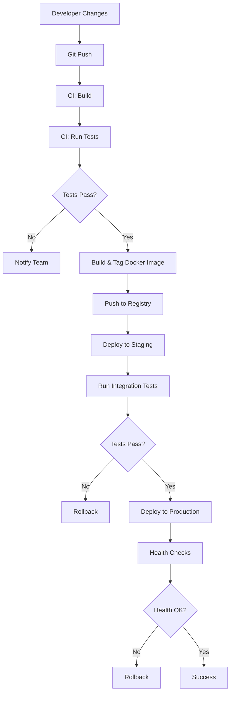

# CI/CD for Legacy Applications

## Introduction

Legacy applications present unique challenges when implementing modern software development practices like Continuous Integration and Continuous Deployment (CI/CD). These applications were often built in an era before automated testing, containerization, and cloud deployment were standard practices. They may rely on outdated technologies, lack proper documentation, and contain technical debt that makes them resistant to change.

In this guide, we'll explore how to gradually introduce CI/CD practices to legacy applications, allowing you to modernize your development workflow without a complete rewrite of your application.

## Understanding the Challenges

Legacy applications typically come with several obstacles to implementing CI/CD:

- **Limited or no automated tests**: Making changes safely becomes difficult
- **Manual deployment processes**: Often involving complex, undocumented steps
- **Monolithic architecture**: Tightly coupled components that are hard to deploy independently
- **Environment dependencies**: Reliance on specific OS versions, libraries, or hardware
- **Institutional knowledge**: Critical operational details may only exist in certain team members' heads

## Step-by-Step Implementation Strategy

### 1. Assessment and Documentation

Before making any changes, thoroughly document the current state:

```bash
# Example command to generate a dependency report
npm ls --prod > dependencies.txt

# For Java applications
mvn dependency:tree > dependencies.txt

# For .NET applications
nuget list -Source "C:\path\to\project" > dependencies.txt
```

Document the current manual deployment process, including:
- Server configurations
- Deployment steps
- Configuration files
- Database schema changes
- Required environment variables

### 2. Introduce Version Control

If not already using version control, this is your first step:

```bash
# Initialize a Git repository
git init

# Add all existing files
git add .

# Create initial commit
git commit -m "Initial commit of legacy application"

# Add remote repository
git remote add origin https://github.com/your-org/legacy-app.git
git push -u origin main
```

Create a `.gitignore` file to exclude sensitive data:

```
# .gitignore for a typical application
node_modules/
.env
*.log
config/secrets.yml
**/bin/
**/obj/
```

### 3. Set Up a Basic CI Pipeline

Start with a simple pipeline that just builds the application:

```yaml
# Example GitHub Actions workflow for a Java legacy application
name: Basic CI

on:
  push:
    branches: [ main ]
  pull_request:
    branches: [ main ]

jobs:
  build:
    runs-on: ubuntu-latest
    
    steps:
    - uses: actions/checkout@v3
    
    - name: Set up JDK
      uses: actions/setup-java@v3
      with:
        java-version: '8'
        distribution: 'adopt'
        
    - name: Build with Maven
      run: mvn -B package --file pom.xml
```

### 4. Containerize the Application

Create a Docker container to make the application environment consistent:

```dockerfile
# Example Dockerfile for a legacy Java application
FROM openjdk:8-jdk

WORKDIR /app

# Copy the application files
COPY target/*.jar app.jar

# Set environment variables if needed
ENV DB_HOST=localhost
ENV DB_PORT=5432

EXPOSE 8080

CMD ["java", "-jar", "app.jar"]
```

Build and test the container:

```bash
# Build the container
docker build -t legacy-app:latest .

# Run the container locally
docker run -p 8080:8080 legacy-app:latest
```

### 5. Create Automated Tests

Add basic smoke tests to verify the application starts correctly:

```javascript
// Simple smoke test using Jest
const axios = require('axios');

test('Application responds to health check', async () => {
  const response = await axios.get('http://localhost:8080/health');
  expect(response.status).toBe(200);
});
```

Gradually add more tests focusing on critical paths:

```java
// Example JUnit test for a Java application
@Test
public void testUserLogin() {
    User user = userService.login("testuser", "password123");
    assertNotNull(user);
    assertEquals("testuser", user.getUsername());
}
```

Update your CI pipeline to run these tests:

```yaml
# Add to your existing CI configuration
- name: Run tests
  run: mvn test
```

### 6. Implement Database Migration Strategy

For applications with databases, introduce a migration tool:

```javascript
// Example using Node.js with Sequelize migrations
const Migration = {
  up: async (queryInterface, Sequelize) => {
    await queryInterface.addColumn('Users', 'lastLoginDate', {
      type: Sequelize.DATE,
      allowNull: true
    });
  },
  down: async (queryInterface, Sequelize) => {
    await queryInterface.removeColumn('Users', 'lastLoginDate');
  }
};
```

Execute migrations during deployment:

```bash
# Run database migrations
sequelize db:migrate

# For Ruby on Rails
rails db:migrate

# For Django
python manage.py migrate
```

### 7. Set Up Continuous Deployment

Create a deployment script:

```bash
#!/bin/bash
# deploy.sh

# Pull the latest image
docker pull your-registry/legacy-app:latest

# Stop the current container
docker stop legacy-app || true

# Remove the old container
docker rm legacy-app || true

# Start the new container
docker run -d --name legacy-app -p 8080:8080 \
  -e DB_HOST=$DB_HOST \
  -e DB_PASSWORD=$DB_PASSWORD \
  your-registry/legacy-app:latest
```

### 8. Implement Feature Flags

Use feature flags to safely deploy changes:

```javascript
// Example implementation of feature flags
function isFeatureEnabled(featureName, userId) {
  const enabledFeatures = {
    'new-ui': ['user1', 'user2', 'user3'],
    'api-v2': ['user1'],
    'reporting-module': []
  };
  
  return enabledFeatures[featureName]?.includes(userId) || false;
}

// Using the feature flag in code
if (isFeatureEnabled('new-ui', currentUser.id)) {
  renderNewUI();
} else {
  renderLegacyUI();
}
```

### 9. Monitoring and Rollback Strategy

Implement basic monitoring to detect deployment issues:

```javascript
// Express.js middleware for monitoring
app.use((req, res, next) => {
  const startTime = Date.now();
  
  res.on('finish', () => {
    const duration = Date.now() - startTime;
    console.log(`${req.method} ${req.url} ${res.statusCode} - ${duration}ms`);
    
    if (res.statusCode >= 500) {
      notifyTeam(`Error ${res.statusCode} on ${req.url}`);
    }
  });
  
  next();
});
```

Create a rollback plan:

```bash
#!/bin/bash
# rollback.sh

# Pull the previous working version
docker pull your-registry/legacy-app:$PREVIOUS_VERSION

# Stop the current container
docker stop legacy-app

# Remove the current container
docker rm legacy-app

# Start the container with the previous version
docker run -d --name legacy-app -p 8080:8080 \
  -e DB_HOST=$DB_HOST \
  -e DB_PASSWORD=$DB_PASSWORD \
  your-registry/legacy-app:$PREVIOUS_VERSION

echo "Rolled back to version $PREVIOUS_VERSION"
```

## CI/CD Pipeline Architecture

Here's a visualization of the complete CI/CD pipeline for a legacy application:



## Real-World Example: Modernizing a Legacy PHP Application

Let's consider a real-world example of modernizing a legacy PHP application that was previously deployed manually via FTP:

### Before CI/CD:
1. Developer would make changes directly on their local machine
2. Testing was manual and inconsistent
3. Deployment involved FTP uploads of changed files
4. Configuration changes were applied manually
5. Database changes were executed with SQL scripts run by hand
6. No version control

### After CI/CD Implementation:

**1. Version Control Setup:**
```bash
git init
git add .
git commit -m "Initial commit"
git push -u origin main
```

**2. Containerization:**
```dockerfile
FROM php:7.4-apache

# Install dependencies
RUN apt-get update && apt-get install -y \
    libzip-dev \
    zip \
    && docker-php-ext-install zip pdo pdo_mysql

# Enable Apache modules
RUN a2enmod rewrite

# Copy application files
COPY . /var/www/html/
COPY config/apache-vhost.conf /etc/apache2/sites-available/000-default.conf

# Set permissions
RUN chown -R www-data:www-data /var/www/html

# Expose port 80
EXPOSE 80

CMD ["apache2-foreground"]
```

**3. CI Pipeline with GitHub Actions:**
```yaml
name: CI/CD Pipeline

on:
  push:
    branches: [ main ]
  pull_request:
    branches: [ main ]

jobs:
  build-and-test:
    runs-on: ubuntu-latest
    
    services:
      mysql:
        image: mysql:5.7
        env:
          MYSQL_ROOT_PASSWORD: rootpassword
          MYSQL_DATABASE: testdb
        ports:
          - 3306:3306
        options: --health-cmd="mysqladmin ping" --health-interval=10s --health-timeout=5s --health-retries=3
    
    steps:
    - uses: actions/checkout@v3
    
    - name: Setup PHP
      uses: shivammathur/setup-php@v2
      with:
        php-version: '7.4'
        extensions: zip, pdo, pdo_mysql
    
    - name: Install Composer dependencies
      run: composer install --no-progress --prefer-dist
    
    - name: Run PHPUnit tests
      run: vendor/bin/phpunit
      
    - name: Build Docker image
      run: docker build -t legacy-php-app:${{ github.sha }} .
      
    - name: Push to Container Registry
      if: github.ref == 'refs/heads/main'
      run: |
        echo ${{ secrets.REGISTRY_PASSWORD }} | docker login -u ${{ secrets.REGISTRY_USERNAME }} --password-stdin
        docker tag legacy-php-app:${{ github.sha }} your-registry/legacy-php-app:latest
        docker tag legacy-php-app:${{ github.sha }} your-registry/legacy-php-app:${{ github.sha }}
        docker push your-registry/legacy-php-app:latest
        docker push your-registry/legacy-php-app:${{ github.sha }}
```

**4. Database Migrations (using Phinx):**
```php
<?php
// db/migrations/20220101000000_add_user_last_login.php
use Phinx\Migration\AbstractMigration;

class AddUserLastLogin extends AbstractMigration
{
    public function change()
    {
        $table = $this->table('users');
        $table->addColumn('last_login', 'datetime', ['null' => true])
              ->update();
    }
}
```

**5. Deployment Script:**
```bash
#!/bin/bash
# Production deployment script

set -e

# Pull the latest image
docker pull your-registry/legacy-php-app:latest

# Run database migrations
docker run --rm \
  --network=production-network \
  -e DB_HOST=$DB_HOST \
  -e DB_USER=$DB_USER \
  -e DB_PASSWORD=$DB_PASSWORD \
  -e DB_NAME=$DB_NAME \
  your-registry/legacy-php-app:latest \
  vendor/bin/phinx migrate -e production

# Update the running container
docker stop php-app || true
docker rm php-app || true
docker run -d --name php-app \
  --network=production-network \
  -p 80:80 \
  -e DB_HOST=$DB_HOST \
  -e DB_USER=$DB_USER \
  -e DB_PASSWORD=$DB_PASSWORD \
  -e DB_NAME=$DB_NAME \
  your-registry/legacy-php-app:latest

# Verify deployment
echo "Waiting for application to start..."
sleep 5
HTTP_STATUS=$(curl -s -o /dev/null -w "%{http_code}" http://localhost/health)

if [ $HTTP_STATUS -ne 200 ]; then
  echo "Deployment failed! Rolling back..."
  docker stop php-app
  docker rm php-app
  docker run -d --name php-app \
    --network=production-network \
    -p 80:80 \
    -e DB_HOST=$DB_HOST \
    -e DB_USER=$DB_USER \
    -e DB_PASSWORD=$DB_PASSWORD \
    -e DB_NAME=$DB_NAME \
    your-registry/legacy-php-app:$PREVIOUS_VERSION
  exit 1
fi

echo "Deployment successful!"
```

## Benefits Achieved

After implementing CI/CD for this legacy application:

1. **Deployment time**: Reduced from hours to minutes
2. **Deployment frequency**: Increased from monthly to weekly or daily
3. **Defect rate**: Reduced by ~60% due to automated testing
4. **Onboarding time**: New developers can contribute within days instead of weeks
5. **Documentation**: Self-documenting infrastructure and deployment process
6. **Disaster recovery**: Recovery time reduced from days to hours

## Incremental Modernization Roadmap

Once you have basic CI/CD in place, consider these next steps:

1. **Refactor into microservices**: Gradually break the monolith into smaller services
2. **Improve test coverage**: Aim for at least 70% code coverage
3. **Implement infrastructure as code**: Define all infrastructure using tools like Terraform
4. **Add observability**: Implement logging, metrics, and tracing
5. **Automate security scanning**: Add vulnerability scanning to your CI/CD pipeline

## Summary

Implementing CI/CD for legacy applications is a gradual process that requires patience and careful planning. By taking an incremental approach, you can modernize your development and deployment processes without the risk of a complete rewrite.

The key steps to remember:
1. Start with documentation and version control
2. Containerize the application to ensure consistency
3. Implement automated testing, starting with smoke tests
4. Set up a basic CI pipeline that builds and tests
5. Create a deployment strategy with rollback capabilities
6. Gradually improve coverage and automation

By following these steps, you can bring modern DevOps practices to even the oldest legacy applications, improving reliability, reducing risk, and increasing your team's development velocity.

## Additional Resources

Here are some exercises to help you practice implementing CI/CD for legacy applications:

1. **Exercise 1**: Document the manual deployment process for an existing application
2. **Exercise 2**: Containerize a simple application that doesn't already use containers
3. **Exercise 3**: Create a basic CI pipeline for an application without existing automation
4. **Exercise 4**: Implement a feature flag system in an existing application
5. **Exercise 5**: Create a rollback plan and script for your application

## Advanced Topics

As you progress in your CI/CD journey with legacy applications, explore these advanced topics:

- Blue-Green Deployments
- Canary Releases
- A/B Testing Infrastructure
- Chaos Engineering
- GitOps Workflow Implementation