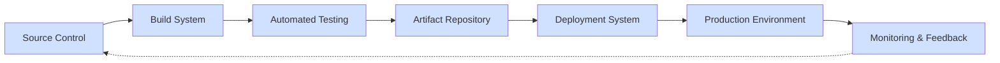
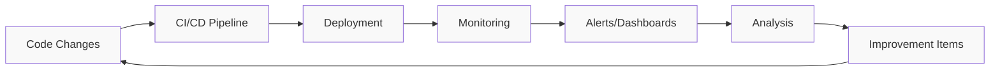

# CI/CD Enterprise Implementation

## Introduction

Continuous Integration and Continuous Deployment (CI/CD) forms the backbone of modern software development practices, especially in enterprise environments. This guide explores how to implement CI/CD processes in large organizations, where scale, security, and standardization present unique challenges.

CI/CD in enterprise settings involves automating the building, testing, and deployment of applications across complex infrastructures. Unlike smaller projects, enterprise implementations must consider factors like compliance requirements, multi-team collaboration, and integration with existing systems.

## Understanding Enterprise CI/CD

### What Makes Enterprise CI/CD Different?

Enterprise CI/CD implementations differ from smaller projects in several key ways:

- **Scale**: Supporting hundreds or thousands of developers and applications
- **Compliance**: Meeting regulatory requirements (SOX, HIPAA, PCI-DSS, etc.)
- **Governance**: Enforcing organizational standards and policies
- **Integration**: Working with existing enterprise systems and legacy applications
- **Security**: Implementing robust security controls and vulnerability management

### Key Components of Enterprise CI/CD



## Planning Your Enterprise CI/CD Implementation

### Assessment Phase

Before implementing CI/CD, conduct a thorough assessment of your current environment:

1. **Current State Analysis**: Document existing development and deployment processes
2. **Technology Inventory**: Catalog tools, platforms, and infrastructure components
3. **Skills Assessment**: Evaluate team capabilities and identify training needs
4. **Cultural Readiness**: Assess organizational readiness for DevOps transformation

### Strategy Development

Create a comprehensive implementation strategy that addresses:

- **Tool Selection**: Choose CI/CD tools that meet enterprise requirements
- **Reference Architecture**: Define standard patterns for different application types
- **Governance Model**: Establish policies for code reviews, approvals, and access controls
- **Implementation Roadmap**: Create a phased approach for rolling out CI/CD

## Building the Foundation

### Enterprise-Grade Source Control

Set up a robust source control system that supports:

- Branch protection and code review policies
- Fine-grained access controls
- Audit logging
- Integration with identity management systems

**Example Git Branch Strategy:**

```text
main             ●────●────●────●────●────●
                 │    │    │    │    └─── Production releases
                 │    │    │    │
release/1.0      │    │    │    ●────●────●
                 │    │    │    │         └─── Release branches
                 │    │    │    │
feature/login    │    ●────●────●
                 │    │         └─── Feature branches
                 │    │
hotfix/security  │    ●────●
                 │         └─── Hotfix branches
                 │
develop          ●────●────●────●────●────●
                      │         └─── Integration branch
                      │
```

### CI/CD Pipeline Infrastructure

Set up a scalable CI/CD infrastructure:

- **Build Agents**: Deploy build agents with appropriate capacity planning
- **Artifact Repository**: Implement a secure repository for storing build artifacts
- **Secrets Management**: Use a dedicated service for managing secrets and credentials
- **Infrastructure as Code**: Manage pipeline infrastructure using IaC tools

## Implementing CI/CD Pipelines

### Pipeline Structure

Enterprise CI/CD pipelines typically include these stages:

1. **Build**: Compile code and create artifacts
2. **Static Analysis**: Run code quality and security scans
3. **Unit Testing**: Execute automated unit tests
4. **Integration Testing**: Test component interactions
5. **Artifact Publishing**: Store build artifacts
6. **Deployment**: Deploy to target environments
7. **Acceptance Testing**: Run automated acceptance tests
8. **Compliance Verification**: Check compliance requirements
9. **Release Approval**: Manual or automated approval gates
10. **Production Deployment**: Controlled deployment to production

### Example Pipeline Configuration (Azure DevOps YAML)

```yaml
trigger:
  branches:
    include:
    - main
    - release/*

pool:
  vmImage: 'ubuntu-latest'

variables:
  buildConfiguration: 'Release'

stages:
- stage: Build
  jobs:
  - job: BuildAndTest
    steps:
    - task: DotNetCoreCLI@2
      displayName: 'Restore packages'
      inputs:
        command: 'restore'
        projects: '**/*.csproj'
    
    - task: DotNetCoreCLI@2
      displayName: 'Build'
      inputs:
        command: 'build'
        projects: '**/*.csproj'
        arguments: '--configuration $(buildConfiguration)'
    
    - task: DotNetCoreCLI@2
      displayName: 'Run unit tests'
      inputs:
        command: 'test'
        projects: '**/*Tests.csproj'
        arguments: '--configuration $(buildConfiguration) --collect "Code coverage"'
    
    - task: SonarCloudPrepare@1
      displayName: 'Prepare SonarCloud analysis'
      inputs:
        SonarCloud: 'SonarCloud'
        organization: 'myorg'
        scannerMode: 'MSBuild'
        projectKey: 'myproject'
        projectName: 'My Project'
    
    - task: SonarCloudAnalyze@1
      displayName: 'Run SonarCloud analysis'
    
    - task: SonarCloudPublish@1
      displayName: 'Publish SonarCloud quality gate results'
    
    - task: DotNetCoreCLI@2
      displayName: 'Publish web app'
      inputs:
        command: 'publish'
        publishWebProjects: true
        arguments: '--configuration $(buildConfiguration) --output $(Build.ArtifactStagingDirectory)'
        zipAfterPublish: true
    
    - task: PublishBuildArtifacts@1
      displayName: 'Publish artifacts'
      inputs:
        pathtoPublish: '$(Build.ArtifactStagingDirectory)'
        artifactName: 'webapp'

- stage: DeployDev
  dependsOn: Build
  jobs:
  - deployment: DeployToDev
    environment: 'Development'
    strategy:
      runOnce:
        deploy:
          steps:
          - task: AzureWebApp@1
            inputs:
              azureSubscription: 'Azure Dev'
              appName: 'myapp-dev'
              package: '$(Pipeline.Workspace)/webapp/*.zip'

- stage: DeployProd
  dependsOn: DeployDev
  jobs:
  - deployment: DeployToProd
    environment: 'Production'
    strategy:
      runOnce:
        deploy:
          steps:
          - task: AzureWebApp@1
            inputs:
              azureSubscription: 'Azure Prod'
              appName: 'myapp-prod'
              package: '$(Pipeline.Workspace)/webapp/*.zip'
```

## Security and Compliance in Enterprise CI/CD

### Security Controls

Implement these security controls in your CI/CD pipelines:

1. **Secure Dependencies**: Scan dependencies for vulnerabilities
2. **SAST & DAST**: Implement Static and Dynamic Application Security Testing
3. **Secrets Management**: Use dedicated secrets management solutions
4. **Least Privilege**: Apply principle of least privilege for all service accounts
5. **Artifact Signing**: Sign build artifacts to verify authenticity

### Example Vulnerability Scanning with OWASP Dependency-Check

```yaml
- task: dependency-check-build-task@5
  displayName: 'Check dependencies for vulnerabilities'
  inputs:
    projectName: '$(Build.Repository.Name)'
    scanPath: '$(Build.SourcesDirectory)'
    format: 'HTML,JSON'
    failOnCVSS: '7'

- task: PublishBuildArtifacts@1
  displayName: 'Publish security reports'
  inputs:
    pathtoPublish: '$(Common.TestResultsDirectory)'
    artifactName: 'SecurityReports'
```

### Compliance Automation

Automate compliance verification:

```yaml
- task: ComplianceAsCode@1
  displayName: 'Check compliance with corporate standards'
  inputs:
    policyRepository: 'corporate-policies'
    complianceThreshold: '100'
    reportFormat: 'HTML,JSON'

- task: PublishComplianceReport@1
  displayName: 'Publish compliance report'
  inputs:
    reportPath: '$(Common.TestResultsDirectory)/compliance'
    artifactName: 'ComplianceReports'
```

## Environment Management

### Environment Strategy

Define a robust environment strategy:

- **Development**: For individual developer testing
- **Integration**: For testing feature integration
- **QA/Test**: For quality assurance and testing
- **Staging/Pre-production**: Production-like environment for final validation
- **Production**: Live environment serving customers

### Infrastructure as Code (IaC)

Use IaC to manage environments consistently:

```yaml
# Example Terraform configuration for environment provisioning
- task: TerraformTaskV2@2
  displayName: 'Terraform Init'
  inputs:
    provider: 'aws'
    command: 'init'
    workingDirectory: '$(System.DefaultWorkingDirectory)/infrastructure'
    backendServiceAWS: 'AWS-Connection'
    backendAWSBucketName: 'terraform-state-bucket'
    backendAWSKey: 'dev/terraform.tfstate'

- task: TerraformTaskV2@2
  displayName: 'Terraform Plan'
  inputs:
    provider: 'aws'
    command: 'plan'
    workingDirectory: '$(System.DefaultWorkingDirectory)/infrastructure'
    environmentServiceNameAWS: 'AWS-Connection'
    commandOptions: '-var="environment=dev" -out=tfplan'

- task: TerraformTaskV2@2
  displayName: 'Terraform Apply'
  inputs:
    provider: 'aws'
    command: 'apply'
    workingDirectory: '$(System.DefaultWorkingDirectory)/infrastructure'
    environmentServiceNameAWS: 'AWS-Connection'
    commandOptions: 'tfplan'
```

## Deployment Strategies

### Implementing Deployment Patterns

Select appropriate deployment strategies for different application types:

1. **Blue-Green Deployment**: Maintain two identical environments and switch traffic
2. **Canary Releases**: Gradually roll out changes to a small subset of users
3. **Feature Flags**: Toggle features on/off without deploying new code
4. **Rolling Deployments**: Update instances in a rolling fashion

### Example Blue-Green Deployment (Kubernetes)

```yaml
# Deployment for the blue version
apiVersion: apps/v1
kind: Deployment
metadata:
  name: myapp-blue
  labels:
    app: myapp
    version: blue
spec:
  replicas: 3
  selector:
    matchLabels:
      app: myapp
      version: blue
  template:
    metadata:
      labels:
        app: myapp
        version: blue
    spec:
      containers:
      - name: myapp
        image: myregistry.io/myapp:1.0.0
        ports:
        - containerPort: 8080

---
# Deployment for the green version
apiVersion: apps/v1
kind: Deployment
metadata:
  name: myapp-green
  labels:
    app: myapp
    version: green
spec:
  replicas: 3
  selector:
    matchLabels:
      app: myapp
      version: green
  template:
    metadata:
      labels:
        app: myapp
        version: green
    spec:
      containers:
      - name: myapp
        image: myregistry.io/myapp:1.1.0
        ports:
        - containerPort: 8080

---
# Service to route traffic (initially to blue)
apiVersion: v1
kind: Service
metadata:
  name: myapp
spec:
  selector:
    app: myapp
    version: blue  # Switch to green when ready
  ports:
  - port: 80
    targetPort: 8080
```

## Monitoring and Feedback

### Implementing Observability

Set up comprehensive monitoring:

- **Metrics**: Track performance and usage metrics
- **Logs**: Centralize and analyze application logs
- **Traces**: Monitor request flows across services
- **Alerts**: Configure alerts for critical issues

### Feedback Loops

Create automated feedback mechanisms:



### Example Prometheus Monitoring Configuration

```yaml
# Prometheus configuration for application monitoring
global:
  scrape_interval: 15s

scrape_configs:
  - job_name: 'myapp'
    metrics_path: '/metrics'
    static_configs:
      - targets: ['myapp:8080']
    
  - job_name: 'kubernetes-pods'
    kubernetes_sd_configs:
      - role: pod
    relabel_configs:
      - source_labels: [__meta_kubernetes_pod_annotation_prometheus_io_scrape]
        action: keep
        regex: true
      - source_labels: [__meta_kubernetes_pod_annotation_prometheus_io_path]
        action: replace
        target_label: __metrics_path__
        regex: (.+)
```

## Scaling CI/CD for Enterprise

### Multi-repo Management

Implement strategies for managing multiple repositories:

- **Monorepo vs. Multi-repo**: Choose appropriate source code organization
- **Inner Source**: Internal open-source practices for shared components
- **Release Coordination**: Coordinate releases across multiple repositories

### Template-Based Pipeline Management

Use templates to standardize pipelines:

```yaml
# YAML template for standardized build steps
parameters:
  language: ''
  buildConfiguration: 'Release'

steps:
- ${{ if eq(parameters.language, 'dotnet') }}:
  - task: DotNetCoreCLI@2
    displayName: 'Restore packages'
    inputs:
      command: 'restore'
      projects: '**/*.csproj'
  
  - task: DotNetCoreCLI@2
    displayName: 'Build'
    inputs:
      command: 'build'
      projects: '**/*.csproj'
      arguments: '--configuration ${{ parameters.buildConfiguration }}'

- ${{ if eq(parameters.language, 'java') }}:
  - task: Maven@3
    displayName: 'Build Java project'
    inputs:
      mavenPomFile: 'pom.xml'
      goals: 'clean package'
      options: '-Dmaven.test.skip=false'
```

## Real-World Case Study: Global Financial Institution

### Challenge

A global financial institution needed to modernize their software delivery while maintaining strict compliance with financial regulations.

### Solution

1. **Tool Standardization**: Implemented standardized CI/CD tools across all development teams
2. **Security Gates**: Added automated security scanning at multiple pipeline stages
3. **Compliance Automation**: Automated compliance checks for all regulatory requirements
4. **Deployment Automation**: Implemented blue-green deployments for zero-downtime updates
5. **Centralized Governance**: Created a central DevOps team to govern CI/CD platform

### Results

- **Deployment Frequency**: Increased from bi-monthly to weekly releases
- **Lead Time**: Reduced from 45 days to 7 days
- **Change Failure Rate**: Decreased by 60%
- **Mean Time to Recovery**: Reduced from days to hours
- **Audit Preparation**: Reduced from weeks to days

## Best Practices for Enterprise CI/CD

### Technical Best Practices

1. **Pipeline as Code**: Define pipelines as code and store them in source control
2. **Everything as Code**: Apply IaC principles to all infrastructure
3. **Immutable Artifacts**: Build once, deploy everywhere
4. **Automated Testing**: Achieve high test coverage with automation
5. **Consistent Environments**: Ensure consistency across all environments

### Organizational Best Practices

1. **Executive Sponsorship**: Secure support from leadership
2. **DevOps Culture**: Foster collaboration between development and operations
3. **Training and Enablement**: Provide continuous learning opportunities
4. **Center of Excellence**: Establish a CI/CD center of excellence
5. **Metrics and KPIs**: Track and improve key metrics

## Common Challenges and Solutions

| Challenge | Solution |
|-----------|----------|
| Legacy System Integration | Use adapter patterns and gradually modernize |
| Security Compliance | Implement "shift-left" security practices |
| Change Resistance | Focus on education and quick wins |
| Tool Sprawl | Standardize on core toolsets |
| Scale | Use self-service platforms and automation |

## Summary

Implementing CI/CD in enterprise environments requires careful planning, robust architecture, and organizational alignment. By following the practices outlined in this guide, you can successfully implement CI/CD that meets enterprise requirements for security, compliance, and scale.

Remember that enterprise CI/CD implementation is a journey, not a destination. Start with a solid foundation, demonstrate value through quick wins, and continuously improve your processes based on feedback and metrics.

## Additional Resources

### Further Learning

- Books:
  - "Continuous Delivery" by Jez Humble and David Farley
  - "The DevOps Handbook" by Gene Kim, Patrick Debois, John Willis, and Jez Humble
  - "Accelerate" by Nicole Forsgren, Jez Humble, and Gene Kim

### Practice Exercises

1. Design a CI/CD pipeline for a multi-tier application with database, API, and front-end components.
2. Create a deployment strategy that includes blue-green deployments for a mission-critical application.
3. Implement a security scanning process within a CI/CD pipeline that includes SAST, DAST, and SCA.
4. Develop a plan for migrating an existing enterprise application from manual deployments to a fully automated CI/CD pipeline.