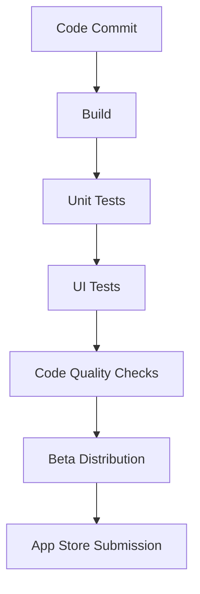

# CI/CD for Mobile Applications

## Introduction

Continuous Integration and Continuous Deployment (CI/CD) has revolutionized how software is developed, tested, and deployed. For mobile applications, implementing CI/CD brings unique challenges and benefits that can significantly improve your development workflow.

In this guide, we'll explore how to set up CI/CD pipelines specifically for mobile applications, covering both iOS and Android platforms. You'll learn how to automate building, testing, and deploying your mobile apps to testing environments and app stores.

## Why CI/CD Matters for Mobile Development

Mobile app development presents unique challenges:

- Multiple platforms (iOS, Android)
- Device fragmentation (various screen sizes, OS versions)
- App store approval processes
- Signing and provisioning complexities
- High user expectations for quality and performance

CI/CD addresses these challenges by:

- Automating repetitive tasks
- Ensuring consistent build environments
- Catching issues early through automated testing
- Streamlining the release process
- Enabling faster feedback cycles

## CI/CD Pipeline Components for Mobile Apps

A typical mobile CI/CD pipeline includes these stages:



Let's explore each component in detail.

## Setting Up Your Mobile CI/CD Pipeline

### Prerequisites

Before implementing CI/CD for mobile apps, ensure you have:

- Source code repository (GitHub, GitLab, Bitbucket)
- CI/CD tool (Jenkins, CircleCI, GitHub Actions, Bitrise, etc.)
- Unit and UI testing frameworks
- Code signing certificates and provisioning profiles
- App distribution platform (TestFlight, Firebase App Distribution, etc.)

### Step 1: Configure Your Repository

First, organize your repository with proper branching strategy:

```
main       (production-ready code)
���── develop (integration branch)
    ├── feature/login
    ├── feature/profile
    └── bugfix/crash-on-startup
```

Create a `.gitignore` file to exclude sensitive files:

```
# iOS
xcuserdata/
*.pbxuser
*.xcworkspace
Pods/
fastlane/report.xml

# Android
*.apk
*.aab
*.keystore
local.properties
.gradle/
build/
```

### Step 2: Set Up Your CI/CD Tool

Let's examine how to configure GitHub Actions, a popular CI/CD tool, for a mobile project.

For Android, create a file at `.github/workflows/android.yml`:

```yaml
name: Android CI

on:
  push:
    branches: [ main, develop ]
  pull_request:
    branches: [ main, develop ]

jobs:
  build:
    runs-on: ubuntu-latest
    steps:
    - uses: actions/checkout@v3
    
    - name: Set up JDK 11
      uses: actions/setup-java@v3
      with:
        java-version: '11'
        distribution: 'temurin'
    
    - name: Grant execute permission for gradlew
      run: chmod +x gradlew
    
    - name: Build with Gradle
      run: ./gradlew build
    
    - name: Run unit tests
      run: ./gradlew testDebugUnitTest
    
    - name: Upload APK
      uses: actions/upload-artifact@v3
      with:
        name: app-debug
        path: app/build/outputs/apk/debug/app-debug.apk
```

For iOS, create a file at `.github/workflows/ios.yml`:

```yaml
name: iOS CI

on:
  push:
    branches: [ main, develop ]
  pull_request:
    branches: [ main, develop ]

jobs:
  build:
    runs-on: macos-latest
    steps:
    - uses: actions/checkout@v3
    
    - name: Set up Ruby
      uses: ruby/setup-ruby@v1
      with:
        ruby-version: '2.7'
    
    - name: Install Cocoapods
      run: gem install cocoapods
    
    - name: Install dependencies
      run: pod install
    
    - name: Build and test
      run: xcodebuild -workspace MyApp.xcworkspace -scheme MyApp -destination 'platform=iOS Simulator,name=iPhone 14' clean test
    
    - name: Upload test results
      uses: actions/upload-artifact@v3
      with:
        name: test-results
        path: test-results
```

### Step 3: Implement Automated Testing

Mobile apps require several types of testing:

1. **Unit Tests** - Test individual components in isolation
2. **Integration Tests** - Test interactions between components
3. **UI Tests** - Test the user interface and workflows

#### Android Example (using JUnit and Espresso)

```kotlin
// Unit test for login validation
@Test
fun loginValidation_correctCredentials_returnsTrue() {
    val validator = LoginValidator()
    val result = validator.validate("user@example.com", "Password123")
    assertTrue(result)
}

// UI test for login screen
@RunWith(AndroidJUnit4::class)
class LoginScreenTest {
    @Rule
    @JvmField
    val activityRule = ActivityScenarioRule(LoginActivity::class.java)
    
    @Test
    fun loginButton_isDisabled_whenFieldsEmpty() {
        onView(withId(R.id.email)).check(matches(isDisplayed()))
        onView(withId(R.id.password)).check(matches(isDisplayed()))
        onView(withId(R.id.loginButton)).check(matches(not(isEnabled())))
    }
}
```

#### iOS Example (using XCTest)

```swift
// Unit test for login validation
func testLoginValidation_correctCredentials_returnsTrue() {
    let validator = LoginValidator()
    let result = validator.validate(email: "user@example.com", password: "Password123")
    XCTAssertTrue(result)
}

// UI test for login screen
func testLoginButton_isDisabled_whenFieldsEmpty() {
    let app = XCUIApplication()
    app.launch()
    
    let emailField = app.textFields["emailField"]
    let passwordField = app.secureTextFields["passwordField"]
    let loginButton = app.buttons["loginButton"]
    
    XCTAssertFalse(loginButton.isEnabled)
}
```

### Step 4: Code Quality Checks

Implement static code analysis to maintain code quality:

For Android, add SonarQube or ktlint to your Gradle file:

```gradle
plugins {
    id "org.sonarqube" version "3.5.0.2730"
}

sonarqube {
    properties {
        property "sonar.projectKey", "my-android-app"
        property "sonar.organization", "my-organization"
        property "sonar.host.url", "https://sonarcloud.io"
    }
}
```

For iOS, use SwiftLint in your workflow:

```yaml
- name: Install SwiftLint
  run: brew install swiftlint

- name: Run SwiftLint
  run: swiftlint
```

### Step 5: Automate Beta Distribution

Use Fastlane to automate distribution to beta testers:

Create a `Fastfile` for Android:

```ruby
platform :android do
  desc "Build and distribute beta version to Firebase App Distribution"
  lane :beta do
    gradle(task: "clean assembleRelease")
    firebase_app_distribution(
      app: "1:123456789:android:abcd1234",
      groups: "beta-testers",
      release_notes: "New beta version with login improvements"
    )
  end
end
```

Create a `Fastfile` for iOS:

```ruby
platform :ios do
  desc "Build and distribute beta version to TestFlight"
  lane :beta do
    build_app(scheme: "MyApp")
    upload_to_testflight(
      skip_waiting_for_build_processing: true
    )
  end
end
```

Add this to your CI/CD workflow:

```yaml
- name: Install Fastlane
  run: gem install fastlane

- name: Distribute to beta testers
  run: fastlane beta
  env:
    FIREBASE_APP_ID: ${{ secrets.FIREBASE_APP_ID }}
    FIREBASE_TOKEN: ${{ secrets.FIREBASE_TOKEN }}
```

### Step 6: App Store Deployment

Automate app store submissions with Fastlane:

For Android:

```ruby
lane :release do
  gradle(task: "clean bundleRelease")
  upload_to_play_store(
    track: "production",
    aab: "app/build/outputs/bundle/release/app-release.aab"
  )
end
```

For iOS:

```ruby
lane :release do
  build_app(scheme: "MyApp")
  upload_to_app_store(
    submit_for_review: true,
    force: true,
    automatic_release: true
  )
end
```

## Real-World CI/CD Pipeline Example

Here's a complete GitHub Actions workflow for a React Native app:

```yaml
name: React Native CI/CD

on:
  push:
    branches: [ main, develop ]
  pull_request:
    branches: [ main, develop ]

jobs:
  test:
    runs-on: ubuntu-latest
    steps:
    - uses: actions/checkout@v3
    
    - name: Set up Node.js
      uses: actions/setup-node@v3
      with:
        node-version: 16
    
    - name: Install dependencies
      run: npm install
    
    - name: Run ESLint
      run: npm run lint
    
    - name: Run tests
      run: npm test

  build-android:
    needs: test
    runs-on: ubuntu-latest
    if: github.event_name != 'pull_request'
    steps:
    - uses: actions/checkout@v3
    
    - name: Set up JDK 11
      uses: actions/setup-java@v3
      with:
        java-version: '11'
        distribution: 'temurin'
    
    - name: Install dependencies
      run: npm install
    
    - name: Build Android Release
      run: |
        cd android
        ./gradlew bundleRelease
    
    - name: Upload Android Bundle
      uses: actions/upload-artifact@v3
      with:
        name: app-release-bundle
        path: android/app/build/outputs/bundle/release/app-release.aab
    
    - name: Deploy to Firebase App Distribution
      if: github.ref == 'refs/heads/develop'
      uses: wzieba/Firebase-Distribution-Github-Action@v1
      with:
        appId: ${{ secrets.FIREBASE_APP_ID }}
        token: ${{ secrets.FIREBASE_TOKEN }}
        groups: testers
        file: android/app/build/outputs/apk/release/app-release.apk
        releaseNotes: "Automated build from develop branch"

  build-ios:
    needs: test
    runs-on: macos-latest
    if: github.event_name != 'pull_request'
    steps:
    - uses: actions/checkout@v3
    
    - name: Set up Ruby
      uses: ruby/setup-ruby@v1
      with:
        ruby-version: '2.7'
    
    - name: Install Fastlane
      run: gem install fastlane
    
    - name: Install dependencies
      run: |
        npm install
        cd ios
        pod install
    
    - name: Build and deploy to TestFlight
      if: github.ref == 'refs/heads/develop'
      run: |
        cd ios
        fastlane beta
      env:
        APPLE_ID: ${{ secrets.APPLE_ID }}
        APP_STORE_CONNECT_API_KEY: ${{ secrets.APP_STORE_CONNECT_API_KEY }}
```

## Handling Secrets and Environment Variables

Mobile CI/CD requires several secrets:

- Signing keys and certificates
- App store credentials
- API keys for services

Store these securely in your CI/CD provider's secrets management:

1. For GitHub Actions, use repository secrets:
   - Go to Settings > Secrets and variables > Actions
   - Add secrets like `KEYSTORE_FILE`, `KEYSTORE_PASSWORD`, etc.

2. Reference these in your workflow file:

```yaml
- name: Decode Keystore
  run: echo "${{ secrets.KEYSTORE_FILE }}" | base64 --decode > app/my-release-key.keystore
  
- name: Build Release APK
  run: ./gradlew assembleRelease
  env:
    KEYSTORE_PASSWORD: ${{ secrets.KEYSTORE_PASSWORD }}
    KEY_ALIAS: ${{ secrets.KEY_ALIAS }}
    KEY_PASSWORD: ${{ secrets.KEY_PASSWORD }}
```

## Best Practices for Mobile CI/CD

1. **Version Management**: Automate version numbering:

```gradle
// Android: build.gradle
android {
    defaultConfig {
        versionCode System.getenv("GITHUB_RUN_NUMBER") ?: 1
        versionName "1.0.${System.getenv("GITHUB_RUN_NUMBER") ?: 0}"
    }
}
```

```ruby
# iOS: Fastfile
lane :increment_version do
  increment_build_number(
    build_number: ENV["GITHUB_RUN_NUMBER"]
  )
end
```

2. **Parallel Testing**: Test on multiple devices simultaneously:

```yaml
strategy:
  matrix:
    api-level: [21, 23, 29]
    
steps:
  - name: Run Android Tests
    uses: reactivecircus/android-emulator-runner@v2
    with:
      api-level: ${{ matrix.api-level }}
      script: ./gradlew connectedAndroidTest
```

3. **Staged Rollouts**: Implement phased releases:

```ruby
lane :production do
  upload_to_play_store(
    track: 'production',
    rollout: '0.1' # 10% rollout
  )
end
```

4. **Monitoring**: Integrate crash reporting tools:

```kotlin
// Android
dependencies {
    implementation("com.google.firebase:firebase-crashlytics:18.3.7")
}
```

```swift
// iOS: AppDelegate.swift
import FirebaseCrashlytics

func application(_ application: UIApplication, didFinishLaunchingWithOptions launchOptions: [UIApplication.LaunchOptionsKey: Any]?) -> Bool {
    FirebaseApp.configure()
    return true
}
```

## Cross-Platform CI/CD Considerations

For React Native, Flutter, or other cross-platform frameworks:

1. Reuse code between platforms:

```yaml
jobs:
  build:
    steps:
      - name: Install dependencies
        run: npm install
        
      - name: Run tests (shared)
        run: npm test
        
      # Then proceed with platform-specific builds
```

2. Separate platform-specific steps:

```yaml
jobs:
  android:
    # Android-specific steps
  
  ios:
    # iOS-specific steps
```

## Troubleshooting Common Issues

### Build Failures

If your build fails with message "Execution failed for task ':app:processReleaseResources'":

```
# Check gradle properties
./gradlew --info assembleRelease
```

### Code Signing Issues

For iOS code signing errors:

```
# Ensure certificates are properly installed
fastlane match development
fastlane match appstore
```

### Memory Issues

If your CI runner crashes with out-of-memory errors:

```gradle
// In gradle.properties
org.gradle.jvmargs=-Xmx4g -XX:MaxPermSize=512m
```

## Summary

Implementing CI/CD for mobile applications offers tremendous benefits:

- Faster release cycles
- Higher quality through automated testing
- Consistent builds across developer machines
- Early detection of platform-specific issues
- Streamlined app store submissions

By following the steps in this guide, you've learned how to:

1. Set up a CI/CD pipeline for iOS and Android apps
2. Automate building, testing, and deployment
3. Distribute apps to beta testers
4. Submit apps to the app stores
5. Implement best practices for mobile CI/CD

## Additional Resources

To continue learning about mobile CI/CD:

- [Fastlane Documentation](https://docs.fastlane.tools/)
- [GitHub Actions Documentation](https://docs.github.com/en/actions)
- [Firebase App Distribution](https://firebase.google.com/docs/app-distribution)
- [TestFlight Beta Testing](https://developer.apple.com/testflight/)

## Exercises

1. Set up a basic CI/CD pipeline for an existing mobile app
2. Configure automated UI testing for your app
3. Implement a beta distribution channel for your testers
4. Create a workflow that automatically increases your app's version number
5. Set up a production deployment pipeline with staged rollouts