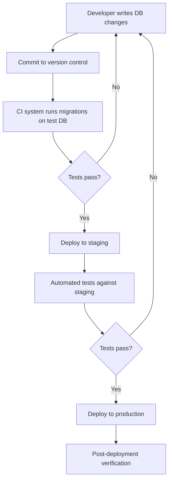
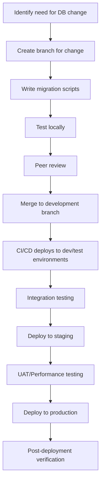

# CI/CD Database Deployment

## Introduction

Database deployments have traditionally been one of the most challenging aspects of software delivery. While application code deployments have become increasingly automated through CI/CD (Continuous Integration/Continuous Deployment) pipelines, database changes often remain manual, error-prone processes performed by database administrators.

In this guide, we'll explore how to bring databases into your CI/CD workflow, automating database deployments alongside your application code. This approach ensures consistency, reduces human error, and enables faster, more reliable releases.

## Understanding Database Deployment Challenges

Unlike application code, databases are stateful systems that store valuable production data. This creates unique challenges:

1. **Data preservation** - You can't simply replace a database like you would application code
2. **Schema evolution** - Changes must be applied incrementally without data loss
3. **Rollbacks** - Reversing database changes can be complex or sometimes impossible
4. **Environment consistency** - Ensuring development, testing, and production databases remain in sync

These challenges explain why many teams are hesitant to automate database deployments. However, with the right approach and tools, we can safely incorporate databases into our CI/CD pipelines.

## Database Migration Fundamentals

The foundation of automated database deployments is the concept of **migrations** - versioned, incremental changes to your database schema and reference data.

### What are Database Migrations?

Migrations are scripts that transform a database from one version to another. Each migration represents a specific change to your database schema or data, such as:

- Creating, altering, or dropping tables
- Adding, modifying, or removing columns
- Adding or updating reference data
- Creating or modifying indexes, constraints, or triggers

By managing these changes as versioned scripts in your source code repository, you gain:

- A complete history of database changes
- The ability to recreate your database at any point in time
- A systematic way to apply changes across environments

### Migration Tools

Several tools help manage database migrations. Here are some popular options for different database systems:

| Database Type | Migration Tools |
|--------------|-----------------|
| SQL Server | Flyway, Liquibase, SSDT |
| PostgreSQL | Flyway, Liquibase, Sqitch |
| MySQL | Flyway, Liquibase, Alembic |
| MongoDB | Mongock, migrate-mongo |
| Oracle | Flyway, Liquibase |

For this tutorial, we'll use **Flyway** as our example tool because it's database-agnostic and relatively simple to use.

## Setting Up Database Migrations with Flyway

Flyway is a popular open-source database migration tool that supports a wide range of databases. Let's set up a basic project with Flyway migrations.

### Project Structure

Here's a typical project structure for a database migrations project:

```
db-migrations/
├── migrations/
│   ├── V1__Create_users_table.sql
│   ├── V2__Create_products_table.sql
│   ├── V3__Add_email_to_users.sql
│   └── R__Views.sql
├── flyway.conf
└── pom.xml (or build.gradle)
```

### Example Migration Files

Let's look at some sample migration files:

**V1__Create_users_table.sql**:

```sql
CREATE TABLE users (
    id SERIAL PRIMARY KEY,
    username VARCHAR(100) NOT NULL UNIQUE,
    created_at TIMESTAMP NOT NULL DEFAULT CURRENT_TIMESTAMP
);
```

**V2__Create_products_table.sql**:

```sql
CREATE TABLE products (
    id SERIAL PRIMARY KEY,
    name VARCHAR(200) NOT NULL,
    description TEXT,
    price DECIMAL(10, 2) NOT NULL,
    created_by INT REFERENCES users(id),
    created_at TIMESTAMP NOT NULL DEFAULT CURRENT_TIMESTAMP
);
```

**V3__Add_email_to_users.sql**:

```sql
ALTER TABLE users ADD COLUMN email VARCHAR(255);
```

**R__Views.sql** (repeatable migration for views):

```sql
-- This will be re-applied whenever its content changes
DROP VIEW IF EXISTS active_products;

CREATE VIEW active_products AS
SELECT p.id, p.name, p.price, u.username as creator
FROM products p
JOIN users u ON p.created_by = u.id
WHERE p.price > 0;
```

### Configuring Flyway

A basic `flyway.conf` file might look like this:

```
flyway.url=jdbc:postgresql://localhost:5432/myapp
flyway.user=postgres
flyway.password=password
flyway.locations=filesystem:migrations
```

## Integrating Database Migrations into CI/CD

Now let's incorporate our database migrations into a CI/CD pipeline. We'll use GitHub Actions as our example CI/CD platform, but the concepts apply to other tools like Jenkins, GitLab CI, or Azure DevOps.

### GitHub Actions Workflow Example

Create a file at `.github/workflows/database-deploy.yml`:

```yaml
name: Database Deployment

on:
  push:
    branches: [ main, develop ]
    paths:
      - 'db-migrations/**'
  pull_request:
    branches: [ main, develop ]
    paths:
      - 'db-migrations/**'

jobs:
  validate:
    runs-on: ubuntu-latest
    services:
      postgres:
        image: postgres:13
        env:
          POSTGRES_PASSWORD: postgres
          POSTGRES_USER: postgres
          POSTGRES_DB: test_db
        ports:
          - 5432:5432
        options: >-
          --health-cmd pg_isready
          --health-interval 10s
          --health-timeout 5s
          --health-retries 5

    steps:
      - uses: actions/checkout@v3
      
      - name: Set up JDK 11
        uses: actions/setup-java@v3
        with:
          java-version: '11'
          distribution: 'temurin'
      
      - name: Validate migrations
        working-directory: ./db-migrations
        run: |
          # Configure flyway for test database
          echo "flyway.url=jdbc:postgresql://localhost:5432/test_db" > flyway.conf
          echo "flyway.user=postgres" >> flyway.conf
          echo "flyway.password=postgres" >> flyway.conf
          echo "flyway.locations=filesystem:migrations" >> flyway.conf
          
          # Run flyway migrations
          flyway clean migrate
  
  deploy-staging:
    needs: validate
    if: github.event_name == 'push' && github.ref == 'refs/heads/develop'
    runs-on: ubuntu-latest
    steps:
      - uses: actions/checkout@v3
      
      - name: Set up JDK 11
        uses: actions/setup-java@v3
        with:
          java-version: '11'
          distribution: 'temurin'
      
      - name: Deploy to staging
        working-directory: ./db-migrations
        env:
          DB_URL: ${{ secrets.STAGING_DB_URL }}
          DB_USER: ${{ secrets.STAGING_DB_USER }}
          DB_PASSWORD: ${{ secrets.STAGING_DB_PASSWORD }}
        run: |
          # Configure flyway for staging database
          echo "flyway.url=${DB_URL}" > flyway.conf
          echo "flyway.user=${DB_USER}" >> flyway.conf
          echo "flyway.password=${DB_PASSWORD}" >> flyway.conf
          echo "flyway.locations=filesystem:migrations" >> flyway.conf
          
          # Run flyway migrations
          flyway migrate
  
  deploy-production:
    needs: validate
    if: github.event_name == 'push' && github.ref == 'refs/heads/main'
    runs-on: ubuntu-latest
    environment: production
    steps:
      - uses: actions/checkout@v3
      
      - name: Set up JDK 11
        uses: actions/setup-java@v3
        with:
          java-version: '11'
          distribution: 'temurin'
      
      - name: Deploy to production
        working-directory: ./db-migrations
        env:
          DB_URL: ${{ secrets.PRODUCTION_DB_URL }}
          DB_USER: ${{ secrets.PRODUCTION_DB_USER }}
          DB_PASSWORD: ${{ secrets.PRODUCTION_DB_PASSWORD }}
        run: |
          # Configure flyway for production database
          echo "flyway.url=${DB_URL}" > flyway.conf
          echo "flyway.user=${DB_USER}" >> flyway.conf
          echo "flyway.password=${DB_PASSWORD}" >> flyway.conf
          echo "flyway.locations=filesystem:migrations" >> flyway.conf
          
          # Run flyway migrations
          flyway migrate
```

## CI/CD Database Deployment Flow

Let's visualize the complete CI/CD flow for database deployments:



## Best Practices for CI/CD Database Deployments

### 1. Version Control Everything

Keep all database objects under version control, including:
- Table definitions
- Stored procedures
- Functions
- Views
- Indexes
- Reference data

### 2. Use Migration-Based Approaches

Avoid state-based comparisons in favor of explicit, versioned migrations that clearly define the path from one database state to another.

### 3. Make Migrations Idempotent When Possible

Design migrations that can be safely run multiple times without causing errors. For example:

```sql
-- Instead of this:
CREATE TABLE users (...);

-- Do this:
CREATE TABLE IF NOT EXISTS users (...);
```

### 4. Include Rollback Scripts

For critical changes, provide rollback scripts that can revert the changes if something goes wrong:

```sql
-- Migration: V1__Add_status_column.sql
ALTER TABLE orders ADD COLUMN status VARCHAR(50);

-- Rollback: R1__Remove_status_column.sql
ALTER TABLE orders DROP COLUMN status;
```

### 5. Separate Migrations from Application Releases

Database changes should be deployable independently of application code when possible. This enables:
- Database-only releases for performance tuning
- Application-only releases for bug fixes
- Phased deployments of large features

### 6. Test Migrations Thoroughly

Test your migrations in environments that mirror production as closely as possible:
- Use production-like schemas
- Include realistic data volumes
- Measure migration execution time

### 7. Use Environment-Specific Configuration

Different environments may require different configuration:

```
# Development
flyway.url=jdbc:postgresql://localhost:5432/dev_db
flyway.placeholders.tablespace=dev_space

# Production
flyway.url=jdbc:postgresql://prod-server:5432/prod_db
flyway.placeholders.tablespace=prod_space
```

### 8. Monitor Migration Performance

Long-running migrations can cause downtime. Monitor and optimize migrations that:
- Add columns to large tables
- Create indexes on large datasets
- Import substantial reference data

## Advanced Techniques

### Handling Large Tables

For large tables, consider techniques to minimize downtime:

```sql
-- Instead of locking a large table:
ALTER TABLE huge_table ADD COLUMN status VARCHAR(50);

-- Consider creating a new column without a default first (quick):
ALTER TABLE huge_table ADD COLUMN status VARCHAR(50);

-- Then update data in batches (can be done while system is running):
UPDATE huge_table SET status = 'active' WHERE id BETWEEN 1 AND 10000;
UPDATE huge_table SET status = 'active' WHERE id BETWEEN 10001 AND 20000;
-- etc.

-- Finally, add not-null constraint if needed (quick):
ALTER TABLE huge_table ALTER COLUMN status SET NOT NULL;
```

### Blue-Green Database Deployments

For zero-downtime deployments, consider using a blue-green approach:

1. Maintain two identical database instances (blue and green)
2. Apply changes to the inactive instance
3. Test the changes thoroughly
4. Switch application connections to the updated instance
5. The previously active instance becomes the new inactive one

## Implementing a Database Change Workflow

Let's establish a complete workflow for database changes:



## Example: Complete CI/CD Database Deployment Project

Let's tie everything together with a complete example project that handles database changes for a simple e-commerce application.

### Initial Setup

1. Create a db-migrations folder in your repository
2. Install Flyway CLI or add it to your build tool (Maven/Gradle)
3. Set up your initial migration files

### Basic Migration Files

**V1__Initial_schema.sql**:

```sql
-- Users table
CREATE TABLE users (
    id SERIAL PRIMARY KEY,
    username VARCHAR(100) NOT NULL UNIQUE,
    email VARCHAR(255) NOT NULL UNIQUE,
    password_hash VARCHAR(255) NOT NULL,
    created_at TIMESTAMP NOT NULL DEFAULT CURRENT_TIMESTAMP
);

-- Products table
CREATE TABLE products (
    id SERIAL PRIMARY KEY,
    name VARCHAR(200) NOT NULL,
    description TEXT,
    price DECIMAL(10, 2) NOT NULL,
    stock_quantity INT NOT NULL DEFAULT 0,
    created_at TIMESTAMP NOT NULL DEFAULT CURRENT_TIMESTAMP
);

-- Orders table
CREATE TABLE orders (
    id SERIAL PRIMARY KEY,
    user_id INT NOT NULL REFERENCES users(id),
    total_amount DECIMAL(10, 2) NOT NULL,
    status VARCHAR(50) NOT NULL DEFAULT 'pending',
    created_at TIMESTAMP NOT NULL DEFAULT CURRENT_TIMESTAMP
);

-- Order items table
CREATE TABLE order_items (
    id SERIAL PRIMARY KEY,
    order_id INT NOT NULL REFERENCES orders(id),
    product_id INT NOT NULL REFERENCES products(id),
    quantity INT NOT NULL,
    unit_price DECIMAL(10, 2) NOT NULL
);
```

### Adding a Feature with Migration

Let's say we want to add a product categories feature. We'd create a new migration:

**V2__Add_product_categories.sql**:

```sql
-- Create categories table
CREATE TABLE categories (
    id SERIAL PRIMARY KEY,
    name VARCHAR(100) NOT NULL UNIQUE,
    description TEXT,
    created_at TIMESTAMP NOT NULL DEFAULT CURRENT_TIMESTAMP
);

-- Add category relationship to products
ALTER TABLE products ADD COLUMN category_id INT;
ALTER TABLE products ADD CONSTRAINT fk_product_category FOREIGN KEY (category_id) REFERENCES categories(id);

-- Create index for faster category lookups
CREATE INDEX idx_products_category ON products(category_id);
```

### Seeding Reference Data

For lookup tables, we might want to seed initial data:

**V3__Seed_initial_categories.sql**:

```sql
INSERT INTO categories (name, description) VALUES
('Electronics', 'Electronic devices and accessories'),
('Clothing', 'Apparel and fashion items'),
('Books', 'Books, e-books, and publications'),
('Home & Kitchen', 'Household and kitchen products'),
('Toys & Games', 'Recreational items for all ages');
```

### Creating Database Views

For reporting purposes, we might create some views:

**R__Reporting_views.sql**:

```sql
-- Product sales by category
DROP VIEW IF EXISTS product_sales_by_category;

CREATE VIEW product_sales_by_category AS
SELECT 
    c.name AS category_name,
    p.id AS product_id,
    p.name AS product_name,
    SUM(oi.quantity) AS units_sold,
    SUM(oi.quantity * oi.unit_price) AS total_revenue
FROM order_items oi
JOIN products p ON oi.product_id = p.id
LEFT JOIN categories c ON p.category_id = c.id
JOIN orders o ON oi.order_id = o.id
WHERE o.status = 'completed'
GROUP BY c.name, p.id, p.name
ORDER BY total_revenue DESC;

-- Customer order history
DROP VIEW IF EXISTS customer_order_history;

CREATE VIEW customer_order_history AS
SELECT 
    u.id AS user_id,
    u.username,
    u.email,
    COUNT(o.id) AS total_orders,
    SUM(o.total_amount) AS lifetime_value,
    MAX(o.created_at) AS last_order_date
FROM users u
LEFT JOIN orders o ON u.id = o.user_id
GROUP BY u.id, u.username, u.email
ORDER BY lifetime_value DESC;
```

## Common Database Deployment Challenges and Solutions

### Challenge 1: Long-Running Migrations

**Problem**: Adding a column to a table with millions of rows can lock the table for minutes or hours.

**Solution**: Use techniques that minimize locking:
- Add nullable columns without defaults
- Update data in batches
- Schedule migrations during low-traffic periods
- Use database-specific techniques (e.g., CONCURRENTLY in PostgreSQL)

### Challenge 2: Failed Migrations

**Problem**: A migration fails halfway through, leaving the database in an inconsistent state.

**Solution**:
- Design migrations to be transactional when possible
- Use migration tools that support transactions
- Have a rollback strategy for each migration
- Create a backup before applying complex migrations

### Challenge 3: Environment Differences

**Problem**: Migrations work in development but fail in production due to data differences.

**Solution**:
- Test with production-like data volumes
- Make migrations data-agnostic when possible
- Use environment-specific configurations
- Perform dry runs in staging environments

## Summary

Implementing CI/CD for database deployments brings numerous benefits:

1. **Consistency**: The same changes are applied the same way across all environments
2. **Automation**: Reduces manual errors and frees up DBA time for more valuable tasks
3. **Version Control**: Complete history of database changes
4. **Rapid Delivery**: Database changes no longer bottleneck application releases
5. **Testing**: Opportunities to catch issues early through automated testing

By treating database changes as code, using migrations, and incorporating them into your CI/CD pipeline, you can achieve reliable, automated database deployments that keep pace with your application development.

## Additional Resources

For further learning, consider exploring:

1. Migration tools documentation:
   - [Flyway Documentation](https://flywaydb.org/documentation)
   - [Liquibase Documentation](https://docs.liquibase.com)

2. Database-specific best practices:
   - PostgreSQL schema migrations
   - MySQL online schema changes
   - SQL Server database projects

3. Practice Exercises:

   - **Exercise 1**: Set up a basic Flyway project with migrations for a simple blog database (users, posts, comments)
   - **Exercise 2**: Create a GitHub Actions workflow to automatically apply migrations to a test database
   - **Exercise 3**: Implement a complex migration that requires data transformation in batches
   - **Exercise 4**: Design a database deployment strategy with rollback capabilities