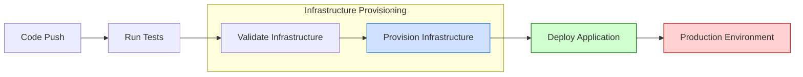
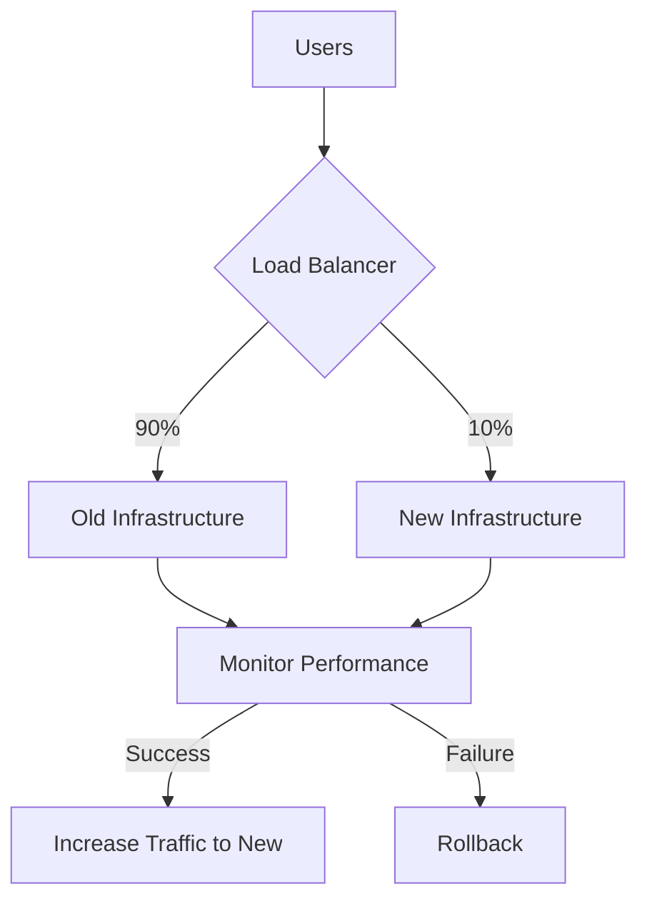

# CICD Infrastructure Provisioning

## Introduction

In modern software development, Continuous Integration and Continuous Deployment (CI/CD) pipelines have become essential for delivering high-quality applications quickly and reliably. While CI/CD is often associated with automating code testing and deployment, an equally important aspect is **Infrastructure Provisioning** - the automated creation and management of the underlying infrastructure that your applications run on.

Infrastructure provisioning in CI/CD enables teams to:

- Create consistent environments across development, testing, and production
- Treat infrastructure as code (IaC), making it versionable and repeatable
- Automate the complete deployment process, from code to production
- Reduce human error and increase deployment reliability

In this guide, we'll explore how to integrate infrastructure provisioning into your CI/CD pipeline, making it a seamless part of your development workflow.

## What is Infrastructure Provisioning?

Infrastructure provisioning refers to the process of setting up the computing resources, networks, storage, and other components needed to run your applications. Traditionally, this was done manually by system administrators, but modern DevOps practices have moved toward automating this process through Infrastructure as Code (IaC).

In a CI/CD context, infrastructure provisioning means:

1. **Defining infrastructure in code** - Using tools like Terraform, AWS CloudFormation, or Ansible
2. **Versioning infrastructure definitions** - Storing them in source control alongside application code
3. **Automating deployment** - Creating or updating infrastructure as part of your CI/CD pipeline
4. **Testing infrastructure** - Validating infrastructure changes before applying them

## Tools for Infrastructure Provisioning

Several tools have become industry standards for infrastructure provisioning:

### Terraform

Terraform is a popular open-source IaC tool that allows you to define infrastructure using a declarative configuration language.

```hcl
# Example Terraform configuration for provisioning a web server on AWS
provider "aws" {
  region = "us-west-2"
}

resource "aws_instance" "web_server" {
  ami           = "ami-0c55b159cbfafe1f0"
  instance_type = "t2.micro"
  
  tags = {
    Name = "WebServer"
    Environment = "Production"
  }
}
```

### AWS CloudFormation

CloudFormation is AWS's native IaC service, using JSON or YAML templates to define AWS resources.

```yaml
# Example CloudFormation template for an S3 bucket
Resources:
  MyS3Bucket:
    Type: 'AWS::S3::Bucket'
    Properties:
      BucketName: my-application-artifacts
      VersioningConfiguration:
        Status: Enabled
```

### Ansible

Ansible uses YAML-based playbooks to automate configuration management and application deployment.

```yaml
# Example Ansible playbook for installing Nginx
---
- name: Install and configure Nginx
  hosts: webservers
  become: yes
  
  tasks:
    - name: Install Nginx
      apt:
        name: nginx
        state: present
        
    - name: Start Nginx service
      service:
        name: nginx
        state: started
        enabled: yes
```

## Integrating Infrastructure Provisioning into CI/CD

Let's explore how to make infrastructure provisioning a part of your CI/CD pipeline.

### Step 1: Store Infrastructure Code in Version Control

The first step is to store your infrastructure code in the same repository as your application or in a separate repository that's linked to your CI/CD pipeline.

```
project/
├── app/
│   ├── src/
│   └── ...
├── infrastructure/
│   ├── terraform/
│   │   ├── main.tf
│   │   ├── variables.tf
│   │   └── outputs.tf
│   └── scripts/
│       └── deploy.sh
└── .github/
    └── workflows/
        └── deploy.yml
```

### Step 2: Create CI/CD Pipeline Stages for Infrastructure

Next, modify your CI/CD pipeline to include stages for infrastructure provisioning. Here's an example GitHub Actions workflow:

```yaml
name: Deploy Application and Infrastructure

on:
  push:
    branches: [ main ]

jobs:
  test:
    runs-on: ubuntu-latest
    steps:
      - uses: actions/checkout@v2
      - name: Run tests
        run: npm test
        
  terraform:
    needs: test
    runs-on: ubuntu-latest
    steps:
      - uses: actions/checkout@v2
      
      - name: Setup Terraform
        uses: hashicorp/setup-terraform@v1
        
      - name: Terraform Init
        run: terraform -chdir=./infrastructure/terraform init
        
      - name: Terraform Plan
        run: terraform -chdir=./infrastructure/terraform plan -out=tfplan
        
      - name: Terraform Apply
        if: github.ref == 'refs/heads/main'
        run: terraform -chdir=./infrastructure/terraform apply -auto-approve tfplan
        
  deploy:
    needs: terraform
    runs-on: ubuntu-latest
    steps:
      - uses: actions/checkout@v2
      - name: Deploy application
        run: ./infrastructure/scripts/deploy.sh
```

### Step 3: Implement Infrastructure Validation

Before applying changes to your infrastructure, it's important to validate them. Most IaC tools provide commands for this:

- Terraform: `terraform validate` and `terraform plan`
- CloudFormation: `aws cloudformation validate-template`
- Ansible: `ansible-playbook --check`

Incorporating these validation steps into your CI/CD pipeline helps catch issues before they affect your environments.

### Step 4: Create Environment-Specific Configurations

Different environments (dev, staging, production) often require different infrastructure configurations. You can manage this through:

1. **Variable files** for different environments
2. **Workspaces or environments** supported by your IaC tool
3. **Branch-based deployment** strategies

Here's an example of environment-specific Terraform variables:

```hcl
# dev.tfvars
instance_type = "t2.micro"
instance_count = 1

# production.tfvars
instance_type = "t2.large"
instance_count = 3
```

### Step 5: Manage Secrets and State

Infrastructure provisioning often requires access to sensitive credentials. Best practices include:

1. **Using secret management** services like AWS Secrets Manager, HashiCorp Vault, or GitHub Secrets
2. **Securing state files** that contain sensitive information (like Terraform state)
3. **Implementing least privilege** for CI/CD service accounts

## Real-World CI/CD Infrastructure Provisioning Example

Let's walk through a complete example of a CI/CD pipeline that provisions and deploys a web application to AWS:

### Infrastructure Code (Terraform)

```hcl
# main.tf
provider "aws" {
  region = var.aws_region
}

# Create VPC and networking
resource "aws_vpc" "app_vpc" {
  cidr_block = "10.0.0.0/16"
  tags = {
    Name = "${var.environment}-vpc"
  }
}

# Create subnet
resource "aws_subnet" "app_subnet" {
  vpc_id     = aws_vpc.app_vpc.id
  cidr_block = "10.0.1.0/24"
  tags = {
    Name = "${var.environment}-subnet"
  }
}

# Create EC2 instance for web server
resource "aws_instance" "web_server" {
  ami           = var.ami_id
  instance_type = var.instance_type
  subnet_id     = aws_subnet.app_subnet.id
  
  user_data = <<-EOF
              #!/bin/bash
              yum update -y
              yum install -y httpd
              systemctl start httpd
              systemctl enable httpd
              echo "Hello from CI/CD Provisioned Server" > /var/www/html/index.html
              EOF
  
  tags = {
    Name = "${var.environment}-webserver"
  }
}

# Create S3 bucket for application artifacts
resource "aws_s3_bucket" "app_artifacts" {
  bucket = "${var.environment}-app-artifacts"
  
  tags = {
    Environment = var.environment
  }
}

# Output values
output "website_url" {
  value = "http://${aws_instance.web_server.public_dns}"
}
```

### CI/CD Pipeline (GitLab CI)

```yaml
stages:
  - test
  - validate_infrastructure
  - provision_infrastructure
  - deploy

variables:
  TF_VAR_environment: $CI_ENVIRONMENT_NAME

test:
  stage: test
  script:
    - npm install
    - npm test

validate_terraform:
  stage: validate_infrastructure
  image: hashicorp/terraform:latest
  script:
    - cd infrastructure
    - terraform init
    - terraform validate
    - terraform plan -var-file="${CI_ENVIRONMENT_NAME}.tfvars" -out=tfplan

provision_infrastructure:
  stage: provision_infrastructure
  image: hashicorp/terraform:latest
  script:
    - cd infrastructure
    - terraform init
    - terraform apply -auto-approve tfplan
  dependencies:
    - validate_terraform
  only:
    - main

deploy_application:
  stage: deploy
  script:
    - aws s3 cp ./dist s3://${CI_ENVIRONMENT_NAME}-app-artifacts --recursive
    - aws ec2 reboot-instances --instance-ids $(terraform output -raw web_server_id)
  dependencies:
    - provision_infrastructure
  only:
    - main

```

### Visualizing the CI/CD Infrastructure Pipeline

Here's a diagram illustrating the complete CI/CD pipeline with infrastructure provisioning:



## Best Practices for CI/CD Infrastructure Provisioning

1. **Immutable Infrastructure**: Treat infrastructure as disposable and rebuild rather than modify in place
2. **Small, Incremental Changes**: Make small, frequent changes to reduce risk
3. **Comprehensive Testing**: Test infrastructure changes in staging environments before production
4. **Backup and Rollback Plans**: Always have a way to revert changes if problems occur
5. **Documentation**: Document infrastructure architecture and CI/CD processes
6. **Cost Monitoring**: Track and optimize cloud resource costs

## Common Challenges and Solutions

| Challenge | Solution |
|-----------|----------|
| Long provisioning times | Use parallel provisioning, pre-built images |
| State management | Use remote state storage (S3, Terraform Cloud) |
| Secrets management | Implement vault solutions, use CI/CD secret stores |
| Permissions | Use least privilege IAM roles for CI/CD processes |
| Dependency management | Implement a clear dependency graph in your IaC |

## Infrastructure Provisioning Patterns

### Blue-Green Deployments

Blue-green deployment involves provisioning an entirely new set of infrastructure (green) alongside the existing one (blue), and then switching traffic once everything is validated.

```hcl
# Simplified Terraform example for blue-green
resource "aws_instance" "blue" {
  count = var.current_environment == "blue" ? var.instance_count : 0
  # configuration...
}

resource "aws_instance" "green" {
  count = var.current_environment == "green" ? var.instance_count : 0
  # configuration...
}

resource "aws_route53_record" "www" {
  zone_id = aws_route53_zone.primary.zone_id
  name    = "www.example.com"
  type    = "A"
  ttl     = "300"
  records = var.current_environment == "blue" ? aws_instance.blue[*].public_ip : aws_instance.green[*].public_ip
}
```

### Canary Deployments

Canary deployments involve gradually shifting traffic to the new infrastructure.



## Summary

CI/CD Infrastructure Provisioning automates the creation and management of infrastructure as part of your continuous integration and deployment pipeline. By defining infrastructure as code and integrating it into your CI/CD process, you can:

- Ensure consistent environments
- Deploy faster and more reliably
- Reduce human error
- Make infrastructure changes trackable and reversible
- Scale infrastructure alongside your application

Getting started with CI/CD infrastructure provisioning involves:
1. Choosing an infrastructure as code tool
2. Defining your infrastructure in code
3. Integrating infrastructure provisioning into your CI/CD pipeline
4. Implementing testing and validation
5. Setting up environment-specific configurations

As your DevOps practices mature, you can implement more advanced patterns like blue-green deployments and canary releases.

## Additional Resources

To continue learning about CI/CD infrastructure provisioning:

- Learn more about [Terraform](https://www.terraform.io/docs)
- Explore [AWS CloudFormation](https://docs.aws.amazon.com/cloudformation/)
- Try [Ansible](https://docs.ansible.com/) for configuration management
- Understand [GitOps principles](https://www.gitops.tech/)
- Practice with [Infrastructure testing frameworks](https://www.infoq.com/articles/testing-terraform/)

## Exercises

1. Set up a basic Terraform configuration to provision a web server on your preferred cloud provider
2. Create a GitHub Actions workflow that validates and applies your Terraform configuration
3. Extend your infrastructure code to support multiple environments (dev, staging, production)
4. Implement a blue-green deployment strategy for your infrastructure
5. Add monitoring and alerting to your infrastructure to detect issues early