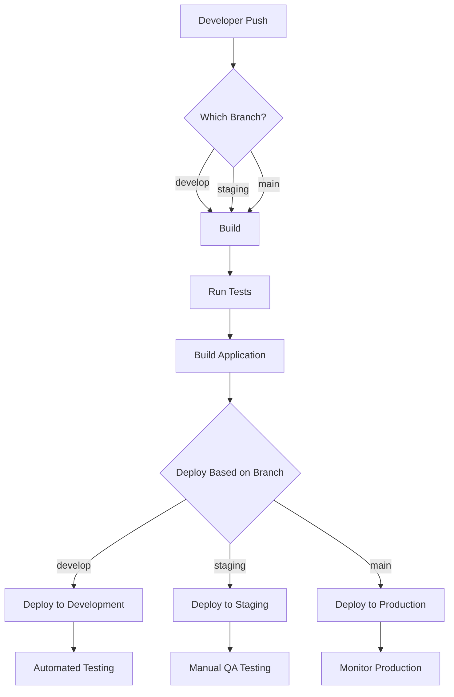

# CICD Multi-Environment Setup

## Introduction

In modern software development, deploying applications across multiple environments is a critical practice for ensuring quality and reliability. A multi-environment CI/CD (Continuous Integration/Continuous Deployment) setup allows teams to test code changes in isolated environments before promoting them to production.

This guide will walk you through creating a comprehensive multi-environment pipeline that automates the build, test, and deployment processes across development, staging, and production environments.

## What Are CI/CD Environments?

Before diving into the implementation, let's understand what environments are in the CI/CD context:

- **Development (Dev)**: Where new features and bug fixes are initially deployed for developer testing
- **Staging**: A pre-production environment that mimics production settings for final validation
- **Production (Prod)**: The live environment that serves end users

Each environment typically has:
- Different configuration settings
- Separate infrastructure resources
- Specific deployment criteria
- Unique access controls

## Benefits of a Multi-Environment CI/CD Setup

- **Risk Reduction**: Test changes in isolated environments before affecting real users
- **Quality Assurance**: Validate functionality across different configurations
- **Controlled Progression**: Methodically promote code through verification stages
- **Environment-Specific Optimizations**: Configure each environment for its specific purpose
- **Simplified Rollbacks**: Easily revert to previous states when issues arise

## Setting Up a Basic Multi-Environment Pipeline

Let's create a simple CI/CD pipeline that deploys a web application across three environments.

### 1. Project Structure

First, organize your project to support multiple environments:

```
project-root/
├── src/                  # Application source code
├── tests/                # Test suites
├── .github/
│   └── workflows/        # GitHub Actions workflow files
├── environments/         # Environment-specific configurations
│   ├── development/
│   ├── staging/
│   └── production/
└── scripts/              # Deployment scripts
```

### 2. Environment Configuration Files

Create environment-specific configuration files:

**`environments/development/config.json`**:

```json
{
  "apiUrl": "https://dev-api.example.com",
  "logLevel": "debug",
  "featureFlags": {
    "newFeature": true,
    "betaFeature": true
  }
}
```

**`environments/staging/config.json`**:

```json
{
  "apiUrl": "https://staging-api.example.com",
  "logLevel": "info",
  "featureFlags": {
    "newFeature": true,
    "betaFeature": false
  }
}
```

**`environments/production/config.json`**:

```json
{
  "apiUrl": "https://api.example.com",
  "logLevel": "warning",
  "featureFlags": {
    "newFeature": false,
    "betaFeature": false
  }
}
```

### 3. Creating the CI/CD Pipeline

Let's implement this using GitHub Actions. Here's a workflow file that defines our multi-environment pipeline:

**`.github/workflows/deploy.yml`**:

```yaml
name: Deploy Application

on:
  push:
    branches:
      - develop
      - staging
      - main

jobs:
  build:
    runs-on: ubuntu-latest
    steps:
      - name: Checkout code
        uses: actions/checkout@v3
      
      - name: Setup Node.js
        uses: actions/setup-node@v3
        with:
          node-version: '18'
      
      - name: Install dependencies
        run: npm ci
      
      - name: Run tests
        run: npm test
      
      - name: Build application
        run: npm run build
      
      - name: Upload build artifacts
        uses: actions/upload-artifact@v3
        with:
          name: build-files
          path: build/

  deploy-development:
    needs: build
    if: github.ref == 'refs/heads/develop'
    runs-on: ubuntu-latest
    environment: development
    steps:
      - name: Download build artifacts
        uses: actions/download-artifact@v3
        with:
          name: build-files
          path: build/
      
      - name: Configure AWS credentials
        uses: aws-actions/configure-aws-credentials@v1
        with:
          aws-access-key-id: ${{ secrets.AWS_ACCESS_KEY_ID }}
          aws-secret-access-key: ${{ secrets.AWS_SECRET_ACCESS_KEY }}
          aws-region: us-east-1
      
      - name: Deploy to development
        run: |
          aws s3 sync build/ s3://dev-example-app/ --delete
          aws cloudfront create-invalidation --distribution-id ${{ secrets.DEV_DISTRIBUTION_ID }} --paths "/*"

  deploy-staging:
    needs: build
    if: github.ref == 'refs/heads/staging'
    runs-on: ubuntu-latest
    environment: staging
    steps:
      - name: Download build artifacts
        uses: actions/download-artifact@v3
        with:
          name: build-files
          path: build/
      
      - name: Configure AWS credentials
        uses: aws-actions/configure-aws-credentials@v1
        with:
          aws-access-key-id: ${{ secrets.AWS_ACCESS_KEY_ID }}
          aws-secret-access-key: ${{ secrets.AWS_SECRET_ACCESS_KEY }}
          aws-region: us-east-1
      
      - name: Deploy to staging
        run: |
          aws s3 sync build/ s3://staging-example-app/ --delete
          aws cloudfront create-invalidation --distribution-id ${{ secrets.STAGING_DISTRIBUTION_ID }} --paths "/*"

  deploy-production:
    needs: build
    if: github.ref == 'refs/heads/main'
    runs-on: ubuntu-latest
    environment: production
    steps:
      - name: Download build artifacts
        uses: actions/download-artifact@v3
        with:
          name: build-files
          path: build/
      
      - name: Configure AWS credentials
        uses: aws-actions/configure-aws-credentials@v1
        with:
          aws-access-key-id: ${{ secrets.AWS_ACCESS_KEY_ID }}
          aws-secret-access-key: ${{ secrets.AWS_SECRET_ACCESS_KEY }}
          aws-region: us-east-1
      
      - name: Deploy to production
        run: |
          aws s3 sync build/ s3://example-app/ --delete
          aws cloudfront create-invalidation --distribution-id ${{ secrets.PROD_DISTRIBUTION_ID }} --paths "/*"
```

## How the Pipeline Works

Let's visualize the workflow:



In this pipeline:

1. **Branch-Based Deployment**: 
   - Code pushed to `develop` deploys to the development environment
   - Code pushed to `staging` deploys to the staging environment
   - Code pushed to `main` deploys to the production environment

2. **Isolated Builds**: Each environment gets the same built artifacts, ensuring consistency

3. **Environment-Specific Configurations**: Different settings are applied in each environment

4. **Sequential Promotion**: Changes typically flow from development → staging → production

## Environment-Specific Variables and Secrets

A crucial aspect of multi-environment setups is managing environment-specific secrets and variables. Most CI/CD platforms allow you to define these securely:

### GitHub Actions Environment Secrets

In GitHub, you can define environment-specific secrets:

1. Go to your repository settings
2. Navigate to Environments
3. Create environments named "development," "staging," and "production"
4. Add secrets to each environment

For example:
- `DEV_API_KEY`: API key for the development environment
- `STAGING_API_KEY`: API key for the staging environment
- `PROD_API_KEY`: API key for the production environment

You can then reference these in your workflow:

```yaml
- name: Set environment variables
  run: |
    echo "API_KEY=${{ secrets.API_KEY }}" >> $GITHUB_ENV
    echo "ENVIRONMENT=${{ env.ENVIRONMENT_NAME }}" >> $GITHUB_ENV
```

## Implementing Environment-Specific Configurations

Let's create a script that applies the right configuration based on the environment:

**`scripts/apply-config.js`**:

```javascript
const fs = require('fs');
const path = require('path');

// Get environment from command line argument or environment variable
const environment = process.argv[2] || process.env.DEPLOY_ENV || 'development';
console.log(`Applying configuration for ${environment} environment`);

// Read the environment-specific configuration
const configPath = path.join(__dirname, '..', 'environments', environment, 'config.json');
const config = JSON.parse(fs.readFileSync(configPath, 'utf8'));

// Create config file for the application
const outputPath = path.join(__dirname, '..', 'build', 'config.js');
const configContent = `window.APP_CONFIG = ${JSON.stringify(config, null, 2)};`;

fs.writeFileSync(outputPath, configContent);
console.log(`Configuration written to ${outputPath}`);
```

Then in your deployment workflow, add a step to apply the configuration:

```yaml
- name: Apply environment configuration
  run: node scripts/apply-config.js ${{ env.ENVIRONMENT_NAME }}
```

## Implementing Approval Gates

For added security, you might want to require manual approvals before deploying to production:

```yaml
deploy-production:
  needs: build
  if: github.ref == 'refs/heads/main'
  runs-on: ubuntu-latest
  environment:
    name: production
    url: https://example.com
  # This creates an approval gate in GitHub Actions
  # The deployment won't proceed until it's approved
```

## Testing Considerations for Multiple Environments

When working with multiple environments, testing should be tailored to each stage:

1. **Development Environment**:
   - Unit tests
   - Integration tests
   - Developer smoke tests

2. **Staging Environment**:
   - End-to-end tests
   - Performance tests
   - Security scans
   - User acceptance testing (UAT)

3. **Production Environment**:
   - Canary deployments
   - Smoke tests
   - Health checks
   - Monitoring alerts

You can automate most of these tests in your CI/CD pipeline:

```yaml
- name: Run E2E tests in staging
  if: github.ref == 'refs/heads/staging'
  run: npm run test:e2e

- name: Run smoke tests after production deployment
  if: github.ref == 'refs/heads/main'
  run: npm run test:smoke
```

## Real-World Example: Multi-Environment React Application

Let's see a practical example using a React application deployed to AWS:

### Environment-Specific `.env` Files

**`.env.development`**:
```
REACT_APP_API_URL=https://dev-api.example.com
REACT_APP_FEATURE_FLAGS='{"newDashboard":true,"betaFeatures":true}'
REACT_APP_ANALYTICS_ID=UA-XXXXX-DEV
```

**`.env.staging`**:
```
REACT_APP_API_URL=https://staging-api.example.com
REACT_APP_FEATURE_FLAGS='{"newDashboard":true,"betaFeatures":false}'
REACT_APP_ANALYTICS_ID=UA-XXXXX-STAGING
```

**`.env.production`**:
```
REACT_APP_API_URL=https://api.example.com
REACT_APP_FEATURE_FLAGS='{"newDashboard":false,"betaFeatures":false}'
REACT_APP_ANALYTICS_ID=UA-XXXXX-PROD
```

### Build Script

```bash
#!/bin/bash
# build.sh
ENV=$1
echo "Building for environment: $ENV"

# Load the appropriate environment variables
if [ -f .env.$ENV ]; then
  export $(cat .env.$ENV | grep -v '^#' | xargs)
else
  echo "Error: Environment file .env.$ENV not found!"
  exit 1
fi

# Build the application with the environment-specific config
npm run build
```

### Using in CI/CD Pipeline

```yaml
- name: Build for environment
  run: ./build.sh ${{ env.ENVIRONMENT_NAME }}
```

## Best Practices for Multi-Environment CI/CD

1. **Keep Environments Similar**: Minimize differences between environments to reduce "works on my machine" problems

2. **Infrastructure as Code**: Define all environments using code (Terraform, CloudFormation, etc.)

3. **Immutable Deployments**: Create new instances rather than modifying existing ones

4. **Feature Flags**: Control feature availability in different environments

5. **Automate Everything**: From testing to deployment to rollbacks

6. **Environment-Specific Logging**: Configure appropriate logging levels for each environment

7. **Access Control**: Restrict who can deploy to production

8. **Database Migrations**: Handle database changes carefully across environments

9. **Monitoring**: Implement monitoring for all environments, with stricter alerts for production

10. **Documentation**: Maintain clear documentation on environment differences and deployment processes

## Troubleshooting Common Issues

### Environment-Specific Bugs

If your application works in development but fails in production:

1. Check environment variables and configurations
2. Verify third-party service connections
3. Look for environment-specific code paths
4. Check for resource constraints (memory, CPU)

### Failed Deployments

When deployments fail:

1. Check deployment logs
2. Verify access permissions
3. Validate environment configurations
4. Test manual deployment steps
5. Check for infrastructure issues

## Summary

A well-configured multi-environment CI/CD setup is essential for modern application development. By properly configuring development, staging, and production environments, you can:

- Catch bugs early in the development lifecycle
- Test in production-like environments before affecting real users
- Automate repetitive deployment tasks
- Maintain a structured promotion process for code changes
- Implement targeted testing strategies for each environment

Remember that each environment serves a specific purpose in your development lifecycle, and your CI/CD pipeline should be designed to support those purposes while maintaining security, reliability, and efficiency.

## Additional Exercises

1. Set up a local multi-environment pipeline using Docker Compose
2. Implement feature flags that control feature availability in different environments
3. Create a rollback strategy for each environment
4. Implement canary deployments for production releases
5. Set up monitoring and alerting for all environments

## Further Learning Resources

- Explore infrastructure as code (IaC) tools like Terraform or AWS CloudFormation
- Learn about container orchestration platforms like Kubernetes for environment isolation
- Study feature flag implementation strategies
- Research blue-green and canary deployment techniques
- Investigate automated testing strategies for different environments