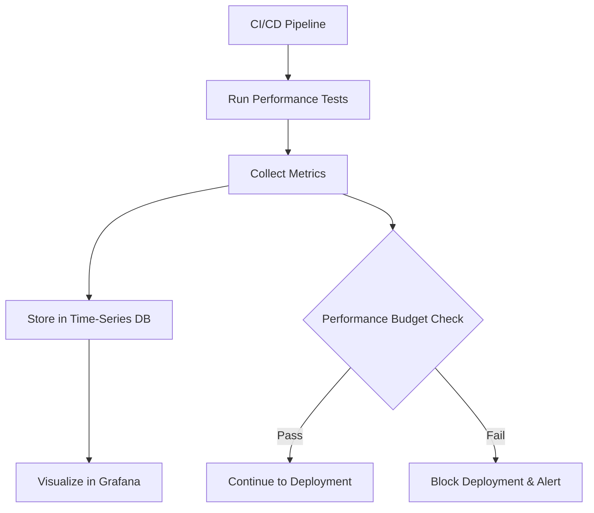
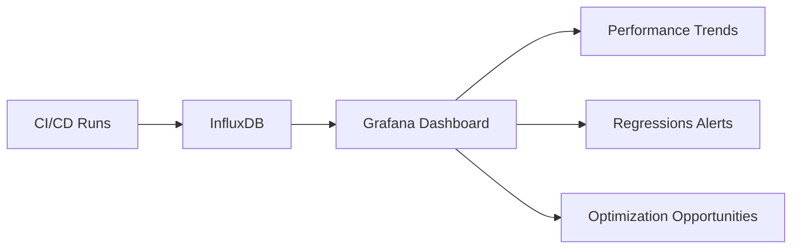

# CI/CD Performance Pipeline

## Introduction

A CI/CD Performance Pipeline extends the traditional Continuous Integration and Continuous Deployment (CI/CD) approach by incorporating performance testing and optimization as a core part of your development workflow. Instead of discovering performance issues after deployment, this approach helps you identify and address them early in the development cycle.

For beginners who are just getting familiar with CI/CD concepts, a performance pipeline adds automated checks that ensure your application not only works correctly but also performs efficiently. This guide will walk you through setting up a CI/CD pipeline specifically designed to monitor, test, and optimize application performance.

## Why Performance Matters in CI/CD

Traditional CI/CD pipelines focus on functionality: Does the code compile? Do the tests pass? Can it be deployed? However, an application can pass all functional tests while still suffering from performance issues that affect user experience, such as:

- Slow page load times
- High resource usage (CPU, memory)
- Poor response times under load
- Inefficient database queries
- Unoptimized assets (images, JavaScript, CSS)

A performance pipeline addresses these concerns by automating performance testing and establishing performance baselines and budgets.

## Key Components of a CI/CD Performance Pipeline

### 1. Performance Metrics Collection

The first step is defining what performance means for your application. Common metrics include:

- **Load time**: How long it takes for pages to load
- **Time to First Byte (TTFB)**: How quickly the server responds
- **Memory and CPU usage**: Resource consumption 
- **Response time**: How long API endpoints take to respond
- **Throughput**: Requests handled per second
- **Error rate**: Percentage of failed requests

### 2. Performance Baseline

A baseline helps you understand your application's current performance, giving you a reference point for comparisons.

```js
// Example of a performance baseline configuration
const performanceBaseline = {
  homepage: {
    loadTime: 1200, // in milliseconds
    firstContentfulPaint: 800,
    resourceCount: 25,
    totalSize: 1500000 // in bytes
  },
  productPage: {
    loadTime: 1500,
    firstContentfulPaint: 950,
    resourceCount: 35,
    totalSize: 2000000
  }
};
```

### 3. Performance Budgets

Performance budgets set thresholds that should not be exceeded:

```js
// Example performance budget configuration
const performanceBudgets = {
  // Page weights
  sizeLimit: {
    document: '100kb',
    totalSize: '2mb',
    image: '800kb',
    script: '350kb',
    stylesheet: '100kb'
  },
  // Timing budgets
  timingBudget: {
    firstContentfulPaint: 1000, // ms
    timeToInteractive: 2500,    // ms
    onload: 3000               // ms
  }
};
```

### 4. Automated Performance Tests

Performance tests should run automatically as part of your CI/CD pipeline.

## Building a Basic CI/CD Performance Pipeline

Let's walk through creating a simple CI/CD performance pipeline using GitHub Actions and open-source tools.

### Step 1: Create a Workflow File

Start by creating a GitHub Actions workflow in your repository:

```yaml
# .github/workflows/performance-pipeline.yml
name: Performance Pipeline

on:
  push:
    branches: [ main ]
  pull_request:
    branches: [ main ]

jobs:
  performance:
    runs-on: ubuntu-latest
    steps:
      - uses: actions/checkout@v3
      
      - name: Setup Node.js
        uses: actions/setup-node@v3
        with:
          node-version: '18'
          
      - name: Install dependencies
        run: npm ci
        
      - name: Build project
        run: npm run build
        
      - name: Run Lighthouse CI
        uses: treosh/lighthouse-ci-action@v9
        with:
          urls: |
            http://localhost:3000/
            http://localhost:3000/products
          uploadArtifacts: true
          temporaryPublicStorage: true
          
      - name: Start local server
        run: npm run start &
        
      - name: Wait for server
        run: sleep 10
        
      - name: Run performance tests
        run: npm run test:performance
```

### Step 2: Set Up Lighthouse CI

Lighthouse CI is an excellent tool for measuring web performance. Create a configuration file:

```js
// lighthouserc.js
module.exports = {
  ci: {
    collect: {
      startServerCommand: 'npm run start',
      url: ['http://localhost:3000/'],
      numberOfRuns: 3,
    },
    assert: {
      assertions: {
        'categories:performance': ['error', {minScore: 0.8}],
        'first-contentful-paint': ['error', {maxNumericValue: 1000}],
        'interactive': ['error', {maxNumericValue: 3000}],
        'max-potential-fid': ['error', {maxNumericValue: 100}],
        'cumulative-layout-shift': ['error', {maxNumericValue: 0.1}],
        'largest-contentful-paint': ['error', {maxNumericValue: 2500}],
      },
    },
    upload: {
      target: 'temporary-public-storage',
    },
  },
};
```

### Step 3: Create Performance Tests

Write custom performance tests using a tool like `k6` for load testing:

```js
// tests/performance/load-test.js
import http from 'k6/http';
import { sleep, check } from 'k6';

export const options = {
  vus: 10,
  duration: '30s',
  thresholds: {
    http_req_duration: ['p(95)<500'], // 95% of requests should be below 500ms
    http_req_failed: ['rate<0.01'],    // Less than 1% of requests should fail
  },
};

export default function() {
  const res = http.get('http://localhost:3000/api/products');
  
  check(res, {
    'status is 200': (r) => r.status === 200,
    'response time < 400ms': (r) => r.timings.duration < 400,
  });
  
  sleep(1);
}
```

### Step 4: Configure Performance Budgets

Set up webpack's performance budgets (if you're using webpack):

```js
// webpack.config.js (excerpt)
module.exports = {
  // ... other webpack configuration
  performance: {
    maxAssetSize: 250000,
    maxEntrypointSize: 400000,
    hints: 'error',
  },
  // ...
};
```

### Step 5: Visualize Performance Results

Set up a dashboard to visualize performance metrics over time. For example, using Grafana:



## Real-World Example: E-commerce Site Performance Pipeline

Let's apply these concepts to an e-commerce website:

### 1. Define Critical User Journeys

Start by identifying the key user flows:

```js
// performance-test-flows.js
const criticalFlows = [
  {
    name: 'Product Search',
    steps: [
      { name: 'Load Homepage', url: '/' },
      { name: 'Search for Product', action: async (page) => {
        await page.type('#search-input', 'smartphone');
        await page.click('#search-button');
      }},
      { name: 'View Search Results', waitFor: '.product-grid' }
    ]
  },
  {
    name: 'Checkout Flow',
    steps: [
      // Additional steps defined here
    ]
  }
];
```

### 2. Implement Frontend Performance Testing

Set up automated tests for frontend performance using Puppeteer:

```js
// tests/performance/frontend-perf.js
const puppeteer = require('puppeteer');
const { expect } = require('chai');

describe('Homepage Performance', function() {
  let browser, page;
  
  before(async function() {
    browser = await puppeteer.launch();
    page = await browser.newPage();
    
    // Enable performance metrics collection
    await page.setCacheEnabled(false);
    await page.coverage.startJSCoverage();
    await page.coverage.startCSSCoverage();
  });
  
  after(async function() {
    await browser.close();
  });
  
  it('should load homepage within budget', async function() {
    // Navigate to the page
    const navigationStart = Date.now();
    await page.goto('http://localhost:3000', { waitUntil: 'networkidle0' });
    const navigationTime = Date.now() - navigationStart;
    
    // Get performance metrics
    const performanceMetrics = await page.evaluate(() => JSON.stringify(window.performance.timing));
    const metrics = JSON.parse(performanceMetrics);
    
    // Collect JS and CSS coverage
    const jsCoverage = await page.coverage.stopJSCoverage();
    const cssCoverage = await page.coverage.stopCSSCoverage();
    
    // Calculate unused JS and CSS
    const jsUsed = calculateUsedBytes(jsCoverage);
    const cssUsed = calculateUsedBytes(cssCoverage);
    
    // Assertions
    expect(navigationTime).to.be.below(3000);
    expect(metrics.domComplete - metrics.navigationStart).to.be.below(2500);
    expect(jsUsed.unusedPercentage).to.be.below(30);
    expect(cssUsed.unusedPercentage).to.be.below(25);
  });
});

function calculateUsedBytes(coverage) {
  let totalBytes = 0;
  let usedBytes = 0;
  
  for (const entry of coverage) {
    totalBytes += entry.text.length;
    
    for (const range of entry.ranges) {
      usedBytes += range.end - range.start;
    }
  }
  
  return {
    total: totalBytes,
    used: usedBytes,
    unused: totalBytes - usedBytes,
    unusedPercentage: (totalBytes - usedBytes) / totalBytes * 100
  };
}
```

### 3. Implement API Performance Testing

Test your API endpoints for performance:

```js
// tests/performance/api-perf.js
const axios = require('axios');
const { expect } = require('chai');

describe('API Performance Tests', function() {
  this.timeout(10000);
  
  it('should return product list within 300ms', async function() {
    const start = Date.now();
    const response = await axios.get('http://localhost:3000/api/products');
    const duration = Date.now() - start;
    
    expect(response.status).to.equal(200);
    expect(duration).to.be.below(300);
    expect(response.data.length).to.be.greaterThan(0);
  });
  
  it('should handle concurrent API requests efficiently', async function() {
    const endpoints = [
      '/api/products',
      '/api/categories',
      '/api/featured',
      '/api/promotions',
      '/api/reviews'
    ];
    
    const start = Date.now();
    
    const responses = await Promise.all(
      endpoints.map(endpoint => axios.get(`http://localhost:3000${endpoint}`))
    );
    
    const duration = Date.now() - start;
    
    // All responses should be successful
    responses.forEach(response => {
      expect(response.status).to.equal(200);
    });
    
    // Total time should be less than if they were sequential
    expect(duration).to.be.below(endpoints.length * 200);
  });
});
```

### 4. Database Performance Checks

Test database query performance:

```js
// tests/performance/db-perf.js
const { Pool } = require('pg');
const { expect } = require('chai');

describe('Database Performance Tests', function() {
  let db;
  
  before(async function() {
    db = new Pool({
      user: 'test_user',
      host: 'localhost',
      database: 'test_db',
      password: 'test_password',
      port: 5432,
    });
  });
  
  after(async function() {
    await db.end();
  });
  
  it('should perform product search query within 50ms', async function() {
    const start = Date.now();
    
    const result = await db.query(`
      SELECT p.id, p.name, p.price, p.description 
      FROM products p
      JOIN product_categories pc ON p.id = pc.product_id
      WHERE p.name ILIKE $1 OR p.description ILIKE $1
      LIMIT 20
    `, ['%smartphone%']);
    
    const duration = Date.now() - start;
    
    expect(duration).to.be.below(50);
    expect(result.rows.length).to.be.greaterThan(0);
  });
});
```

### 5. Performance Report Generation

Generate readable performance reports:

```js
// scripts/generate-perf-report.js
const fs = require('fs');
const path = require('path');

// Load test results
const lighthouseResults = JSON.parse(fs.readFileSync('./lighthouse-results.json'));
const apiResults = JSON.parse(fs.readFileSync('./api-perf-results.json'));
const dbResults = JSON.parse(fs.readFileSync('./db-perf-results.json'));

// Generate markdown report
const report = `# Performance Test Report
Generated: ${new Date().toISOString()}

## Lighthouse Scores
- Performance: ${lighthouseResults.categories.performance.score * 100}/100
- First Contentful Paint: ${lighthouseResults.audits['first-contentful-paint'].displayValue}
- Time to Interactive: ${lighthouseResults.audits['interactive'].displayValue}
- Speed Index: ${lighthouseResults.audits['speed-index'].displayValue}

## API Performance
${apiResults.map(test => `- ${test.name}: ${test.duration}ms (${test.status})`).join('
')}

## Database Performance
${dbResults.map(test => `- ${test.name}: ${test.duration}ms (${test.status})`).join('
')}

## Recommendations
${generateRecommendations(lighthouseResults, apiResults, dbResults)}
`;

fs.writeFileSync('performance-report.md', report);

function generateRecommendations(lighthouse, api, db) {
  const recommendations = [];
  
  // Add logic to generate recommendations based on test results
  if (lighthouse.audits['render-blocking-resources'].score < 1) {
    recommendations.push('Eliminate render-blocking resources');
  }
  
  // More recommendations based on other metrics
  
  return recommendations.join('
- ');
}
```

### 6. Implementing the Full Pipeline

Put it all together in your CI/CD configuration:

```yaml
# .github/workflows/full-performance-pipeline.yml
name: Full Performance Pipeline

on:
  push:
    branches: [ main ]
  pull_request:
    branches: [ main ]

jobs:
  performance:
    runs-on: ubuntu-latest
    steps:
      - uses: actions/checkout@v3
      
      - name: Setup Node.js
        uses: actions/setup-node@v3
        with:
          node-version: '18'
          
      - name: Install dependencies
        run: npm ci
        
      - name: Build project
        run: npm run build
        
      - name: Setup Database
        run: docker-compose up -d test-db
        
      - name: Wait for Database
        run: sleep 10
        
      - name: Setup Test Data
        run: npm run db:seed:test
        
      - name: Start application
        run: npm run start:test &
        
      - name: Wait for application
        run: sleep 10
        
      - name: Run Lighthouse CI
        uses: treosh/lighthouse-ci-action@v9
        with:
          urls: |
            http://localhost:3000/
            http://localhost:3000/products
          uploadArtifacts: true
          
      - name: Run Frontend Performance Tests
        run: npm run test:frontend-performance
        
      - name: Run API Performance Tests
        run: npm run test:api-performance
        
      - name: Run Database Performance Tests
        run: npm run test:db-performance
        
      - name: Generate Performance Report
        run: node scripts/generate-perf-report.js
        
      - name: Upload Performance Report
        uses: actions/upload-artifact@v3
        with:
          name: performance-report
          path: performance-report.md
          
      - name: Check Performance Budgets
        run: npm run check:performance-budgets
        
      - name: Notify on Performance Regression
        if: failure()
        uses: actions/github-script@v6
        with:
          script: |
            github.rest.issues.createComment({
              issue_number: context.issue.number,
              owner: context.repo.owner,
              repo: context.repo.repo,
              body: '⚠️ Performance tests failed! Please check the performance report.'
            })
```

## Visualizing Performance Metrics

A performance dashboard helps track metrics over time:



You can set up a simple performance dashboard using Grafana and InfluxDB to monitor trends over time.

## Best Practices for CI/CD Performance Pipelines

1. **Start small**: Begin with a few critical metrics rather than trying to measure everything
2. **Set realistic budgets**: Base your performance budgets on your current metrics plus a reasonable improvement target
3. **Automate everything**: Performance testing should be fully automated, not a manual step
4. **Focus on user experience**: Prioritize metrics that directly impact how users perceive your application
5. **Version your tests**: Keep your performance tests under version control
6. **Use production-like environments**: Test in environments that closely match production
7. **Track trends over time**: Look for patterns and regressions, not just isolated test results
8. **Make performance visible**: Share performance reports with the entire team
9. **Set performance gates**: Block deployments that fail to meet performance criteria
10. **Continuously improve**: Regularly review and update your performance budgets and tests

## Troubleshooting Common Issues

### Inconsistent Test Results

Performance tests can produce variable results. To address this:

```js
// Improved test reliability
const options = {
  discardResponseBodies: true,
  scenarios: {
    contacts: {
      executor: 'ramping-vus',
      startVUs: 0,
      stages: [
        { duration: '20s', target: 10 },
        { duration: '30s', target: 10 },
        { duration: '10s', target: 0 },
      ],
    },
  },
  thresholds: {
    http_req_duration: ['p(95)<500', 'p(99)<1500'],
    'http_req_duration{staticAsset:yes}': ['p(95)<100'],
    'http_req_duration{staticAsset:no}': ['p(95)<400'],
    http_req_failed: ['rate<0.01'],
  },
};
```

### False Positives/Negatives

Sometimes tests may fail or pass erroneously:

- Use multiple runs and take the median result
- Implement warmup periods before measurement
- Isolate tests from external dependencies where possible

## Exercise: Setting Up Your First Performance Pipeline

Now it's your turn to implement a basic performance pipeline:

1. Choose a simple web application you've built or a sample application
2. Set up Lighthouse CI using the configuration provided in this guide
3. Define at least three performance metrics important for your application
4. Create a GitHub Actions workflow to run Lighthouse tests on pull requests
5. Set performance budgets for your key metrics
6. Create a simple dashboard to visualize your results

## Summary

A CI/CD Performance Pipeline helps you identify and address performance issues early in the development cycle. By integrating performance testing into your CI/CD workflow, you can:

- Catch performance regressions before they reach production
- Establish clear performance expectations with measurable budgets
- Build a culture of performance awareness in your development team
- Continuously optimize your application based on data, not assumptions

Building a performance pipeline requires initial investment but pays dividends in user satisfaction, conversion rates, and reduced infrastructure costs.

## Additional Resources

- [Web Vitals](https://web.dev/vitals/) - Google's core web vitals metrics
- [Lighthouse CI](https://github.com/GoogleChrome/lighthouse-ci) - Documentation and examples
- [k6 Documentation](https://k6.io/docs/) - For load testing
- [Performance Budget Calculator](https://www.performancebudget.io/) - Help determine appropriate budgets
- [WebPageTest](https://www.webpagetest.org/) - Advanced web performance testing
- [PageSpeed Insights](https://pagespeed.web.dev/) - Performance analysis tool