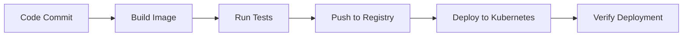

# CICD Kubernetes Deployment

## Introduction

Continuous Integration and Continuous Deployment (CI/CD) with Kubernetes has become an essential practice in modern software development. This approach automates the process of building, testing, and deploying applications to Kubernetes clusters, ensuring faster, more reliable software delivery.

In this tutorial, we'll explore how to set up a CI/CD pipeline for deploying applications to Kubernetes. You'll learn how to automate your workflow from code commit to production deployment, making your development process more efficient and less error-prone.

## Understanding CI/CD and Kubernetes

### What is CI/CD?

CI/CD consists of two complementary practices:

- **Continuous Integration (CI)**: Automatically building and testing code changes whenever they're committed to your repository.
- **Continuous Deployment (CD)**: Automatically deploying applications to production after passing all tests in the CI process.

### What is Kubernetes?

Kubernetes is an open-source container orchestration platform that automates the deployment, scaling, and management of containerized applications. It provides:

- Container scheduling and management
- Service discovery and load balancing
- Storage orchestration
- Self-healing capabilities
- Declarative configuration

## Setting Up Your CI/CD Pipeline for Kubernetes

Let's walk through building a complete CI/CD pipeline for Kubernetes deployments.



### Prerequisites

Before we begin, make sure you have:

1. A Kubernetes cluster (local with Minikube or cloud-based)
2. A container registry account (Docker Hub, Google Container Registry, etc.)
3. A Git repository for your application
4. A CI/CD tool (GitHub Actions, Jenkins, GitLab CI, etc.)

## Step 1: Creating a Sample Application

Let's use a simple Node.js application as our example:

```javascript
// app.js
const express = require('express');
const app = express();
const port = process.env.PORT || 3000;

app.get('/', (req, res) => {
  res.send('Hello from Kubernetes!');
});

app.listen(port, () => {
  console.log(`App listening at http://localhost:${port}`);
});
```

And a corresponding `package.json`:

```json
{
  "name": "k8s-demo-app",
  "version": "1.0.0",
  "description": "Demo app for Kubernetes deployment",
  "main": "app.js",
  "scripts": {
    "start": "node app.js",
    "test": "jest"
  },
  "dependencies": {
    "express": "^4.17.1"
  },
  "devDependencies": {
    "jest": "^27.0.6"
  }
}
```

## Step 2: Containerizing the Application

Create a `Dockerfile` to containerize your application:

```dockerfile
FROM node:14-alpine

WORKDIR /app

COPY package*.json ./
RUN npm install --production

COPY . .

EXPOSE 3000
CMD ["npm", "start"]
```

## Step 3: Creating Kubernetes Manifests

Now, let's create Kubernetes manifests for our application. First, a deployment manifest:

```yaml
# k8s/deployment.yaml
apiVersion: apps/v1
kind: Deployment
metadata:
  name: demo-app
spec:
  replicas: 3
  selector:
    matchLabels:
      app: demo-app
  template:
    metadata:
      labels:
        app: demo-app
    spec:
      containers:
      - name: demo-app
        image: ${DOCKER_IMAGE}:${IMAGE_TAG}
        ports:
        - containerPort: 3000
        resources:
          limits:
            cpu: "0.5"
            memory: "512Mi"
          requests:
            cpu: "0.2"
            memory: "256Mi"
```

Next, a service manifest to expose the application:

```yaml
# k8s/service.yaml
apiVersion: v1
kind: Service
metadata:
  name: demo-app
spec:
  selector:
    app: demo-app
  ports:
  - port: 80
    targetPort: 3000
  type: LoadBalancer
```

## Step 4: Setting Up GitHub Actions for CI/CD

For this tutorial, we'll use GitHub Actions as our CI/CD tool. Create a file at `.github/workflows/cicd.yaml`:

```yaml
name: CI/CD Pipeline

on:
  push:
    branches: [ main ]
  pull_request:
    branches: [ main ]

env:
  DOCKER_IMAGE: yourusername/demo-app
  K8S_NAMESPACE: default

jobs:
  build-and-test:
    runs-on: ubuntu-latest
    steps:
    - uses: actions/checkout@v2
    
    - name: Set up Node.js
      uses: actions/setup-node@v2
      with:
        node-version: '14'
    
    - name: Install dependencies
      run: npm ci
    
    - name: Run tests
      run: npm test
    
    - name: Build Docker image
      run: |
        IMAGE_TAG=${GITHUB_SHA::7}
        docker build -t $DOCKER_IMAGE:$IMAGE_TAG .
        docker tag $DOCKER_IMAGE:$IMAGE_TAG $DOCKER_IMAGE:latest
    
    - name: Log in to Docker Hub
      uses: docker/login-action@v1
      with:
        username: ${{ secrets.DOCKER_USERNAME }}
        password: ${{ secrets.DOCKER_PASSWORD }}
    
    - name: Push Docker image
      run: |
        IMAGE_TAG=${GITHUB_SHA::7}
        docker push $DOCKER_IMAGE:$IMAGE_TAG
        docker push $DOCKER_IMAGE:latest

  deploy:
    needs: build-and-test
    if: github.ref == 'refs/heads/main'
    runs-on: ubuntu-latest
    steps:
    - uses: actions/checkout@v2
    
    - name: Set up kubectl
      uses: azure/setup-kubectl@v1
    
    - name: Configure kubectl
      run: |
        echo "${{ secrets.KUBE_CONFIG }}" > kube_config.yaml
        export KUBECONFIG=./kube_config.yaml
    
    - name: Update deployment image
      run: |
        IMAGE_TAG=${GITHUB_SHA::7}
        sed -i "s|\${DOCKER_IMAGE}|$DOCKER_IMAGE|g" k8s/deployment.yaml
        sed -i "s|\${IMAGE_TAG}|$IMAGE_TAG|g" k8s/deployment.yaml
    
    - name: Deploy to Kubernetes
      run: |
        kubectl apply -f k8s/deployment.yaml
        kubectl apply -f k8s/service.yaml
        kubectl rollout status deployment/demo-app -n $K8S_NAMESPACE
```

## Step 5: Setting Up Repository Secrets

For the CI/CD pipeline to work, you need to add these secrets to your GitHub repository:

1. `DOCKER_USERNAME`: Your Docker Hub username
2. `DOCKER_PASSWORD`: Your Docker Hub password or access token
3. `KUBE_CONFIG`: Your Kubernetes config file content, base64 encoded

You can add these in your GitHub repository under Settings > Secrets > Actions.

## Step 6: Understanding the Pipeline Process

Let's break down what happens in our CI/CD pipeline:

1. **Build and Test**:
   - Check out code from the repository
   - Set up Node.js and install dependencies
   - Run tests to validate the code
   - Build a Docker image with the code
   - Push the image to Docker Hub

2. **Deploy**:
   - Set up kubectl for Kubernetes interaction
   - Configure kubectl with your cluster credentials
   - Update the deployment manifest with the new image
   - Apply the Kubernetes manifests
   - Verify the deployment is successful

## Step 7: Making Changes and Watching the Pipeline

Now you can experience the power of CI/CD with Kubernetes:

1. Make a change to your application code
2. Commit and push to the main branch
3. Watch the GitHub Actions workflow run automatically
4. Observe your application update in Kubernetes

Example change to the application:

```javascript
// Updated app.js
app.get('/', (req, res) => {
  res.send('Hello from Kubernetes with CI/CD!');
});
```

## Best Practices for CI/CD with Kubernetes

### 1. Environment Strategy

Implement a multi-environment strategy:

```yaml
# Example in GitHub Actions
jobs:
  deploy-dev:
    # Deploy to development environment
    
  deploy-staging:
    needs: deploy-dev
    # Deploy to staging environment
    
  deploy-production:
    needs: deploy-staging
    # Deploy to production environment
```

### 2. Automated Rollbacks

Implement automated rollbacks for failed deployments:

```yaml
- name: Deploy to Kubernetes
  run: |
    kubectl apply -f k8s/deployment.yaml
    # Check if deployment is successful
    if ! kubectl rollout status deployment/demo-app -n $K8S_NAMESPACE --timeout=180s; then
      echo "Deployment failed, rolling back"
      kubectl rollout undo deployment/demo-app -n $K8S_NAMESPACE
      exit 1
    fi
```

### 3. Secret Management

Use Kubernetes Secrets or external secret management tools:

```yaml
apiVersion: v1
kind: Secret
metadata:
  name: app-secrets
type: Opaque
data:
  api-key: base64encodedvalue
```

### 4. Resource Management

Always define resource requests and limits:

```yaml
resources:
  limits:
    cpu: "0.5"
    memory: "512Mi"
  requests:
    cpu: "0.2"
    memory: "256Mi"
```

### 5. Health Checks

Implement liveness and readiness probes:

```yaml
livenessProbe:
  httpGet:
    path: /health
    port: 3000
  initialDelaySeconds: 30
  periodSeconds: 10

readinessProbe:
  httpGet:
    path: /ready
    port: 3000
  initialDelaySeconds: 5
  periodSeconds: 5
```

## Advanced CI/CD Features

### Feature Flags

Implement feature flags to control feature rollout:

```javascript
const featureFlags = {
  newFeature: process.env.ENABLE_NEW_FEATURE === 'true'
};

app.get('/feature', (req, res) => {
  if (featureFlags.newFeature) {
    res.send('New feature is enabled!');
  } else {
    res.send('New feature is not available yet.');
  }
});
```

### Canary Deployments

Implement canary deployments to test with a subset of users:

```yaml
# canary-deployment.yaml
apiVersion: apps/v1
kind: Deployment
metadata:
  name: demo-app-canary
spec:
  replicas: 1
  selector:
    matchLabels:
      app: demo-app
      track: canary
  template:
    metadata:
      labels:
        app: demo-app
        track: canary
    spec:
      containers:
      - name: demo-app
        image: ${DOCKER_IMAGE}:${IMAGE_TAG}
```

### Blue/Green Deployments

Implement blue/green deployments for zero-downtime updates:

```yaml
# In your CI/CD pipeline
- name: Blue/Green Deployment
  run: |
    # Deploy new version (green)
    kubectl apply -f k8s/green-deployment.yaml
    
    # Wait for green deployment to be ready
    kubectl rollout status deployment/demo-app-green
    
    # Switch traffic to green
    kubectl apply -f k8s/service-green.yaml
    
    # If successful, remove old deployment (blue)
    kubectl delete -f k8s/blue-deployment.yaml
```

## Troubleshooting Common Issues

### 1. Image Pull Errors

If your pods are stuck in `ImagePullBackOff` state:

```bash
# Check pod status
kubectl get pods
kubectl describe pod <pod-name>

# Solutions:
# 1. Verify image name and tag
# 2. Check registry credentials
kubectl create secret docker-registry regcred \
  --docker-server=<your-registry-server> \
  --docker-username=<your-username> \
  --docker-password=<your-password>
```

### 2. Configuration Issues

If your application isn't behaving as expected:

```bash
# Check logs
kubectl logs <pod-name>

# Check ConfigMaps and Secrets
kubectl get configmap
kubectl get secrets
```

### 3. Resource Constraints

If pods are being evicted or not scheduling:

```bash
# Check node resources
kubectl describe nodes

# Monitor resource usage
kubectl top nodes
kubectl top pods
```

## Summary

In this tutorial, we've learned how to set up a CI/CD pipeline for Kubernetes deployments. We've covered:

- The basics of CI/CD and Kubernetes
- Creating a sample application and containerizing it
- Defining Kubernetes deployment manifests
- Setting up GitHub Actions for automation
- Best practices for Kubernetes deployments
- Advanced deployment strategies
- Troubleshooting common issues

By implementing CI/CD with Kubernetes, you can:
- Reduce manual errors
- Speed up deployment cycles
- Ensure consistent deployments across environments
- Easily roll back problematic changes
- Focus more on developing features rather than deployment tasks

## Additional Resources

For further learning, check out:

- The official [Kubernetes documentation](https://kubernetes.io/docs/)
- [GitHub Actions documentation](https://docs.github.com/en/actions)
- The [Twelve-Factor App methodology](https://12factor.net/)

## Practice Exercises

1. Modify the CI/CD pipeline to implement a multi-environment strategy (dev, staging, production)
2. Add a liveness probe and readiness probe to the Kubernetes deployment
3. Implement a canary deployment strategy for the application
4. Set up monitoring and alerting for your Kubernetes cluster
5. Implement automated testing of your Kubernetes deployment