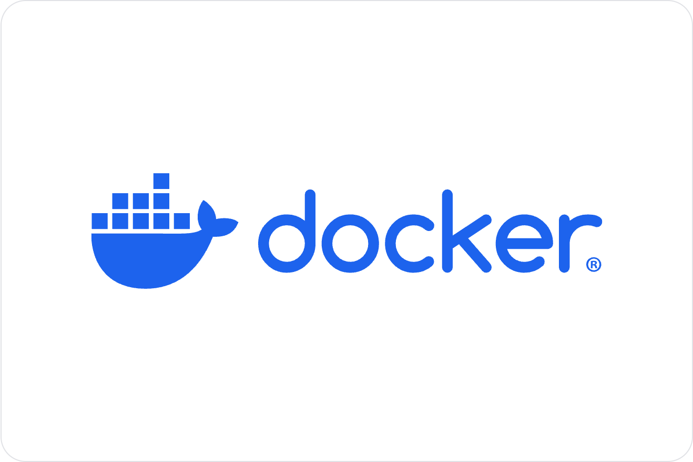
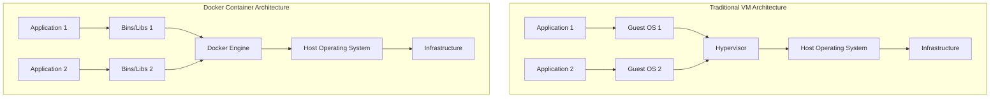

# Docker Introduction

## What is Docker?

<div style={{
    "width": "20%",
    "margin": "0 auto",
    "text-align": "center"
}}>
    
</div>


Docker is a platform that enables developers to build, package, and distribute applications inside lightweight, portable containers. These containers bundle an application with all its dependencies, ensuring that it runs consistently across different environments.

Think of a container as a standardized box that includes everything your application needs to run – code, runtime, system tools, libraries, and settings. This consistency eliminates the classic developer problem: "But it works on my machine!"

## Why Use Docker?

Docker solves several common development challenges:

- **Consistency**: Applications run the same way everywhere
- **Isolation**: Applications and their dependencies are separated from other applications
- **Portability**: Containers can run on any system that has Docker installed
- **Efficiency**: Containers share OS resources and start up in seconds
- **Scalability**: Easy to scale applications by running multiple identical containers

## Docker vs. Virtual Machines

Before containers, virtual machines (VMs) were the primary way to isolate applications. Let's see how they compare:



The key difference: **VMs virtualize an entire machine down to the hardware level, while containers virtualize only at the operating system level.** This makes containers much lighter and faster.

## Core Docker Concepts

Before diving into commands, let's understand the basic terminology:

- **Docker Image**: A read-only template containing instructions for creating a container
- **Docker Container**: A runnable instance of an image
- **Dockerfile**: A text file with instructions to build a Docker image
- **Docker Hub**: A registry service where you can find and share Docker images
- **Docker Engine**: The runtime that runs and manages containers

## Installing Docker

To get started with Docker, you need to install Docker Desktop (for Windows/Mac) or Docker Engine (for Linux).

Visit the [official Docker website](https://www.docker.com/get-started) to download and install Docker for your operating system.

You can verify your installation by running:

```bash
docker --version
```

Output should look similar to:

```
Docker version 24.0.6, build ed223bc
```

## Your First Docker Container

Let's run your first container using the official Nginx web server image:

```bash
docker run --name my-nginx -p 8080:80 -d nginx
```

This command:
- `docker run`: Creates and starts a new container
- `--name my-nginx`: Names the container "my-nginx"
- `-p 8080:80`: Maps port 8080 on your host to port 80 in the container
- `-d`: Runs the container in detached mode (in the background)
- `nginx`: Specifies the image to use

Now, open your browser and navigate to `http://localhost:8080`. You should see the Nginx welcome page!

## Basic Docker Commands

Here are some essential Docker commands to get you started:

### Listing containers

```bash
# List running containers
docker ps

# List all containers (including stopped ones)
docker ps -a
```

Example output:

```
CONTAINER ID   IMAGE     COMMAND                  CREATED          STATUS          PORTS                  NAMES
f8d75e234e12   nginx     "/docker-entrypoint.…"   10 seconds ago   Up 9 seconds    0.0.0.0:8080->80/tcp   my-nginx
```

### Stopping and removing containers

```bash
# Stop a running container
docker stop my-nginx

# Remove a container
docker rm my-nginx
```

### Working with images

```bash
# List available images
docker images

# Pull an image from Docker Hub
docker pull ubuntu:latest

# Remove an image
docker rmi nginx
```

## Creating a Custom Docker Image

Now let's create our own Docker image using a Dockerfile. Create a new directory for your project and add a file named `Dockerfile` (no extension):

```bash
mkdir docker-demo
cd docker-demo
touch Dockerfile
```

Open the Dockerfile in your text editor and add:

```dockerfile
# Use an official Node.js runtime as the base image
FROM node:14-alpine

# Set the working directory in the container
WORKDIR /app

# Copy package.json and package-lock.json
COPY package*.json ./

# Install dependencies
RUN npm install

# Copy the rest of the application code
COPY . .

# Expose port 3000
EXPOSE 3000

# Command to run the application
CMD ["npm", "start"]
```

Next, create a simple Node.js app:

1. Initialize a Node.js project:

```bash
npm init -y
```

2. Create a simple `index.js` file:

```javascript
const express = require('express');
const app = express();
const port = 3000;

app.get('/', (req, res) => {
  res.send('Hello from Docker!');
});

app.listen(port, () => {
  console.log(`App listening at http://localhost:${port}`);
});
```

3. Install Express:

```bash
npm install express
```

4. Update `package.json` to include a start script:

```json
"scripts": {
  "start": "node index.js"
}
```

Now build your Docker image:

```bash
docker build -t my-node-app .
```

And run it:

```bash
docker run --name my-app -p 3000:3000 -d my-node-app
```

Visit `http://localhost:3000` to see your application running!

## Docker Compose for Multi-Container Applications

Real-world applications often require multiple containers working together. Docker Compose simplifies managing multi-container applications.

Create a `docker-compose.yml` file:

```yaml
version: '3'
services:
  web:
    build: .
    ports:
      - "3000:3000"
    depends_on:
      - db
  db:
    image: mongo
    ports:
      - "27017:27017"
    volumes:
      - mongo-data:/data/db
volumes:
  mongo-data:
```

This configuration sets up two services:
- A web service using our custom image
- A MongoDB database service

Start both containers with:

```bash
docker-compose up -d
```

## Best Practices

As you continue working with Docker, keep these best practices in mind:

1. **Use official images** as your base when possible
2. **Keep images small** by using Alpine-based images and minimizing layers
3. **Don't run containers as root** for security
4. **Use volume mounting** for persistent data
5. **Tag your images** properly with version information
6. **Use multi-stage builds** to create smaller production images
7. **Leverage the Docker cache** by ordering Dockerfile instructions efficiently

## Summary

In this introduction to Docker, we've covered:

- What Docker is and its benefits
- Core Docker concepts and terminology
- How to install Docker and run your first container
- Essential Docker commands
- Creating custom Docker images with Dockerfiles
- Using Docker Compose for multi-container applications
- Best practices for working with Docker

Docker has revolutionized how developers build, ship, and run applications. By packaging applications into containers, Docker provides consistency across different environments, isolates dependencies, and makes deployment easier.

## Additional Resources

To continue learning about Docker:

- Practice with the exercises below
- Explore the [official Docker documentation](https://docs.docker.com/)
- Try building a more complex application with multiple containers

## Exercises

1. Create a Docker container running a different web server (e.g., Apache)
2. Modify the Node.js application to include a React or Vue frontend
3. Create a three-container application with a frontend, backend API, and database
4. Build a custom image for a language/framework of your choice
5. Learn how to use Docker volumes to persist data between container restarts