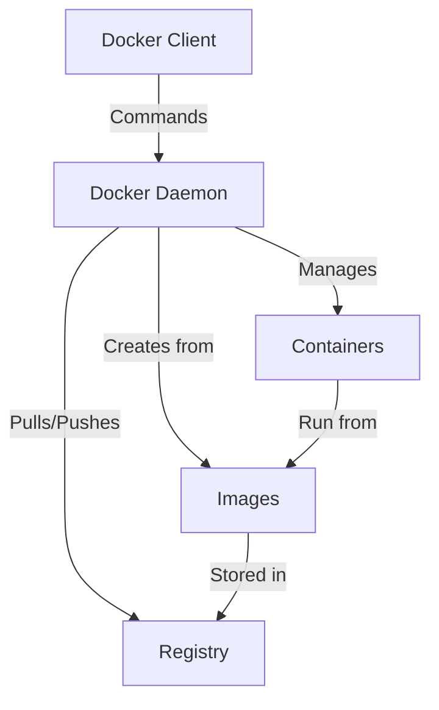

# Docker Installation

## Introduction

Docker is a platform that enables developers to build, package, and run applications in containers. Containers are lightweight, portable, and consistent environments that include everything needed to run an application: code, runtime, system tools, libraries, and settings.

Before you can start creating and managing containers, you need to install Docker on your system. This guide walks you through the installation process for different operating systems and helps you verify your installation.

## Prerequisites

Before installing Docker, ensure your system meets the following requirements:

- **For Windows**: Windows 10 64-bit: Pro, Enterprise, or Education (Build 16299 or later)
- **For macOS**: macOS must be version 10.14 or newer (Mojave, Catalina, Big Sur, or later)
- **For Linux**: A 64-bit version of Ubuntu, Debian, Fedora, or CentOS

You'll also need:
- Administrative/sudo privileges on your machine
- Internet connection for downloading Docker
- Basic familiarity with command-line interfaces

## Installing Docker on Windows

Windows users have two options for installing Docker:

1. **Docker Desktop for Windows** (recommended for most users)
2. **Docker Engine with WSL2** (for advanced users)

### Option 1: Installing Docker Desktop for Windows

1. Download Docker Desktop from the [official Docker website](https://www.docker.com/products/docker-desktop)

2. Double-click the installer and follow the installation wizard

3. During installation, you'll be prompted to enable WSL 2 (Windows Subsystem for Linux) - it's recommended to enable this feature

4. After installation completes, Docker will start automatically

5. Verify the installation by opening a command prompt and running:
   ```cmd
   docker --version
   docker run hello-world
   ```

If you see the Docker version and a welcome message from the hello-world container, the installation was successful.

### Option 2: Docker with WSL2 (Advanced)

For users who prefer a more Linux-native experience, you can:

1. Install WSL2 following the [Microsoft documentation](https://docs.microsoft.com/en-us/windows/wsl/install)

2. Install a Linux distribution like Ubuntu from the Microsoft Store

3. Open your Linux distribution and install Docker Engine directly:
   ```bash
   sudo apt update
   sudo apt install docker.io
   sudo systemctl start docker
   sudo systemctl enable docker
   ```

4. Configure Docker to start on boot:
   ```bash
   sudo systemctl enable docker
   ```

## Installing Docker on macOS

1. Download Docker Desktop for Mac from the [official Docker website](https://www.docker.com/products/docker-desktop)

2. Open the downloaded `.dmg` file and drag the Docker app to your Applications folder

3. Open Docker from your Applications folder

4. When prompted, enter your password to grant the necessary permissions

5. Wait for Docker to start (you'll see the Docker icon in the menu bar)

6. Verify the installation by opening Terminal and running:
   ```bash
   docker --version
   docker run hello-world
   ```

## Installing Docker on Linux

The installation process varies slightly depending on your Linux distribution. Here's how to install Docker on Ubuntu:

1. Update your package index:
   ```bash
   sudo apt update
   ```

2. Install packages to allow apt to use repositories over HTTPS:
   ```bash
   sudo apt install apt-transport-https ca-certificates curl software-properties-common
   ```

3. Add Docker's official GPG key:
   ```bash
   curl -fsSL https://download.docker.com/linux/ubuntu/gpg | sudo apt-key add -
   ```

4. Set up the stable repository:
   ```bash
   sudo add-apt-repository "deb [arch=amd64] https://download.docker.com/linux/ubuntu $(lsb_release -cs) stable"
   ```

5. Update the apt package index again:
   ```bash
   sudo apt update
   ```

6. Install Docker Engine:
   ```bash
   sudo apt install docker-ce docker-ce-cli containerd.io
   ```

7. Verify the installation:
   ```bash
   sudo docker --version
   sudo docker run hello-world
   ```

### Post-Installation Steps for Linux

By default, Docker commands require sudo privileges. To run Docker without sudo, add your user to the Docker group:

```bash
sudo usermod -aG docker $USER
```

Log out and log back in for the changes to take effect. After that, you can run Docker commands without sudo:

```bash
docker run hello-world
```

## Verifying Your Installation

Regardless of your operating system, you can verify your Docker installation by running:

```bash
docker --version
```

This should display the installed Docker version. Additionally, try running a test container:

```bash
docker run hello-world
```

You should see output similar to:

```
Hello from Docker!
This message shows that your installation appears to be working correctly.
...
```

## Docker Architecture Overview

Now that you have Docker installed, let's understand the basic architecture:



- **Docker Client**: The command-line interface you interact with
- **Docker Daemon**: The background service that manages Docker objects
- **Images**: Read-only templates used to create containers
- **Containers**: Runnable instances of images
- **Registry**: A repository of Docker images (like Docker Hub)

## Basic Docker Commands

Now that Docker is installed, here are some basic commands to get you started:

1. Check Docker version:
   ```bash
   docker --version
   ```

2. List all running containers:
   ```bash
   docker ps
   ```

3. List all containers (including stopped ones):
   ```bash
   docker ps -a
   ```

4. List available Docker images:
   ```bash
   docker images
   ```

5. Run a container:
   ```bash
   docker run -d -p 80:80 nginx
   ```
   This runs an Nginx web server in the background, mapping port 80 of the container to port 80 on your host.

6. Stop a container:
   ```bash
   docker stop container_id
   ```

## Troubleshooting Common Installation Issues

### Docker Desktop Won't Start

**Windows**:
- Ensure Hyper-V and Virtualization are enabled in BIOS
- Check that WSL2 is properly installed and configured

**macOS**:
- Check for macOS updates
- Ensure you have enough disk space
- Try resetting Docker to factory settings through the menu

### Permission Denied

On Linux, if you see errors like "permission denied":
```bash
Got permission denied while trying to connect to the Docker daemon socket
```

Ensure you've added your user to the docker group:
```bash
sudo usermod -aG docker $USER
```

Then log out and log back in, or run:
```bash
newgrp docker
```

### Docker Engine Won't Start

If the Docker service won't start:
```bash
sudo systemctl status docker
```

Look for error messages in the output, then try:
```bash
sudo systemctl restart docker
```

## Summary

In this guide, you've learned:

- How to install Docker on Windows, macOS, and Linux
- How to verify your installation
- Basic Docker architecture
- Essential Docker commands to get started
- How to troubleshoot common installation issues

With Docker successfully installed, you're now ready to start creating and managing containers. In the next section of Docker Fundamentals, you'll learn how to work with Docker images and containers.

## Additional Resources

To deepen your understanding of Docker:

- Official Docker documentation: [https://docs.docker.com/](https://docs.docker.com/)
- Docker Get Started tutorial: [https://docs.docker.com/get-started/](https://docs.docker.com/get-started/)
- Docker Hub (public image repository): [https://hub.docker.com/](https://hub.docker.com/)

## Practice Exercises

1. Install Docker on your system and verify the installation.
2. Run the hello-world container and analyze the output.
3. Find and run a public Nginx container, then access the default webpage through your browser.
4. List all running containers and then stop the Nginx container.
5. Explore Docker Hub and identify three images you might find useful for your projects.