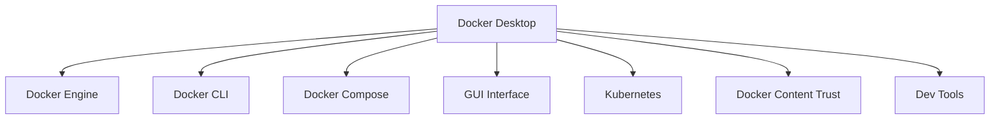

# Docker Desktop

## Introduction

Docker Desktop is an all-in-one application that provides everything you need to start working with Docker containers on your local machine. It's designed to make containerization accessible to developers by offering a user-friendly graphical interface along with all the necessary tools to build, share, and run containerized applications.

As part of the Docker ecosystem, Docker Desktop plays a crucial role in the development workflow by creating a consistent local development environment that mirrors production environments. This solves the classic "it works on my machine" problem by ensuring that applications run consistently across different development, testing, and production environments.

## What is Docker Desktop?

Docker Desktop is a powerful desktop application that provides:

1. A complete Docker development environment for Windows and macOS
2. A graphical user interface (GUI) for managing Docker containers, images, volumes, and networks
3. Docker Engine (the core container runtime)
4. Docker CLI client for command-line operations
5. Docker Compose for defining and running multi-container applications
6. Docker Content Trust for image signing
7. Kubernetes for container orchestration
8. Several additional developer tools and features



## Why Use Docker Desktop?

For beginners stepping into the world of containerization, Docker Desktop offers several advantages:

- **Simplified Installation**: Installs all Docker components with a single package
- **GUI Management**: Manage containers visually instead of memorizing commands
- **Seamless Updates**: Easy one-click updates for all Docker components
- **Cross-Platform Consistency**: Works consistently on Windows and macOS
- **Resource Control**: Easily configure CPU, memory, and disk usage
- **Kubernetes Integration**: Built-in Kubernetes for learning orchestration
- **Container Visualization**: Visual representation of container relationships
- **Development Workflow**: Streamlined development-to-deployment process

## Installation Guide

Docker Desktop is available for Windows and macOS. Let's walk through the installation process for both platforms.

### System Requirements

#### For Windows:
- Windows 10 64-bit (Pro, Enterprise, or Education) with Hyper-V and Containers features enabled, or
- Windows 10 64-bit Home with WSL 2 (Windows Subsystem for Linux 2)
- 4GB system RAM minimum
- BIOS-level hardware virtualization support

#### For macOS:
- macOS 11 (Big Sur) or newer
- At least 4GB RAM
- Apple Silicon chip (M1/M2) or Intel processor

### Installation Steps

#### For Windows:

1. Download Docker Desktop for Windows from the [official Docker website](https://www.docker.com/products/docker-desktop)
2. Double-click the installer file (Docker Desktop Installer.exe)
3. Follow the installation wizard instructions
4. Choose whether to use WSL 2 or Hyper-V backend
5. Click "Finish" to complete the installation
6. Launch Docker Desktop from the Start menu

#### For macOS:

1. Download Docker Desktop for Mac from the [official Docker website](https://www.docker.com/products/docker-desktop)
2. Drag the Docker.app to your Applications folder
3. Double-click Docker.app to start Docker Desktop
4. Provide necessary permissions when prompted
5. Wait for the Docker Desktop initialization to complete

Once installed, you'll see the Docker icon in your system tray (Windows) or menu bar (macOS) indicating that Docker Desktop is running.

## Docker Desktop Interface

After installing and launching Docker Desktop, you'll see a user-friendly interface that gives you access to various Docker features.

### Dashboard Overview

The Docker Desktop Dashboard provides an overview of your Docker environment:

- **Containers**: Lists all your running containers with options to start, stop, or delete them
- **Images**: Shows Docker images downloaded to your system
- **Volumes**: Displays persistent data storage volumes
- **Dev Environments**: Access to development environments
- **Extensions**: Add functionality through extensions

### Basic Container Management

The Dashboard makes it easy to:

1. View container status, ports, and resource usage
2. Access container logs directly
3. Open a terminal within a container
4. Stop and restart containers with a single click

## Your First Container with Docker Desktop

Let's run a simple "Hello World" container to get started with Docker Desktop.

### Using the GUI:

1. Open Docker Desktop
2. Click on the "Search" box at the top of the Dashboard
3. Type "hello-world" and press Enter
4. Select the official "hello-world" image from Docker Hub
5. Click "Run" to start a container from this image

### Using the integrated terminal:

You can also use the Docker CLI through your terminal:

```bash
# Run a Hello World container
docker run hello-world
```

The output will look something like this:

```
Hello from Docker!
This message shows that your installation appears to be working correctly.

To generate this message, Docker took the following steps:
 1. The Docker client contacted the Docker daemon.
 2. The Docker daemon pulled the "hello-world" image from the Docker Hub.
 3. The Docker daemon created a new container from that image which runs the
    executable that produces the output you are currently reading.
 4. The Docker daemon streamed that output to the Docker client, which sent it
    to your terminal.
...
```

## Building and Running a Web Application

Let's create a more practical example by building and running a simple web application using Docker Desktop.

### Step 1: Create a Simple Web App

Create a new directory for your project:

```bash
mkdir docker-web-app
cd docker-web-app
```

Create a file named `app.js`:

```javascript
const express = require('express');
const app = express();
const port = 3000;

app.get('/', (req, res) => {
  res.send('Hello from Docker Desktop!');
});

app.listen(port, () => {
  console.log(`App listening at http://localhost:${port}`);
});
```

Create a `package.json` file:

```json
{
  "name": "docker-web-app",
  "version": "1.0.0",
  "description": "Simple Node.js web app for Docker",
  "main": "app.js",
  "scripts": {
    "start": "node app.js"
  },
  "dependencies": {
    "express": "^4.18.2"
  }
}
```

### Step 2: Create a Dockerfile

In the same directory, create a file named `Dockerfile`:

```dockerfile
FROM node:18-alpine

WORKDIR /app

COPY package*.json ./

RUN npm install

COPY . .

EXPOSE 3000

CMD ["npm", "start"]
```

### Step 3: Build the Docker Image

Using Docker Desktop's terminal:

```bash
docker build -t my-web-app .
```

You'll see output like this:

```
[+] Building 15.2s (10/10) FINISHED
 => [internal] load build definition from Dockerfile                       0.0s
 => => transferring dockerfile: 37B                                        0.0s
 => [internal] load .dockerignore                                          0.0s
 => => transferring context: 2B                                            0.0s
 => [internal] load metadata for docker.io/library/node:18-alpine          3.1s
 => [1/5] FROM docker.io/library/node:18-alpine                            5.2s
 => [internal] load build context                                          0.0s
 => => transferring context: 2.72kB                                        0.0s
 => [2/5] WORKDIR /app                                                     0.1s
 => [3/5] COPY package*.json ./                                            0.0s
 => [4/5] RUN npm install                                                  6.5s
 => [5/5] COPY . .                                                         0.1s
 => exporting to image                                                     0.2s
 => => exporting layers                                                    0.2s
 => => writing image sha256:a72df23b...                                    0.0s
 => => naming to docker.io/library/my-web-app                              0.0s
```

Alternatively, you can use the Docker Desktop GUI:
1. In Docker Desktop, go to "Images"
2. Click "Build/Push"
3. Select your project directory
4. Name your image "my-web-app"
5. Click "Build"

### Step 4: Run the Container

Using the terminal:

```bash
docker run -p 3000:3000 my-web-app
```

Or through the Docker Desktop GUI:
1. Go to the "Images" tab
2. Find your "my-web-app" image
3. Click "Run"
4. Set "Host port" to 3000
5. Click "Run"

Now you can open your browser and navigate to `http://localhost:3000` to see your web application running!

## Docker Desktop Features for Development

### Container Management

Docker Desktop provides several features to help you manage containers effectively:

- **Container Inspection**: Right-click on a container to inspect details
- **Port Forwarding**: Easily view and change port mappings
- **Resource Monitoring**: Monitor CPU, memory, and network usage
- **Volume Management**: Create and manage persistent data volumes
- **Network Configuration**: Set up and manage container networks

### Docker Compose with Docker Desktop

Docker Compose allows you to define and run multi-container applications. Let's create a simple web app with a database:

Create a `docker-compose.yml` file:

```yaml
version: '3'
services:
  web:
    build: .
    ports:
      - "3000:3000"
    depends_on:
      - db
    environment:
      - DATABASE_URL=mongodb://db:27017/myapp
  db:
    image: mongo:latest
    volumes:
      - mongodb_data:/data/db

volumes:
  mongodb_data:
```

To run the application:

```bash
docker-compose up
```

In Docker Desktop:
1. Navigate to the "Containers" tab
2. You'll see both services running together
3. Click on each to view logs and details

### Development Environments

Docker Desktop includes a feature called "Dev Environments" that allows you to:

- Quickly spin up development environments from git repositories
- Share development environments with teammates
- Work on multiple projects simultaneously without conflicts

## Docker Desktop Extensions

Docker Desktop supports extensions that add new functionality to the application. To explore available extensions:

1. Click on "Extensions" in the left sidebar
2. Browse the marketplace for useful extensions
3. Install extensions like:
   - Database management tools
   - Kubernetes dashboards
   - Security scanners
   - Volume management tools

## Docker Desktop Settings and Configuration

Docker Desktop provides various configuration options to customize your Docker environment:

### Resources

You can allocate system resources to Docker:
1. Go to Settings (gear icon) > Resources
2. Adjust CPU, memory, disk, and swap limits
3. Configure file sharing to determine which directories can be mounted into containers

### Docker Engine

You can customize Docker Engine configuration:
1. Go to Settings > Docker Engine
2. Modify the JSON configuration file for advanced settings
3. Click "Apply & Restart" to apply changes

### Kubernetes

To enable Kubernetes:
1. Go to Settings > Kubernetes
2. Check "Enable Kubernetes"
3. Click "Apply & Restart"
4. Wait for the Kubernetes cluster to initialize

## Troubleshooting Common Issues

### Container Won't Start

If a container fails to start:
1. Check the container logs in Docker Desktop
2. Verify port conflicts (two services can't use the same port)
3. Check if the container has access to required resources

```bash
# View container logs
docker logs [container_id]

# Check for port conflicts
docker ps -a
```

### Docker Desktop Won't Start

If Docker Desktop won't start:
1. Verify virtualization is enabled in BIOS
2. For Windows, ensure Hyper-V or WSL 2 is properly configured
3. Check system logs for errors
4. Try resetting Docker Desktop to factory defaults

### Performance Issues

If Docker Desktop is running slowly:
1. Increase allocated CPU and memory in Docker Desktop settings
2. Prune unused containers, images, and volumes
3. Check for resource-intensive containers

```bash
# Remove unused resources
docker system prune -a

# View resource usage
docker stats
```

## Best Practices for Using Docker Desktop

1. **Regularly update Docker Desktop** to get the latest features and security fixes
2. **Use docker-compose.yml** files for complex applications
3. **Create a .dockerignore file** to exclude unnecessary files from builds
4. **Monitor resource usage** to prevent containers from consuming too many resources
5. **Use named volumes** instead of bind mounts for persistent data
6. **Prune unused Docker objects** to save disk space:

```bash
docker system prune -a --volumes
```

7. **Use Docker Desktop's GUI** for visualizing container relationships
8. **Enable Kubernetes** only when needed to conserve resources

## Summary

Docker Desktop is an essential tool for developers working with containers on local machines. It provides:

- A complete Docker development environment with a user-friendly interface
- Tools for building, running, and managing containerized applications
- Features that simplify the containerization workflow
- A consistent environment that minimizes "works on my machine" problems

By mastering Docker Desktop, you've taken an important step in your containerization journey. You now have the foundation to build, test, and deploy containerized applications efficiently.

## Additional Resources

To continue learning about Docker and containerization:

- Official Docker documentation and tutorials
- Docker Hub for exploring containerized applications
- Docker community forums for support
- Docker Desktop extension marketplace

## Practice Exercises

1. Create a multi-container application using Docker Compose that includes a web server, application server, and database
2. Try using Docker Desktop's Dev Environments feature with a GitHub repository
3. Experiment with Docker Desktop Extensions to enhance your development workflow
4. Create a development environment that matches your production environment using Docker
5. Build a CI/CD pipeline that leverages Docker containers for testing and deployment