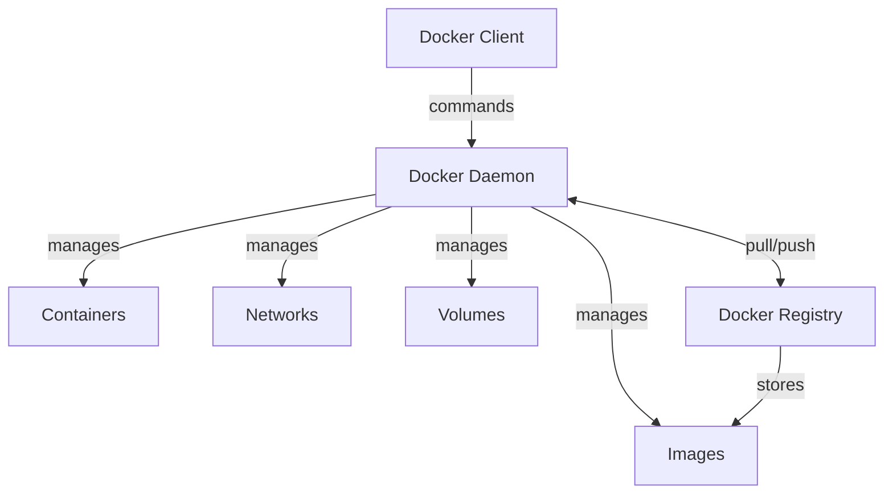

# Docker Terminology

## Introduction

Docker has revolutionized how applications are built, shipped, and run by introducing containerization to the mainstream development workflow. As you begin your Docker journey, you'll encounter specific terms that are essential to understand. This guide explains the key Docker terminology in simple language with practical examples to help beginners grasp these concepts quickly.

## Core Docker Concepts

### Container

A container is a lightweight, standalone, executable software package that includes everything needed to run an application: code, runtime, system tools, system libraries, and settings.

Think of a container as a portable, self-sufficient box that holds your application and all its dependencies. Containers run consistently across different environments, solving the infamous "it works on my machine" problem.

**Example:**

```bash
# Run a container from the nginx image
docker run -d -p 8080:80 nginx
```

This command creates and starts a container running the Nginx web server, accessible on port 8080 of your host machine.

### Image

An image is a read-only template used to create containers. Images contain the application code, libraries, tools, dependencies, and other files needed for an application to run.

Think of an image as a blueprint or snapshot that defines what's inside a container when it runs. Images are built in layers, which makes them efficient to store and transfer.

**Example:**

```bash
# List all images on your system
docker images

# Pull the official Python image from Docker Hub
docker pull python:3.9
```

### Dockerfile

A Dockerfile is a text file containing instructions on how to build a Docker image. Each instruction in a Dockerfile adds a new layer to the image.

**Example:**

```dockerfile
# Simple Python application Dockerfile
FROM python:3.9-slim

WORKDIR /app

COPY requirements.txt .
RUN pip install --no-cache-dir -r requirements.txt

COPY . .

CMD ["python", "app.py"]
```

When you build this Dockerfile, Docker follows each instruction to create an image:

```bash
# Build an image from the Dockerfile in the current directory
docker build -t my-python-app .
```

### Docker Hub

Docker Hub is a cloud-based registry service for Docker images. It's like GitHub for Docker images, allowing you to find, share, and store container images.

**Example:**

```bash
# Pull an image from Docker Hub
docker pull mongodb:latest

# Push your custom image to Docker Hub (after logging in)
docker push yourusername/your-custom-image:tag
```

## Container Lifecycle Terms

### Docker Run

The `docker run` command creates and starts a new container from an image.

**Example:**

```bash
# Run a container in interactive mode with a terminal
docker run -it ubuntu bash

# Run a container in the background (detached mode)
docker run -d --name my-redis redis
```

### Docker Stop, Start, and Restart

Commands to control the state of containers:

```bash
# Stop a running container
docker stop my-container

# Start a stopped container
docker start my-container

# Restart a container
docker restart my-container
```

### Docker Exec

Executes a command inside a running container.

**Example:**

```bash
# Open a bash shell inside a running container
docker exec -it my-container bash

# Run a command inside a container without attaching
docker exec my-container ls -la
```

## Networking Concepts

### Docker Network

Docker networks enable containers to communicate with each other and with the outside world.

**Example:**

```bash
# Create a custom bridge network
docker network create my-network

# Run a container connected to the custom network
docker run -d --network my-network --name db mysql:5.7
```

### Port Mapping

Port mapping allows container services to be accessible from the host machine by mapping container ports to host ports.

**Example:**

```bash
# Map container port 80 to host port 8080
docker run -p 8080:80 nginx

# Map multiple ports
docker run -p 8080:80 -p 3000:3000 my-web-app
```

The format is always `-p HOST_PORT:CONTAINER_PORT`.

## Data Management Terms

### Volume

Docker volumes are the preferred mechanism for persisting data generated by and used by containers. Volumes are completely managed by Docker.

**Example:**

```bash
# Create a named volume
docker volume create my-data

# Run a container with a mounted volume
docker run -v my-data:/data myapp
```

### Bind Mount

Bind mounts allow you to mount a file or directory from the host machine into a container.

**Example:**

```bash
# Mount the current directory into the container
docker run -v $(pwd):/app myapp
```

## Multi-Container Concepts

### Docker Compose

Docker Compose is a tool for defining and running multi-container Docker applications. It uses a YAML file to configure application services, networks, and volumes.

**Example `docker-compose.yml`:**

```yaml
version: '3'
services:
  web:
    build: .
    ports:
      - "5000:5000"
    depends_on:
      - db
  db:
    image: postgres
    environment:
      POSTGRES_PASSWORD: example
    volumes:
      - postgres-data:/var/lib/postgresql/data

volumes:
  postgres-data:
```

To run this multi-container application:

```bash
docker-compose up
```

## Docker Architecture Terms

### Docker Daemon

The Docker daemon (dockerd) is a background service that manages Docker objects such as images, containers, networks, and volumes.

### Docker Client

The Docker client is the primary way users interact with Docker through the command line interface.

### Docker Registry

A Docker registry stores Docker images. Docker Hub is a public registry, but you can also set up private registries.



## Advanced Concepts

### Layer

Docker images consist of multiple layers. Each layer represents an instruction in the Dockerfile. Layers are cached, making builds faster and more efficient.

### Container Orchestration

For managing containers in production environments, orchestration platforms like Kubernetes or Docker Swarm are used.

## Summary

Understanding Docker terminology is the foundation for working effectively with containerization. Key terms to remember include:

- **Container**: A running instance of an image
- **Image**: A template for creating containers
- **Dockerfile**: Instructions for building an image
- **Volume**: Persistent data storage
- **Docker Compose**: Tool for multi-container applications

These concepts work together to create the Docker ecosystem that makes application development, deployment, and scaling more efficient and consistent across different environments.

## Practice Exercises

1. Try running your first container using the official Nginx image
2. Create a simple Dockerfile for a web application and build it
3. Use Docker Compose to set up a web application with a database
4. Experiment with different volume types to understand data persistence

## Additional Resources

- [Docker's Official Documentation](https://docs.docker.com/)
- [Docker Hub](https://hub.docker.com/) for exploring available images
- [Docker Curriculum](https://docker-curriculum.com/) for guided learning