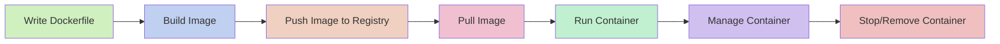

# Docker Workflow

## Introduction

Docker has revolutionized how developers build, share, and run applications. Instead of spending hours configuring development environments or worrying about the "it works on my machine" problem, Docker enables you to package your application and its dependencies into standardized units called **containers**.

In this guide, we'll explore the essential Docker workflow - the sequence of steps you'll follow when working with Docker. Understanding this workflow is crucial as it forms the foundation of your Docker journey and will help you navigate more complex Docker scenarios later on.

## The Docker Workflow Lifecycle

The Docker workflow follows a logical lifecycle that consists of several key steps:



Let's break down each step in detail.

## 1. Writing a Dockerfile

A **Dockerfile** is a text document containing instructions for building a Docker image. Think of it as a recipe for your application's environment.

### Basic Dockerfile Structure

```dockerfile
# Base image
FROM node:18

# Set working directory
WORKDIR /app

# Copy package files
COPY package*.json ./

# Install dependencies
RUN npm install

# Copy application code
COPY . .

# Expose port
EXPOSE 3000

# Command to run the application
CMD ["npm", "start"]
```

This example Dockerfile creates a Node.js application environment. Let's understand each instruction:

- `FROM`: Specifies the base image to start with
- `WORKDIR`: Sets the working directory inside the container
- `COPY`: Copies files from your local system to the container
- `RUN`: Executes commands during the image building process
- `EXPOSE`: Documents which ports the container listens on
- `CMD`: Specifies the command to run when the container starts

## 2. Building a Docker Image

Once you have your Dockerfile, you can build an image from it. An **image** is a read-only template containing your application code, runtime, libraries, and dependencies.

```bash
docker build -t my-app:1.0 .
```

Output:
```
Sending build context to Docker daemon  2.048kB
Step 1/7 : FROM node:18
 ---> 55b4f9e29275
Step 2/7 : WORKDIR /app
 ---> Using cache
 ---> b7c8b8aed4b3
...
Successfully built 3a95e8d3efab
Successfully tagged my-app:1.0
```

This command builds an image tagged as `my-app` with version `1.0` using the Dockerfile in the current directory (denoted by the `.`).

## 3. Pushing Images to a Registry

Docker registries are repositories for storing and sharing Docker images. Docker Hub is the default public registry, but many organizations use private registries too.

```bash
# Log in to Docker Hub
docker login

# Tag your image for the registry
docker tag my-app:1.0 username/my-app:1.0

# Push the image to Docker Hub
docker push username/my-app:1.0
```

Output:
```
The push refers to repository [docker.io/username/my-app]
e4bce7a5b942: Pushed
c28bbf0bb15c: Pushed
...
1.0: digest: sha256:1b3d459f47... size: 1472
```

## 4. Pulling Images

On another machine or server, you can pull the image to deploy it:

```bash
docker pull username/my-app:1.0
```

Output:
```
1.0: Pulling from username/my-app
d121f8d1c412: Pull complete
...
Digest: sha256:1b3d459f47...
Status: Downloaded newer image for username/my-app:1.0
```

## 5. Running Containers

A **container** is a running instance of an image. You can run multiple containers from the same image:

```bash
docker run -p 3000:3000 --name myapp-container username/my-app:1.0
```

Output:
```
> my-app@1.0.0 start
> node server.js

Server running at http://0.0.0.0:3000
```

This command:
- Creates and starts a container named `myapp-container`
- Maps port 3000 from the container to port 3000 on your host machine
- Uses the image `username/my-app:1.0`

### Running Containers in Different Modes

#### Detached Mode
```bash
docker run -d -p 3000:3000 username/my-app:1.0
```

This starts the container in the background.

#### Interactive Mode
```bash
docker run -it ubuntu bash
```

This gives you an interactive terminal session inside the container.

## 6. Managing Containers

Once your containers are running, you'll need to manage them effectively:

### Listing Containers

```bash
# List running containers
docker ps

# List all containers (including stopped ones)
docker ps -a
```

Output:
```
CONTAINER ID   IMAGE                 COMMAND        CREATED         STATUS         PORTS                    NAMES
af8f4f961c8e   username/my-app:1.0   "npm start"    2 minutes ago   Up 2 minutes   0.0.0.0:3000->3000/tcp   myapp-container
```

### Viewing Container Logs

```bash
docker logs myapp-container
```

Output:
```
> my-app@1.0.0 start
> node server.js

Server running at http://0.0.0.0:3000
GET / 200 - 23ms
GET /api/users 200 - 15ms
```

### Executing Commands in Running Containers

```bash
docker exec -it myapp-container bash
```

This command gives you a bash shell inside the running container, allowing you to inspect its environment.

## 7. Stopping and Removing Containers

When you're done with a container, you can stop and remove it:

```bash
# Stop a container
docker stop myapp-container

# Remove a container
docker rm myapp-container

# Remove an image
docker rmi username/my-app:1.0
```

Output:
```
myapp-container  # (output from the stop command)
myapp-container  # (output from the rm command)
Untagged: username/my-app:1.0
Deleted: sha256:3a95e8d3efab...  # (output from the rmi command)
```

## Real-World Example: Setting Up a Web Application with a Database

Let's walk through a practical example of using Docker to set up a web application with a database:

### 1. Create a Docker Compose File

Docker Compose is a tool for defining and running multi-container Docker applications. Here's a basic example:

```yaml
version: '3'
services:
  web:
    build: .
    ports:
      - "3000:3000"
    environment:
      - DB_HOST=db
      - DB_USER=postgres
      - DB_PASSWORD=secret
      - DB_NAME=myapp
    depends_on:
      - db
  
  db:
    image: postgres:13
    volumes:
      - postgres_data:/var/lib/postgresql/data
    environment:
      - POSTGRES_PASSWORD=secret
      - POSTGRES_USER=postgres
      - POSTGRES_DB=myapp

volumes:
  postgres_data:
```

### 2. Start the Application Stack

```bash
docker-compose up
```

This command builds and starts both the web application and database containers according to the configuration.

### 3. Access the Application

Navigate to `http://localhost:3000` in your browser to access the web application.

### 4. Shut Down the Stack

```bash
docker-compose down
```

This stops and removes the containers but preserves the database volume.

## Docker Workflow Best Practices

To make the most of Docker, follow these best practices:

1. **Keep images small** - Use smaller base images when possible (like Alpine variants) and minimize layers
2. **Use .dockerignore files** - Exclude unnecessary files from the build context
3. **Pin specific versions** - Use specific tags like `node:18.12.1` instead of `node:latest`
4. **One process per container** - Design containers to run a single process to maintain simplicity
5. **Use volumes for persistent data** - Don't store data in containers; use volumes instead
6. **Set health checks** - Include health checks to monitor container health
7. **Document environment variables** - Clearly document all required environment variables
8. **Leverage Docker Compose** - Use Compose for multi-container applications

## Common Docker Workflow Challenges and Solutions

| Challenge | Solution |
|-----------|----------|
| Long build times | Use multi-stage builds and .dockerignore |
| Container networking issues | Use Docker networks and understand network modes |
| Data persistence problems | Implement proper volume management |
| Resource constraints | Set appropriate resource limits in your container configuration |
| Security concerns | Use non-root users and scan images for vulnerabilities |

## Summary

The Docker workflow provides a robust framework for developing, deploying, and managing containerized applications. By understanding the logical progression from writing Dockerfiles to managing running containers, you gain the fundamental skills needed for more advanced Docker usage.

Remember that the Docker workflow is not always strictly linear. In real-world scenarios, you'll often iterate between these steps as you develop and refine your applications.

## Exercises

1. Create a Dockerfile for a simple web application of your choice.
2. Build and run the application locally using Docker.
3. Create a Docker Compose file that adds a database container to your application.
4. Practice pushing your image to Docker Hub and pulling it on another machine.
5. Experiment with different Docker networking options to understand how containers communicate.

## Additional Resources

- [Docker Official Documentation](https://docs.docker.com/)
- Docker in Practice (Book by Ian Miell and Aidan Hobson Sayers)
- [Play with Docker](https://labs.play-with-docker.com/) - A sandbox environment for experimenting with Docker

Happy containerizing!