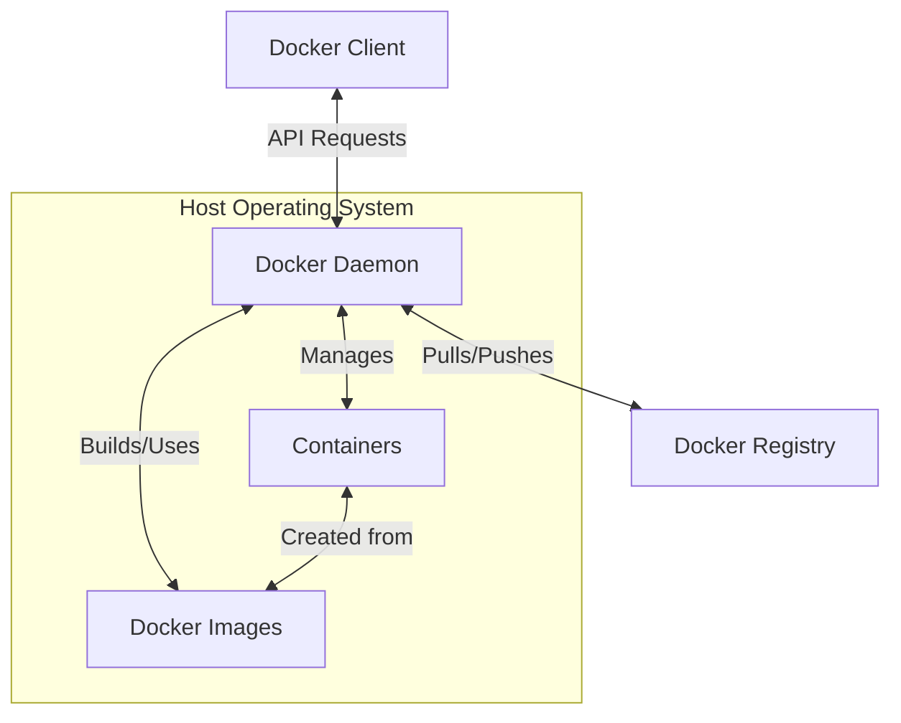
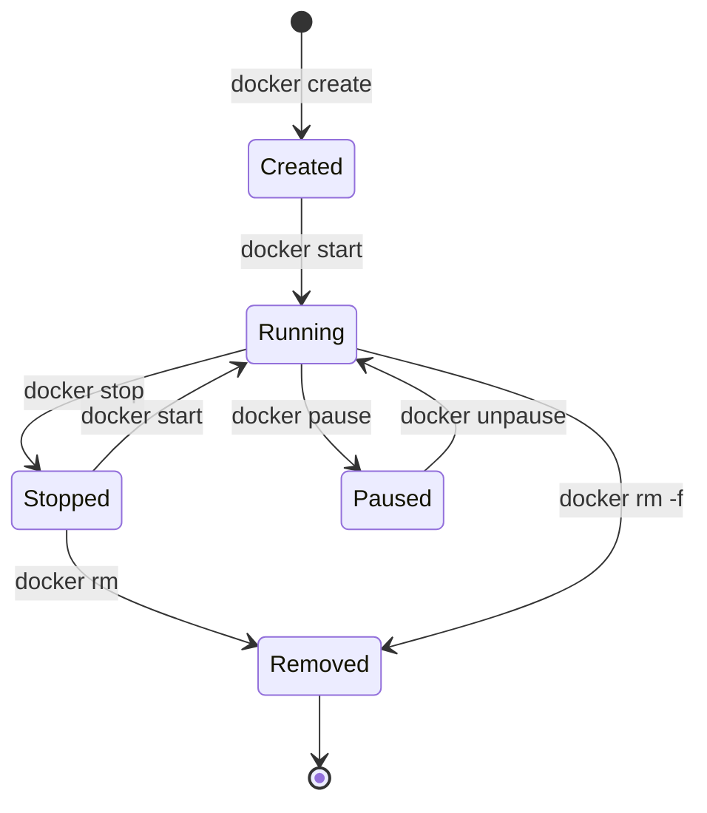

# Docker Components

## Introduction

Docker is a platform that enables developers to package applications into containers—standardized executable components that combine application source code with all the operating system (OS) libraries and dependencies required to run the code in any environment. Understanding Docker's architecture and its core components is essential for effectively working with containerized applications.

In this guide, we'll explore the fundamental components that make up the Docker ecosystem, how they interact with each other, and how they work together to create the container magic that has revolutionized application development and deployment.

## Docker Architecture Overview

Before diving into specific components, let's understand Docker's high-level architecture:



Docker uses a client-server architecture where the Docker client communicates with the Docker daemon, which handles building, running, and distributing Docker containers.

## Core Docker Components

### 1. Docker Engine

The Docker Engine is the foundation of the Docker platform, responsible for creating and managing Docker containers.

#### Components of Docker Engine:

- **Docker Daemon (`dockerd`)**: A persistent background process that manages Docker objects such as images, containers, networks, and volumes.
- **REST API**: Specifies interfaces for interacting with the daemon.
- **Docker CLI**: A command-line interface that allows users to interact with Docker through commands.

Example of checking Docker Engine version:

```bash
docker version
```

Output:
```
Client: Docker Engine - Community
 Version:           24.0.6
 API version:       1.43
 Go version:        go1.20.7
 Git commit:        ed223bc
 Built:             Mon Sep  4 12:31:44 2023
 OS/Arch:           linux/amd64
 Context:           default

Server: Docker Engine - Community
 Engine:
  Version:          24.0.6
  API version:      1.43 (minimum version 1.12)
  Go version:       go1.20.7
  Git commit:       1a79695
  Built:            Mon Sep  4 12:31:44 2023
  OS/Arch:          linux/amd64
  Experimental:     false
```

### 2. Docker Client

The Docker client is the primary way users interact with Docker. When you run commands like `docker run` or `docker build`, you're using the Docker client. The client sends these commands to the Docker daemon, which carries them out.

Example of a basic client command:

```bash
docker info
```

This command displays system-wide information about the Docker installation.

### 3. Docker Images

A Docker image is a read-only template containing instructions for creating a Docker container. Images include the application code, libraries, dependencies, tools, and other files needed for an application to run.

Images are built in layers, with each layer representing an instruction in the image's Dockerfile. Layers are cached, making image sharing and building more efficient.

#### Working with Docker Images:

```bash
# List all images
docker images

# Pull an image from Docker Hub
docker pull ubuntu:22.04

# Build an image from a Dockerfile
docker build -t myapp:1.0 .
```

Example Dockerfile:

```dockerfile
FROM node:18-alpine
WORKDIR /app
COPY package*.json ./
RUN npm install
COPY . .
EXPOSE 3000
CMD ["npm", "start"]
```

### 4. Docker Containers

A container is a runnable instance of an image. You can create, start, stop, move, or delete a container using the Docker API or CLI. Containers are isolated from each other and from the host machine.

#### Container Lifecycle:



#### Working with Docker Containers:

```bash
# Run a container
docker run -d -p 80:80 --name webserver nginx

# List running containers
docker ps

# List all containers (including stopped ones)
docker ps -a

# Stop a container
docker stop webserver

# Remove a container
docker rm webserver
```

### 5. Docker Registry

A Docker registry stores Docker images. Docker Hub is a public registry that anyone can use, and Docker is configured to look for images on Docker Hub by default. You can also set up your own private registry.

When you use commands like `docker pull` or `docker run`, the required images are pulled from your configured registry. When you use the `docker push` command, your image is pushed to your configured registry.

```bash
# Pull an image from Docker Hub
docker pull mongo:latest

# Tag an image
docker tag myapp:1.0 username/myapp:1.0

# Push an image to Docker Hub
docker push username/myapp:1.0
```

### 6. Docker Volumes

Docker volumes are the preferred mechanism for persisting data generated by and used by Docker containers. While containers themselves are ephemeral (data inside them is lost when they're removed), volumes provide a way to store data independently of the container lifecycle.

```bash
# Create a volume
docker volume create my-vol

# Run a container with a volume mounted
docker run -d --name devtest -v my-vol:/app nginx:latest

# Inspect a volume
docker volume inspect my-vol
```

Example output of volume inspection:
```json
[
    {
        "CreatedAt": "2023-09-10T12:44:07Z",
        "Driver": "local",
        "Labels": {},
        "Mountpoint": "/var/lib/docker/volumes/my-vol/_data",
        "Name": "my-vol",
        "Options": {},
        "Scope": "local"
    }
]
```

### 7. Docker Networks

Docker networks allow containers to communicate with each other and with the outside world. Docker provides several network drivers out of the box.

Types of Docker networks:
- **Bridge**: The default network driver. Containers on the same bridge network can communicate.
- **Host**: Removes network isolation between container and host.
- **None**: Disables all networking for the container.
- **Overlay**: Connect multiple Docker daemons together (used in Docker Swarm).
- **macvlan**: Assign a MAC address to a container, making it appear as a physical device.

```bash
# List available networks
docker network ls

# Create a network
docker network create my-network

# Run a container in a specific network
docker run -d --name alpine1 --network my-network alpine sleep infinity

# Connect a running container to a network
docker network connect my-network existing-container
```

## Real-World Examples

### Example 1: Multi-Container Application with Docker Compose

Docker Compose is a tool for defining and running multi-container Docker applications. With a YAML file, you configure your application's services, networks, and volumes. Then, with a single command, you create and start all the services from your configuration.

Here's a real-world example of a simple web application with a Node.js backend and MongoDB database:

```yaml
version: '3'
services:
  web:
    build: ./web
    ports:
      - "3000:3000"
    environment:
      - MONGO_URL=mongodb://db:27017/webapp
    depends_on:
      - db
    networks:
      - webnet
  
  db:
    image: mongo:latest
    volumes:
      - mongo-data:/data/db
    networks:
      - webnet

networks:
  webnet:

volumes:
  mongo-data:
```

To start this application:

```bash
docker-compose up
```

### Example 2: Containerized Development Environment

Docker can create consistent development environments across a team:

```dockerfile
FROM ubuntu:22.04

# Install development tools
RUN apt-get update && apt-get install -y \
    build-essential \
    git \
    python3 \
    python3-pip \
    nodejs \
    npm

# Create workspace
WORKDIR /workspace

# Install project dependencies
COPY requirements.txt ./
RUN pip3 install -r requirements.txt

# Set default command
CMD ["bash"]
```

Using this environment:

```bash
# Build the dev environment image
docker build -t devenv .

# Run a container with the current directory mounted
docker run -it --rm -v $(pwd):/workspace devenv
```

## Summary

Docker's component architecture is designed to make building, shipping, and running applications easier and more efficient:

- Docker Engine (Daemon + API + CLI) provides the core infrastructure
- Docker Images serve as the blueprint for containers
- Docker Containers are the runnable instances of images
- Docker Registry stores and distributes images
- Docker Volumes provide persistent storage
- Docker Networks enable communication between containers

Together, these components create a powerful ecosystem for containerization that has changed how we develop, test, and deploy applications.

## Additional Resources

To deepen your understanding of Docker components:

1. Explore the [official Docker documentation](https://docs.docker.com/)
2. Practice with the Docker command-line interface
3. Try building your own Docker images with Dockerfiles
4. Experiment with multi-container applications using Docker Compose

## Exercises

1. Create a custom Docker image for a simple web application using a Dockerfile.
2. Set up a multi-container application with Docker Compose that includes a web server and a database.
3. Explore Docker volume mounting by creating a container that persists data across container restarts.
4. Create a custom Docker network and demonstrate container-to-container communication.
5. Practice pushing and pulling images from Docker Hub.