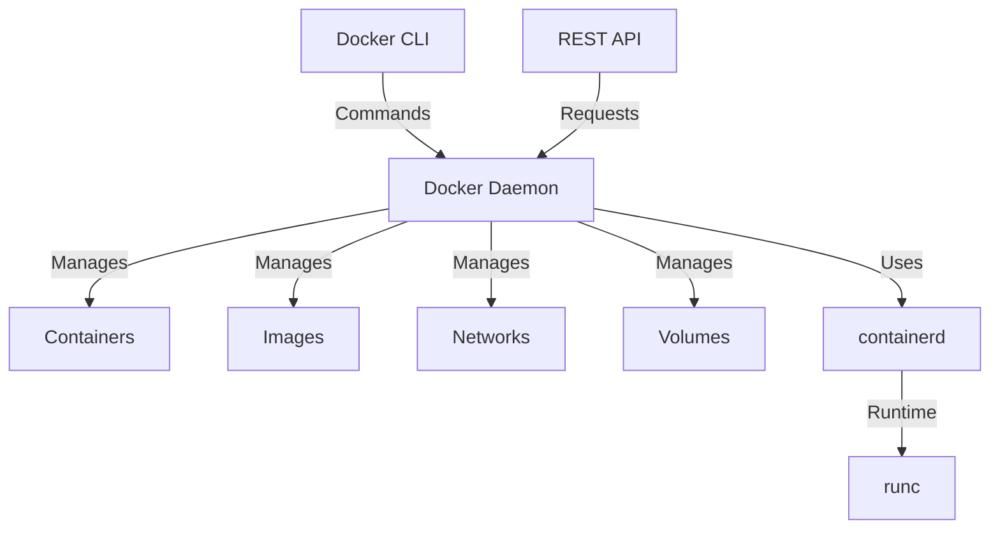

# Docker Engine

## Introduction

Docker Engine is the core technology that powers Docker's containerization platform. It's a lightweight runtime and tooling system that builds and runs containers. If you're new to Docker, think of Docker Engine as the heart that keeps the entire Docker ecosystem alive and functioning.

In this guide, we'll explore what Docker Engine is, how it works under the hood, and how you can use it effectively for your containerization needs. By the end, you'll have a solid understanding of this fundamental Docker component.

## What is Docker Engine?

Docker Engine is an open-source containerization technology that acts as the client-server application with:

1. **A daemon process** (`dockerd`) with a REST API that manages Docker objects like images, containers, networks, and volumes
2. **A command-line interface (CLI)** client (`docker`) that communicates with the Docker daemon
3. **APIs** that applications can use to talk to and instruct the Docker daemon



## Docker Engine Architecture

Docker Engine follows a client-server architecture that consists of several key components working together:

### The Docker Daemon (`dockerd`)

The daemon is a background service that listens for API requests and manages Docker objects. It's responsible for:

- Building, running, and distributing Docker containers
- Managing container lifecycle (create, run, pause, stop, delete)
- Managing Docker images (pull, build, push)
- Setting up networks for container communication
- Managing data volumes for persistent storage

### The Docker Client (`docker`)

The command-line interface that users interact with to issue commands to the Docker daemon. Common commands include:

- `docker build`: Build an image from a Dockerfile
- `docker run`: Create and start a container
- `docker pull`: Download an image from a registry
- `docker push`: Upload an image to a registry
- `docker ps`: List running containers

### containerd

A core container runtime that manages the complete container lifecycle of its host system, from image transfer and storage to container execution and supervision.

### runc

A lightweight, portable container runtime that implements the OCI (Open Container Initiative) specification. It's the low-level component that actually creates and runs the containers.

## How Docker Engine Works

Let's walk through how Docker Engine processes a typical request:

1. You enter a command in the Docker CLI (e.g., `docker run nginx`)
2. The CLI uses the Docker API to send the command to the Docker daemon
3. The Docker daemon receives the instruction and proceeds to:
   - Check if the image exists locally
   - If not, pull it from Docker Hub or the configured registry
   - Create a new container
   - Set up a network interface for the container
   - Set up a bridge network
   - Mount volumes if specified
   - Start the container according to the provided parameters

Let's see this in action:

```bash
# Running a simple Nginx container
docker run -d -p 8080:80 --name my-nginx nginx
```

When you run this command:
- Docker Engine checks if the nginx image exists locally
- If not, it pulls the image from Docker Hub
- Creates a container named "my-nginx"
- Maps port 8080 on your host to port 80 in the container
- Starts the container in detached mode

You can verify the container is running with:

```bash
docker ps
```

Example output:
```
CONTAINER ID   IMAGE     COMMAND                  CREATED         STATUS         PORTS                  NAMES
f8d9c21a72b0   nginx     "/docker-entrypoint.…"   5 seconds ago   Up 3 seconds   0.0.0.0:8080->80/tcp   my-nginx
```

## Core Docker Engine Components

### 1. Storage Drivers

Docker Engine uses storage drivers to manage the contents of image layers and writable container layers. Some common storage drivers include:

- overlay2 (default on most Linux distributions)
- devicemapper
- btrfs
- zfs
- aufs (older systems)

```bash
# Check which storage driver your Docker Engine is using
docker info | grep "Storage Driver"
```

Example output:
```
Storage Driver: overlay2
```

### 2. Network Drivers

Docker Engine includes several built-in network drivers that provide core networking functionality:

- `bridge`: The default network driver for containers
- `host`: Removes network isolation between the container and the host
- `none`: Disables all networking for a container
- `overlay`: Connects multiple Docker daemons and enables Swarm services
- `macvlan`: Assigns a MAC address to a container to make it appear as a physical device

```bash
# List available networks
docker network ls
```

Example output:
```
NETWORK ID     NAME      DRIVER    SCOPE
bb83f1c1d45c   bridge    bridge    local
6d647e5d75ef   host      host      local
b9de015231f4   none      null      local
```

### 3. Execution Drivers

In earlier versions, Docker Engine used execution drivers to run containers. In modern Docker versions, this has been replaced by containerd and runc as part of the standardization of container runtimes.

## Working with Docker Engine

### Checking Docker Engine Status

You can verify that Docker Engine is running properly with:

```bash
docker info
```

This provides detailed information about your Docker installation, including:
- Container and image counts
- Server version
- Storage driver
- Logging driver
- Kernel version
- Operating system

### Managing Docker Engine Service

On Linux systems, you can start, stop, and check the status of the Docker daemon:

```bash
# Start Docker service
sudo systemctl start docker

# Stop Docker service
sudo systemctl stop docker

# Restart Docker service
sudo systemctl restart docker

# Check Docker service status
sudo systemctl status docker
```

On Windows and macOS, Docker Desktop provides a GUI to manage the Docker Engine service.

### Configuring Docker Engine

Docker Engine's configuration is stored in a JSON file typically located at `/etc/docker/daemon.json` (Linux) or `~/.docker/daemon.json` (macOS/Windows).

Here's an example configuration file:

```json
{
  "data-root": "/var/lib/docker",
  "storage-driver": "overlay2",
  "log-driver": "json-file",
  "log-opts": {
    "max-size": "10m",
    "max-file": "3"
  },
  "registry-mirrors": ["https://registry-mirror.example.com"],
  "insecure-registries": ["registry.internal:5000"],
  "debug": false,
  "experimental": false
}
```

After modifying the configuration, restart the Docker daemon for changes to take effect:

```bash
sudo systemctl restart docker
```

## Practical Examples

### Example 1: Building and Running a Custom Image

Let's create a simple web application and containerize it with Docker Engine:

1. Create a project directory:

```bash
mkdir docker-web-app
cd docker-web-app
```

2. Create a simple HTML file (`index.html`):

```html
<!DOCTYPE html>
<html>
<head>
    <title>Docker Web App</title>
</head>
<body>
    <h1>Hello from Docker!</h1>
    <p>This is a simple web application running in a Docker container.</p>
</body>
</html>
```

3. Create a Dockerfile:

```dockerfile
# Use the official Nginx image as base
FROM nginx:alpine

# Copy our HTML file to the Nginx document root
COPY index.html /usr/share/nginx/html/

# Expose port 80
EXPOSE 80

# Start Nginx
CMD ["nginx", "-g", "daemon off;"]
```

4. Build the Docker image:

```bash
docker build -t my-web-app .
```

5. Run a container from the image:

```bash
docker run -d -p 8080:80 --name web-app my-web-app
```

6. Access your web application at http://localhost:8080

### Example 2: Creating a Multi-Container Application

Docker Engine can run multiple containers that work together. Let's create a simple application with a web server and a database:

1. Create a `docker-compose.yml` file:

```yaml
version: '3'

services:
  web:
    image: nginx:alpine
    ports:
      - "8080:80"
    volumes:
      - ./website:/usr/share/nginx/html
    depends_on:
      - db

  db:
    image: mysql:5.7
    environment:
      MYSQL_ROOT_PASSWORD: example
      MYSQL_DATABASE: myapp
    volumes:
      - db_data:/var/lib/mysql

volumes:
  db_data:
```

2. Create the `website` directory and add an `index.html` file:

```bash
mkdir -p website
```

```html
<!DOCTYPE html>
<html>
<head>
    <title>Multi-Container App</title>
</head>
<body>
    <h1>Multi-Container Application</h1>
    <p>This web server connects to a MySQL database.</p>
</body>
</html>
```

3. Start the multi-container application:

```bash
docker-compose up -d
```

4. View the running containers:

```bash
docker-compose ps
```

Example output:
```
      Name                    Command               State          Ports        
-----------------------------------------------------------------------------
example_db_1      docker-entrypoint.sh mysqld      Up      3306/tcp, 33060/tcp
example_web_1     /docker-entrypoint.sh ngin ...   Up      0.0.0.0:8080->80/tcp
```

## Docker Engine vs Docker Desktop

It's worth noting the difference between Docker Engine and Docker Desktop:

- **Docker Engine**: The core container runtime technology that runs on Linux systems
- **Docker Desktop**: A user-friendly application for Windows and macOS that includes Docker Engine, Docker CLI, Docker Compose, and other tools within a virtualized Linux environment

If you're using Windows or macOS, you're likely using Docker Desktop, which provides a convenient way to interact with Docker Engine through a graphical interface.

## Troubleshooting Docker Engine

Here are some common issues and their solutions:

### 1. Docker daemon not starting

If the Docker daemon doesn't start, check the logs:

```bash
sudo journalctl -u docker.service
```

Common issues include:
- Permission problems
- Conflicting network configurations
- Storage driver issues

### 2. Cannot connect to Docker daemon

If you see an error like "Cannot connect to the Docker daemon":

```bash
# Check if Docker daemon is running
sudo systemctl status docker

# Make sure your user is in the docker group
sudo usermod -aG docker $USER
# Log out and back in for the group change to take effect
```

### 3. Container not starting properly

If your container exits immediately:

```bash
# Check container logs
docker logs [container_id]

# Start container in interactive mode to debug
docker run -it --rm [image_name] /bin/sh
```

## Summary

Docker Engine is the powerful core technology behind Docker's containerization platform. It consists of a daemon, a CLI client, and APIs that work together to build, run, and manage containers. It leverages containerd and runc to standardize container execution and implements advanced features like storage drivers and networking capabilities.

In this guide, we've covered:
- What Docker Engine is and its architecture
- How Docker Engine works under the hood
- Core Docker Engine components
- How to use Docker Engine for building and running containers
- Practical examples of containerized applications
- Common troubleshooting techniques

By understanding Docker Engine, you now have a solid foundation for working with containers and can better utilize Docker's capabilities for your applications.

## Additional Resources

To deepen your knowledge about Docker Engine, consider exploring these resources:

- [Official Docker Engine Documentation](https://docs.docker.com/engine/)
- [Docker Engine API Reference](https://docs.docker.com/engine/api/)
- [containerd Project](https://containerd.io/)
- [OCI Runtime Specification](https://github.com/opencontainers/runtime-spec)

## Exercises

1. Install Docker Engine on your preferred platform and verify it's working correctly.
2. Create a custom image that runs a simple application of your choice.
3. Experiment with different Docker network drivers to understand their use cases.
4. Create a multi-container application using Docker Compose.
5. Modify the Docker daemon configuration to change the default logging driver.