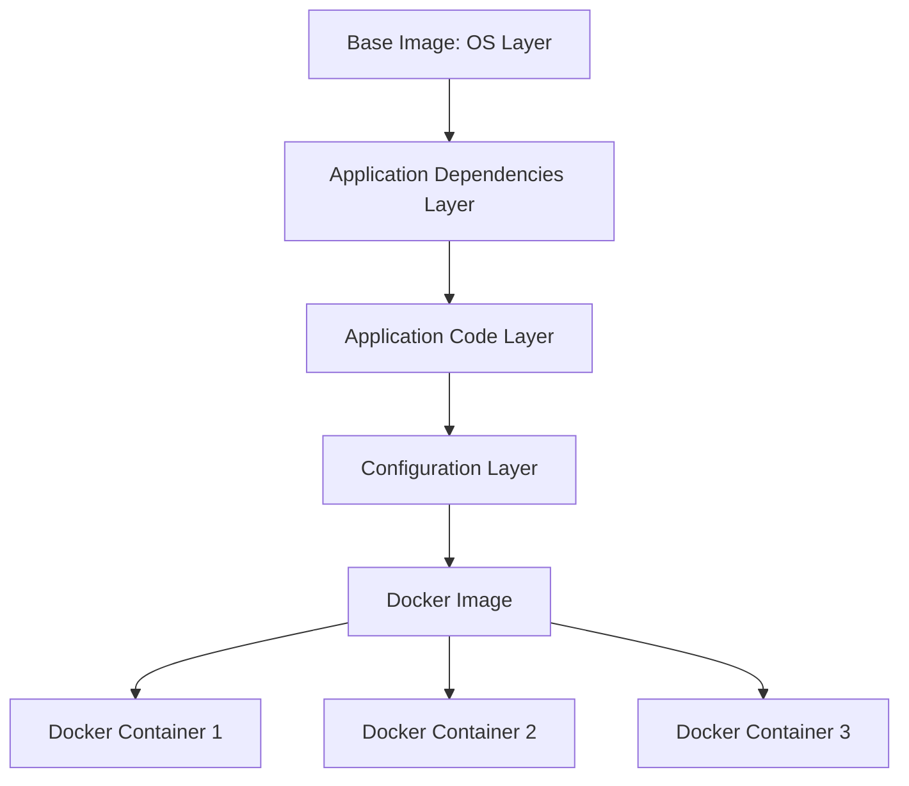

# Docker Images

## Introduction

Docker images are the foundation of containerization in Docker. They serve as read-only templates used to create Docker containers. Think of an image as a blueprint or a snapshot that contains everything needed to run an application: the code, runtime environment, libraries, dependencies, and other files.

In this guide, we'll explore Docker images in depth, learn how to create and manage them, and understand their role in the Docker ecosystem.

## What Are Docker Images?

A Docker image is a lightweight, standalone, and executable software package that includes everything needed to run an application. Images are:

- **Immutable**: Once created, the content of an image doesn't change
- **Layered**: Built using a series of layers that are stacked on top of each other
- **Shareable**: Can be shared through registries like Docker Hub
- **Efficient**: Share common layers between images to save space



## Docker Image Anatomy

Images consist of multiple layers stacked in a specific order:

1. **Base Layer**: Usually a minimal operating system (like Alpine Linux, Ubuntu)
2. **Additional Layers**: Each command in a Dockerfile creates a new layer
3. **Writable Layer**: Added when a container is created from the image

Each layer only stores the changes from the previous layer, making images efficient in terms of storage.

## Working with Docker Images

### Listing Docker Images

To see all the Docker images on your system:

```bash
docker images
```

Example output:

```
REPOSITORY          TAG                 IMAGE ID            CREATED             SIZE
nginx               latest              a1523e859360        2 days ago          127MB
node                14                  e493e9123a56        1 week ago          943MB
alpine              latest              e7d92cdc71fe        2 weeks ago         5.59MB
```

### Pulling Docker Images

You can download images from Docker Hub or other registries using the `pull` command:

```bash
docker pull nginx:latest
```

The format is typically `repository:tag`. If you omit the tag, Docker assumes `latest`.

### Image Tags

Tags help identify specific versions of an image:

```bash
docker pull node:14-alpine
```

This pulls the Node.js image version 14 based on Alpine Linux.

### Inspecting Images

To see detailed information about an image:

```bash
docker inspect nginx:latest
```

This provides a JSON output with all the metadata related to the image.

## Creating Docker Images

### Using Dockerfile

A Dockerfile is a text file containing instructions to build an image:

```dockerfile
# Start from the Node.js 14 Alpine image
FROM node:14-alpine

# Set the working directory
WORKDIR /app

# Copy package.json and package-lock.json
COPY package*.json ./

# Install dependencies
RUN npm install

# Copy the rest of the application
COPY . .

# Expose port 3000
EXPOSE 3000

# Command to run the application
CMD ["npm", "start"]
```

### Building an Image

To build an image from a Dockerfile:

```bash
docker build -t myapp:1.0 .
```

The `-t` flag tags the image, and the `.` specifies the build context (current directory).

### Image Layers and Caching

Each instruction in a Dockerfile creates a new layer:

```bash
docker history myapp:1.0
```

Example output:

```
IMAGE          CREATED        CREATED BY                                      SIZE
a6d503c545dd   2 minutes ago  CMD ["npm" "start"]                             0B
f4b8c38b8e7d   2 minutes ago  EXPOSE 3000                                     0B
1304fd48df20   2 minutes ago  COPY . . # buildkit                             1.42MB
a7b73bc2ee01   2 minutes ago  RUN /bin/sh -c npm install # buildkit           42.8MB
983e68571661   2 minutes ago  COPY package*.json ./ # buildkit                12.3kB
66afd7c32bd7   2 minutes ago  WORKDIR /app                                    0B
ef5b55a501a7   9 days ago     /bin/sh -c #(nop)  CMD ["node"]                 0B
<missing>      9 days ago     /bin/sh -c #(nop)  ENTRYPOINT ["docker-entry…   0B
<missing>      9 days ago     /bin/sh -c #(nop) COPY file:238737301d473041…   116B
<missing>      9 days ago     /bin/sh -c apk add --no-cache --virtual .bui…   7.62MB
<missing>      9 days ago     /bin/sh -c #(nop)  ENV YARN_VERSION=1.22.5      0B
<missing>      9 days ago     /bin/sh -c addgroup -g 1000 node && adduser …   74.3MB
<missing>      9 days ago     /bin/sh -c #(nop)  ENV NODE_VERSION=14.16.1     0B
<missing>      11 days ago    /bin/sh -c #(nop)  CMD ["/bin/sh"]              0B
<missing>      11 days ago    /bin/sh -c #(nop) ADD file:8ec69d882e7f29f06…   5.61MB
```

Docker caches layers for faster builds. If a layer hasn't changed, Docker uses the cached version.

## Best Practices for Docker Images

### 1. Use Specific Tags

Avoid using `latest` in production. Always specify a version:

```bash
docker pull node:14.17.0-alpine3.13
```

### 2. Multi-Stage Builds

Use multi-stage builds to create smaller production images:

```dockerfile
# Build stage
FROM node:14-alpine AS build
WORKDIR /app
COPY package*.json ./
RUN npm install
COPY . .
RUN npm run build

# Production stage
FROM nginx:alpine
COPY --from=build /app/build /usr/share/nginx/html
EXPOSE 80
CMD ["nginx", "-g", "daemon off;"]
```

### 3. Minimize Layers

Combine related commands to reduce layers:

```dockerfile
# Bad: Creates two layers
RUN apt-get update
RUN apt-get install -y curl

# Good: Creates one layer
RUN apt-get update && \
    apt-get install -y curl
```

### 4. Use .dockerignore

Create a `.dockerignore` file to exclude unnecessary files:

```
node_modules
npm-debug.log
Dockerfile
.git
.gitignore
```

## Working with Docker Registries

### Docker Hub

Docker Hub is the default public registry for Docker images.

Pushing an image to Docker Hub:

```bash
# Login to Docker Hub
docker login

# Tag your image with your username
docker tag myapp:1.0 username/myapp:1.0

# Push the image
docker push username/myapp:1.0
```

### Private Registries

For corporate environments, you might use a private registry:

```bash
# Login to private registry
docker login registry.company.com

# Tag and push
docker tag myapp:1.0 registry.company.com/myapp:1.0
docker push registry.company.com/myapp:1.0
```

## Managing Docker Images

### Removing Images

Remove an image:

```bash
docker rmi nginx:latest
```

Remove all unused images:

```bash
docker image prune
```

### Saving and Loading Images

Export an image to a tar file:

```bash
docker save -o nginx.tar nginx:latest
```

Load an image from a tar file:

```bash
docker load -i nginx.tar
```

## Practical Example: Building a Web Application Image

Let's create a simple web application image:

1. Create a project directory:

```bash
mkdir docker-web-app
cd docker-web-app
```

2. Create an `index.html` file:

```html
<!DOCTYPE html>
<html>
<head>
    <title>Docker Web App</title>
    <style>
        body {
            font-family: Arial, sans-serif;
            margin: 40px;
            text-align: center;
        }
        .container {
            max-width: 800px;
            margin: 0 auto;
            padding: 20px;
            border: 1px solid #ddd;
            border-radius: 5px;
        }
    </style>
</head>
<body>
    <div class="container">
        <h1>Hello from Docker!</h1>
        <p>This is a simple web application running in a Docker container.</p>
    </div>
</body>
</html>
```

3. Create a Dockerfile:

```dockerfile
FROM nginx:alpine
COPY index.html /usr/share/nginx/html/index.html
EXPOSE 80
CMD ["nginx", "-g", "daemon off;"]
```

4. Build the image:

```bash
docker build -t web-app:1.0 .
```

5. Run the container:

```bash
docker run -d -p 8080:80 web-app:1.0
```

6. Access the application at http://localhost:8080

## Image Layers in Action

Let's visualize how image layers work with a practical example:

```bash
# Create a new directory
mkdir layer-demo
cd layer-demo

# Create Dockerfile
cat > Dockerfile << EOF
FROM alpine:latest
RUN echo "Layer 1" > /layer1.txt
RUN echo "Layer 2" > /layer2.txt
RUN echo "Layer 3" > /layer3.txt
CMD ["cat", "/layer1.txt", "/layer2.txt", "/layer3.txt"]
EOF

# Build the image
docker build -t layer-demo .

# Inspect the layers
docker history layer-demo
```

You'll see each RUN command created a separate layer.

## Summary

Docker images are the building blocks of containers, providing consistent environments across development, testing, and production. Key concepts to remember:

- Images are immutable templates for containers
- They're built in layers, with each layer representing a change
- Dockerfile is used to define and build images
- Good practices include using specific tags, minimizing layers, and implementing multi-stage builds

With Docker images, you can package applications with all their dependencies, ensuring they run the same way regardless of the environment.

## Additional Resources

- [Official Docker Documentation on Images](https://docs.docker.com/engine/reference/commandline/images/)
- [Dockerfile Best Practices](https://docs.docker.com/develop/develop-images/dockerfile_best-practices/)
- [Docker Hub](https://hub.docker.com/) - Explore public images

## Exercises

1. Create a Dockerfile for a simple Python application that prints "Hello, Docker!"
2. Build an image using multi-stage builds to minimize the final image size
3. Pull an image from Docker Hub, make changes to it, and push it to your own repository
4. Experiment with the `docker history` command to understand layer composition
5. Create a `.dockerignore` file for a project and observe how it affects the build process