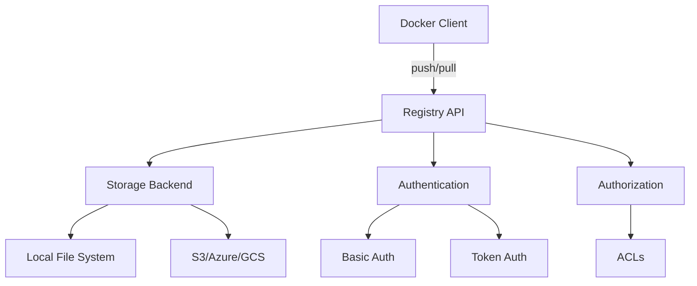

# Docker Registry

## Introduction

A Docker Registry is a storage and distribution system for Docker container images. It allows you to store, manage, and distribute your Docker images, making them available for deployment across different environments. Think of a Docker Registry as a repository for your Docker images, similar to how GitHub is a repository for your code.

In this guide, we'll explore what Docker registries are, why they're essential, and how to use them effectively in your containerization workflow.

## What is a Docker Registry?

A Docker Registry is a stateless, server-side application that stores and distributes Docker images. The registry:

- Enables you to **store** your Docker images in a central location
- Provides a way to **share** images across different environments and teams
- Allows you to **version** your images to maintain history and enable rollbacks
- Supports **access control** to manage who can pull or push images

The most common Docker Registry is Docker Hub, which is Docker's official public registry, but you can also set up your own private registry for internal use.

## Types of Docker Registries

There are several types of Docker registries you can use:

1. **Public Registries** - Accessible to everyone (e.g., Docker Hub)
2. **Private Registries** - Self-hosted or cloud-hosted registries with access control
3. **Cloud Provider Registries** - Offered by cloud providers (e.g., Amazon ECR, Google Container Registry, Azure Container Registry)

## Docker Hub: The Default Registry

Docker Hub is the default registry that Docker uses when you run commands like `docker pull` or `docker push`. It contains thousands of public images, including official images for many programming languages, databases, and applications.

### Searching for Images on Docker Hub

You can search for images on Docker Hub using the `docker search` command:

```bash
docker search nginx
```

This will output a list of publicly available NGINX images:

```
NAME                              DESCRIPTION                                     STARS     OFFICIAL   AUTOMATED
nginx                             Official build of Nginx.                        15565     [OK]       
jwilder/nginx-proxy               Automated Nginx reverse proxy for docker con…   2060                 [OK]
richarvey/nginx-php-fpm           Container running Nginx + PHP-FPM capable of…   818                  [OK]
...
```

## Working with Docker Hub

### Pulling Images from Docker Hub

To download an image from Docker Hub, use the `docker pull` command:

```bash
docker pull nginx:latest
```

Output:
```
latest: Pulling from library/nginx
a2abf6c4d29d: Pull complete 
a9edb18cadd1: Pull complete 
589b7251471a: Pull complete 
186b1aaa4aa6: Pull complete 
b4df32aa5a72: Pull complete 
a0bcbecc962e: Pull complete 
Digest: sha256:0d17b565c37bcbd895e9d92315a05c1c3c9a29f762b011a10c54a66cd53c9b31
Status: Downloaded newer image for nginx:latest
docker.io/library/nginx:latest
```

### Pushing Images to Docker Hub

Before pushing an image to Docker Hub, you need to:

1. Create a Docker Hub account
2. Log in to Docker Hub from your terminal
3. Tag your image with your Docker Hub username

Here's how to do it:

```bash
# Log in to Docker Hub
docker login

# Tag your image
docker tag my-app:latest yourusername/my-app:latest

# Push the image to Docker Hub
docker push yourusername/my-app:latest
```

Output:
```
The push refers to repository [docker.io/yourusername/my-app]
e0dce5f44115: Pushed
f2ec1567f98b: Pushed
ea1063857357: Pushed
latest: digest: sha256:1c45b95b2e3f717587d68ce597b504c21b93ff8f3834f73ef6dfca71700d8e1e size: 947
```

## Setting Up a Private Docker Registry

For organizations that need to maintain their own repositories of Docker images, setting up a private registry is a common practice. This provides more control over where your images are stored and who can access them.

### Running a Local Registry with Docker

Docker provides an official registry image that you can use to run your own registry:

```bash
# Start a local registry on port 5000
docker run -d -p 5000:5000 --name registry registry:2
```

### Pushing to a Local Registry

Once your local registry is running, you can push images to it:

```bash
# Tag the image for your local registry
docker tag my-app:latest localhost:5000/my-app:latest

# Push the image to your local registry
docker push localhost:5000/my-app:latest
```

### Pulling from a Local Registry

To pull an image from your local registry:

```bash
docker pull localhost:5000/my-app:latest
```

## Registry Authentication and Security

For production environments, you'll want to secure your registry with authentication and possibly TLS encryption.

### Adding Basic Authentication

Here's how to set up basic authentication for your registry:

```bash
# Create a password file
mkdir auth
docker run --entrypoint htpasswd registry:2 -Bbn username password > auth/htpasswd

# Start the registry with authentication
docker run -d \
  -p 5000:5000 \
  --name registry \
  -v "$(pwd)"/auth:/auth \
  -e "REGISTRY_AUTH=htpasswd" \
  -e "REGISTRY_AUTH_HTPASSWD_REALM=Registry Realm" \
  -e "REGISTRY_AUTH_HTPASSWD_PATH=/auth/htpasswd" \
  registry:2
```

Now, users will need to log in before they can push or pull images:

```bash
docker login localhost:5000
```

## Docker Registry Architecture

Understanding the architecture of a Docker registry helps in troubleshooting and optimizing your image management workflow.



## Registry API

The Docker Registry API is a RESTful API that allows clients to interact with the registry. Understanding the API can be useful for automation and integration with other tools.

Here are some common API endpoints:

```
GET /v2/_catalog          # List all repositories
GET /v2/<name>/tags/list  # List all tags for a repository
GET /v2/<name>/manifests/<reference>  # Get the manifest for a specific tag
DELETE /v2/<name>/manifests/<reference>  # Delete an image
```

## Best Practices for Working with Registries

To effectively manage your Docker images and registries, follow these best practices:

1. **Use specific tags** rather than relying on the `latest` tag
2. **Implement image cleaning policies** to prevent your registry from growing too large
3. **Set up automated vulnerability scanning** for your images
4. **Use a CI/CD pipeline** to automate image building and pushing
5. **Document your tagging strategy** so team members understand how images are organized

## Real-World Registry Workflow Example

Let's walk through a typical workflow using a Docker registry in a development team:

1. **Develop locally**:
```bash
# Build the application locally
docker build -t myapp:dev .

# Test locally
docker run -p 8080:8080 myapp:dev
   ```

2. **Push to shared registry** for team testing:
```bash
# Tag with version and environment
docker tag myapp:dev registry.example.com/myapp:1.0.0-rc1

# Push to shared registry
docker push registry.example.com/myapp:1.0.0-rc1
   ```

3. **Deploy in test environment**:
```bash
# On test server
docker pull registry.example.com/myapp:1.0.0-rc1
docker run -d -p 8080:8080 registry.example.com/myapp:1.0.0-rc1
   ```

4. **Promote to production**:
```bash
# Tag as production release
docker tag registry.example.com/myapp:1.0.0-rc1 registry.example.com/myapp:1.0.0

# Push production tag
docker push registry.example.com/myapp:1.0.0
   ```

5. **Deploy to production**:
```bash
# On production servers
docker pull registry.example.com/myapp:1.0.0
docker run -d -p 8080:8080 registry.example.com/myapp:1.0.0
   ```

## Common Issues and Troubleshooting

Here are some common issues you might encounter when working with Docker registries and how to resolve them:

### Cannot Push to Registry

If you're getting authentication errors:

```bash
# Check if you're logged in
docker login your-registry-url

# Verify your Docker config
cat ~/.docker/config.json
```

### Registry Storage Issues

If your registry is running out of disk space:

```bash
# Check the size of your registry storage
du -sh /path/to/registry/data

# Set up a garbage collection policy
# Example registry configuration:
storage:
  delete:
    enabled: true
  filesystem:
    rootdirectory: /var/lib/registry
```

### Delete Images from Registry

Deleting images from a registry requires multiple steps:

```bash
# Mark an image for deletion
curl -X DELETE -u username:password \
  https://registry.example.com/v2/myapp/manifests/$(
    curl -s -H "Accept: application/vnd.docker.distribution.manifest.v2+json" \
      -u username:password \
      https://registry.example.com/v2/myapp/manifests/tag \
      | jq -r '.config.digest'
  )

# Run garbage collection
docker exec -it registry bin/registry garbage-collect /etc/docker/registry/config.yml
```

## Summary

Docker registries are a fundamental component of a containerized infrastructure, enabling efficient storage, distribution, and versioning of container images. Whether you're using public registries like Docker Hub or setting up your own private registry, understanding how registries work is essential for any Docker-based workflow.

In this guide, we've covered:

- What Docker registries are and why they're important
- Different types of registries (public, private, cloud-based)
- How to work with Docker Hub
- Setting up and securing a private registry
- Best practices for registry management
- A real-world workflow example
- Troubleshooting common issues

By mastering Docker registries, you'll be able to better manage your containerized applications across development, testing, and production environments.

## Exercises

1. Set up a local Docker registry and push an image to it.
2. Create a Docker Compose file that includes a registry service with basic authentication.
3. Write a shell script that cleans up old images from your registry.
4. Create a CI/CD pipeline that automatically builds and pushes Docker images to a registry.
5. Implement a tag lifecycle policy for your Docker images.

## Additional Resources

- [Docker Registry Documentation](https://docs.docker.com/registry/)
- [Docker Hub Documentation](https://docs.docker.com/docker-hub/)
- [Registry API Specification](https://docs.docker.com/registry/spec/api/)
- [Registry Configuration Reference](https://docs.docker.com/registry/configuration/)
- [Harbor: An enterprise-grade registry](https://goharbor.io/)