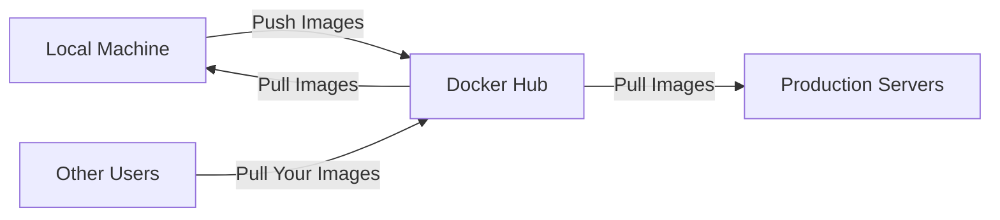

# Docker Hub

## Introduction

Docker Hub is the official cloud-based registry service provided by Docker for storing and distributing Docker images. Think of it as a central repository—similar to GitHub for code—but specifically designed for Docker images. As a beginner working with Docker, Docker Hub will be one of your most valuable resources for finding pre-built images and sharing your own containerized applications.

In this tutorial, we'll explore what Docker Hub is, how to use it effectively, and how it fits into the broader Docker ecosystem.

## What is Docker Hub?

Docker Hub serves as:

- **Public registry** for Docker images
- **Marketplace** for finding official and community images
- **Repository** for storing your own images
- **Collaboration platform** for team-based Docker development



## Creating a Docker Hub Account

Before you can push images to Docker Hub or access private repositories, you'll need to create an account.

1. Visit [Docker Hub](https://hub.docker.com/) and click "Sign Up"
2. Complete the registration process with your email and create a password
3. Verify your email address

Once your account is set up, you can log in from your command line:

```bash
docker login
# Enter your Docker Hub username and password when prompted
```

You should see a "Login Succeeded" message if everything went correctly.

## Finding and Using Images from Docker Hub

### Searching for Images

You can search for images directly on the Docker Hub website or use the command line:

```bash
docker search nginx
```

Output:
```
NAME                      DESCRIPTION                                     STARS     OFFICIAL   AUTOMATED
nginx                     Official build of Nginx.                        17865     [OK]       
bitnami/nginx             Bitnami nginx Docker Image                      169                  [OK]
ubuntu/nginx              Nginx, a high-performance reverse proxy & ...   79        
...
```

### Pulling Images

To download an image from Docker Hub to your local machine:

```bash
docker pull nginx:latest
```

Output:
```
latest: Pulling from library/nginx
a803e7c4b030: Pull complete 
8b625c47d697: Pull complete 
4d3239651a63: Pull complete 
0f816efa513d: Pull complete 
01d159b8db2f: Pull complete 
a4e8b95f0a35: Pull complete 
Digest: sha256:0f816efa513d4177b7202fdc45b68d4bff2dd9404ccf57889ee7d46f829089f3
Status: Downloaded newer image for nginx:latest
docker.io/library/nginx:latest
```

### Understanding Image Names

Docker Hub images follow this naming convention:

- **Official images**: `name:tag` (e.g., `nginx:latest`, `ubuntu:20.04`)
- **User/organization images**: `username/name:tag` (e.g., `bitnami/nginx:latest`)

The tag is optional and defaults to `latest` if not specified.

## Publishing Your Own Images to Docker Hub

### Creating a Repository

1. Log in to Docker Hub
2. Click on "Create Repository"
3. Name your repository (e.g., `my-application`)
4. Choose visibility (public or private)
5. Click "Create"

### Tagging Your Local Image

Before pushing an image, you need to tag it with your Docker Hub username:

```bash
docker tag my-local-image:latest yourusername/my-application:latest
```

### Pushing to Docker Hub

```bash
docker push yourusername/my-application:latest
```

Output:
```
The push refers to repository [docker.io/yourusername/my-application]
f73d13e69202: Pushed 
e33b501c3877: Pushed 
4af9308a0d89: Pushed 
latest: digest: sha256:4fc7c5650ce6c266d956f095f443d37235a82e144adf828d98235d91158ba05b size: 948
```

## Docker Hub Features

### Official Images

Docker Hub hosts official images maintained by Docker and original software vendors. These images:

- Follow best practices
- Are regularly updated for security
- Provide detailed documentation
- Are well-tested and reliable

Examples include `python`, `nginx`, `mongodb`, and `mysql`.

### Automated Builds

Docker Hub can automatically build images from source code repositories:

1. Connect your GitHub or Bitbucket account to Docker Hub
2. Configure automated builds to trigger when you push to your repository
3. Docker Hub builds and pushes the resulting image

```bash
# Example Dockerfile that might be in your GitHub repo
FROM node:14
WORKDIR /app
COPY package*.json ./
RUN npm install
COPY . .
EXPOSE 3000
CMD ["npm", "start"]
```

### Organizations and Teams

For collaborative projects, Docker Hub offers organization accounts:

- Create teams within your organization
- Set permissions for image repositories
- Share private repositories with team members

## Docker Hub Limitations and Best Practices

### Rate Limiting

Docker Hub enforces pull rate limits:

- Anonymous: 100 pulls/6 hours
- Free authenticated: 200 pulls/6 hours
- Pro/Team: Higher limits

To avoid hitting these limits:

- Authenticate with `docker login` before pulling
- Consider using a private registry for high-volume environments
- Pull images less frequently by caching locally

### Security Considerations

When using Docker Hub:

- Scan images for vulnerabilities before deployment
- Prefer official images when possible
- Check image creation dates and update frequency
- Verify Dockerfile sources for community images

Docker Hub offers vulnerability scanning for Pro and Team accounts:

```bash
# View security scan results (if available)
docker pull nginx:latest
docker scan nginx:latest
```

### Private vs Public Repositories

- **Public repositories**: Free, accessible to anyone
- **Private repositories**: Require authentication, limited quantity on free accounts

## Integrating Docker Hub with CI/CD

You can integrate Docker Hub with continuous integration/deployment workflows:

```yaml
# Example GitHub Actions workflow
name: Build and Push Docker Image

on:
  push:
    branches: [ main ]

jobs:
  build:
    runs-on: ubuntu-latest
    steps:
    - uses: actions/checkout@v2
    
    - name: Login to Docker Hub
      uses: docker/login-action@v1
      with:
        username: ${{ secrets.DOCKER_HUB_USERNAME }}
        password: ${{ secrets.DOCKER_HUB_ACCESS_TOKEN }}
    
    - name: Build and push
      uses: docker/build-push-action@v2
      with:
        push: true
        tags: yourusername/my-application:latest
```

## Alternatives to Docker Hub

While Docker Hub is the default registry, alternatives include:

- **GitHub Container Registry**: Integrated with GitHub
- **AWS Elastic Container Registry**: For AWS deployments
- **Google Container Registry**: For GCP deployments
- **Azure Container Registry**: For Azure deployments
- **Self-hosted registries** like Harbor or Nexus

## Practical Example: Creating a Web Application with Docker Hub

Let's build a simple web application and publish it to Docker Hub:

1. Create a simple Node.js application:

```javascript
// app.js
const express = require('express');
const app = express();
const port = 3000;

app.get('/', (req, res) => {
  res.send('Hello from my Docker container!');
});

app.listen(port, () => {
  console.log(`App listening at http://localhost:${port}`);
});
```

2. Create a Dockerfile:

```dockerfile
FROM node:14-alpine
WORKDIR /app
COPY package*.json ./
RUN npm install
COPY . .
EXPOSE 3000
CMD ["node", "app.js"]
```

3. Build the image:

```bash
docker build -t yourusername/node-app:1.0 .
```

4. Test the image locally:

```bash
docker run -p 3000:3000 yourusername/node-app:1.0
```

5. Push to Docker Hub:

```bash
docker push yourusername/node-app:1.0
```

6. Others can now use your image:

```bash
docker pull yourusername/node-app:1.0
docker run -p 3000:3000 yourusername/node-app:1.0
```

## Summary

Docker Hub is an essential tool in the Docker ecosystem that allows you to:

- Find and use pre-built Docker images
- Store and share your own images
- Collaborate with teams on container development
- Integrate containerization into your development workflow

As you continue your Docker journey, Docker Hub will be a valuable resource for finding optimized, ready-to-use images and sharing your containerized applications with the world.

## Additional Resources

- [Docker Hub Documentation](https://docs.docker.com/docker-hub/)
- [Docker Hub Best Practices](https://docs.docker.com/docker-hub/publish/)
- [Docker Official Images](https://docs.docker.com/docker-hub/official_images/)

## Exercises

1. Create a Docker Hub account and push your first image.
2. Find three official images that interest you and pull them to your local machine.
3. Create a Docker Compose file that uses images from Docker Hub to set up a development environment with a database and web server.
4. Set up an automated build from a GitHub repository to Docker Hub.
5. Compare the same application (e.g., Nginx) across different publishers on Docker Hub. What differences do you notice in size, configuration, and documentation?