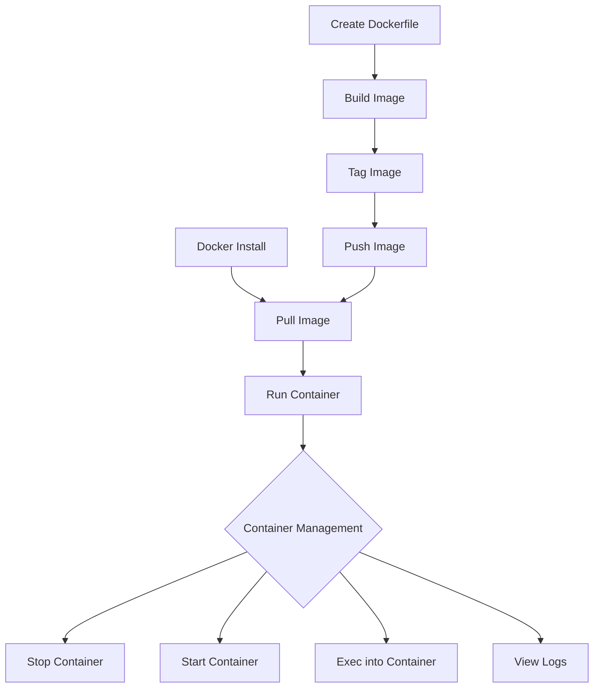

# Docker CLI

## Introduction

The Docker Command Line Interface (CLI) is the primary way developers interact with Docker. It provides a set of commands that allow you to build, manage, and deploy containers efficiently. Whether you're developing applications or managing production environments, mastering the Docker CLI is essential for working with containerized applications.

In this guide, we'll explore the most common Docker CLI commands, their syntax, and practical examples to help you become proficient in Docker container management.

## Prerequisites

Before diving into the Docker CLI commands, make sure you have:

- Docker installed on your system
- Basic understanding of what containers are
- Terminal or command prompt access

## Basic Docker Commands

### Checking Docker Installation

Let's start with verifying your Docker installation:

```bash
docker --version
```

**Output:**
```
Docker version 24.0.5, build 24.0.5-0ubuntu1~22.04.1
```

You can get more detailed information about your Docker installation with:

```bash
docker info
```

### Getting Help

If you're ever unsure about a Docker command or its options, you can use the help flag:

```bash
docker --help
```

For help with a specific command:

```bash
docker run --help
```

## Working with Docker Images

### Searching for Images

You can search for images on Docker Hub directly from the command line:

```bash
docker search nginx
```

**Output:**
```
NAME                              DESCRIPTION                                     STARS     OFFICIAL   AUTOMATED
nginx                             Official build of Nginx.                        17763     [OK]       
jwilder/nginx-proxy               Automated Nginx reverse proxy for docker c...   2153                 [OK]
...
```

### Pulling Images

To download an image from Docker Hub:

```bash
docker pull nginx:latest
```

**Output:**
```
latest: Pulling from library/nginx
a803e7c4b030: Pull complete 
8b625c47d697: Pull complete 
4d3239651a63: Pull complete 
0f816efa513d: Pull complete 
01d159b8db2f: Pull complete 
5fb9a81470f3: Pull complete 
Digest: sha256:32da30332506740a2f7c34d5dc70467b7f14ec67d912703568daff790ab3f755
Status: Downloaded newer image for nginx:latest
docker.io/library/nginx:latest
```

### Listing Images

To see all the images you've downloaded:

```bash
docker images
```

or the newer:

```bash
docker image ls
```

**Output:**
```
REPOSITORY    TAG       IMAGE ID       CREATED         SIZE
nginx         latest    a6bd71f48f68   2 weeks ago     187MB
ubuntu        latest    3bc6e9f30f21   3 weeks ago     77.8MB
hello-world   latest    9c7a54a9a43c   6 months ago    13.3kB
```

## Managing Containers

### Running Containers

The most basic way to run a container:

```bash
docker run nginx
```

This will start a container in the foreground. To run it in the background (detached mode):

```bash
docker run -d nginx
```

**Output:**
```
7d2c1f0c98c7c8bd2b5c5b90304a30658331bf82ce455a13b435c4b2e8bb73d3
```

To run a container with a specific name:

```bash
docker run -d --name my-nginx nginx
```

### Exposing Ports

To access services running inside a container, you need to map ports:

```bash
docker run -d -p 8080:80 nginx
```

This maps port 80 in the container to port 8080 on your host machine. You can now access Nginx at `http://localhost:8080`.

### Viewing Running Containers

To see all running containers:

```bash
docker ps
```

**Output:**
```
CONTAINER ID   IMAGE     COMMAND                  CREATED         STATUS         PORTS                  NAMES
7d2c1f0c98c7   nginx     "/docker-entrypoint.…"   2 minutes ago   Up 2 minutes   80/tcp                 elegant_dijkstra
f45e3489032f   nginx     "/docker-entrypoint.…"   5 minutes ago   Up 5 minutes   0.0.0.0:8080->80/tcp   my-nginx
```

To see all containers (including stopped ones):

```bash
docker ps -a
```

### Container Lifecycle Management

To stop a running container:

```bash
docker stop my-nginx
```

To start a stopped container:

```bash
docker start my-nginx
```

To restart a container:

```bash
docker restart my-nginx
```

To remove a stopped container:

```bash
docker rm my-nginx
```

If you want to force remove a running container:

```bash
docker rm -f my-nginx
```

### Executing Commands in Containers

To run a command inside a running container:

```bash
docker exec -it my-nginx bash
```

The `-it` flags allow you to interact with the container in an interactive terminal session.

### Viewing Container Logs

To view the logs of a container:

```bash
docker logs my-nginx
```

To follow the logs in real-time:

```bash
docker logs -f my-nginx
```

## Working with Docker Volumes

Volumes allow data to persist beyond the lifecycle of a container.

### Creating a Volume

```bash
docker volume create my-data
```

### Running a Container with a Volume

```bash
docker run -d --name my-nginx -v my-data:/usr/share/nginx/html nginx
```

This mounts the `my-data` volume to the `/usr/share/nginx/html` directory in the container.

### Listing Volumes

```bash
docker volume ls
```

**Output:**
```
DRIVER    VOLUME NAME
local     my-data
```

### Removing Volumes

```bash
docker volume rm my-data
```

## Building Custom Images

### Creating a Dockerfile

Create a file named `Dockerfile` with the following content:

```dockerfile
FROM nginx:latest
COPY ./html /usr/share/nginx/html
EXPOSE 80
CMD ["nginx", "-g", "daemon off;"]
```

### Building an Image

To build an image from a Dockerfile:

```bash
docker build -t my-custom-nginx .
```

The `.` at the end specifies the build context (current directory).

### Tagging Images

```bash
docker tag my-custom-nginx my-username/my-custom-nginx:1.0
```

### Pushing Images to Docker Hub

First, login to Docker Hub:

```bash
docker login
```

Then push your image:

```bash
docker push my-username/my-custom-nginx:1.0
```

## Docker Network Management

### Creating a Network

```bash
docker network create my-network
```

### Listing Networks

```bash
docker network ls
```

**Output:**
```
NETWORK ID     NAME        DRIVER    SCOPE
9f6f85323a47   bridge      bridge    local
109c39406ab8   host        host      local
f9a48b9af806   my-network  bridge    local
a3c5b517c8c0   none        null      local
```

### Running Containers on a Specific Network

```bash
docker run -d --name my-nginx --network my-network nginx
```

### Connecting a Container to a Network

```bash
docker network connect my-network my-nginx
```

### Disconnecting a Container from a Network

```bash
docker network disconnect my-network my-nginx
```

## Docker CLI Workflow Visualization

Here's a visualization of the typical Docker CLI workflow:



## Advanced Docker CLI Commands

### Inspecting Docker Objects

To get detailed information about a container:

```bash
docker inspect my-nginx
```

### System Cleanup

To remove all stopped containers:

```bash
docker container prune
```

To remove unused images:

```bash
docker image prune
```

To remove all unused objects (containers, images, volumes, networks):

```bash
docker system prune -a
```

### Resource Usage Statistics

```bash
docker stats
```

**Output:**
```
CONTAINER ID   NAME            CPU %     MEM USAGE / LIMIT     MEM %     NET I/O           BLOCK I/O         PIDS
7d2c1f0c98c7   elegant_dijkstra   0.00%     3.734MiB / 7.668GiB   0.05%     1.15kB / 0B       0B / 0B           3
f45e3489032f   my-nginx        0.00%     3.773MiB / 7.668GiB   0.05%     3.83kB / 2.89kB   0B / 0B           3
```

## Docker CLI Environment Variables

Docker CLI respects several environment variables:

- `DOCKER_HOST`: Specifies the Docker daemon socket to connect to
- `DOCKER_TLS_VERIFY`: Enable or disable TLS verification
- `DOCKER_CERT_PATH`: Path to TLS certificates

Example:

```bash
export DOCKER_HOST=tcp://192.168.99.100:2376
export DOCKER_TLS_VERIFY=1
export DOCKER_CERT_PATH=~/.docker/certs
```

## Common Docker CLI Patterns

### One-off Commands

Run a command and immediately remove the container:

```bash
docker run --rm alpine echo "Hello, Docker!"
```

### Multi-container Applications with Docker Compose

While beyond the scope of this guide, it's worth mentioning that for complex applications with multiple containers, Docker Compose provides a more convenient interface than using the Docker CLI directly.

## Summary

The Docker CLI is a powerful tool that enables you to manage the entire lifecycle of your containerized applications. In this guide, we've covered:

- Basic Docker commands for checking your installation
- Managing images (pulling, listing, building)
- Container lifecycle management (running, stopping, removing)
- Working with volumes for data persistence
- Network management
- Advanced commands for inspection and cleanup

By mastering these commands, you'll be well-equipped to develop and deploy containerized applications efficiently.

## Additional Resources

- [Official Docker CLI Documentation](https://docs.docker.com/engine/reference/commandline/cli/)
- [Docker Hub](https://hub.docker.com/) - For finding official and community images
- [Docker Compose](https://docs.docker.com/compose/) - For managing multi-container applications

## Exercises

1. Pull the official Ubuntu image and run a container with an interactive shell.
2. Create a custom Nginx image that serves a simple "Hello World" HTML page.
3. Create a volume, mount it to a container, and verify data persistence by creating a file, removing the container, and then mounting the volume to a new container.
4. Create a custom network and run two containers that can communicate with each other by their container names.
5. Use the Docker CLI to monitor resource usage of your containers.