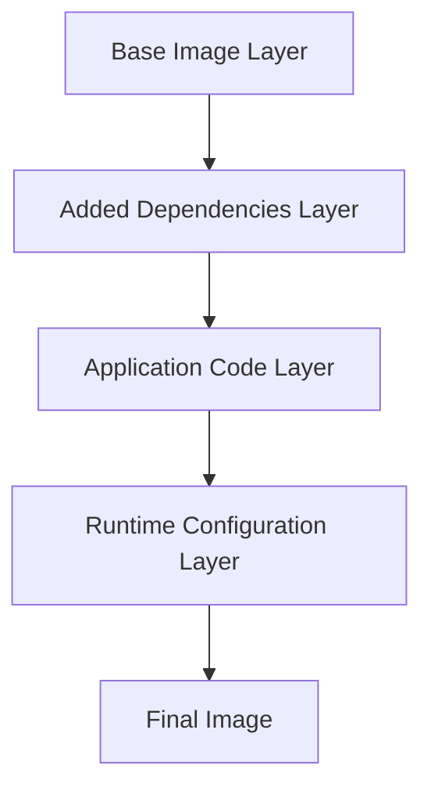

# Docker Dockerfile

## Introduction

A Dockerfile is a text file that contains a set of instructions used to build a Docker image. Think of it as a recipe for creating a consistent environment where your application can run. Dockerfiles are fundamental to Docker's functionality, allowing developers to automate the image creation process and ensure consistency across different environments.

In this tutorial, we'll explore how to create and use Dockerfiles effectively, understand the various instructions available, and learn best practices for building efficient Docker images.

## What is a Dockerfile?

A Dockerfile is a simple text document containing a series of commands that Docker uses to assemble an image. By writing a Dockerfile, you're essentially providing Docker with step-by-step instructions on how to build your application environment.

Here's a basic structure of what a Dockerfile looks like:

```dockerfile
# Comment
INSTRUCTION arguments
```

Each instruction creates a new layer in the image and tells Docker to perform a specific action during the build process.

## Key Dockerfile Instructions

Let's go through the most important Dockerfile instructions you'll use regularly:

### FROM

Every Dockerfile must start with a `FROM` instruction, which specifies the base image from which you're building.

```dockerfile
FROM node:14
```

This tells Docker to use the official Node.js version 14 image as your starting point.

### WORKDIR

Sets the working directory for any subsequent instructions.

```dockerfile
WORKDIR /app
```

### COPY and ADD

Both copy files from your local filesystem into the image. `COPY` is simpler while `ADD` has additional features like the ability to extract tar files and download from URLs.

```dockerfile
COPY package.json .
COPY . .
```

### RUN

Executes commands in a new layer on top of the current image.

```dockerfile
RUN npm install
RUN apt-get update && apt-get install -y python
```

### ENV

Sets environment variables that will be available to containers launched from the image.

```dockerfile
ENV NODE_ENV=production
ENV PORT=3000
```

### EXPOSE

Documents which ports the container will listen on at runtime.

```dockerfile
EXPOSE 3000
```

### CMD and ENTRYPOINT

These specify what command to run when the container starts. `CMD` provides defaults that can be overridden, while `ENTRYPOINT` configures the container to run as an executable.

```dockerfile
CMD ["node", "app.js"]
```

```dockerfile
ENTRYPOINT ["nginx", "-g", "daemon off;"]
```

## Creating Your First Dockerfile

Let's create a simple Dockerfile for a Node.js application:

```dockerfile
# Use an official Node.js runtime as the base image
FROM node:14-alpine

# Set the working directory in the container
WORKDIR /usr/src/app

# Copy package.json and package-lock.json to the working directory
COPY package*.json ./

# Install the application dependencies
RUN npm install

# Copy the rest of the application code
COPY . .

# Expose port 3000 for the application
EXPOSE 3000

# Define the command to run the application
CMD ["node", "app.js"]
```

## Building an Image from a Dockerfile

Once you've created your Dockerfile, you can build an image using the `docker build` command. Let's say you have a Dockerfile in your current directory:

```bash
docker build -t my-nodejs-app .
```

Here, `-t` tags the image with a name, and `.` tells Docker to look for the Dockerfile in the current directory.

**Output:**
```
Sending build context to Docker daemon  3.072kB
Step 1/7 : FROM node:14-alpine
 ---> fe19cf4d65b9
Step 2/7 : WORKDIR /usr/src/app
 ---> Using cache
 ---> 9a93c8f2271c
Step 3/7 : COPY package*.json ./
 ---> 6d28e1483abc
Step 4/7 : RUN npm install
 ---> Running in 7b8b5f3c0f4d
[...]
 ---> 9ad4ee7c71f5
Step 5/7 : COPY . .
 ---> fc9ba960ff6e
Step 6/7 : EXPOSE 3000
 ---> Running in d39388ab993e
 ---> a5cfd37726ef
Step 7/7 : CMD ["node", "app.js"]
 ---> Running in c193ec15d3ad
 ---> ba1f04700f0e
Successfully built ba1f04700f0e
Successfully tagged my-nodejs-app:latest
```

## Multi-stage Builds

Multi-stage builds are a powerful feature that allows you to use multiple `FROM` statements in your Dockerfile. Each `FROM` instruction starts a new build stage that can be used to create a more efficient final image.

This is particularly useful for creating smaller production images by separating build environments from runtime environments.

```dockerfile
# Build stage
FROM node:14 AS build
WORKDIR /app
COPY package*.json ./
RUN npm install
COPY . .
RUN npm run build

# Production stage
FROM nginx:alpine
COPY --from=build /app/dist /usr/share/nginx/html
EXPOSE 80
CMD ["nginx", "-g", "daemon off;"]
```

This example first builds a Node.js application and then copies only the built assets to an Nginx server, resulting in a much smaller final image.

## Dockerfile Best Practices

To create efficient, maintainable Dockerfiles, follow these best practices:

1. **Use a .dockerignore file**: Similar to .gitignore, it prevents unnecessary files from being copied into your Docker image.

```
node_modules
npm-debug.log
Dockerfile
.dockerignore
.git
.github
```

2. **Minimize the number of layers**: Combine RUN commands using `&&` to reduce image size.

```dockerfile
# Inefficient - creates two layers
RUN apt-get update
RUN apt-get install -y curl

# Better - creates a single layer
RUN apt-get update && apt-get install -y curl
```

3. **Use specific tags for base images**: Instead of `FROM node`, use `FROM node:14.17.0-alpine3.13` to ensure consistency.

4. **Order instructions from least to most frequently changing**: This optimizes Docker's build cache.

5. **Use multi-stage builds** for smaller production images.

6. **Make containers ephemeral**: Design them to be stateless and immutable.

## Real-world Example: Full-stack Web Application

Let's create a Dockerfile for a full-stack web application with a Node.js backend and React frontend:

```dockerfile
# Build stage for React frontend
FROM node:14-alpine AS frontend-builder
WORKDIR /app/frontend
COPY frontend/package*.json ./
RUN npm install
COPY frontend ./
RUN npm run build

# Build stage for Node.js backend
FROM node:14-alpine AS backend-builder
WORKDIR /app/backend
COPY backend/package*.json ./
RUN npm install
COPY backend ./

# Production stage
FROM node:14-alpine
WORKDIR /app
# Copy built frontend assets
COPY --from=frontend-builder /app/frontend/build ./public
# Copy backend files and dependencies
COPY --from=backend-builder /app/backend ./
# Expose API port
EXPOSE 5000
# Start the application
CMD ["npm", "start"]
```

This Dockerfile creates a production-ready image containing both frontend and backend components, with optimized layers and minimal size.

## Understanding Dockerfile Layers

Each instruction in a Dockerfile creates a layer in the final image. These layers are cached and reused when possible, which can significantly speed up build times.



When you change your Dockerfile or source code, Docker only rebuilds the affected layers and their downstream dependencies, leaving earlier layers intact.

## Environment-specific Dockerfiles

For different environments (development, testing, production), you can create specialized Dockerfiles:

**development.Dockerfile**:
```dockerfile
FROM node:14-alpine
WORKDIR /app
COPY package*.json ./
RUN npm install
COPY . .
EXPOSE 3000
CMD ["npm", "run", "dev"]
```

**production.Dockerfile**:
```dockerfile
FROM node:14-alpine AS builder
WORKDIR /app
COPY package*.json ./
RUN npm install
COPY . .
RUN npm run build

FROM node:14-alpine
WORKDIR /app
COPY --from=builder /app/dist ./dist
COPY --from=builder /app/package*.json ./
RUN npm install --only=production
EXPOSE 3000
CMD ["npm", "run", "start"]
```

Build with:
```bash
docker build -f production.Dockerfile -t myapp:prod .
```

## Variables in Dockerfiles

You can use build-time variables using the `ARG` instruction:

```dockerfile
FROM ubuntu:20.04
ARG NODE_VERSION=14
RUN apt-get update && apt-get install -y nodejs=${NODE_VERSION}
```

Build with variable override:
```bash
docker build --build-arg NODE_VERSION=16 -t myapp .
```

## Summary

Dockerfiles are powerful tools for creating Docker images with consistent, reproducible environments. In this tutorial, we've covered:

- Basic Dockerfile syntax and structure
- Essential Dockerfile instructions (FROM, WORKDIR, COPY, RUN, etc.)
- Building Docker images from Dockerfiles
- Multi-stage builds for optimized images
- Best practices for creating efficient Dockerfiles
- Real-world examples for different application types
- Environment-specific configurations
- Working with build arguments

By mastering Dockerfiles, you'll be able to containerize your applications effectively, ensuring they run consistently across different environments—from your local development machine to production servers.

## Additional Resources

Here are some exercises to reinforce your understanding:

1. Create a Dockerfile for a simple static website using Nginx.
2. Write a multi-stage Dockerfile for a Python Flask application.
3. Optimize an existing Dockerfile to reduce the image size.
4. Create a development and production Dockerfile for the same application.

For further learning, explore:

- Docker's official documentation on Dockerfiles
- Docker Compose for managing multi-container applications
- Docker Hub for finding official base images
- Container orchestration tools like Kubernetes