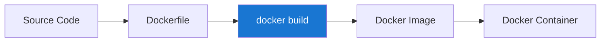

# Docker Build

## Introduction

Docker Build is a fundamental process in the Docker ecosystem that creates container images from code and dependencies. These images serve as the blueprint for running containers, which are lightweight, portable, and consistent runtime environments. Whether you're deploying a simple web application or a complex microservices architecture, understanding how to effectively build Docker images is essential.

In this guide, we'll explore the `docker build` command, Dockerfile syntax, best practices, and real-world examples to help you master image creation.

## What is Docker Build?

Docker Build is the process of creating a Docker image from a set of instructions defined in a Dockerfile. A Dockerfile is a text document containing commands that Docker executes sequentially to assemble an image.



The build process follows these general steps:
1. Docker reads instructions from the Dockerfile
2. Processes each instruction in sequence
3. Creates a new layer for each instruction
4. Produces a final image that can be used to run containers

## The Dockerfile

A Dockerfile is a text file that contains a series of instructions for building a Docker image. Each instruction creates a layer in the image.

### Basic Structure

Let's start with a simple Dockerfile for a Node.js application:

```dockerfile
# Base image
FROM node:18-alpine

# Set working directory
WORKDIR /app

# Copy package files
COPY package*.json ./

# Install dependencies
RUN npm install

# Copy application code
COPY . .

# Expose port
EXPOSE 3000

# Command to run the application
CMD ["node", "index.js"]
```

### Common Dockerfile Instructions

- `FROM`: Specifies the base image
- `WORKDIR`: Sets the working directory
- `COPY` and `ADD`: Copy files from host to the image
- `RUN`: Executes commands during build time
- `EXPOSE`: Documents which ports the container listens on
- `ENV`: Sets environment variables
- `ARG`: Defines build-time variables
- `CMD`: Specifies the command to run when the container starts
- `ENTRYPOINT`: Configures the container to run as an executable

## The docker build Command

The `docker build` command creates an image from a Dockerfile and a "context" (usually the directory containing the Dockerfile).

### Basic Syntax

```bash
docker build [OPTIONS] PATH | URL | -
```

### Common Options

- `-t`, `--tag`: Name and optionally tag the image
- `--file`, `-f`: Name of the Dockerfile (if not 'PATH/Dockerfile')
- `--build-arg`: Set build-time variables
- `--no-cache`: Do not use cache when building the image
- `--pull`: Always attempt to pull a newer version of the base image

### Example Usage

Let's build an image for our Node.js application:

```bash
# Build with a tag
docker build -t myapp:1.0 .

# Output:
# Sending build context to Docker daemon  8.192kB
# Step 1/7 : FROM node:18-alpine
#  ---> 5e3ac15e9010
# Step 2/7 : WORKDIR /app
#  ---> Using cache
#  ---> 7a5ce3b2fa29
# Step 3/7 : COPY package*.json ./
#  ---> Using cache
#  ---> 8e23e01a3fcd
# Step 4/7 : RUN npm install
#  ---> Using cache
#  ---> 0b5c301de213
# Step 5/7 : COPY . .
#  ---> 8e2914cd01a5
# Step 6/7 : EXPOSE 3000
#  ---> Running in 89e5d9a28fdc
#  ---> d5c18e5ab9da
# Step 7/7 : CMD ["node", "index.js"]
#  ---> Running in 0cafebeec1fc
#  ---> a92fc71e5bfc
# Successfully built a92fc71e5bfc
# Successfully tagged myapp:1.0
```

## Build Context and .dockerignore

### Build Context

The build context is the set of files located at the specified PATH or URL that Docker sends to the daemon during the build process. To minimize the build context size, keep only necessary files in your build directory.

### Using .dockerignore

A `.dockerignore` file allows you to specify patterns of files and directories that should be excluded from the build context.

```plaintext
# Example .dockerignore file
node_modules
npm-debug.log
Dockerfile
.dockerignore
.git
.gitignore
README.md
```

Using a `.dockerignore` file:
- Reduces build context size
- Improves build speed
- Prevents unnecessary cache invalidation
- Avoids including sensitive files

## Multi-stage Builds

Multi-stage builds allow you to use multiple FROM statements in your Dockerfile. Each FROM instruction can use a different base image, and begins a new stage of the build.

### Benefits

- **Smaller final images**: Keep only what's necessary for running the application
- **Better separation of concerns**: Build and runtime environments can be different
- **Improved security**: Reduced attack surface in production images

### Example: Multi-stage Build for a Go Application

```dockerfile
# Build stage
FROM golang:1.19-alpine AS builder

WORKDIR /app

COPY go.mod go.sum ./
RUN go mod download

COPY . .

RUN CGO_ENABLED=0 GOOS=linux go build -o /app/server .

# Final stage
FROM alpine:3.17

WORKDIR /app

COPY --from=builder /app/server .

EXPOSE 8080

CMD ["./server"]
```

## Build Arguments and Environment Variables

### Build Arguments (ARG)

Build arguments are variables that are available only during the build process.

```dockerfile
FROM node:18-alpine

ARG NODE_ENV=production
ARG VERSION

WORKDIR /app

# Use the build arg
RUN echo "Building version: $VERSION in $NODE_ENV environment"

# Rest of Dockerfile...
```

To use build arguments:

```bash
docker build --build-arg VERSION=1.2.3 --build-arg NODE_ENV=development -t myapp:1.2.3 .
```

### Environment Variables (ENV)

Environment variables exist both during build and when the container runs.

```dockerfile
FROM node:18-alpine

ENV NODE_ENV=production
ENV APP_HOME=/app

WORKDIR $APP_HOME

# Rest of Dockerfile...
```

## Docker Build Best Practices

### Optimize Caching

Docker uses a layer caching system to speed up builds. To maximize cache usage:

1. **Order instructions from least to most frequently changing**
   ```dockerfile
   # Good order - rarely changing dependencies first
   COPY package.json package-lock.json ./
   RUN npm install
   COPY . .
   ```

2. **Group RUN commands that change together**
   ```dockerfile
   # Instead of multiple RUN commands
   RUN apt-get update && \
       apt-get install -y curl && \
       rm -rf /var/lib/apt/lists/*
   ```

### Minimize Image Size

1. **Use specific base images**
   ```dockerfile
   # Use slim or alpine variants when possible
   FROM node:18-alpine
   ```

2. **Clean up in the same layer**
   ```dockerfile
   RUN apt-get update && \
       apt-get install -y curl && \
       rm -rf /var/lib/apt/lists/*
   ```

3. **Use multi-stage builds**

### Security Considerations

1. **Avoid running as root**
   ```dockerfile
   # Create a non-root user
   RUN addgroup -S appgroup && adduser -S appuser -G appgroup
   USER appuser
   ```

2. **Minimize installed packages**
3. **Scan images for vulnerabilities**
   ```bash
   docker scan myapp:1.0
   ```

## Real-world Examples

### Example 1: Python Web Application

```dockerfile
FROM python:3.11-slim

WORKDIR /app

COPY requirements.txt .
RUN pip install --no-cache-dir -r requirements.txt

COPY . .

ENV FLASK_APP=app.py
ENV FLASK_ENV=production

EXPOSE 5000

CMD ["flask", "run", "--host=0.0.0.0"]
```

Build and run:

```bash
# Build the image
docker build -t flask-app:latest .

# Run the container
docker run -p 5000:5000 flask-app:latest
```

### Example 2: React Application with Nginx

```dockerfile
# Build stage
FROM node:18-alpine AS build

WORKDIR /app

COPY package*.json ./
RUN npm install

COPY . .
RUN npm run build

# Production stage
FROM nginx:1.23-alpine

COPY --from=build /app/build /usr/share/nginx/html
COPY nginx.conf /etc/nginx/conf.d/default.conf

EXPOSE 80

CMD ["nginx", "-g", "daemon off;"]
```

Create an nginx.conf file:

```plaintext
server {
    listen 80;
    
    location / {
        root /usr/share/nginx/html;
        index index.html index.htm;
        try_files $uri $uri/ /index.html;
    }
}
```

Build and run:

```bash
# Build the image
docker build -t react-app:latest .

# Run the container
docker run -p 80:80 react-app:latest
```

## Troubleshooting Common Issues

### Build Context Errors

**Problem**: Build context is too large, causing slow uploads or out-of-space errors.

**Solution**: Use `.dockerignore` to exclude unnecessary files.

### Cache Invalidation Issues

**Problem**: Cache is invalidated too frequently, causing slow builds.

**Solution**: Order Dockerfile instructions from least to most frequently changing.

### Permission Denied Errors

**Problem**: Commands fail with "permission denied" errors.

**Solution**: Check file permissions or consider using the `--chmod` flag with COPY:

```dockerfile
COPY --chmod=755 script.sh .
```

## Docker Build in CI/CD Pipelines

Integrating Docker builds in CI/CD pipelines ensures consistent, automated image creation:

```yaml
# Example GitHub Actions workflow
name: Build and Push Docker Image

on:
  push:
    branches: [ main ]

jobs:
  build:
    runs-on: ubuntu-latest
    steps:
      - uses: actions/checkout@v3
      
      - name: Login to DockerHub
        uses: docker/login-action@v2
        with:
          username: ${{ secrets.DOCKERHUB_USERNAME }}
          password: ${{ secrets.DOCKERHUB_TOKEN }}
      
      - name: Build and push
        uses: docker/build-push-action@v4
        with:
          context: .
          push: true
          tags: username/repository:latest
```

## Summary

Docker Build is a powerful tool for creating consistent, reproducible container images. By mastering the Dockerfile syntax and the `docker build` command, you can create efficient, secure, and optimized images for your applications.

Key points to remember:
- Dockerfiles provide a declarative way to define your application's environment
- Each instruction creates a layer in the image
- Multi-stage builds help create smaller, more secure images
- Proper organization of instructions improves build efficiency through caching
- Docker images should be treated as immutable artifacts

## Exercises

1. Create a Dockerfile for a simple web application using your preferred language.
2. Modify your Dockerfile to use multi-stage builds and reduce the final image size.
3. Implement a `.dockerignore` file to exclude unnecessary files.
4. Use build arguments to create different versions of your image.
5. Optimize your Dockerfile to maximize layer caching.

## Additional Resources

- [Docker Documentation: Dockerfile Reference](https://docs.docker.com/engine/reference/builder/)
- [Docker Documentation: Build Command](https://docs.docker.com/engine/reference/commandline/build/)
- [Docker Documentation: Best Practices](https://docs.docker.com/develop/develop-images/dockerfile_best-practices/)
- [Docker Documentation: Multi-Stage Builds](https://docs.docker.com/build/building/multi-stage/)